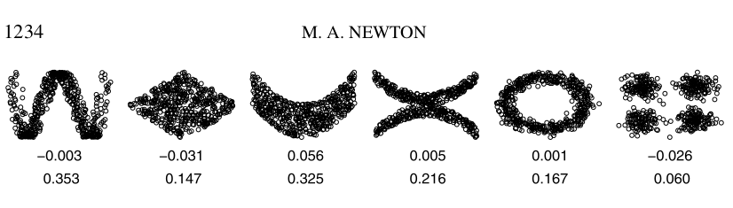
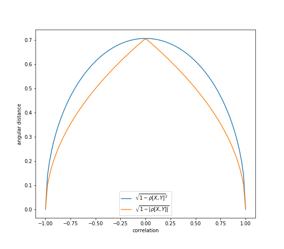

.. _codependence-correlation_based_metrics:

.. note::
   The following implementations and documentation, closely follows the lecture notes from Cornell University, by Marcos Lopez de Prado:
   `Codependence (Presentation Slides) <https://papers.ssrn.com/sol3/papers.cfm?abstract_id=3512994>`_.

=========================
Correlation-Based Metrics
=========================

Distance Correlation
====================

**Distance correlation** can capture not only linear association but also non-linear variable dependencies which Pearson correlation can not.
It was introduced in 2005 by Gábor J. Szekely and is described in the work
`"Measuring and testing independence by correlation of distances". <https://projecteuclid.org/download/pdfview_1/euclid.aos/1201012979>`_
It is calculated as:

.. math::
    \rho_{dist}[X, Y] = \frac{dCov[X, Y]}{\sqrt{dCov[X, X]dCov[Y,Y}}

Where :math:`dCov[X, Y]` can be interpreted as the average Hadamard product of the doubly-centered Euclidean distance matrices of
:math:`X, Y`. (`Cornell lecture slides, p.7 <https://papers.ssrn.com/sol3/papers.cfm?abstract_id=3512994>`_)

Values of distance correlation fall in the range:

.. math::
    0 \leq \rho_{dist}[X, Y] \leq 1

Distance correlation is equal to zero if and only if the two variables are independent (in contrast to Pearson correlation
that can be zero even if the variables are dependant).

.. math::
    \rho_{dist}[X, Y] = 0 \Leftrightarrow X \perp Y

As shown in the figure below, distance correlation captures the nonlinear relationship.

The numbers in the first line are Pearson correlation values and the values in the second line are Distance correlation values.
This figure is from `"Introducing the discussion paper by Székely and Rizzo" <https://www.researchgate.net/publication/238879872_Introducing_the_discussion_paper_by_Szekely_and_Rizzo>`_
by Michale A. Newton. It provides a great overview for readers.

Implementation
##############

.. py:currentmodule:: mlfinlab.codependence.correlation

.. autofunction:: distance_correlation

Standard Angular Distance
=========================

**Angular distance** is a slight modification of the Pearson correlation coefficient which satisfies all distance metric conditions.
This measure is known as the angular distance because when we use *covariance* as an *inner product*, we can interpret correlation as :math:`cos\theta`.

A proof that angular distance is a true metric can be found in the work by Lopez de Prado
`Building Diversified Portfolios that Outperform Out-of-Sample: <https://papers.ssrn.com/sol3/papers.cfm?abstract_id=2708678>`_

"Angular distance is a linear multiple of the Euclidean distance between the vectors :math:`\{X, Y\}` after z-standardization,
hence it inherits the true-metric properties of the Euclidean distance."

According to Lopez de Prado:

"The [standard angular distance] metric deems more distant two random variables with negative correlation than two random
variables with positive correlation".

"This property makes sense in many applications. For example, we may wish to build a **long-only portfolio**, where holdings
in negative-correlated securities can only offset risk, and therefore should be treated as different for diversification purposes".

Formula used to calculate standard angular distance:

.. math::
    d_\rho[X, Y] = \sqrt{\frac{1}{2}(1-\rho[X,Y])}

where :math:`\rho[X,Y]` is Pearson correlation between the vectors :math:`\{X, Y\}` .

Values of standard angular distance fall in the range:

.. math::
    d_\rho[X, Y] \in [0, 1]

.. figure:: images/angular_distance.png
   :scale: 70 %
   :align: center
   :figclass: align-center
   :alt: Angular Distance

   The angular distance satisfies all the conditions of a true metric, (Lopez de Prado, 2020.)

Implementation
##############

.. autofunction:: angular_distance

Absolute Angular Distance
=========================

This modification of angular distance uses an absolute value of Pearson correlation in the formula.

This property assigns small distance to elements that have a high negative correlation. According to Lopez de Prado, this
is useful because "in **long-short portfolios**, we often prefer to consider highly negatively-correlated securities as similar,
because the position sign can override the sign of the correlation".

Formula used to calculate absolute angular distance:

.. math::
    d_{|\rho|}[X, Y] = \sqrt{1-|\rho[X,Y]|}

where :math:`\rho[X,Y]` is Pearson correlation between the vectors :math:`\{X, Y\}` .

Values of absolute angular distance fall in the range:

.. math::
    d_{|\rho|}[X, Y] \in [0, 1]

   In some financial applications, it makes more sense to apply a modified definition of angular distance, such that the
   sign of the correlation is ignored, (Lopez de Prado, 2020)

Implementation
##############

.. autofunction:: absolute_angular_distance

Squared Angular Distance
=========================

Squared angular distance uses the squared value of Pearson correlation in the formula and has similar properties to absolute
angular distance. The only difference is that a higher distance is assigned to the elements that have a small absolute correlation.

Formula used to calculate squared angular distance:

.. math::
    d_{\rho^2}[X, Y] = \sqrt{1-{\rho[X,Y]}^2}

where :math:`\rho[X,Y]` is Pearson correlation between the vectors :math:`\{X, Y\}` .

Values of squared angular distance fall in the range:

.. math::
    d_{\rho^2}[X, Y] \in [0, 1]

Implementation
##############

.. autofunction:: squared_angular_distance

Examples
========

The following examples show how the described above correlation-based metrics can be used on real data:

.. code-block::

    import pandas as pd
    from mlfinlab.codependence import distance_correlation, angular_distance,
                                      absolute_angular_distance, squared_angular_distance

    # Import dataframe of returns for assets in a portfolio
    asset_returns = pd.read_csv(DATA_PATH, index_col='Date', parse_dates=True)

    asset1 = 'SPY'
    asset2 = 'TLT'

    # Calculate distance correlation between chosen assets
    distance_corr = distance_correlation(asset_returns[asset1], asset_returns[assets2])

    # Calculate angular distance between chosen assets
    angular_dist = angular_distance(asset_returns[asset1], asset_returns[assets2])

    # Calculate absolute angular distance between chosen assets
    angular_dist = absolute_angular_distance(asset_returns[asset1], asset_returns[assets2])

    # Calculate squared angular distance between chosen assets
    angular_dist = squared_angular_distance(asset_returns[asset1], asset_returns[assets2])
