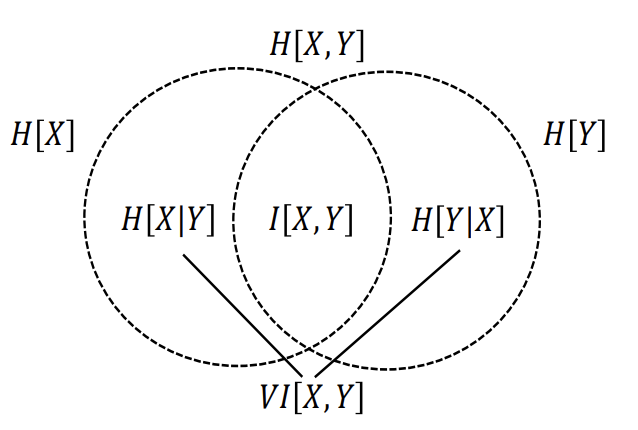
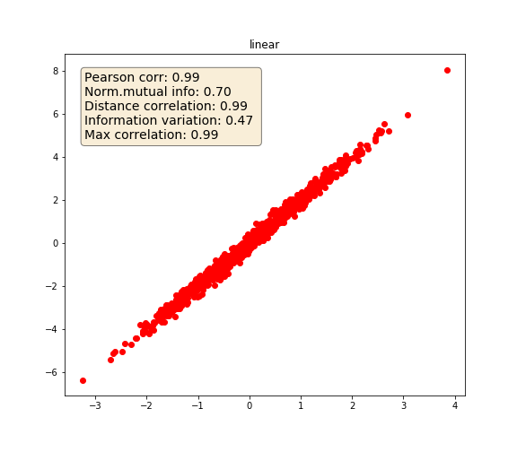
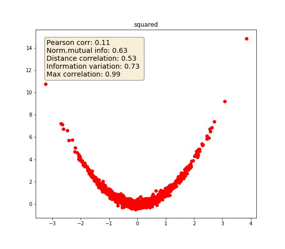
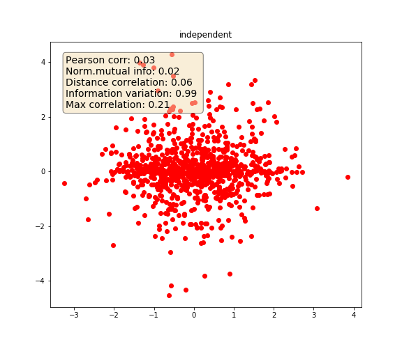

.. _codependence-information_theory_metrics:

.. note::
   The following implementations and documentation, closely follows the lecture notes from Cornell University, by Marcos Lopez de Prado:
   `Codependence (Presentation Slides) <https://papers.ssrn.com/sol3/papers.cfm?abstract_id=3512994>`_.

==========================
Information Theory Metrics
==========================

We can gauge the codependence from the information theory perspective. In information theory, (Shannon’s) entropy is a
measure of information (uncertainty). As described in the `Cornell lecture slides, p.13 <https://papers.ssrn.com/sol3/papers.cfm?abstract_id=3512994>`_
, entropy is calculated as:

.. math::
    H[X] = -\sum\limits_{x \in S_{X}}p[x]log[p[x]]

Where :math:`X` is a discrete random variable that takes a value :math:`x` from the set :math:`S_{X}` with probability
:math:`p[x]` .

In short, we can say that entropy is the expectation of the amount of information when we sample from a particular probability
distribution or the number of bits to transmit to the target. So, if there is a correspondence between random variables,
the correspondence will be reflected in entropy. For example, if two random variables are associated, the amount of
information in the joint probability distribution of the two random variables will be less than the sum of the information
in each random variable. This is because knowing a correspondence means knowing one random variable can reduce uncertainty
about the other random variable.

.. math::
    H[X+Y] = H[X] + H[Y],  X \bot Y

This module presents two ways of measuring correspondence:

1. Mutual Information
2. Variation of Information

The following figure highlights how we can view the relationships of various information measures associated with correlated variables
:math:`X` and :math:`Y` through the below figure. (`Cornell lecture slides, p.24 <https://papers.ssrn.com/sol3/papers.cfm?abstract_id=3512994>`_)

   The correspondence between joint entropy, marginal entropies, conditional entropies, mutual information and variation of information (Lopez de Prado, 2020)

Mutual Information
==================

According to Lopez de Prado: "**Mutual Information** is defined as the decrease in uncertainty (or informational gain)
in :math:`X` that results from knowing the value of :math:`Y`. Mutual information is not a metric as it doesn't satisfy
the triangle inequality". The properties of non-negativity and symmetry are satisfied. Mutual information is calculated as:

.. math::
    \begin{align*}
    I[X, Y]=& H[X] - H[X|Y]\\
           =& H[X] + H[Y] - H[X,Y]\\
           =& \sum\limits_{x \in S_{X}} \sum\limits_{y \in S_{Y}}p[x,y]log[\frac{p[x,y]}{p[x]p[y]}]\\
    \end{align*}

Mutual information has a grouping property:

.. math::

    I[X, Y, Z] = I[X, Y] + I[(X, Y), Z]

where :math:`(X, Y)` is a joint distribution of :math:`X` and :math:`Y` .

It can also be normalized using a known upper boundary:

.. math::

    I[X, Y] \le min\{H[X] + H[Y]\}

Implementation
##############

.. py:currentmodule:: mlfinlab.codependence.information

.. autofunction:: get_mutual_info

Variation of Information
========================

According to Lopez de Prado: "**Variation of Information** can be interpreted as the uncertainty we expect in one variable
if we are told the value of another". The variation of information is a true metric and satisfies the axioms from the introduction.

.. math::
   \begin{align*}
     VI[X,Y]=& H[X|Y] + H[Y|X]\\
           =& H[X] + H[Y]-2I[X,Y]\\
           =& 2H[X,Y]-H[X]-H[Y]\\
   \end{align*}

The upper bound of Variation of information is not firm as it depends on the sizes of the population which is problematic
when comparing variations of information across different population sizes, as described in
`Cornell lecture slides, p.21 <https://papers.ssrn.com/sol3/papers.cfm?abstract_id=3512994>`_

Implementation
##############

.. autofunction::  variation_of_information_score

Discretization
==============

Both mutual information and variation of information are using random variables that are discrete. To use these tools for
continuous random variables the discretization approach can be used.

For the continuous case, we can quantize the values to estimate :math:`H[X]`. Following the `Cornell lecture slides, p.26 <https://papers.ssrn.com/sol3/papers.cfm?abstract_id=3512994>`_ :

.. math::
    \begin{align*}
    H[X] =& \int_{\infty}^{\infty}f_{X}[x]log[f_{X}[x]]dx\\
    \:    \approx& -\sum\limits_{i=1}^{B_{X}}f_{X}[x_{i}]log[f_{X}[x_{i}]]\Delta_{x}\\
    \end{align*}

where the observed values :math:`\{x\}` are divided into :math:`B_{X}` bins of equal size :math:`\Delta_{X}`,
:math:`\Delta_{X} = \frac{max\{x\} - min\{x\}}{B_{X}}` , and :math:`f_{X}[x_{i}]` is the frequency of observations
within the i-th bin.

So, the discretized estimator of entropy is:

.. math::
    \hat{H}[X]=-\sum\limits_{i=1}^{B_{X}}\frac{N_{i}}{N}log[\frac{N_{i}}{N}]log[\Delta_{X}]

where :math:`N_{i}` is the number of observations within the i-th bin, :math:`N = \sum_{i=1}^{B_{X}}N_{i}` .

From the above equations, the size of the bins should be chosen. The results of the entropy estimation will depend on the
binning. The works by `Hacine-Gharbi et al. (2012) <https://www.researchgate.net/publication/257014935>`_  and
`Hacine-Gharbi and Ravier (2018) <https://www.researchgate.net/publication/320887281>`_  present optimal binning
for marginal and joint entropy.

This optimal binning method is used in the mutual information and variation of information functions.

Implementation
##############

.. autofunction:: get_optimal_number_of_bins

Examples
========

The following example highlights how the various metrics behave under various variable dependencies:

1. Linear
2. Squared
3. :math:`Y = abs(X)`
4. Independent variables

.. code-block::

    import numpy as np
    import matplotlib.pyplot as plt

    from mlfinlab.codependence import distance_correlation, get_mutual_info, variation_of_information_score
    from ace import model # ace package is used for max correlation estimation

    def max_correlation(x: np.array, y: np.array) -> float:
        """
        Get max correlation using ace package.
        """

        x_input = [x]
        y_input = y
        ace_model = model.Model()
        ace_model.build_model_from_xy(x_input, y_input)
        return np.corrcoef(ace_model.ace.x_transforms[0], ace_model.ace.y_transform)[0][1]

    state = np.random.RandomState(42)
    x = state.normal(size=1000)
    y_1 = 2 * x + state.normal(size=1000) / 5 # linear
    y_2 = x ** 2 + state.normal(size=1000) / 5 # squared
    y_3 = abs(x) + state.normal(size=1000) / 5 # Abs
    # independent
    y_4 = np.random.RandomState(0).normal(size=1000) * np.random.RandomState(5).normal(size=1000)

    for y, dependency in zip([y_1, y_2, y_3, y_4], ['linear', 'squared', 'y=|x|', 'independent']):
        text = "Pearson corr: {:0.2f} " + \
               "\nNorm.mutual info: {:0.2f} " + \
               "\nDistance correlation: {:0.2f} " + \
               "\nInformation variation: {:0.2f} " + \
               "\nMax correlation: {:0.2f}"

        text = text.format(np.corrcoef(x, y)[0, 1],
                           get_mutual_info(x, y, normalize=True),
                           distance_correlation(x, y),
                           variation_of_information_score(x, y, normalize=True),
                           max_correlation(x, y))

        # Plot relationships
        fig, ax = plt.subplots(figsize=(8,7))
        props = dict(boxstyle='round', facecolor='wheat', alpha=0.5)
        ax.text(0.05, 0.95, text, transform=ax.transAxes, fontsize=14, verticalalignment='top', bbox=props)
        plt.title(dependency)
        ax.plot(x, y, 'ro')
        plt.savefig('{}.png'.format(dependency))

   Linear

   Squared

.. figure:: images/abs.png
   :scale: 70 %
   :align: center
   :figclass: align-center
   :alt: Absolute Codependence

   Absolute

    
   Indepedent
