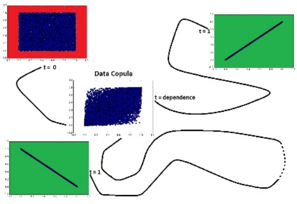

.. _codependence-optimal_trnsport:

.. note::
   The following documentation closely follows the work by Marti et al.:
   `Exploring and measuring non-linear correlations: Copulas, Lightspeed Transportation and Clustering <https://arxiv.org/pdf/1610.09659.pdf>`_.

   Initial implementation was taken from the blog post by Gautier Marti:
   `Measuring non-linear dependence with Optimal Transport <https://gmarti.gitlab.io/qfin/2020/06/25/copula-optimal-transport-dependence.html>`_.

=================
Optimal Transport
=================

The basic idea of the optimal copula transport dependence measure is rather simple. It relies on leveraging:

    1. Copulas, which are distributions encoding fully the dependence between random variables.

    2. A geometrical point of view: Where does the empirical copula stand in the space of copulas?
       In particular, how far is it from reference copulas such as the Fréchet–Hoeffding copula bounds
       (copulas associated to comonotone, countermonotone, independent random variables)?

   Dependence is measured as the relative distance from independence to the nearest target-dependence: comonotonicity or countermonotonicity. (Source: Measuring non-linear dependence with Optimal Transport)

With this geometric view,

    1. It is rather easy to extend this novel dependence measure to alternative use cases
       (e.g. by changing the reference copulas).

    2. It can also allow to look for specific patterns in the dependence structure
       (generalization of conditional correlation): Typically, one would try to answer
       “What is the correlation between these two stocks knowing that the VIX is above 40?”
       (e.g. estimate ρXY|Z>z;

With this optimal copula transport tool, one can look for answers to, for example:

    a. “Which pairs of assets are both positively and negatively correlated?”

    b. “Which assets occur extreme variations while those of others are relatively small, and conversely?”

    c. “Which pairs of assets are positively correlated for small variations but uncorrelated otherwise?”

.. Tip::
   For an example comparing the behaviour of Optimal Transport distacne to Pearson's correlation, Spearman's rho,
   and Kendall tau distance, please read this blogpost by Gautier Marti:
   `Measuring non-linear dependence with Optimal Transport <https://gmarti.gitlab.io/qfin/2020/06/25/copula-optimal-transport-dependence.html>`_.

Optimal Transport distance
==========================

...

Implementation
##############

.. py:currentmodule:: mlfinlab.codependence.optimal_transport

.. autofunction:: optimal_transport_distance

Examples
========

The following example shows how the optimal transport distance can be used:

.. code-block::

   import pandas as pd
   from mlfinlab.codependence import optimal_transport_distance,
                              get_dependence_matrix

   # Getting the dataframe with time series of returns
   data = pd.read_csv('X_FILE_PATH.csv', index_col=0, parse_dates = [0])

   element_x = 'SPY'
   element_y = 'TLT'

   # Calculating the optimal transport distance between chosen assets
   # using Gaussian target copula with correlation 0.6
   ot_gaussian = optimal_transport_distance(data[element_x], data[element_y],
                                            target_dependence='gaussian',
                                            gaussian_corr=0.7)

   # Calculating the optimal transport distance between chosen assets
   # using comonotonicity target copula with correlation 0.6
   ot_comonotonicity = optimal_transport_distance(data[element_x], data[element_y],
                                                  target_dependence='comonotonicity',
                                                  gaussian_corr=0.7)

   # Calculating the optimal transport distance between all assets
   # using positive-negative target copula
   ot_matrix_posneg = get_dependence_matrix(data, dependence_method='optimal_transport',
                                            target_dependence='positive_negative')

Research Notebooks
##################

The following research notebook can be used to better understand the optimal transport distance measure described above.

* `Optimal Transport`_

.. _`Optimal Transport`: https://github.com/hudson-and-thames/research/blob/master/Codependence/Optimal%Transport/optimal_transport.ipynb