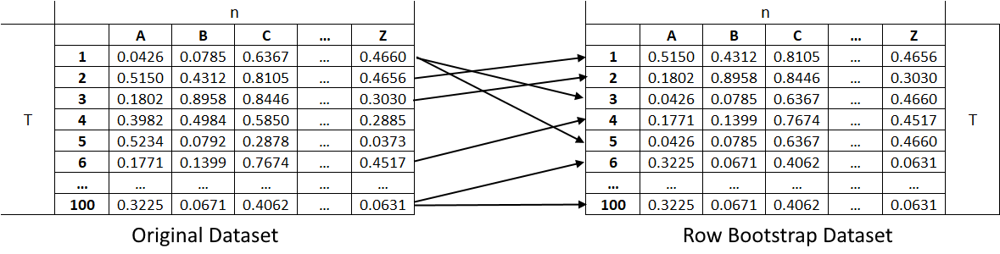
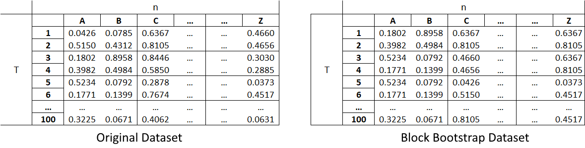

.. _data_generation-bootstrapping:

.. note::
    This section includes an accompanying Jupyter Notebook Tutorial that is now available via the respective tier on
    `Patreon <https://www.patreon.com/HudsonThames>`_.

=============
Bootstrapping
=============

.. note::
   The following implementation and documentation is based on the work of F. Musciotto, L. Marotta, S. Miccichè, and R. N. Mantegna
   `Bootstrap validation of links of a minimum spanning tree <https://arxiv.org/pdf/1802.03395.pdf>`_.

Bootstrapping is a statistical method used to resample a dataset with replacement to estimate its population statistics (such as
mean, median, standard deviation, etc.) In machine learning applications, bootstrap sampling usually leads to less overfitting and
improvement of the stability of our models.
Bootstrap methods draw small samples (with replacement) from a large dataset one at a time, and organizing them to construct
a new dataset. Here we examine three bootstrap methods. Row, Pair, and Block Bootstrap.

Row Bootstrap
#############

The Row Bootstrap method samples rows with replacement from a dataset to generate a new dataset. For example, for a dataset of size
:math:`T \times n` which symbolizes :math:`T` rows (timesteps) and :math:`n` columns (assets), if we use the row bootstrap method to generate
a new matrix of the same size, we sample with replacement :math:`T` rows to form the new dataset. This implies that the new dataset can contain
repeated data from the original dataset.

   (Left) Original dataset of size :math:`T \times n`. (Right) Row bootstrap dataset of size :math:`T \times n`.

Implementation
**************

.. py:currentmodule:: mlfinlab.data_generation.bootstrap

.. autofunction:: row_bootstrap

Examples
********

.. code-block::

    from mlfinlab.data_generation.bootstrap import row_bootstrap
    import seaborn as sns
    import numpy as np
    import matplotlib.pyplot as plt

    # Create random matrix.
    original_dataset = np.random.rand(15, 6)

    # Generate a row bootstrap matrix.
    bootstrap_dataset = row_bootstrap(original_dataset, n_samples=1)

    # Plot them.
    fig, axes = plt.subplots(1, 2)
    sns.heatmap(original_dataset, annot=True, fmt=".2f", ax=axes[0])
    axes[0].set_title("Original Dataset")
    sns.heatmap(bootstrap_dataset[0], annot=True, fmt=".2f", ax=axes[1])
    axes[1].set_title("Row Bootstrap Dataset")

    plt.show()

Pair Bootstrap
##############

The Pair Bootstrap method samples pairs of columns with replacement from a dataset to generate a new dataset. This new dataset can be used to generate a dependence
matrix, as is a correlation matrix. For example, for a dataset of size :math:`T \times n` which symbolizes :math:`T` rows (timesteps) and :math:`n` columns (assets),
if we use the pair bootstrap method to generate a correlation matrix of size :math:`n \times n`, we iterate over the upper triangular indices of the correlation
matrix. For each index, we sample with replacement 2 columns and all their rows. We calculate the correlation measure of this pair and use it to fill the given
index of the correlation matrix. We repeat this process until we fill the correlation matrix.

.. figure:: images/pair_bootstrap.png
   :scale: 75 %
   :align: center
   :alt: Pair Bootstrap Generation

   (Left) Original dataset of size :math:`T \times n`. (Right) Row bootstrap dataset, each of size :math:`T \times 2`. Each pair dataset can be used to generate a dependence matrix (e.g. correlation matrix).

Implementation
**************

.. autofunction:: pair_bootstrap

Examples
********

.. code-block::

    from mlfinlab.data_generation.bootstrap import pair_bootstrap
    import seaborn as sns
    import numpy as np
    import matplotlib.pyplot as plt

    # Create random matrix.
    original_dataset = np.random.rand(50, 10)

    # Generate a pair bootstrap correlation matrix.
    bootstrap_corr_matrix = pair_bootstrap(original_dataset, n_samples=1)

    # Plot them.
    fig, axes = plt.subplots(1, 2)
    sns.heatmap(pd.DataFrame(original_dataset).corr(), ax=axes[0])
    axes[0].set_title("Original Dataset")
    sns.heatmap(bootstrap_corr_matrix[0], ax=axes[1])
    axes[1].set_title("Pair Bootstrap Dataset")

    plt.show()

Block Bootstrap
###############

The Block Bootstrap method samples blocks of data with replacement from a dataset to generate a new dataset. The block size can be of a size equal to or less
than the original dataset. The blocks in this module are non-overlapping (except on the edges of the dataset if the blocks cannot perfectly split the data).
Their ideal size depends on the data and its application. For example, for a dataset of size :math:`T \times n` which symbolizes
:math:`T` rows (timesteps) and :math:`n` columns (assets), if we use the Block Bootstrap method to split the data set into blocks of :math:`2 \times 2`, then
we sample as many blocks as needed to fill the bootstrapped matrix.

   (Left) Original dataset of size :math:`T \times n`. (Right) Block bootstrap dataset of size :math:`T \times n` created with blocks of size :math:`2 \times 2`.

Implementation
**************

.. autofunction:: block_bootstrap

Examples
********

.. code-block::

    from mlfinlab.data_generation.bootstrap import block_bootstrap
    import seaborn as sns
    import numpy as np
    import matplotlib.pyplot as plt

    # Create random matrix.
    original_dataset = np.random.rand(14, 9)

    # Generate a block bootstrap matrix.
    bootstrap_dataset = block_bootstrap(original_dataset, n_samples=1, block_size=(2, 3))

    # Plot them.
    fig, axes = plt.subplots(1, 2, figsize=(9, 5))
    sns.heatmap(original_dataset, annot=True, fmt=".2f", ax=axes[0])
    axes[0].set_title("Original Dataset")
    sns.heatmap(bootstrap_dataset[0], annot=True, fmt=".2f", ax=axes[1])
    axes[1].set_title("Block Bootstrap Dataset")

    plt.show()

Research Notebook
#################

.. note::
    This and other accompanying Jupyter Notebook Tutorials are now available via the respective tier on
    `Patreon <https://www.patreon.com/HudsonThames>`_.

The following research notebook can be used to better understand the bootstrap methods.

* `Generating Matrices using Bootstrap Methods`_

.. _`Generating Matrices using Bootstrap Methods`: https://github.com/Hudson-and-Thames-Clients/research/tree/master/Data%20Generation/Bootstrap/bootstrap.ipynb

References
##########

Musciotto, F., Marotta, L., Miccichè, S. and Mantegna, R.N., 2018. Bootstrap validation of links of a minimum spanning tree. Physica A: Statistical Mechanics and its Applications, 512, pp.1032-1043.
