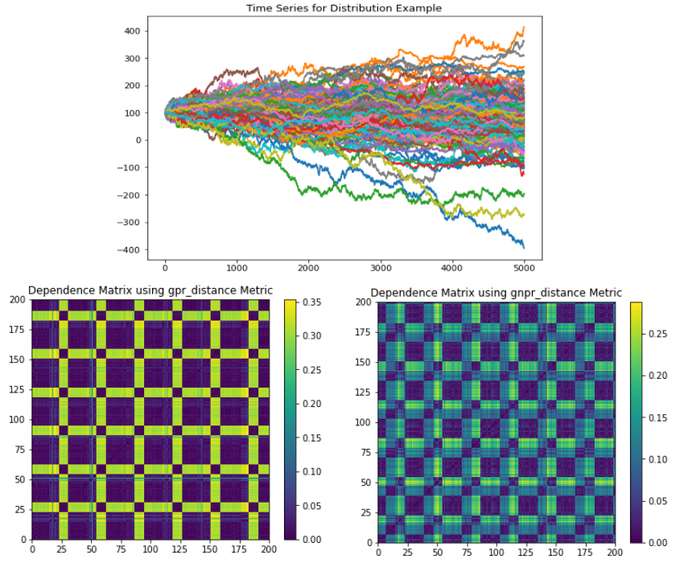
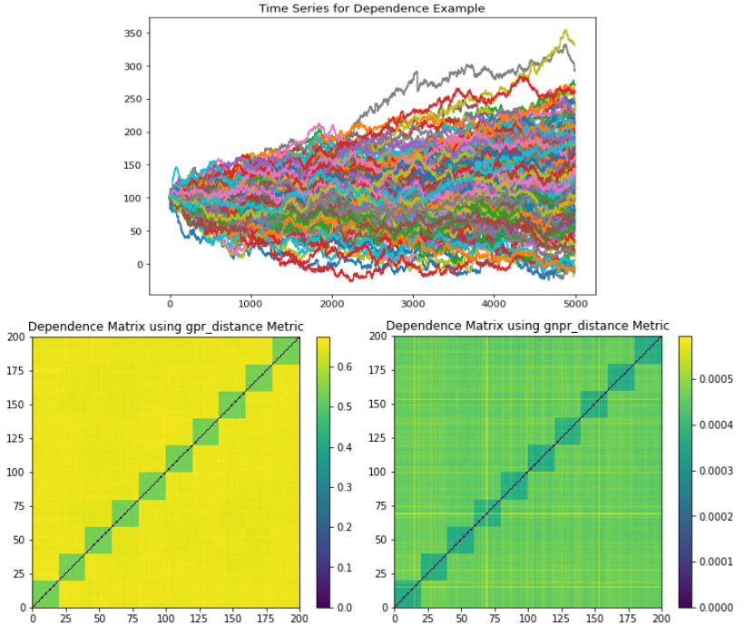

.. _data_generation-correlated_random_walks:

.. note::
    This section includes an accompanying Jupyter Notebook Tutorial that is now available via the respective tier on
    `Patreon <https://www.patreon.com/HudsonThames>`_.

=======================
Correlated Random Walks
=======================

.. note::
   The following implementation and documentation closely follow the work of Donnat, P., Marti, G. and Very, P.,
   `Toward a generic representation of random variables for machine learning <https://arxiv.org/pdf/1506.00976.pdf>`_.

Being able to discriminate random variables both on distribution and dependence on time series is
motivated by the study of financial assets returns. The authors proposed a distance metric (GNPR) that "improves the
performance of machine learning algorithms working on independent and identically distributed stochastic processes".

As examined by the authors, there is a need for a generic representation of random variables for machine learning. They introduce a
non-parametric approach to represent random variables that is able to split and detect different underlying distributions on a time series.
This method is called the generic non-parametric representation (GNPR) approach, the authors have shown it separates distributions more effectively than
other methods such as generic parametric representation (GPR), :math:`L_2` distance, and distance correlation.

.. note::

    The GNPR approach is described in our documentation, located in the :ref:`Codependence by Marti <codependence-codependence_marti>` section.

Time Series Generation with Different Distributions
###################################################

In order to test and verify the efficiency of this approach, the authors provide a method to generate time series datasets.
They are defined as :math:`N` time series, each of length :math:`T`, which are subdivided into :math:`K` correlation clusters, themselves subdivided into
:math:`D` distribution clusters.

If :math:`\textbf{W}` is sampled from a normal distribution :math:`N(0, 1)` of length :math:`T`, :math:`(Y_k)_{k=1}^K` is :math:`K` i.i.d random distributions
each of length :math:`T`, and :math:`(Z_d^i)_{d=1}^D`; for :math:`i \leq i \leq N` are independent random distributions of length :math:`T`, for
:math:`i \leq i \leq N` they define:

.. math::
    X_i = \textbf{W} + \sum_{k=1}^{K} \beta_{k, i} Y_k + \sum_{d=1}^{D} \alpha_{d, i} Z_d^i

Where

- :math:`\alpha_{d, i} = 1`, if :math:`i \equiv d - 1` (mod :math:`D`), 0 otherwise
- :math:`\beta \in [0, 1]`
- :math:`\beta_{k, i} = \beta`, if :math:`\textit{ceil}(iK/N) = k`, 0 otherwise.

The authors show that even though the mean and the variance of the :math:`(Y_k)` and :math:`(Z_d^i)` distributions are the same and their variables are highly correlated,
GNPR is able to successfully separate them into different clusters.

The distributions supported by default are:

- Normal distribution (:code:`np.random.normal`)
- Laplace distribution (:code:`np.random.laplace`)
- Student's t-distribution (:code:`np.random.standard_t`)

Implementation
##############

To override the default distributions used to create the time series, the user must pass a list of the names of the distributions to use as the parameter :code:`dists_clusters`.
The first value of this list is used to generate :math:`(Y_k)_{k=1}^K`.
The available distributions are:

- "normal" (:code:`np.random.normal(0, 1)`)
- "normal_2" (:code:`np.random.normal(0, 2)`)
- "laplace" (:code:`np.random.laplace(0, 1 / np.sqrt(2))`)
- "student-t" (:code:`np.random.standard_t(3) / np.sqrt(3)`)

.. py:currentmodule:: mlfinlab.data_generation.correlated_random_walks

.. autofunction:: generate_cluster_time_series

Examples
########

The authors provide multiple parameters and distributions in their paper. :math:`N` represents the normal distribution, :math:`L` represents :math:`Laplace(0, 1/\sqrt{2})`, and
:math:`S` represents :math:`t-distribution(3)/\sqrt{3}`

+--------------+-----+------+----+---+------------------+------------------+----------------+----------------+---------------+----------------+----------------+
|  Clustering  |  N  |   T  |  K | D | :code:`rho_main` | :code:`rho_corr` |   :math:`Y_k`  |  :math:`Z_1^i` | :math:`Z_2^i` |  :math:`Z_3^i` |  :math:`Z_4^i` |
+--------------+-----+------+----+---+------------------+------------------+----------------+----------------+---------------+----------------+----------------+
| Distribution | 200 | 5000 |  1 | 4 |        0.1       |         0        | :math:`N(0,1)` | :math:`N(0,1)` |   :math:`L`   |    :math:`S`   | :math:`N(0,2)` |
+--------------+-----+------+----+---+------------------+------------------+----------------+----------------+---------------+----------------+----------------+
|  Dependence  | 200 | 5000 | 10 | 1 |        0.1       |        0.3       |    :math:`S`   |    :math:`S`   |   :math:`S`   |    :math:`S`   |    :math:`S`   |
+--------------+-----+------+----+---+------------------+------------------+----------------+----------------+---------------+----------------+----------------+
|      Mix     | 200 | 5000 |  5 | 2 |        0.1       |        0.3       | :math:`N(0,1)` | :math:`N(0,1)` |   :math:`S`   | :math:`N(0,1)` |    :math:`S`   |
+--------------+-----+------+----+---+------------------+------------------+----------------+----------------+---------------+----------------+----------------+

The *Distribution* example generates a time series that has a global normal distribution, no correlation clustering, and 4 distribution clusters.

   (Top) Time series plot. (Left) GPR codependence matrix. Only two apparent clusters are seen with no indication of a global embedded distribution. (Right). All 4 distributions clusters can be seen, as well as the global embedded distribution.

The *Dependence* example generates a time series that has a global normal distribution, 10 correlation clusters, and no distribution clusters.

   (Top) Time series plot. (Left) GPR codependence matrix. Only 10 correlation clusters are seen with no indication of a global embedded distribution. All 10 correlation clusters can be seen, as well as the global embedded distribution.

The *Mix* example generates a time series that has a global normal distribution, 5 correlation clusters, and 2 distribution clusters.

.. figure:: images/mix_example.png
   :scale: 75 %
   :align: center
   :alt: Mix Time Series Example

   (Top) Time series plot. (Left) GPR codependence matrix. Only 5 correlation clusters are seen with no indication of a global embedded distribution. All 5 correlation clusters and 2 distribution clusters can be seen, as well as the global embedded distribution.

.. code::

    import matplotlib.pyplot as plt
    from mlfinlab.data_generation.correlated_random_walks import generate_cluster_time_series
    from mlfinlab.data_generation.data_verification import plot_time_series_dependencies

    # Initialize the example parameters for the time series.
    n_series = 200
    t_samples = 5000
    k_clusters = [1, 10, 5]
    d_clusters = [4, 1, 2]
    rho_corrs = [0, 0.3, 0.3]
    thetas = [0, 1, 0.5]
    dists_clusters = [["normal",    "normal",    "laplace",   "student-t", "normal_2"],
                      ["student-t", "student-t", "student-t", "student-t", "student-t"],
                      ["normal",    "normal",    "student-t", "normal",    "student-t"]]
    titles = ["Distribution", "Dependence", "Mix"]

    # Plot the time series and codependence matrix for each example.
    for i in range(len(k_clusters)):
        dataset = generate_cluster_time_series(n_series=n_series, t_samples=t_samples, k_corr_clusters=k_clusters[i],
                                               d_dist_clusters=d_clusters[i], rho_corr=rho_corrs[i],
                                               dists_clusters=dists_clusters[i])

        dataset.plot(legend=None, title="Time Series for {} Example".format(titles[i]))
        plt.figure()

        plot_time_series_dependencies(dataset, dependence_method='gpr_distance', theta=thetas[i])
        plot_time_series_dependencies(dataset, dependence_method='gnpr_distance', theta=thetas[i])
        plt.figure()

    plt.show()

Research Notebook
#################

.. note::
    This and other accompanying Jupyter Notebook Tutorials are now available via the respective tier on
    `Patreon <https://www.patreon.com/HudsonThames>`_.

The following research notebook can be used to better understand Correlated Random Walks.

* `Correlated Random Walks`_

.. _`Correlated Random Walks`: https://github.com/Hudson-and-Thames-Clients/research/tree/master/Data%20Generation/Correlated%20Random%20Walks/correlated_random_walks.ipynb

References
##########

1. www.datagrapple.com. (n.d.). DataGrapple - Tech: A GNPR tutorial: How to cluster random walks. [online] Available at: https://www.datagrapple.com/Tech/GNPR-tutorial-How-to-cluster-random-walks.html [Accessed 26 Aug. 2020].