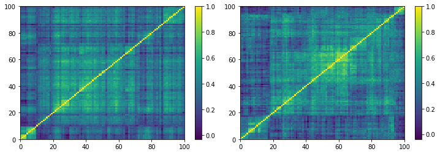

.. _data_generation-corrgan:

.. note::
    This section includes an accompanying Jupyter Notebook Tutorial that is now available via the respective tier on
    `Patreon <https://www.patreon.com/HudsonThames>`_.

.. note::
   The following implementation and documentation closely follow the work of Gautier Marti:
   `CorrGAN: Sampling Realistic Financial Correlation Matrices using Generative Adversarial Networks <https://arxiv.org/pdf/1910.09504.pdf>`_.

=======
CorrGAN
=======

Gautier Marti proposed a novel approach for sampling realistic financial correlation matrices. He used a generative adversarial network (a GAN, named CorrGAN) to recover most of the
known "stylized facts" about empirical correlation matrices based on asset returns.
It was trained on approximately 10,000 empirical correlation matrices estimated on S&P 500 returns sorted by a permutation induced by a hierarchical clustering
algorithm.

   (Left) Empirical correlation matrix estimated on stocks returns; (Right) GAN-generated correlation matrix. (Courtesy of `marti.ai <https://marti.ai/ml/2019/10/13/tf-dcgan-financial-correlation-matrices.html>`_)

Gautier Marti found that previous methods for generating realistic correlation matrices were lacking. Other authors found as well that
"there is no algorithm available for the generation of reasonably random financial correlation matrices with the Perron-Frobenius property. [...] we expect
the task of finding such correlation matrices to be highly complex"
The Perron-Frobenius property is one of many "stylized facts" that financial correlation matrices exhibit and it is difficult to reproduce with previous methods.

Being able to generate any number of realistic correlation matrices is a game changer for these reasons.

CorrGAN generates correlation matrices that have many "stylized facts" seen in empirical correlation matrices. The stylized facts CorrGAN recovered are:

1. Distribution of pairwise correlations is significantly shifted to the positive.
2. Eigenvalues follow the Marchenko-Pastur distribution, but for a very large first eigenvalue (the market).
3. Eigenvalues follow the Marchenko-Pastur distribution, but for a couple of other large eigenvalues (industries).
4. Perron-Frobenius property (first eigenvector has positive entries).
5. Hierarchical structure of correlations.
6. Scale-free property of the corresponding Minimum Spanning Tree (MST).

Implementation
##############

.. py:currentmodule:: mlfinlab.data_generation.corrgan

.. autofunction:: sample_from_corrgan

Example
#######

.. note::

    Due to the CorrGAN trained models being too large to be included in the mlfinlab package (> 100 MB).
    We included them as a downloadable package `here <https://drive.google.com/drive/folders/1-c4Z14a9JV56fvHQm-lB28vlaIjeLXVg>`_.
    Extract the ``corrgan_models`` folder and copy it in the ``mlfinlab`` folder.

.. note::
    The higher the dimension, the longer it takes CorrGAN to generate a sample. For more information refer to the research notebook.

.. code-block::

    from mlfinlab.data_generation.corrgan import sample_from_corrgan
    import matplotlib.pyplot as plt

    # Sample from CorrGAN has shape (n_samples, dim, dim).
    # For this example it corresponds to (4, 100, 100).
    corr_mats = sample_from_corrgan(model_loc="mlfinlab/corrgan_models", dim=100, n_samples=4)

    # Plots the correlation matrices generated from CorrGAN in a pseudocolor plot.
    plt.figure(figsize=(12, 8))
    for i in range(min(4, len(corr_mats))):
        plt.subplot(2, 2, i + 1)
        plt.pcolormesh(corr_mats[i][:, :], cmap='viridis')
        plt.colorbar()
    plt.show()

Research Notebook
#################

.. note::
    This and other accompanying Jupyter Notebook Tutorials are now available via the respective tier on
    `Patreon <https://www.patreon.com/HudsonThames>`_.

The following research notebook can be used to better understand the sampled correlation matrices.

* `CorrGAN - Realistic Financial Correlation Matrices`_

.. _`CorrGAN - Realistic Financial Correlation Matrices`: https://github.com/Hudson-and-Thames-Clients/research/tree/master/Data%20Generation/CorrGAN/corrgan.ipynb