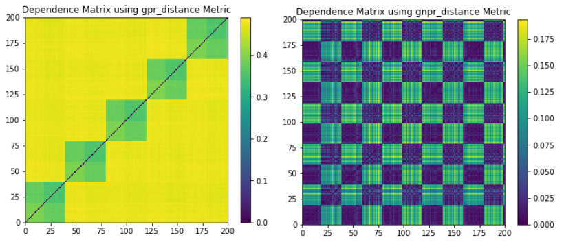

.. _data_generation-data_verification:

.. note::
   The following implementation and documentation closely follow the work of Gautier Marti:
   `CorrGAN: Sampling Realistic Financial Correlation Matrices using Generative Adversarial Networks <https://arxiv.org/pdf/1910.09504.pdf>`_.

   And the work of Donnat, P., Marti, G. and Very, P:
   `Toward a generic representation of random variables for machine learning <https://arxiv.org/pdf/1506.00976.pdf>`_.

=================
Data Verification
=================

Data verification for synthetic data is needed to confirm if it shares some properties of the original data.
Being able to examine and validate synthetically generated data is critical to building more accurate systems. Without verification,
we would operate on data that might not have any significance in the real world. We present several methods to examine the properties of this type of data.

Stylized Factors of Correlation Matrices
########################################

Following the work of Gautier Marti in CorrGAN, we provide function to plot and verify a synthetic matrix has the 6 stylized facts of empirical
correlation matrices.

The stylized facts are:

1. Distribution of pairwise correlations is significantly shifted to the positive.
2. Eigenvalues follow the Marchenko-Pastur distribution, but for a very large first eigenvalue (the market).
3. Eigenvalues follow the Marchenko-Pastur distribution, but for a couple of other large eigenvalues (industries).
4. Perron-Frobenius property (first eigenvector has positive entries).
5. Hierarchical structure of correlations.
6. Scale-free property of the corresponding Minimum Spanning Tree (MST).

Implementation
**************

.. py:currentmodule:: mlfinlab.data_generation.data_verification

.. autofunction:: plot_stylized_facts

.. autofunction:: plot_pairwise_dist

.. autofunction:: plot_eigenvalues

.. autofunction:: plot_eigenvectors

.. autofunction:: plot_hierarchical_structure

.. autofunction:: plot_mst_degree_count

Example
*******

.. code-block::

    import yfinance as yf
    from mlfinlab.data_generation.corrgan import sample_from_corrgan
    from mlfinlab.data_generation.data_verification import plot_stylized_facts

    # Download stock data from yahoo finance.
    dimensions = 3
    prices = yf.download(tickers=" ".join(["AAPL", "MSFT", "AMZN"]), period='1y')['Close']

    # Calculate correlation matrices.
    prices = prices.pct_change()
    rolling_corr = prices.rolling(252, min_periods=252//2).corr().dropna()

    # Generate same quantity of data from CorrGAN.
    num_samples = len(rolling_corr.index.get_level_values(0).unique())

    corrgan_mats = sample_from_corrgan(model_loc="corrgan_models",
                                       dim=dimensions,
                                       n_samples=num_samples)

    # Transform from pandas to numpy array.
    empirical_mats = []
    for date, corr_mat in rolling_corr.groupby(level=0):
        empirical_mats.append(corr_mat.values)
    empirical_mats = np.array(empirical_mats)

    # Plot all stylized facts.
    plot_stylized_facts(empirical_mats, corrgan_mats)

Time Series Codependence Visualization
######################################

.. note::

    The correlated random walks time series generation and GNPR codependence measure approaches are fully explored in
    our :ref:`Correlated random walks <data_generation-correlated_random_walks>`
    and :ref:`Codependence by Marti <codependence-codependence_marti>` sections.

Following the work of Donnat, Marti, and Very (2016) we provide a method to plot the GNPR codependence matrix and visualize the different
underlying distributions these time series may have. GNPR was shown to detect all underlying distributions more accurately than other methods, as it
L2 distance, correlation distance, and GPR.

Implementation
**************

.. autofunction:: plot_time_series_dependencies

Example
*******

   (Left) GPR codependence matrix. Only 5 correlation clusters are seen with no indication of a global embedded distribution. All 5 correlation clusters and 2 distribution clusters can be seen, as well as the global embedded distribution.

.. code::

    import matplotlib.pyplot as plt
    from mlfinlab.data_generation.correlated_random_walks import generate_cluster_time_series
    from mlfinlab.data_generation.data_verification import plot_time_series_dependencies

    # Initialize the example parameters for the time series.
    n_series = 200
    t_samples = 5000
    k_clusters = 5
    d_clusters = 2

    # Plot the time series and codependence matrix for each example.
    # Generate a time series datasets with 2 underlying distributions that are clustered.
    dataset = generate_cluster_time_series(n_series=n_series, t_samples=t_samples,
                                           k_corr_clusters=k_clusters, d_dist_clusters=d_clusters,
                                           dists_clusters=["normal", "normal", "student-t",
                                                           "normal", "student-t"])

    plot_time_series_dependencies(dataset, dependence_method='gnpr_distance', theta=0.5)

    plt.show()

Optimal Hierarchical Clustering
###############################

This function plots the optimal leaf hierarchical clustering as shown in `Marti, G. (2020) TF 2.0 DCGAN for 100x100 financial correlation matrices <https://marti.ai/ml/2019/10/13/tf-dcgan-financial-correlation-matrices.html>`_
by arranging a matrix with hierarchical clustering by maximizing the sum of the similarities between adjacent leaves.

Implementation
**************

.. py:currentmodule:: mlfinlab.data_generation.data_verification

.. autofunction:: plot_optimal_hierarchical_cluster

Example
*******

.. figure:: images/optimal_clustering.png
   :scale: 90 %
   :align: center
   :alt: Optimal Clustering.

   (Left) HCBM matrix. (Right) Optimal Clustering of the HCBM matrix.

.. code-block::

    from mlfinlab.data_generation.data_verification import plot_optimal_hierarchical_cluster
    from mlfinlab.data_generation.hcbm import generate_hcmb_mat
    import matplotlib.pyplot as plt

    # Initialize parameters.
    samples = 1
    dim = 200
    rho_low = 0.1
    rho_high = 0.9

    # Generate HCBM matrix.
    hcbm_mat = generate_hcmb_mat(t_samples=samples,
                                 n_size=dim,
                                 rho_low=rho_low,
                                 rho_high=rho_high,
                                 permute=True)[0]

    # Plot it.
    plt.figure(figsize=(6, 4))
    plt.pcolormesh(hcbm_mat, cmap='viridis')
    plt.colorbar()
    plt.title("Original Correlation Matrix")

    # Plot optimal clustering.
    plot_optimal_hierarchical_cluster(hcbm_mat, method="ward")
    plt.title("Optimal Clustering Correlation Matrix")

    plt.show()
