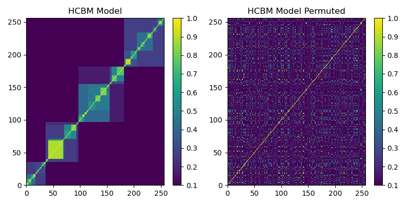
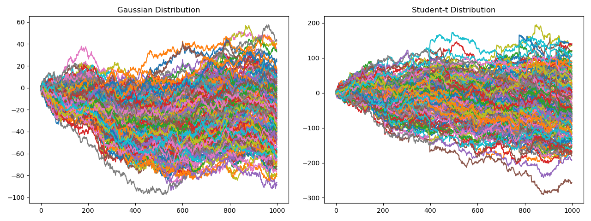

.. _data_generation-hcbm:

.. note::
    This section includes an accompanying Jupyter Notebook Tutorial that is now available via the respective tier on
    `Patreon <https://www.patreon.com/HudsonThames>`_.

===========================================
Hierarchical Correlation Block Model (HCBM)
===========================================

.. note::
   The following implementation and documentation closely follow the work of Marti, Andler, Nielsen, and Donnat:
   `Clustering financial time series: How long is enough? <https://www.ijcai.org/Proceedings/16/Papers/367.pdf>`_.

HCBM
####

According to the research paper, it has been verified that price time series of traded assets for different markets exhibit a hierarchical correlation structure.
Another property they exhibit is the non-Gaussianity of daily asset returns. These two properties prompt the use of alternative correlation coefficients, with
the most used correlation coefficient is the Pearson correlation coefficient, and the definition of the Hierarchical Correlation Block Model (HCBM).

.. warning::

    Pearson correlation only captures linear effects. If two variables have strong non-linear dependency (squared or abs for example)
    Pearson correlation won't find any pattern between them. For information about capturing non-linear dependencies, read our :ref:`codependence-introduction`
    to Codependence.

The HCBM model consists of correlation matrices having a hierarchical block structure. Each block corresponds to a correlation cluster.
The HCBM defines a set of nested partitions :math:`P = \{P_0 \supseteq P_1 \supseteq ... \supseteq P_h\}` for some :math:`h \in [1, N]` for :math:`N` univariate
random variables. Each partition is further subdivided and paritioned again for :math:`k` levels where :math:`1 \leq k \leq h`. We define
:math:`\underline{\rho_k}` and :math:`\bar{\rho_k}` such that for all :math:`1 \leq i,j \leq N`, we have :math:`\underline{\rho_k} \leq \rho_{i,j} \leq \bar{\rho_k}`,
when :math:`C^{(k)}(X_i) = C^{(k)}(X_j)` and :math:`C^{(k+1)}(X_i) \neq C^{(k+1)}(X_j)` (:math:`C^{(k)}(X_i)` denotes the cluster :math:`X_i` in partition :math:`P_k`).

This implies that :math:`\underline{\rho_k}` and :math:`\bar{\rho_k}` are the minimum and maximum correlation factors respectively within all clusters
:math:`C^{(k)}_i` in the partition :math:`P_k` at depth :math:`k`. In order for the generated matrix to have a proper nested correlation hierarchy, we must have
:math:`\bar{\rho_k} < \underline{\rho_{k+1}}` hold true for all :math:`k`.

Figure 1 is a sample HCBM matrix  generated with :math:`N = 256`, :math:`k = 4`, :math:`h = 4`, :math:`\underline{\rho_k} = 0.1`, and :math:`\bar{\rho_k} = 0.9`.

   Figure 1. (Left) HCBM matrix. (Right) Left HCBM matrix permuted once.

Figure 1 shows how an HCBM matrix has different levels of hierarchical clusters. The picture on the right shows how a correlation matrix is most commonly observed
from asset returns.

Implementation
**************

.. py:currentmodule:: mlfinlab.data_generation.hcbm

.. autofunction:: generate_hcmb_mat

Example
*******

.. code-block::

    import matplotlib.pyplot as plt
    from mlfinlab.data_generation.hcbm import generate_hcmb_mat

    # Initialize parameters.
    samples = 4
    dim = 200
    rho_low = 0.1
    rho_high = 0.9

    # Generate HCBM matrices.
    hcbm_mats = generate_hcmb_mat(t_samples=samples,
                                  n_size=dim,
                                  rho_low=rho_low,
                                  rho_high=rho_high)

    # Plot them.
    for i in range(len(hcbm_mats)):
        plt.subplot(2, 2, i + 1)
        plt.pcolormesh(hcbm_mats[i], cmap='viridis')
        plt.colorbar()
    plt.show()

Time Series Generation from HCBM Matrix
#######################################

To generate financial time series models from HCBM matrices we will consider two models.

- The standard, but not entirely accurate, gaussian random walk model. Its increments are realization from a :math:`N`-variate Gaussian :math:`X \sim N(0, \Sigma)`
- The :math:`N`-variate Student's t-distribution, with degree of freedom :math:`v = 3`, :math:`X \sim t_v(0, \frac{v-2}{v}\Sigma)`

The advantage of using the :math:`N`-variate Student's t-distribution is that it captures heavy-tailed behavior and tail-dependence. The authors assert that
"It has been shown that this distribution (Student's t-distribution) yields a much better fit to real returns than the Gaussian distribution"

Both distributions are parameterized by a covariance matrix :math:`\Sigma`. We define :math:`\Sigma` such that the underlying correlation matrix has a HCBM
structure as shown in Figure 1.

Figure 2 shows both distributions created from an HCBM matrix. It has 1000 samples

   Figure 2. (Left) Time Series generated from a Gaussian Distribution. (Right) Time Series generated from a Student-t distribution.

Implementation
**************

.. py:currentmodule:: mlfinlab.data_generation.hcbm

.. autofunction:: time_series_from_dist

Example
*******

.. code-block::

    import matplotlib.pyplot as plt
    from mlfinlab.data_generation.hcbm import generate_hcmb_mat, time_series_from_dist

    # Initialize parameters.
    samples = 1
    dim = 200
    rho_low = 0.1
    rho_high = 0.9

    # Generate time series from HCBM matrix.
    hcbm_mats = generate_hcmb_mat(t_samples=samples,
                                  n_size=dim,
                                  rho_low=rho_low,
                                  rho_high=rho_high)
    series_df = time_series_from_dist(hcbm_mats[0], dist="normal")

    # Plot it.
    series_df.cumsum().plot(legend=None)

    plt.show()

Research Notebook
#################

.. note::
    This and other accompanying Jupyter Notebook Tutorials are now available via the respective tier on
    `Patreon <https://www.patreon.com/HudsonThames>`_.

The following research notebook can be used to better understand the Hierarchical Correlation Block Model.

* `Hierarchical Correlation Block Model`_

.. _`Hierarchical Correlation Block Model`: https://github.com/Hudson-and-Thames-Clients/research/tree/master/Data%20Generation/HCBM/hcbm.ipynb
