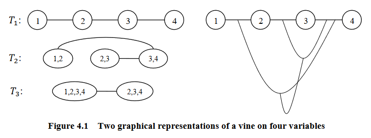
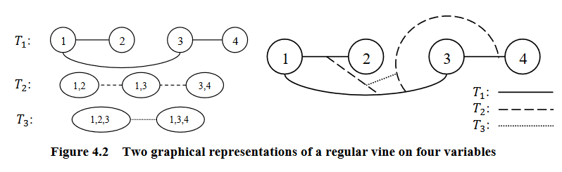
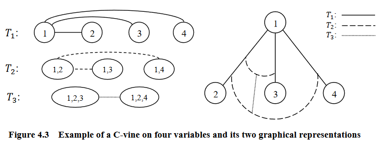
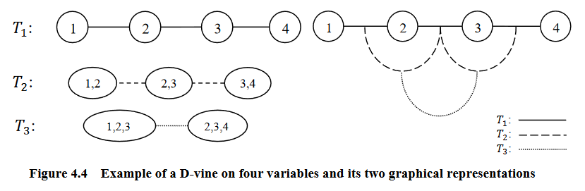
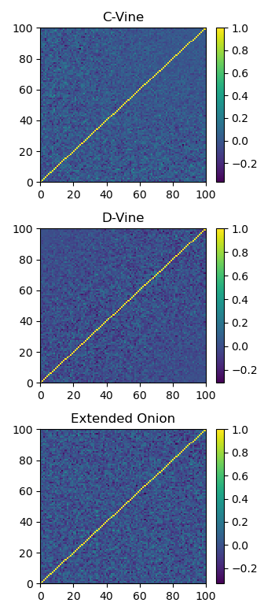
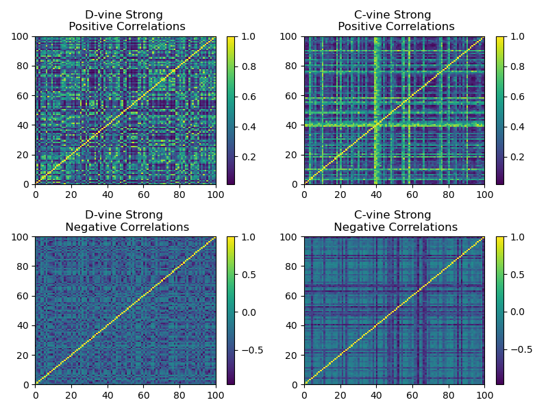

.. _data_generation-vine_methods:

.. note::
    This section includes an accompanying Jupyter Notebook Tutorial that is now available via the respective tier on
    `Patreon <https://www.patreon.com/HudsonThames>`_.

.. note::
   The following implementation and documentation is based on the works of Daniel Lewandowski, Dorota Kurowicka, and Harry Joe:
   `Generating random correlation matrices based on vines and extended onion method <https://www.sciencedirect.com/science/article/pii/S0047259X09000876>`_ and
   `Generating random correlation matrices based partial correlations <https://www.sciencedirect.com/science/article/pii/S0047259X05000886>`_.

===============================
Vine and Extended Onion Methods
===============================

Vines
#####

A vine is a graphical tool for modeling dependence structures of high-dimensional probability distributions.
Copulas are multivariate distributions with uniform univariate margins. It examines the association or dependence between many variables.

Vines have been proven to be useful and flexible tools in high-dimensional correlation structure modeling.
They consist of a nested set of connected trees where the edges in one tree are the nodes of another tree, and the edges of that tree are the nodes of a third tree and so on.

According to Zhu and Welsch (2018), they are defined as:

:math:`V` is an R-vine on :math:`p` elements with :math:`E(V) = E_1 \cup ... \cup  E_{p-1}` denoting a set of edges of :math:`V` if:

- :math:`V = {T_1, ..., T_{p-1}}`
- :math:`T_1` is a connected tree with nodes :math:`N_1 = {1, ..., p}`, and edges :math:`E_1`
- For :math:`i = 2, ..., p-1`; :math:`T_i` is a tree with nodes :math:`N_i = E_{i-1}`

   Graphical representation of a vine (courtesy of Zhu and Welsch (2018)).

The most common vine structures are regular vines (R-vines,) canonical vine (C-vines,) and drawable vines (D-vines).
The following examples are based on the work of to Zhu and Welsch (2018).

R-Vines
-------

A vine is considered a regular vine on :math:`p` elements with :math:`E(V) = E_1 \cup ... \cup E_{p-1}`
denoting the set of edges of :math:`V` if:

- :math:`V` is a vine
- For :math:`i = 2, ..., p-1`; :math:`{a, b} \in E_i`; :math:`\#(a \Delta b) = 2`. Where :math:`\Delta` denotes the symmetric difference operator, and :math:`\#` denotes the cardinality of a set. Therefore, :math:`a \Delta b = (a \cup b) \setminus (a \cap b)`

   Graphical representation of an R-vine (courtesy of Zhu and Welsch (2018)).

C-Vines
-------

An R-vine is considered a C-vine if each tree :math:`T_i` has a unique node of degree :math:`p-i`
for :math:`i = 1, ..., p-2`.

   Graphical representation of an C-vine (courtesy of Zhu and Welsch (2018)).

D-Vines
-------

An R-vine is considered a D-vine if each node in :math:`T_1` has a degree of at most 2.

   Graphical representation of an D-vine (courtesy of Zhu and Welsch (2018)).

Partial Correlation Vines
-------------------------

Partial correlation measures the degree of association between two random variables while controlling for a third random variable.
It is used to find the variance between two variables while eliminating the variance from the third variable.

A partial correlation vine can be formed with an R-vine, C-vine, or D-vine structure :math:`V`. Each edge of the vine
is identified with a partial correlation coefficient. Thus each edge in :math:`V` has can have a value in [-1, 1].
:math:`V` specifies :math:`{d \choose 2}` standard and partial correlations.

Correlation Matrices Generation
-------------------------------

In his work, Joe shows that by using a D-vine, we can generate a :math:`d`-dimensional random positive definite correlation matrix :math:`R = (\rho_{i, j})` by
choosing independent distributions :math:`F_{i, j}, 1 \leq i < j \leq d`, for these :math:`{d \choose 2}` parameters.
:math:`F_{i, j}` conditions are chosen so that the joint density of :math:`(\rho_{i, j})` is proportional to a
power of :math:`det(R)`.

Joe goes on to prove one can generate :math:`\frac{d \cdot (d-1)}{2}` partial correlations by independently sampling from a beta distribution of different
densities, transformed to the range [-1, 1] and then convert them into raw correlations via a recursive formula. The
resulting matrix will be distributed uniformly. The partial correlations can be generated using the D-vine or C-vine methods.

When using the D-vine, the beta distribution :math:`Beta(\alpha_i, \alpha_i)` is sampled for :math:`\alpha_1 = d/2, ..., \alpha_{d-2}, \alpha_{d-1}` Where

:math:`\alpha_{d-2} = \alpha_{d-3} - 1/2`

:math:`\alpha_{d-1} = \alpha_{d-2} - 1/2`

Lewandowski, Kurowicka, and Joe extended this method for the C-vine. They introduce the paramater :math:`\eta` to sample
from a distribution proportional to :math:`det(R)^{\eta-1}`. The resulting beta distribution :math:`Beta(\alpha_i, \alpha_i)` is sampled
for :math:`\alpha_1 = \eta+ (d-1)/2, ..., \alpha_{d-2}, \alpha_{d-1}` Where

:math:`\alpha_{d-2} = \alpha_{d-3} - 1/2`

:math:`\alpha_{d-1} = \alpha_{d-2} - 1/2`

Implementation
--------------

.. py:currentmodule:: mlfinlab.data_generation.vines

.. autofunction:: sample_from_cvine

.. autofunction:: sample_from_dvine

The Onion Method
################

The onion method as described by Ghosh and Henderson (2003) is a method to sample exactly and quickly from a uniform distribution. It iteratively creates a correlation matrix
by starting with a one-dimensional matrix. Then it 'grows out' the matrix by adding one dimension at a time.
Lewandowski, Kurowicka, and Joe modified this method and named it the extended onion method. The extend onion samples correlation
matrices from a distribution proportional to :math:`det(R)^{\eta-1}` as described above. It samples exactly from the uniform distribution
over the set of correlation matrices on the surface of a k-dimensional hypersphere, a subset of :math:`R^{\frac{d-1}{1}}`.

The onion method is based on the fact that any correlation matrix of size :math:`(k+1) \times (k+1)` can be partitioned as

.. math::
    \textbf{r}_{k+1} =
    \begin{bmatrix}
        \textbf{r}_{k} & \textbf{z} \\
        \textbf{z}^T & 1
    \end{bmatrix}

Where :math:`\textbf{r}_k` is an :math:`k \times k` correlation matrix and :math:`\textbf{z}` is a :math:`k`-vector of correlations.

Implementation
--------------

.. py:currentmodule:: mlfinlab.data_generation.vines

.. autofunction:: sample_from_ext_onion

Examples
########

Here we show the correlation matrix generated for each method.

   Plot of a sample generated correlation matrix using each method.

.. code-block::

    from mlfinlab.data_generation.vines import (sample_from_cvine,
                                                sample_from_dvine, sample_from_ext_onion)
    import matplotlib.pyplot as plt

    # Sample a correlation matrix from each method. Matrix has shape (n_samples, dim, dim).
    # For this example it corresponds to (1, 100, 100).
    dim = 100
    n_samples = 1
    fig, axes = plt.subplots(3, figsize=(3.5, 7.8))
    for i, func in enumerate([sample_from_cvine, sample_from_dvine, sample_from_ext_onion]):
        # Only the D-vine method does not support the eta variable.
        if func == sample_from_dvine:
            corr_mats = func(dim=dim, n_samples=n_samples)
        else:
            corr_mats = func(dim=dim, eta=2, n_samples=n_samples)

        # Plots the correlation matrices generated in a pseudocolor plot.
        a = axes[i].pcolormesh(corr_mats[0][:, :], cmap='viridis')
        fig.colorbar(a, ax=axes[i])
        if i == 0:
            title = "C-Vine"
        elif i == 1:
            title = "D-Vine"
        else:
            title = "Extended Onion"
        axes[i].set_title(title)

    plt.show()

We show that by biasing the beta distribution from which the C-vine and D-vine methods sample their correlations, we
can generate stronger correlations matrices. For a beta distribution :math:`Beta(\alpha, \beta)`, if :math:`\alpha \gg \beta`, the resulting correlation
matrix has stronger positive correlations. If :math:`\alpha \ll \beta`, the resulting correlation matrix has stronger negative correlations.

   Plot of a sample generated correlation matrix using skewed beta distributions for stronger correlations.

.. code-block::

    from mlfinlab.data_generation.vines import (sample_from_cvine,
                                                sample_from_dvine, sample_from_ext_onion)
    import matplotlib.pyplot as plt

    # Sample a correlation matrix from C-vine and D-vine methods, setting the beta parameters
    # manually.
    dim = 100
    n_samples = 1
    beta_params = [(30, 4), (4, 30)]
    title_suffix = ["Positive", "Negative"]
    plt.figure(figsize=(8, 6))
    i = 0
    for j, beta_param in enumerate(beta_params):
        # Generate matrices.
        dvine_mat = sample_from_dvine(dim=dim, n_samples=1, beta_dist_fixed=beta_param)
        cvine_mat = sample_from_cvine(dim=dim, n_samples=1, beta_dist_fixed=beta_param)

        # Plot D-vine.
        fig = plt.subplot(2, 2, i + j + 1)
        fig.set_title("D-vine Strong \n {} Correlations".format(title_suffix[i]))
        plt.pcolormesh(dvine_mat[0][:, :], cmap='viridis')
        plt.colorbar()

        # Plot C-vine.
        fig = plt.subplot(2, 2, j + i + 2)
        fig.set_title("C-vine Strong \n {} Correlations".format(title_suffix[i]))
        plt.pcolormesh(cvine_mat[0][:, :], cmap='viridis')
        plt.colorbar()

        i += 1

    plt.show()

Research Notebook
#################

.. note::
    This and other accompanying Jupyter Notebook Tutorials are now available via the respective tier on
    `Patreon <https://www.patreon.com/HudsonThames>`_.

The following research notebook can be used to better understand the Vines and Extended Onion methods.

* `Generating Correlation Matrices using the Vines and Extended Onion Methods`_

.. _`Generating Correlation Matrices using the Vines and Extended Onion Methods`: https://github.com/Hudson-and-Thames-Clients/research/tree/master/Data%20Generation/Vines/vines.ipynb

References
##########

Zhu, Z. and Welsch, R.E., 2018. Robust dependence modeling for high-dimensional covariance matrices with financial applications. The Annals of Applied Statistics, 12(2), pp.1228-1249.

Ghosh, S. and Henderson, S.G., 2003. Behavior of the NORTA method for correlated random vector generation as the dimension increases. ACM Transactions on Modeling and Computer Simulation (TOMACS), 13(3), pp.276-294.