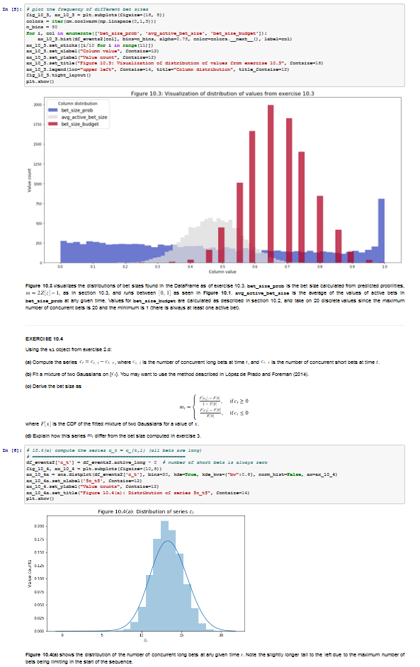

.. _additional_information-research_notebooks:

==================
Research Notebooks
==================

By choosing the Tutorial Notebooks tier and higher on our `Patreon page <https://www.patreon.com/HudsonThames>`_
you gain access to more than 45 research notebooks. These notebooks provide additional theoretical elements,
examples of the use of the algorithms implemented in the MlFinLab package. Research notebooks are a perfect tool to
try algorithms hands-on and gain additional understanding of how they can be used on real data examples.

Available Notebooks
###################

The following is the directory structure for the Notebooks in our private
`Hudson & Thames Clients repository <https://github.com/Hudson-and-Thames-Clients>`_. The Research
notebooks are marked as links to their abstracts.

| ├── Advances in Financial Machine Learning
| │   ├── Backtest Statistics
| │   │   └── `Chapter14_BacktestStatistics.ipynb <https://mlfinlab.readthedocs.io/en/latest/getting_started/research_notebooks.html#id1>`_
| │   ├── Bet Sizing
| │   │   ├── `Chapter10_Exercises.ipynb <https://mlfinlab.readthedocs.io/en/latest/getting_started/research_notebooks.html#id2>`_
| │   │   ├── `Chapter10_Exercises (mlfinlab).ipynb <https://mlfinlab.readthedocs.io/en/latest/getting_started/research_notebooks.html#id3>`_
| │   │   ├── `ef3m_testing.ipynb <https://mlfinlab.readthedocs.io/en/latest/getting_started/research_notebooks.html#id4>`_
| │   ├── Cross-Validation in Finance
| │   │   └── `Chapter7_Exercises_CrossValidation.ipynb <https://mlfinlab.readthedocs.io/en/latest/getting_started/research_notebooks.html#id5>`_
| │   ├── Ensemble Methods
| │   │   ├── `Ensemble_Methods.ipynb <https://mlfinlab.readthedocs.io/en/latest/getting_started/research_notebooks.html#id6>`_
| │   ├── Feature Importance
| │   │   ├── `Chapter8_Exercises_Feature_Importance.ipynb <https://mlfinlab.readthedocs.io/en/latest/getting_started/research_notebooks.html#id7>`_
| │   │   ├── `Cluster_Feature_Importance.ipynb <https://mlfinlab.readthedocs.io/en/latest/getting_started/research_notebooks.html#id8>`_
| │   ├── Financial Data Structures
| │   │   ├── `Dollar-Imbalance-Bars.ipynb <https://mlfinlab.readthedocs.io/en/latest/getting_started/research_notebooks.html#id9>`_
| │   │   ├── `ETF_trick_hedge.ipynb <https://mlfinlab.readthedocs.io/en/latest/getting_started/research_notebooks.html#id10>`_
| │   │   ├── `Futures_Roll_Trick.ipynb <https://mlfinlab.readthedocs.io/en/latest/getting_started/research_notebooks.html#id11>`_
| │   │   ├── `Getting Started.ipynb <https://mlfinlab.readthedocs.io/en/latest/getting_started/research_notebooks.html#id12>`_
| │   │   ├── `Sample_Techniques.ipynb <https://mlfinlab.readthedocs.io/en/latest/getting_started/research_notebooks.html#id13>`_
| │   │   └── tutorial_data
| │   │       ├── dollar_bars.csv
| │   │       ├── ES_Trades.zip
| │   │       ├── tick_bars.csv
| │   │       ├── time_bars.csv
| │   │       └── volume_bars.csv
| │   ├── Fractionally Differentiated Features
| │   │   ├── `Chapter5_Exercises.ipynb** <https://mlfinlab.readthedocs.io/en/latest/getting_started/research_notebooks.html#id14>`_
| │   ├── Hyper-Parameter Tuning
| │   │   └── `Hyperparameter Tuning with CV.ipynb** <https://mlfinlab.readthedocs.io/en/latest/getting_started/research_notebooks.html#id15>`_
| │   ├── Labelling
| │   │   ├── `BBand-Question.ipynb** <https://mlfinlab.readthedocs.io/en/latest/getting_started/research_notebooks.html#id16>`_
| │   │   ├── `Chapter3-Part1.ipynb** <https://mlfinlab.readthedocs.io/en/latest/getting_started/research_notebooks.html#id17>`_
| │   │   ├── `Meta-Labels-MNIST.ipynb** <https://mlfinlab.readthedocs.io/en/latest/getting_started/research_notebooks.html#id18>`_
| │   │   └── `Trend-Follow-Question.ipynb** <https://mlfinlab.readthedocs.io/en/latest/getting_started/research_notebooks.html#id19>`_
| │   ├── Machine Learning Asset Allocation
| │   │   ├── `Chapter16.ipynb** <https://mlfinlab.readthedocs.io/en/latest/getting_started/research_notebooks.html#id20>`_
| │   ├── Microstructural Features
| │   │   ├── `Chapter19-Questions.ipynb** <https://mlfinlab.readthedocs.io/en/latest/getting_started/research_notebooks.html#id21>`_
| │   │   ├── `Microstructural-Features.ipynb** <https://mlfinlab.readthedocs.io/en/latest/getting_started/research_notebooks.html#id22>`_
| │   ├── Sample Weights
| │   │   ├── `Chapter4_Exercises.ipynb** <https://mlfinlab.readthedocs.io/en/latest/getting_started/research_notebooks.html#id23>`_
| │   │   ├── `Sequential_Bootstrapping.ipynb** <https://mlfinlab.readthedocs.io/en/latest/getting_started/research_notebooks.html#id24>`_
| │   │   └── `Trend-Follow-Question-Extended-SB-Cross-Val.ipynb** <https://mlfinlab.readthedocs.io/en/latest/getting_started/research_notebooks.html#id25>`_
| │   └── Understanding Strategy Risk
| │       └── `Chapter15_Exercises_UnderstandingStrategyRisk.ipynb** <https://mlfinlab.readthedocs.io/en/latest/getting_started/research_notebooks.html#id26>`_
| ├── A Framework for Backtest Overfitting
| │   └── `Backtest Overfitting.ipynb** <https://mlfinlab.readthedocs.io/en/latest/getting_started/research_notebooks.html#id27>`_
| ├── Codependence
| │   ├── `Codependence_by_Marti.ipynb** <https://mlfinlab.readthedocs.io/en/latest/getting_started/research_notebooks.html#id28>`_
| │   └── `Optimal_Transport.ipynb** <https://mlfinlab.readthedocs.io/en/latest/getting_started/research_notebooks.html#id29>`_
| ├── Labeling
| │   ├── `Labeling_vs_Benchmark.ipynb** <https://mlfinlab.readthedocs.io/en/latest/getting_started/research_notebooks.html#id30>`_
| │   ├── `Labels_Excess_Over_Mean.ipynb** <https://mlfinlab.readthedocs.io/en/latest/getting_started/research_notebooks.html#id31>`_
| │   ├── `Labels_Excess_Over_Median.ipynb** <https://mlfinlab.readthedocs.io/en/latest/getting_started/research_notebooks.html#id32>`_
| │   ├── `Labels_Fixed_Horizon.ipynb** <https://mlfinlab.readthedocs.io/en/latest/getting_started/research_notebooks.html#id33>`_
| │   ├── `Labels_Matrix_Flags.ipynb** <https://mlfinlab.readthedocs.io/en/latest/getting_started/research_notebooks.html#id34>`_
| │   ├── `Labels_Raw_Return.ipynb** <https://mlfinlab.readthedocs.io/en/latest/getting_started/research_notebooks.html#id35>`_
| │   └── `Labels_Tail_Sets.ipynb** <https://mlfinlab.readthedocs.io/en/latest/getting_started/research_notebooks.html#id36>`_
| ├── Online Portfolio Selection
| │   ├── `Data Selection.ipynb** <https://mlfinlab.readthedocs.io/en/latest/getting_started/research_notebooks.html#id37>`_
| │   ├── `Introduction to Online Portfolio Selection.ipynb** <https://mlfinlab.readthedocs.io/en/latest/getting_started/research_notebooks.html#id38>`_
| │   ├── olps_create_obj.py
| │   ├── olps_tuning.py
| │   ├── `Online Portfolio Selection - Mean Reversion.ipynb** <https://mlfinlab.readthedocs.io/en/latest/getting_started/research_notebooks.html#id39>`_
| │   ├── `Online Portfolio Selection - Momentum.ipynb** <https://mlfinlab.readthedocs.io/en/latest/getting_started/research_notebooks.html#id40>`_
| │   └── `Online Portfolio Selection - Pattern Matching.ipynb** <https://mlfinlab.readthedocs.io/en/latest/getting_started/research_notebooks.html#id41>`_
| ├── Portfolio Optimisation Tutorials
| │   ├── `HERC_&_HRP_Comparison.ipynb** <https://mlfinlab.readthedocs.io/en/latest/getting_started/research_notebooks.html#id42>`_
| │   ├── `Hierarchical_Equal_Risk_Contribution (HERC).ipynb** <https://mlfinlab.readthedocs.io/en/latest/getting_started/research_notebooks.html#id43>`_
| │   ├── `Hierarchical_Risk_Parity_(HRP).ipynb** <https://mlfinlab.readthedocs.io/en/latest/getting_started/research_notebooks.html#id44>`_
| │   ├── `Nested_Clustered_Optimisation_(NCO).ipynb** <https://mlfinlab.readthedocs.io/en/latest/getting_started/research_notebooks.html#id45>`_
| │   ├── `Risk_Estimators.ipynb** <https://mlfinlab.readthedocs.io/en/latest/getting_started/research_notebooks.html#id46>`_
| │   └── `Theory_Implied_Correlation_(TIC).ipynb** <https://mlfinlab.readthedocs.io/en/latest/getting_started/research_notebooks.html#id47>`_
| ├── Sample-Data
| │   ├── assetalloc.csv
| │   ├── classification_tree.csv
| │   ├── dollar_bars.csv
| │   ├── dollar_bars_ex_2.2.csv
| │   ├── eurostoxx.csv
| │   ├── eur_usd.csv
| │   ├── imbalance_bars_3_100000.csv
| │   ├── README.md
| │   ├── results_3-5.csv
| │   ├── spx.csv
| │   ├── stock_prices.csv
| │   ├── tick_bars.csv
| │   └── volume_bars.csv
| └── Tick-Data-Notes
|     ├── final.twj
|     ├── Futures_File_Format_Guide.pdf
|     ├── images
|     │   ├── condition_codes.png
|     │   └── field_descriptions.png
|     └── README.md
|
|

Notebooks Abstracts
*******************

Chapter14_BacktestStatistics.ipynb
==================================

This notebook covers some of the statistics that are used for understanding the characteristics of
a strategy related to levels of risk and return. It also provides tools to test if the strategy
satisfies desired profitability benchmarks (Sharpe ratio in particular). Statistics in this chapter
cover the following topics:

    - Drawdown
    - Time under water
    - Herfindahl-Hirschman Index or Concentration of returns
    - Sharpe ratio
    - Probabilistic Sharpe ratio
    - Deflated Sharpe ratio

Chapter10_Exercises.ipynb
=========================

Your ML algorithm can achieve high accuracy, but if you do not size your bets properly, your investment
strategy will inevitably lose money. This notebook contains the worked exercises from the end of chapter 10
of "Advances in Financial Machine Learning" by Marcos López de Prado. The questions are restated here in
this notebook, with the accompanying code solutions following directly below each question. All code
in this notebook can be run as is and requires no external data, with the exception of the EF3M
algorithm used in exercise 10.4 which can be found in mlfinlab.bet_sizing.ef3m.py.

Chapter10_Exercises (mlfinlab).ipynb
====================================

Same as **Chapter10_Exercises.ipynb**, but all exercises are solved using the functionality provided by mlfinlab.

ef3m_testing.ipynb
==================

This notebook tests the implementation of the EF3M algorithm using synthetic data as well as the example used
in the source literature. This notebook is intended to provide convincing evidence of the accuracy of this
EF3M implementation.

Chapter7_Exercises_CrossValidation.ipynb
========================================

Cross-Validation is a Machine Learning technique aiming to determine how the performance of a model will generalize
to an independent data set. Although broadly useful in all sorts of problems it generally fails when applied to a
financial problem. In this chapter, we will explore why it fails, and how to apply two techniques we call purging and
embargo to get around its problems.

Ensemble_Methods.ipynb
======================

In this research notebook, some of the details about the two of the most popular ML ensemble methods are discussed.
The goal of this notebook is to investigate the efficacy of the methods, and how to avoid common errors that
lead to their misuse in finance.

Chapter8_Exercises_Feature_Importance.ipynb
===========================================

One of the most pervasive mistakes in financial research is to take some data, run it through an ML algorithm,
backtest the predictions, and repeat the sequence until a nice-looking backtest shows up. Academic journals are
filled with such pseudo-discoveries, and even large hedge funds constantly fall into this trap.

It typically takes about 20 such iterations to discover a (false) investment strategy subject to the standard
significance level (false positive ratio) of 5%. This research notebook explores why such an approach is a waste
of time and money, and how feature importance offers an alternative.

Cluster_Feature_Importance.ipynb
================================

The goal of this notebook is to demonstrate the Clustered Feature Importance, a feature importance method
suggested by Dr. Marcos Lopez de Prado in the paper, and the book Machine Learning for Asset Managers.
The aim of CFI is to cluster similar features and apply the feature importance analysis at the cluster level.
This way clusters are mutually dissimilar and the method is tends to tame the substitution effect and by using
information theory along we can also reduce the multicollinearity of the dataset.

Dollar-Imbalance-Bars.ipynb
===========================

In this notebook the properties of the imbalance bars are studied - their distribution, autocorrelation.
The key goal of imbalance/run bars is equal amount of information inside of each bar.
That is why we should consider using information theory to research properties of imbalance bars in
comparison with time/dollar bars.

ETF_trick_hedge.ipynb
=====================

This notebook is the ETF trick use case for SPX/EuroStoxx hedging implementation. Data used is the daily SPY
and EUROSTOXX futures data and EUR/USD exchange rates. Hedging weights are recalculated on a daily basis.

Futures_Roll_Trick.ipynb
========================

Building trading strategies on futures contracts has the unique problem that a given contract is for a short
duration of time, for example, the 3-month contract on wheat. In order to build a continuous time series across
the different contracts, we stitch them together, most commonly using an auto roll or some other function.
However, a problem occurs when we do this, which is: come the expiry date, there is usually a price difference
between the old contract and the new one. Often this difference is quite small, however, for some contracts it
can be quite substantial (especially if the underlying asset has a high carry cost).

This notebook shows that not accounting for the differences in contract prices can add additional noise to the model.

Getting Started.ipynb
=====================

The purpose of this notebook is to act as a tutorial to bridge the gap between idea and implementation.
In particular, we will be looking at how to create the various financial data structures and how to format
your data so that you can make use of the mlfinlab package.

For this tutorial, we made use of the sample data provided by TickWrite LLC. Using S&P500 E-mini futures.

Sample_Techniques.ipynb
=======================

In this notebook data analysis is performed on a series of E-mini S&P 500 futures tick data:

- Form tick, volume, and dollar bars.
- Count the number of bars produced by tick, volume, and dollar bars on a weekly basis. Plot a time series of that bar count. What bar type produces the most stable weekly count? Why?
- Compute serial correlation of returns for the three bar types. What bar method has the lowest serial correlation?
- Apply the Jarque-Bera normality test on returns from the three bar types. What method achieves the lowest test statistic?
- Standardize & Plot the Distributions

Chapter5_Exercises.ipynb
========================

In this notebook, we provide solutions to the exercises 5.1 through 5.6 from AFML by Marcos Lopez de Prado
and illustrate how fractionally differentiated series can be made stationary. Exercises are particularly helpful
in showing how to use fractionally differentiated series as a feature to train an algorithm.

Hyperparameter Tuning with CV.ipynb
===================================

Hyper-parameter tuning is an essential step in building Machine Learning algorithms. Although the ML model
tuning process may seem to be no different for finance, but if not done properly the algorithm will likely
to overfit and produce negative performance. As optimizing models in finance are prone to overfitting, we
must consider some key points mentioned in the chapter.

BBand-Question.ipynb
====================

This notebook answers question 3.5 form the textbook Advances in Financial Machine Learning.

"Develop a mean-reverting strategy based on Bollinger bands. For each observation, the model
suggests a side, but not a size of the bet".

Chapter3-Part1.ipynb
====================

This notebook answers some questions 3.1 - 3.3 from Chapter 3 of the AFML book by Marcos Lopez de Prado.

Meta-Labels-MNIST.ipynb
=======================

This notebook is a small MVP regarding the idea of meta labeling by Marcos Lopez de Prado,
Advances in Financial Machine Learning, Chapter 3, pg 50.

The central idea is to create a secondary ML model that learns how to use the primary exogenous model.
This leads to improved performance metrics, including: Accuracy, Precision, Recall, and F1-Score.

To illustrate the concept we made use of the MNIST data set to train a binary classifier on identifying
the number 3, from a set that only includes the digits 3 and 5. The reason for this is that the number 3
looks very similar to 5 and we expect there to be some overlap in the data, i.e. the data are not linearly
separable. Another reason we chose the MNIST dataset to illustrate the concept, is that MNIST is a solved
problem and we can witness improvements in performance metrics with ease.

Trend-Follow-Question.ipynb
===========================

This notebook answers question 3.4 form the textbook Advances in Financial Machine Learning.

Chapter16.ipynb
===============

This notebook explores the exercises at the back of Chapter-16 in the book "Advances in Financial
Machine Learning". We will use the portfolio optimization algorithms in the mlfinlab package to do a
comparison of their performance. The questions are restated here in this notebook, with the accompanying
code solutions following directly below each question.

Chapter19-Questions.ipynb
=========================

Market microstructure features aim to tease out useful information from the trading behavior of
market participants on exchanges. These features have become more popular with the increased amount
and granularity of data provided by exchanges. As a result, multiple models of liquidity, uncertainty,
and price impact have emerged from this data.

Microstructural-Features.ipynb
==============================

Market microstructure features aim to tease out useful information from the trading behavior of market
participants on exchanges. These features have become more popular with the increased amount and granularity
of data provided by exchanges. As a result, multiple models of liquidity, uncertainty, and price impact have
emerged from this data.

Chapter4_Exercises.ipynb
========================

This notebook describes tools that handle the challenge of sampling observations (with replacement) when they are
not IID (independent and identically distributed). This is especially hard in financial data sets which are rarely
IID. In the framework espoused by MLDP in AFML, observations are labeled using triple-barrier method.

In this notebook, we also provide the answers to the questions at the back of Chapter 4.

Sequential_Bootstrapping.ipynb
==============================

In Chapter 3 notebooks, we have understood how Triple-Barrier and Meta-Labelling concepts work.
The next problem in financial machine learning is non-independent samples as a result of that standard
machine learning models like Random Forest and Bagging Classifier need to be modified. In this notebook,
we will tackle the problem of concurrency and the solution to that - Sequential Bootstrapping.

Trend-Follow-Question-Extended-SB-Cross-Val.ipynb
=================================================

This notebook extends Trend-Following notebook from Chapter 3 by adding sample weights,
Purged Cross-Validation, MDI, MDA, SFI feature importance plots

Chapter15_Exercises_UnderstandingStrategyRisk.ipynb
===================================================

As the majority of the investment strategies have exit conditions (either in a form of stop loss or take profit),
the outcomes can be modeled using a binomial process. This approach shows whether the strategy is sensitive to
minor changes in betting frequency, odds, and payouts.

In this notebook, the exercises from Chapter-15 in the book "Advances in Financial Machine Learning" are implemented.

Backtest Overfitting.ipynb
==========================

This notebook describes the Haircut Sharpe Ratios and Profit Hurdle algorithms and how they may be used in
real-life applications. The algorithms were originally presented by the authors Campbell R. Harvey and Yan Liu
in the paper “Backtesting” `available here <https://papers.ssrn.com/abstract_id=2345489>`__.

Codependence_by_Marti.ipynb
===========================

GPR and GNPR distances are a part of a novel technique for measuring the distance between two random
variables that allows to separate the measurement of distribution information and the dependence information.
A mix of both types of information can be used in a chosen proportion.

This notebook describes the GPR and the GNPR distances how they may be used in real-life applications.
These novel distances were originally presented by the Gautier Marti in the work
“Some contributions to the clustering of financial time series and applications to credit default swaps”
`available here <https://www.researchgate.net/publication/322714557>`__.

Optimal_Transport.ipynb
=======================

Optimal Transport is a unique distance measure between two random variables that allows measuring the
codependence with respect to similarity to the target codependence type.

This notebook describes the Optimal Transport distance measure and how it may be used in real-life
applications. This distance measure was described by Marti et al. in the work “Exploring and measuring non-linear
correlations: Copulas, Lightspeed Transportation and Clustering.” `available here <https://arxiv.org/pdf/1610.09659.pdf>`__.

Labeling_vs_Benchmark.ipynb
===========================

Labeling against benchmark is a simple method of labeling financial data in which time-indexed returns are
labeled according to whether they exceed a set value. The benchmark can be either a constant value, or a
pd.Series of values with an index matching that of the returns. The labels can be the numerical value of
how much each observation's return exceeds the benchmark, or the sign of the excess.

This notebook presents the method to label data according to return over a given benchmark.

Labels_Excess_Over_Mean.ipynb
=============================

Using cross-sectional data on returns of many different stocks, each observation is labeled according
to whether (or how much) its return exceeds the mean return. It is a common practice to label observations
based on whether the return is positive or negative. However, this may produce unbalanced classes, as during
market booms the probability of a positive return is much higher, and during market crashes they are lower
(Coqueret and Guida, 2020). Labeling according to a benchmark such as mean return alleviates this issue.

This notebook presents the method to label data according to excess return over mean.

Labels_Excess_Over_Median.ipynb
===============================

In this notebook, we demonstrate labeling financial data according to excess over median. Returns are
calculated from cross-sectional data on prices of many different stocks. Each observation is labeled according to
whether its return exceeds the median return of all stocks in the given time index. The labels can be given
numerically as the value of excess over median, or categorically as the sign of the numerical return. The user
can also specify a resample period, and optionally lag the returns to make them forward-looking.

Labels_Fixed_Horizon.ipynb
==========================

Fixed Horizon is a classification labeling technique in which time-indexed data is labeled according to whether
it exceeds, falls in between, or is less than a threshold. This method is most commonly used with time bars,
but also be applied to any time-indexed data such as dollar or volume bars. The subsequent labeled data can
then be used as training and test data for ML algorithms.

Labels_Matrix_Flags.ipynb
=========================

The matrix flag labeling method is a multistep labeling method meant to match a data window of price data
for a single stock with a template. In the literature, the template presented is a bull flag 10 by 10 template,
with the first 7 columns representing the consolidation following an initial price surge, and the final 3
represent the breakout. Each column of the template corresponds to a chronological tenth of the data, and
each row corresponds to a decile relative to the entire data window. Each element contains the proportion of
points in each tenth that corresponds to the appropriate decile given by row. Once the data has been transformed
this way, it is multiplied element-wise with the template, and the sum of all elements in the resulting matrix is
the scalar value denoting total fit for the day. The higher the fit, the better match with the template pattern.

Labels_Raw_Return.ipynb
=======================

Labeling data by raw returns is the most simple and basic method of labeling financial data for machine learning.
Raw returns can be calculated either on a simple or logarithmic basis. Using returns rather than prices is usually
preferred for financial time series data because returns are usually stationary, unlike prices. This means that
returns across different assets, or the same asset at different times, can be directly compared with each other.
The same cannot be said of price differences, since the magnitude of the price change is highly dependent on the
preceding price, which varies with time.

Labels_Tail_Sets.ipynb
======================

A tail set is defined to be a group of assets whose volatility-adjusted price change is in the highest or
lowest quantile, for example, the highest or lowest 5%.

A classification model is then fit using these labels to determine which stocks to buy and sell,
for a long / short portfolio.

Data Selection.ipynb
====================

Data selection is one of the hardest problems in research. With numerous test sets and a vast amount of
resources available to the public, it is tempting to overfit and choose the data that best represent your
hypothesis. However, conclusions that are reached from these weak models are more prone to outliers and
can have a narrow scope for applications. Online portfolio selection also deals with the same issues as
it is heavily dependent on the data available.

Introduction to Online Portfolio Selection.ipynb
================================================

Online Portfolio Selection is an algorithmic trading strategy that sequentially allocates capital among a
group of assets to maximize the final returns of the investment.Traditional theories for portfolio selection,
such as Markowitz’s Modern Portfolio Theory, optimize the balance between the portfolio's risks and returns.
However, OLPS is founded on the capital growth theory, which solely focuses on maximizing the returns of the
current portfolio.

Through these walkthroughs of different portfolio selection strategies, we hope to introduce a set of different
selection tools available for everyone. Most of the works will be based on Dr. Bin Li and Dr. Steven Hoi’s book,
*Online Portfolio Selection: Principles and Algorithms*, and further recent papers will be implemented to assist
the development and understanding of these unique portfolio selection strategies.

Online Portfolio Selection - Mean Reversion.ipynb
=================================================

Mean Reversion is an effective quantitative strategy based on the theory that prices will revert back to its
historical mean. A basic example of mean reversion follows the benchmark of Constant Rebalanced Portfolio.
By setting a predetermined allocation of weight to each asset, the portfolio shifts its weights from increasing
to decreasing ones. This module will implement four types of mean reversion strategies: Passive Aggressive Mean
Reversion, Confidence Weighted Mean Reversion, Online Moving Average Reversion, and Robust Median Reversion.

Through this notebook, the importance of hyperparameters is highlighted as the choices greatly affect the
outcome of returns. A lot of the hyperparameters for traditional research has been chosen by looking at the
data in hindsight, and fundamental analysis of each dataset and market structure is required to profitably
implement this strategy in a real-time market scenario.

Online Portfolio Selection - Momentum.ipynb
===========================================

Momentum strategies have been a popular quantitative strategy in recent decades as the simple but powerful
trend-following allows investors to exponentially increase their returns. This module will implement two
types of momentum strategy with one following the best-performing assets in the last period and the other
following the Best Constant Rebalanced Portfolio until the last period.

In this notebook, we will dive into Exponential Gradient, and Follow the Leader momentum strategies.

Online Portfolio Selection - Pattern Matching.ipynb
===================================================

Pattern matching locates similarly acting historical market windows and make future predictions based on the
similarity. Traditional quantitative strategies such as momentum and mean reversion focus on the directionality
of the market trends. The underlying assumption that the immediate past trends will continue is simple but does
not always perform the best in real markets. Pattern matching strategies combine the strengths of both by
exploiting the statistical correlations of the current market window to the past.

HERC_&_HRP_Comparison.ipynb
===================================================

This tutorial notebook will demonstrate the differences between the Hierarchical Equal Risk Contribution
and the Hierarchical Risk Party algorithms, applied through the MlFinLab library. Readers will be taken
through how they can construct optimal portfolios utilizing both algorithms while understanding the main
differences which separate them.

Hierarchical_Equal_Risk_Contribution (HERC).ipynb
===================================================

The following notebook will explore MlFinLab's implementation of Thomas Raffinot's Hierarchical Equal Risk
Contribution portfolio optimization technique. Users will be taken through how they can construct an optimal
portfolio and the different risk metrics and linkage algorithms supported. Additionally, users will be able
to see how they can create custom use cases with this library.

Hierarchical_Risk_Parity_(HRP).ipynb
===================================================

Throughout this notebook, users will be taken through how they can construct optimal portfolios using the
Hierarchical Risk Parity algorithm. Users will also be shown how to create custom use cases and how to build
a Long/Short portfolio.

All calculations and algorithms will be implemented through the MlFinLab library.

Nested_Clustered_Optimisation_(NCO).ipynb
===================================================

This notebook describes the Nested Clustered Optimization (NCO) algorithm, the Monte Carlo Optimization Selection
(MCOS) algorithm alongside the De-noising algorithm, and other helping functions. Also, it shows how these can be
used on some real examples.

The algorithms and the descriptions were originally presented by Marcos Lopez de Prado in the paper
*A Robust Estimator of the Efficient Frontier* `available here <https://papers.ssrn.com/abstract_id=3469961>`__.

Risk_Estimators.ipynb
===================================================

This notebook describes the functions implemented in the RiskEstimators class, related to different ways of
calculating and adjusting the Covariance matrix. Also, it shows how the corresponding functions from the mlfinlab
library can be used and how the outputs can be analyzed.

Theory_Implied_Correlation_(TIC).ipynb
===================================================

This notebook describes the Theory-Implied Correlation (TIC) algorithm and the correlation matrix distance metric.
Also, it shows how these can be used on some real examples.

The algorithms and the descriptions were originally presented by Marcos Lopez de Prado in the paper
*Estimation of Theory-Implied Correlation Matrices* `available here <https://papers.ssrn.com/bstract_id=3484152>`__.
