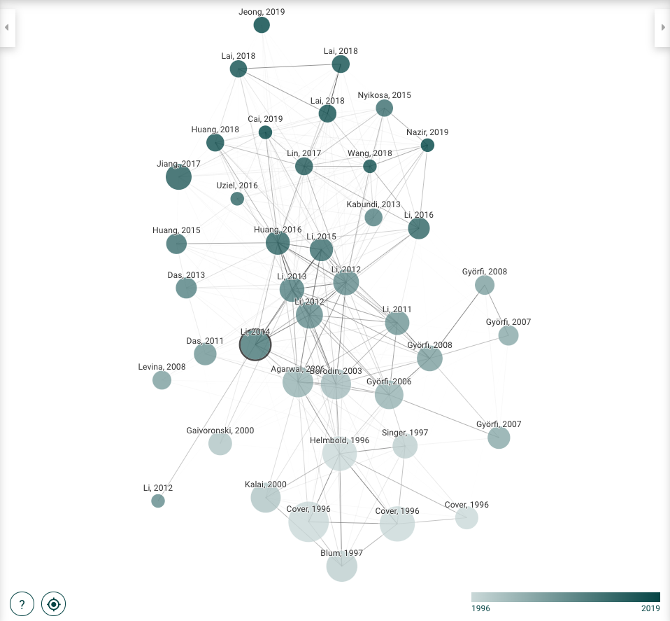
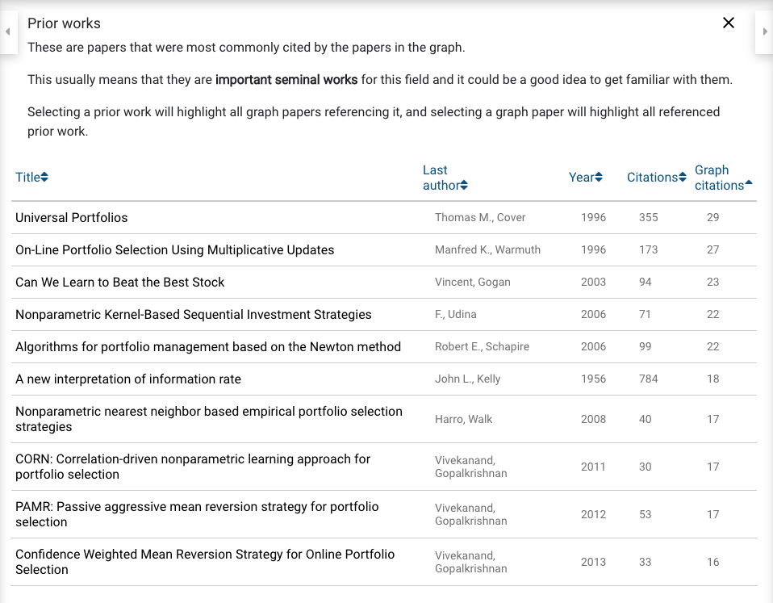
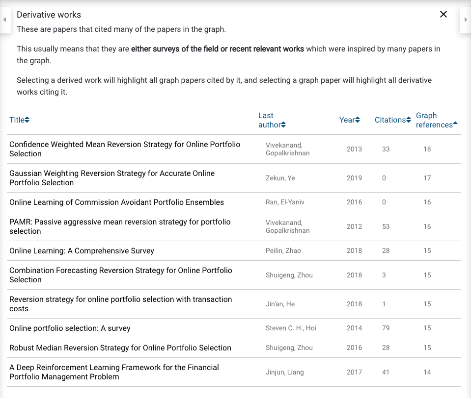

==============
Research Tools
==============

As researchers, we often neglect finding the right tools to streamline
the progress. Financial Machine Learning is no different in that a lot of the papers are scattered
across different journals and different fields. Ranging from journals on econometrics to machine
learning, researchers often struggle to find the best academic papers to begin their studies.

At Hudson & Thames, we primarily use two resources: `Connected Papers`_ and `EThOS`_. These two
free sites have been invaluable and offer an advantage to search through the most cutting edge
resources available for our MlFinLab library.

.. _Connected Papers: https://www.connectedpapers.com/
.. _EThOS: https://ethos.bl.uk/Home.do

Connected Papers
################

Connected papers is unique in that it is not a citation tree. A citation from a paper does not
necessarily lead the reader to another paper. The two topics might be completely different and
an unimportant topic for the researcher.

It uniquely identifies the related papers by looking at the cocitation and bibliographic coupling.
More about the website is available at the connected papers founder’s `medium`_ post.

To give a brief demonstration, we will examine a `paper`_ by Li and Hoi that started our Online Portfolio Selection module.

If you type in the name of the paper, you will see a graph like the one below.

It immediately shows which are the most associated papers. The darker circles indicate that they are
more recent, so we can easily follow from the older papers to the newer ones. Connected papers also
has an amazing feature for prior works and derivative works.

Prior works is available for researchers to see what are the most famous and cited papers in this field
to recognize the importance and start with the baseline material. If we click the button for prior works,
for our current search, we see an image like this:

We can easily see which were the most cited papers. It is not surprising that the number one paper
associated with Online Portfolio Selection is Thomas Cover's Universal Portfolio, the original paper
that began the studies in Portfolio Selection based on information theory.

Once the researcher gets more familiar with the topic by going through literature review with prior
works, they can move on to the derivative works, which cover the most recent papers associated with
the paper of interest.

.. _medium: https://medium.com/connectedpapers/announcing-connected-papers-a-visual-tool-for-researchers-to-find-and-explore-academic-papers-89146a54c7d4
.. _paper: https://arxiv.org/abs/1212.2129

EThOS
#####

`EThOS`_ is a online library sponsored by the United Kingdom to make publicly-funded research available
to all researchers.

The best feature for EThOS is the availability of all doctoral theses in the UK. If your topic of
interest does not have too many sources from journals, there is a high chance that you can find
good works in EThOS as it is not limited to published journals but rather all doctoral theses as well.
