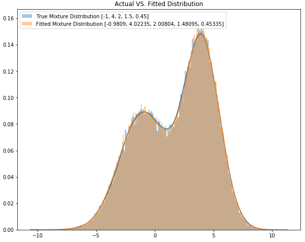

======================================
Exact Fit using first 3 Moments (EF3M)
======================================

The EF3M algorithm was introduced in a paper by Marcos Lopez de Prado and Matthew D. Foreman, titled "A mixture of
Gaussians approach to mathematical portfolio oversight: the `EF3M algorithm`_".

The abstract reads: "An analogue can be made between: (a) the slow pace at which species adapt to an environment, which
often results in the emergence of a new distinct species out of a once homogeneous genetic pool, and (b) the slow
changes that take place over time within a fund, mutating its investment style. A fund’s track record provides a sort
of genetic marker, which we can use to identify mutations. This has motivated our use of a biometric procedure to detect
the emergence of a new investment style within a fund’s track record. In doing so, we answer the question: “What is the probability that
a particular PM’s performance is departing from the reference distribution used to allocate her capital?”  The EF3M
approach, inspired by evolutionary biology, may help detect early stages of an evolutionary divergence in an investment
style, and trigger a decision to review a fund’s capital allocation."

The Exact Fit of the first 3 Moments (EF3M) algorithm allows the parameters of a mixture of Gaussian distributions to
be estimated given the first 5 moments of the mixture distribution, as well as the assumption that the mixture
distribution is composed of a number of Gaussian distributions.

A more thorough investigation into the algorithm can be found within our `Research`_ repository

.. _EF3M algorithm: https://papers.ssrn.com/sol3/papers.cfm?abstract_id=1931734
.. _Research: https://github.com/hudson-and-thames/research

M2N
###
A class for determining the means, standard deviations, and mixture proportion of a given distribution from it's first four or five statistical moments.

.. py:currentmodule:: mlfinlab.bet_sizing.ef3m

.. autoclass:: M2N
    :members:

Utility Functions For Fitting Of Distribution Mixtures
######################################################

.. autofunction:: centered_moment
.. autofunction:: raw_moment
.. autofunction:: most_likely_parameters

Research Notebooks
##################

The following research notebooks can be used to better understand bet sizing.

* `Chapter 10 Exercise Notebook`_
* `EF3M Algorithm Test Cases`_

.. _Chapter 10 Exercise Notebook: https://github.com/hudson-and-thames/research/blob/master/Chapter10/Chapter10_Exercises.ipynb
.. _EF3M Algorithm Test Cases: https://github.com/hudson-and-thames/research/blob/master/Chapter10/ef3m_testing.ipynb