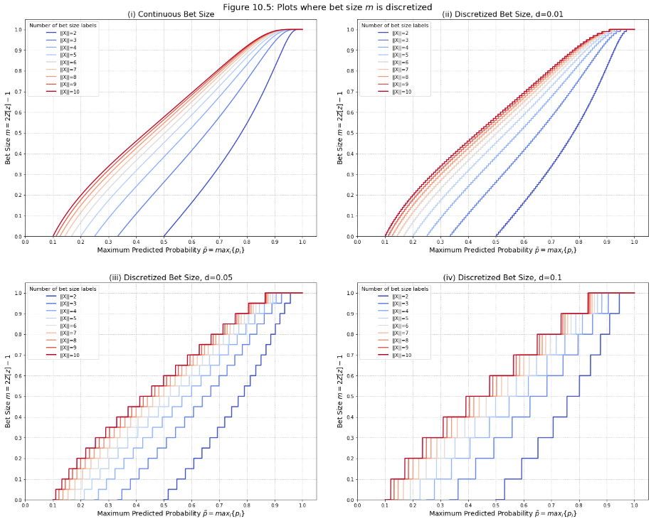

.. py:currentmodule:: mlfinlab.bet_sizing.bet_sizing

==========
Bet Sizing
==========

"There are fascinating parallels between strategy games and investing. Some of the best portfolio managers I have worked
with are excellent poker players, perhaps more so than chess players. One reason is bet sizing, for which Texas Hold’em
provides a great analogue and training ground. Your ML algorithm can achieve high accuracy, but if you do not size your
bets properly, your investment strategy will inevitably lose money. In this chapter we will review a few approaches to
size bets from ML predictions." Advances in Financial Machine Learning, Chapter 10: Bet Sizing, pg 141.

The code in this directory falls under 3 submodules:

1. Bet Sizing: We have extended the code from the book in an easy to use format for practitioners to use going forward.
2. EF3M: An implementation of the EF3M algorithm.
3. Chapter10_Snippets: Documented and adjusted snippets from the book for users to experiment with.

Bet Sizing Methods
##################
Functions for bet sizing are implemented based on the approaches described in chapter 10.

Bet Sizing From Predicted Probability
*************************************

Assuming a machine learning algorithm has predicted a series of investment positions, one can use the probabilities of each of these predictions to derive the size of that specific bet.

.. autofunction:: bet_size_probability

Dynamic Bet Sizes
*****************

Assuming one has a series of forecasted prices for a given investment product, that forecast and the current market price and position can be used to dynamically calculate the bet size.

.. autofunction:: bet_size_dynamic

Strategy-Independent Bet Sizing Approaches
******************************************

These approaches consider the number of concurrent active bets and their sides, and sets the bet size is such a way that reserves some cash for the possibility that the trading signal strengthens before it weakens.

.. autofunction:: bet_size_budget
.. autofunction:: bet_size_reserve

Additional Utility Functions For Bet Sizing
*******************************************

.. autofunction:: confirm_and_cast_to_df
.. autofunction:: get_concurrent_sides
.. autofunction:: cdf_mixture
.. autofunction:: single_bet_size_mixed

.. py:currentmodule:: mlfinlab.bet_sizing.ch10_snippets

Chapter 10 Code Snippets
########################
Chapter 10 of "Advances in Financial Machine Learning" contains a number of Python code snippets, many of which are used to create the top level bet sizing functions. These functions can be found in ``mlfinlab.bet_sizing.ch10_snippets.py``.

Snippets For Bet Sizing From Probabilities
******************************************
.. autofunction:: get_signal
.. autofunction:: avg_active_signals
.. autofunction:: mp_avg_active_signals
.. autofunction:: discrete_signal

Snippets for Dynamic Bet Sizing
*******************************
.. autofunction:: bet_size_sigmoid
.. autofunction:: get_target_pos_sigmoid
.. autofunction:: inv_price_sigmoid
.. autofunction:: limit_price_sigmoid
.. autofunction:: get_w_sigmoid
.. autofunction:: bet_size_power
.. autofunction:: get_target_pos_power
.. autofunction:: inv_price_power
.. autofunction:: limit_price_power
.. autofunction:: get_w_power
.. autofunction:: bet_size
.. autofunction:: get_target_pos
.. autofunction:: inv_price
.. autofunction:: limit_price
.. autofunction:: get_w

Research Notebooks
##################

The following research notebooks can be used to better understand bet sizing.

Exercises From Chapter 10
*************************

* `Chapter 10 Exercise Notebook`_
* `EF3M Algorithm Test Cases`_

.. _Chapter 10 Exercise Notebook: https://github.com/hudson-and-thames/research/blob/master/Chapter10/Chapter10_Exercises.ipynb
.. _EF3M Algorithm Test Cases: https://github.com/hudson-and-thames/research/blob/master/Chapter10/ef3m_testing.ipynb
