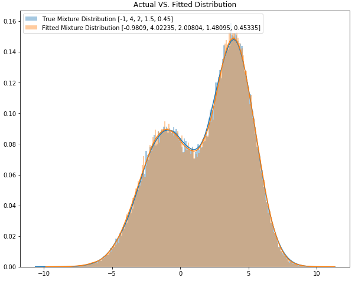

.. py:currentmodule:: mlfinlab.bet_sizing.bet_sizing

==========
Bet Sizing
==========

"There are fascinating parallels between strategy games and investing. Some of the best portfolio managers I have worked
with are excellent poker players, perhaps more so than chess players. One reason is bet sizing, for which Texas Hold’em
provides a great analogue and training ground. Your ML algorithm can achieve high accuracy, but if you do not size your
bets properly, your investment strategy will inevitably lose money. In this chapter we will review a few approaches to
size bets from ML predictions." Advances in Financial Machine Learning, Chapter 10: Bet Sizing, pg 141.

The code in this directory falls under 3 submodules:

1. Bet Sizing: We have extended the code from the book in an easy to use format for practitioners to use going forward.
2. EF3M: An implementation of the EF3M algorithm.
3. Chapter10_Snippets: Documented and adjusted snippets from the book for users to experiment with.

Bet Sizing Methods
==================
Functions for bet sizing are implemented based on the approaches described in chapter 10.

Bet Sizing From Predicted Probability
~~~~~~~~~~~~~~~~~~~~~~~~~~~~~~~~~~~~~
Assuming a machine learning algorithm has predicted a series of investment positions, one can use the probabilities of each of these predictions to derive the size of that specific bet.

.. autofunction:: bet_size_probability

Dynamic Bet Sizes
~~~~~~~~~~~~~~~~~
Assuming one has a series of forecasted prices for a given investment product, that forecast and the current market price and position can be used to dynamically calculate the bet size.

.. autofunction:: bet_size_dynamic

Strategy-Independent Bet Sizing Approaches
~~~~~~~~~~~~~~~~~~~~~~~~~~~~~~~~~~~~~~~~~~
These approaches consider the number of concurrent active bets and their sides, and sets the bet size is such a way that reserves some cash for the possibility that the trading signal strengthens before it weakens.

.. autofunction:: bet_size_budget
.. autofunction:: bet_size_reserve

Additional Utility Functions For Bet Sizing
~~~~~~~~~~~~~~~~~~~~~~~~~~~~~~~~~~~~~~~~~~~
.. autofunction:: confirm_and_cast_to_df
.. autofunction:: get_concurrent_sides
.. autofunction:: cdf_mixture
.. autofunction:: single_bet_size_mixed

.. py:currentmodule:: mlfinlab.bet_sizing.ef3m

EF3M - Exact Fit using the first 3 Moments
==========================================
The EF3M algorithm was introduced in a paper by Marcos Lopez de Prado and Matthew D. Foreman, titled "A mixture of
Gaussians approach to mathematical portfolio oversight: the `EF3M algorithm`_".

The abstract reads: "An analogue can be made between: (a) the slow pace at which species adapt to an environment, which
often results in the emergence of a new distinct species out of a once homogeneous genetic pool, and (b) the slow
changes that take place over time within a fund, mutating its investment style. A fund’s track record provides a sort
of genetic marker, which we can use to identify mutations. This has motivated our use of a biometric procedure to detect
the emergence of a new investment style within a fund’s track record. In doing so, we answer the question: “What is the probability that
a particular PM’s performance is departing from the reference distribution used to allocate her capital?”  The EF3M
approach, inspired by evolutionary biology, may help detect early stages of an evolutionary divergence in an investment
style, and trigger a decision to review a fund’s capital allocation."

The Exact Fit of the first 3 Moments (EF3M) algorithm allows the parameters of a mixture of Gaussian distributions to
be estimated given the first 5 moments of the mixture distribution, as well as the assumption that the mixture
distribution is composed of a number of Gaussian distributions.

A more thorough investigation into the algorithm can be found within our `Research`_ repository

.. _EF3M algorithm: https://papers.ssrn.com/sol3/papers.cfm?abstract_id=1931734
.. _Research: https://github.com/hudson-and-thames/research

M2N
~~~
A class for determining the means, standard deviations, and mixture proportion of a given distribution from it's first four or five statistical moments.

.. autoclass:: M2N
    :members:

Utility Functions For Fitting Of Distribution Mixtures
~~~~~~~~~~~~~~~~~~~~~~~~~~~~~~~~~~~~~~~~~~~~~~~~~~~~~~
.. autofunction:: centered_moment
.. autofunction:: raw_moment
.. autofunction:: most_likely_parameters

.. py:currentmodule:: mlfinlab.bet_sizing.ch10_snippets

Chapter 10 Code Snippets
========================
Chapter 10 of "Advances in Financial Machine Learning" contains a number of Python code snippets, many of which are used to create the top level bet sizing functions. These functions can be found in ``mlfinlab.bet_sizing.ch10_snippets.py``.

Snippets For Bet Sizing From Probabilities
~~~~~~~~~~~~~~~~~~~~~~~~~~~~~~~~~~~~~~~~~~
.. autofunction:: get_signal
.. autofunction:: avg_active_signals
.. autofunction:: mp_avg_active_signals
.. autofunction:: discrete_signal

Snippets for Dynamic Bet Sizing
~~~~~~~~~~~~~~~~~~~~~~~~~~~~~~~~
.. autofunction:: bet_size_sigmoid
.. autofunction:: get_target_pos_sigmoid
.. autofunction:: inv_price_sigmoid
.. autofunction:: limit_price_sigmoid
.. autofunction:: get_w_sigmoid
.. autofunction:: bet_size_power
.. autofunction:: get_target_pos_power
.. autofunction:: inv_price_power
.. autofunction:: limit_price_power
.. autofunction:: get_w_power
.. autofunction:: bet_size
.. autofunction:: get_target_pos
.. autofunction:: inv_price
.. autofunction:: limit_price
.. autofunction:: get_w

Research Notebooks
==================

The following research notebooks can be used to better understand bet sizing.

Exercises From Chapter 10
~~~~~~~~~~~~~~~~~~~~~~~~~

* `Chapter 10 Exercise Notebook`_
* `EF3M Algorithm Test Cases`_

.. _Chapter 10 Exercise Notebook: https://github.com/hudson-and-thames/research/blob/master/Chapter10/Chapter10_Exercises.ipynb
.. _EF3M Algorithm Test Cases: https://github.com/hudson-and-thames/research/blob/master/Chapter10/ef3m_testing.ipynb
