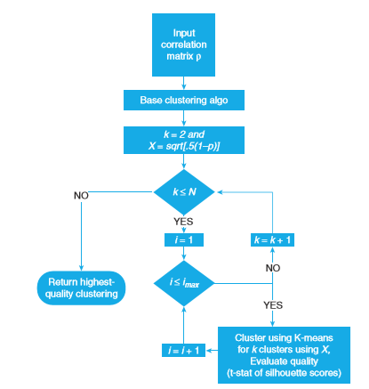
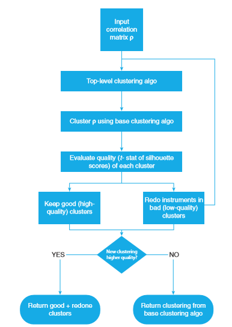

.. _implementations-clustering:

==========
Clustering
==========

Clustering is a task of grouping a set of data points into several groups where such data points in the same group are more similar to each other than to those in other groups. There are different types of clustering algorithms that are known. Some of the well-known ones are the distribution-based method, centroid based method, connectivity-based method, density model, and subspace clustering. One of the most popular clusterings is the K-means algorithm, which falls under the centroid based method category. However, the K-means algorithm requires the user to set the number of clusters in advance. Furthermore, the initialization of the clusters is random. As consequent, the solution is often not optimal in some sense, and the effectiveness of the algorithm can be random.

Optimal Number of Clusters (ONC)
################################

Optimal Number of Clusters algorithm detects the optimal number of K-Means clusters using feature correlation matrix and silhouette scores. This implementation is based on 'Detection of False Investment Strategies using Unsupervised Learning Methods' https://papers.ssrn.com/sol3/papers.cfm?abstract_id=3167017

The same subject and information can also be found in 'Machine Learning for Asset Managers', Marcos M. Lopez de Prado, Cornell University, New York, April 2020, Chapter 4, Page 52-64.

This algorithm results in a tuple that contains an optimized correlation matrix, optimized clusters, and the Silhouette Scores of each node in the clusters.

Formulas
********

The ONC algorithm accommodates three distinct features that set the algorithm apart from the K-means clustering. These features are Silhouette Scores, the measure of clustering quality or *q*, and the distance matrix. The formulas of the said features are available below.

* Silhouette Scores:

        :math:`S_i=\frac{b_i-a_i}{max\{a_i,b_i\}}`

        :math:`a_i` = the average distance between *i* and all other components in the same cluster

        :math:`b_i` = the average distance between *i* and all the components in the nearest cluster where *i* is not included

* The measure of clustering quality or *q*:

        :math:`\textit q= \frac{E[\{S_i\}]}{\sqrt{V[\{S_i\}]}}`

        :math:`E[\{S_i\}]` = the mean of the Silhouette coefficients 

        :math:`V[\{S_i\}]` = the variance of the Silhouette coefficients

* The distance matrix formula:

        :math:`D_{i,j}= \sqrt{\frac{1}{2}(1-\rho_{ij})}`

The ONC Mechanism
*****************

First, we feed an observation matrix into the algorithm. Then, the Base Clustering performs a double for..loop after the algorithm evaluates the observation matrix. The first loop clusters the matrix for different *k* values from 2 to N via k-means for one given initialization and assesses the quality *q* for each clustering. The second loop redoes the first loop multiple times until it satisfies the condition of different initializations. In the end, the algorithm chooses the clustering with the highest quality *q* over these two loops.  

The second algorithm, the Top- Level of Clustering, evaluates the quality of each cluster of the optimum clustering from the first algorithm. The algorithm then takes the average quality of the clusters and finds the set of clusters with below-average quality. We mark the number of sub-par quality clusters :math:`K_1` where :math:`K_1` < :math:`K` (number of clusters). The next step is to rerun the clustering of the items in the :math:`K_1` clusters if :math:`K_1 >=2` or to return the clustering given by the base algorithm if :math:`K_1 <=1`. 

We rerun the Base Clustering algorithm on the matrix that is composed of the elements of :math:`K_1` clusters. This process may return a new clustering for the elements in :math:`K_1`. Then, we check the efficacy of the new clustering by comparing the average cluster quality before and after reclustering the elements in :math:`K_1`. If the average cluster quality does not improve, then we return the clustering created by the base clustering algorithm. However, if we see an improvement in the average cluster quality, then we return the accepted clustering from the base clustering concatenated with the newly redone clustering. 

The ONC Algorithm Diagram
*************************

The ONC algorithm is a composition of two main algorithms, the Base Clustering, and the Top-Level Clustering. Below are the diagrams for the two algorithms.

**Structure of the ONC's Base Clustering Stage.**

Figure 4.1.  Marcos M. Lopez de Prado. *Structure of ONC's base clustering stage*. 2020. Machine Learning for Asset Managers. Marcos M. Lopez de Prado. Cornell University, New York. April 2020. Page 57. Digital Book.

**Structure of the ONC's Top-Level Clustering Stage.**

Figure 4.2. Marcos M. Lopez de Prado and Lewis (2018). *Structure of ONC's higher-level stage*. 2020. Machine Learning for Asset Managers. Marcos M. Lopez de Prado. Cornell University, New York. April 2020. Page 60. Digital Book. 

The ONC Algorithm Code and The Workflow
***************************************

We divide the ONC algorithm into two main parts, the Base Clustering, and the Top- Level Clustering. The Base Clustering produces optimum clustering while the Top- Level Clustering reassesses the clustering, optimizes the inconsistent clustering, and updates the clustering accordingly. We dissect the code, organize the parts, and put some explanations for us to understand the structure and mechanism of the ONC algorithm. We first assume that we have an NxN correlation matrix  :math:`\rho` , where  :math:`\rho_{ij}` is the correlation between entities *i* and *j*.

**The Base Clustering**

.. code-block:: python

        import numpy as np,pandas as pd 
        from sklearn.cluster import KMeans from sklearn.metrics 
        import silhouette_samples 
        #--------------------------------------------------
        def clusterKMeansBase(corr0,maxNumClusters=10,n_init=10): 
        x,silh=((1-corr0.fillna(0))/2.)**.5,pd.Series()# observations matrix 
        for init in range(n_init): 
                for i in xrange(2,maxNumClusters+1): 
                    kmeans_=KMeans(n_clusters=i,n_jobs=1,n_init=1) 
                    kmeans_=kmeans_.fit(x) 
                    silh_=silhouette_samples(x,kmeans_.labels_) 
                    stat=(silh_.mean()/silh_.std(),silh.mean()/silh.std()) 
                    if np.isnan(stat[1]) or stat[0]>stat[1]: 
                        silh,kmeans=silh_,kmeans_ 
        newIdx=np.argsort(kmeans.labels_) 
        corr1=corr0.iloc[newIdx] # reorder rows
                
        corr1=corr1.iloc[:,newIdx] # reorder columns 
        clstrs={i:corr0.columns[np.where(kmeans.labels_==i)[0]].tolist() \ 
                for i in np.unique(kmeans.labels_) } # cluster members 
        silh=pd.Series(silh,index=x.index) 
        return corr1,clstrs,silh

The Base Clustering code is taken from Machine Learning for Asset Managers, Chapter 4, page 56, SNIPPET 4.1 - BASE CLUSTERING. 

The details and the explanations of the Base Clustering are provided below.

1.) We import the necessary packages for the algorithm

.. code-block:: python

        import numpy as np,pandas as pd 
        from sklearn.cluster import KMeans from sklearn.metrics 
        import silhouette_samples 

2.) We define the Base Clustering algorithm with corr0 as the correlation matrix ( :math:`\rho` ),  maxNumClusters as the allowed maximum number of clusters, and n_init as the number of initiations      

.. code-block:: python

        def clusterKMeansBase(corr0,maxNumClusters=10,n_init=10):

3.) We calculate the distance matrix D and set an empty series as the initial Silhouette Scores

.. code-block:: python

        x,silh=((1-corr0.fillna(0))/2.)**.5,pd.Series()# observations matrix 

4.) We implement a double for .. loop

4b.) In the second loop, we repeat the first loop multiple times until the number of loops satisfies the n_init criteria

.. code-block:: python

         for init in range(n_init): 

4a.) In the first loop, we cluster the matrix with the k-means algorithm for every number of k, where k is the number of clusters and k = 2,.., N, and N is the maximum number of clusters set for this algorithm for one given initialization

.. code-block:: python

        for i in xrange(2,maxNumClusters+1): 
            kmeans_=KMeans(n_clusters=i,n_jobs=1,n_init=1) 
            kmeans_=kmeans_.fit(x) 

5.) We then evaluate the quality *q* for each clustering in this loop

.. code-block:: python

        silh_=silhouette_samples(x,kmeans_.labels_) 
        stat=(silh_.mean()/silh_.std(),silh.mean()/silh.std()) 

6.) We also update the Silhouette Scores and the k-means if the clustering quality is greater than that of the previous loop

.. code-block:: python

        if np.isnan(stat[1]) or stat[0]>stat[1]: 
           silh,kmeans=silh_,kmeans_

7.) Rearrange the correlation matrix based on the k-means clustering

.. code-block:: python

        newIdx=np.argsort(kmeans.labels_) 
        corr1=corr0.iloc[newIdx] # reorder rows
        corr1=corr1.iloc[:,newIdx] # reorder columns 

8.) Make a dict that consists of clusters, their labels (keys), and variables (values) based on the k-means clustering

.. code-block:: python

        clstrs={i:corr0.columns[np.where(kmeans.labels_==i)[0]].tolist() \ 
                for i in np.unique(kmeans.labels_) } # cluster members 

9.) Make a series of Silhouette Scores

.. code-block:: python

        silh=pd.Series(silh,index=x.index) 

10.) Return the optimized matrix, the clusters, their labels, and the Silhouette Scores

.. code-block:: python

        return corr1, clstrs, silh

The Base Clustering algorithm may result in optimum clustering, but the new clusters may have inconsistent quality for some of the clusters. To address this problem, the author designed the next algorithm, the Top-Level Clustering. This algorithm is divided into two parts: makeNewOutputs function and clusterKMeansTop function.

**The Top-Level Clustering**

.. code-block:: python

        from sklearn.metrics import silhouette_samples 
        #--------------------------------------------------
        def makeNewOutputs(corr0,clstrs,clstrs2): 
            clstrsNew={} 
            for i in clstrs.keys(): 
                clstrsNew[len(clstrsNew.keys())]=list(clstrs[i]) 
            for i in clstrs2.keys(): 
                clstrsNew[len(clstrsNew.keys())]=list(clstrs2[i]) 
            newIdx=[j for i in clstrsNew for j in clstrsNew[i]] 
            corrNew=corr0.loc[newIdx,newIdx] 
            x=((1-corr0.fillna(0))/2.)**.5 
            kmeans_labels=np.zeros(len(x.columns)) 
            for i in clstrsNew.keys(): 
                idxs=[x.index.get_loc(k) for k in clstrsNew[i]] 
                kmeans_labels[idxs]=i 
            silhNew=pd.Series(silhouette_samples(x,kmeans_labels), 
                              index=x.index) 
            return corrNew,clstrsNew,silhNew 
        #--------------------------------------------------
        def clusterKMeansTop(corr0,maxNumClusters=None,n_init=10): 
            if maxNumClusters==None:maxNumClusters=corr0.shape[1]-1 
            corr1,clstrs,silh=clusterKMeansBase(corr0,maxNumClusters= \ 
              min(maxNumClusters,corr0.shape[1]-1),n_init=n_init) 
            clusterTstats={i:np.mean(silh[clstrs[i]])/ \ 
              np.std(silh[clstrs[i]]) for i in clstrs.keys()} 
            tStatMean=sum(clusterTstats.values())/len(clusterTstats) 
            redoClusters=[i for i in clusterTstats.keys() if \ 
              clusterTstats[i]<tStatMean] 
            if len(redoClusters)<=1: 
                return corr1,clstrs,silh 
            else: 
                keysRedo=[j for i in redoClusters for j in clstrs[i]] 
                corrTmp=corr0.loc[keysRedo,keysRedo] 
                tStatMean=np.mean([clusterTstats[i] for i in redoClusters]) 
                corr2,clstrs2,silh2=clusterKMeansTop(corrTmp, \ 
                  maxNumClusters=min(maxNumClusters, \ 
                  corrTmp.shape[1]-1),n_init=n_init)
                # Make new outputs, if necessary 
                corrNew,clstrsNew,silhNew=makeNewOutputs(corr0, \ 
                  {i:clstrs[i] for i in clstrs.keys() if i not in redoClusters}, \ 
                  clstrs2) 
                newTstatMean=np.mean([np.mean(silhNew[clstrsNew[i]])/ \ 
                  np.std(silhNew[clstrsNew[i]]) for i in clstrsNew.keys()]) 
                if newTstatMean<=tStatMean: 
                    return corr1,clstrs,silh 
                else: 
                    return corrNew,clstrsNew,silhNew

The Top-Level of Clustering code is taken from Machine Learning for Asset Managers, Chapter 4, page 58 and 59, SNIPPET 4.2 - TOP-LEVEL OF CLUSTERING.

The details and explanations of the Top-Level of Clustering are provided below:

**The first part - makeNewOutputs function.**

1.) Import the necessary package

.. code-block:: python

        from sklearn.metrics import silhouette_samples     

2.) Define the function with a correlation matrix and two clusters as the input

.. code-block:: python

        def makeNewOutputs(corr0,clstrs,clstrs2): 
            clstrsNew={} 

3.) Make a dict from the first clusters       

.. code-block:: python

        for i in clstrs.keys(): 
          clstrsNew[len(clstrsNew.keys())]=list(clstrs[i])

4.) Add the second clusters to the dict

.. code-block:: python

        for i in clstrs2.keys(): 
          clstrsNew[len(clstrsNew.keys())]=list(clstrs2[i]) 

5.) Make a new list of the values of the dict

.. code-block:: python

        newIdx=[j for i in clstrsNew for j in clstrsNew[i]] 

6.) Rearrange the correlation matrix based on the new list with its values as the index and column labels

.. code-block:: python

        corrNew=corr0.loc[newIdx,newIdx] 

7.) We create a new distance matrix from the input matrix

.. code-block:: python

        x=((1-corr0.fillna(0))/2.)**.5 

8.) Make an array of x amount of 0 where x is the length of the distance matrix's columns and name it accordingly

.. code-block:: python

        kmeans_labels=np.zeros(len(x.columns)) 

9.) Fill in the array with the index labels of the distance matrix that are sorted according to the values of the dict of the new clusters from step 3 and 4

.. code-block:: python

        for i in clstrsNew.keys(): 
          idxs=[x.index.get_loc(k) for k in clstrsNew[i]] 
          kmeans_labels[idxs]=i 

10.) Make a series of Silhouette Scores of the correlations distance matrix that is sorted based on the new index labels

.. code-block:: python

        silhNew=pd.Series(silhouette_samples(x,kmeans_labels), 
                index=x.index) 

11.) Return the new correlation matrix, clustering, and Silhouette Scores

.. code-block:: python

        return corrNew,clstrsNew,silhNew 
        
**The second part- clusterKMeansTop function.**

1.) We define the function with corr0 as the correlation matrix input or :math:`\rho`, maxNumClusters as the allowed maximum number of clusters, and n_init as the number of initiations

.. code-block:: python

        def clusterKMeansTop(corr0,maxNumClusters=None,n_init=10): 

2.) If the maximum number of clusters is not defined, then the system will choose N-1 as the value

.. code-block:: python

        if maxNumClusters==None:maxNumClusters=corr0.shape[1]-1 

3.) We extract the values of the optimum correlation matrix, the clustering, and the clustering's Silhouette Scores by applying the Base Clustering algorithm on the correlation matrix

.. code-block:: python

        corr1,clstrs,silh=clusterKMeansBase(corr0,maxNumClusters= \ 
         min(maxNumClusters,corr0.shape[1]-1),n_init=n_init) 
        
4.) Evaluate the quality of each cluster and assign the values to a dict

.. code-block:: python

        clusterTstats={i:np.mean(silh[clstrs[i]])/ \ 
         np.std(silh[clstrs[i]]) for i in clstrs.keys()} 

5.) Find the mean of all quality measures of the clusters and assign the value to a variable

.. code-block:: python

        tStatMean=sum(clusterTstats.values())/len(clusterTstats) 

6.) Find the keys of clusters that have smaller quality values than the mean of all quality values in the optimized set of clusters and assign the result to a list

.. code-block:: python

        redoClusters=[i for i in clusterTstats.keys() if \ 
         clusterTstats[i]<tStatMean] 

7.) If the number of sub-par clusters is less or equal to one, then return the values from the Base Clustering

.. code-block:: python

        if len(redoClusters)<=1: 
         return corr1,clstrs,silh 

8.) If the number of sub-par clusters is more than one, then we move to the next step

.. code-block:: python

        else: 

9.) Make a list of keys of the sub-par clusters

.. code-block:: python

        keysRedo=[j for i in redoClusters for j in clstrs[i]] 

10.) Make a new matrix that consists of values in the sub-par clusters

.. code-block:: python

        corrTmp=corr0.loc[keysRedo,keysRedo] 

11.) Calculate the mean of the means of the sub-par clusters

.. code-block:: python

        tStatMean=np.mean([clusterTstats[i] for i in redoClusters]) 

12.) Apply the clusterKMeansTop function to the new matrix of sub-par values. The maximum number of clusters that is set in this function is the minimum value between the initial function and the new matrix's N-1. A new set of optimum clustering is the result.

.. code-block:: python

        corr2,clstrs2,silh2=clusterKMeansTop(corrTmp, \ 
          maxNumClusters=min(maxNumClusters, \ 
          corrTmp.shape[1]-1),n_init=n_init)

13.) Assign new values of the correlation matrix, clustering, and Silhouette Scores to new variables. These values are obtained by applying the makeNewOutputs function to the original correlation matrix, clusters with keys that are not in redoClusters, and the sub-par clusters that have gone through the filtering process in the search for sub-par clusters within.

.. code-block:: python

        # Make new outputs, if necessary 
        corrNew,clstrsNew,silhNew=makeNewOutputs(corr0, \ 
          {i:clstrs[i] for i in clstrs.keys() if i not in redoClusters}, \ 
          clstrs2) 

14.) Find the mean of the means of the quality values of all of the new clusters

.. code-block:: python

        newTstatMean=np.mean([np.mean(silhNew[clstrsNew[i]])/ \ 
          np.std(silhNew[clstrsNew[i]]) for i in clstrsNew.keys()]) 

15.) If the mean of the means of the new quality values is less or equal to the mean of the means of the initial quality values, then return the initial optimum set of clustering

.. code-block:: python

        if newTstatMean<=tStatMean: 
            return corr1,clstrs,silh 

16.) If the above condition is not satisfied, then return the new optimum set of clustering

.. code-block:: python

        else: 
            return corrNew,clstrsNew,silhNew
   

Implementation
##############

.. py:currentmodule:: mlfinlab.clustering.onc

.. automodule:: mlfinlab.clustering.onc
   :members: get_onc_clusters
           
  
Example
#######

Assuming that we want to find the optimum clustering of a matrix by using the ONC algorithm. Let's create the necessary correlation matrix.

.. code-block:: python

    import numpy as np
    import pandas as pd
    from mlfinlab.clustering.onc import get_onc_clusters # import the ONC function
    
    data = [[1,0.5,-0.2,0.7,0], [0.5,1,-1,0,-0.5], [-0.2,-1,1,0.1,0.8],\
            [0.7,0,0.1,1,-0.5], [0,-0.5,0.8,-0.5,1]] 
    df = pd.DataFrame(data) 
    df

Apply ONC algorithm on the matrix.

.. code-block:: python
    
    get_onc_clusters(df,10)

The algorithm results in a tuple that contains the optimized correlation matrix, the optimized clusters, and the Silhouette Scores of each node in the clusters. The result can be seen below.

::

        (     2    4    0    1    3
         2  1.0  0.8 -0.2 -1.0  0.1
         4  0.8  1.0  0.0 -0.5 -0.5
         0 -0.2  0.0  1.0  0.5  0.7
         1 -1.0 -0.5  0.5  1.0  0.0
         3  0.1 -0.5  0.7  0.0  1.0, {0: [2, 4], 1: [0, 1, 3]}, 0    0.435986
         1    0.366015
         2    0.620819
         3    0.336439
         4    0.617621
         dtype: float64)

