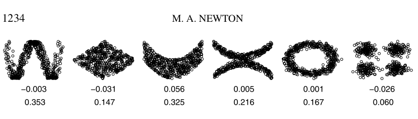
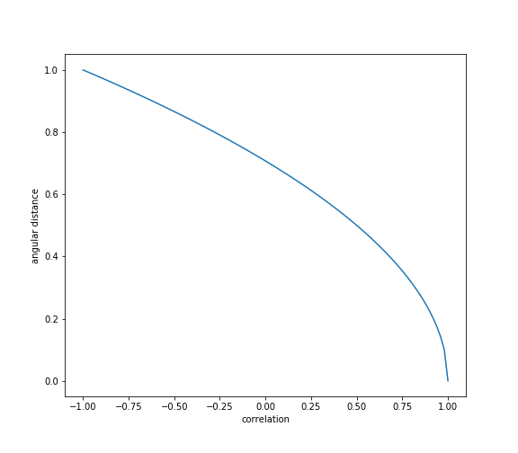
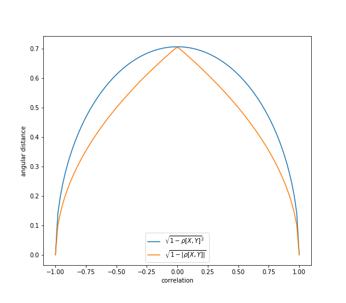
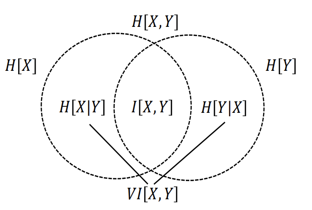
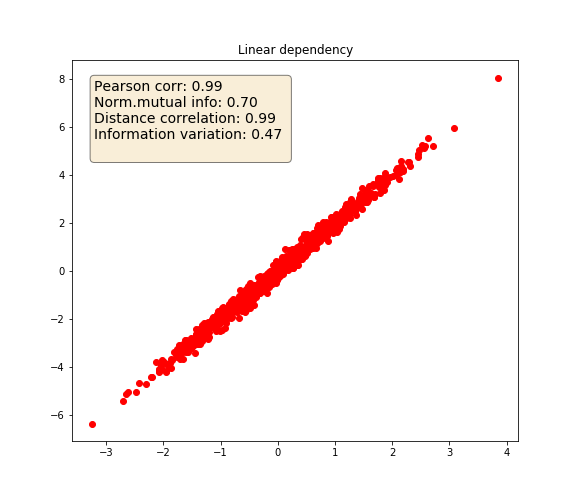
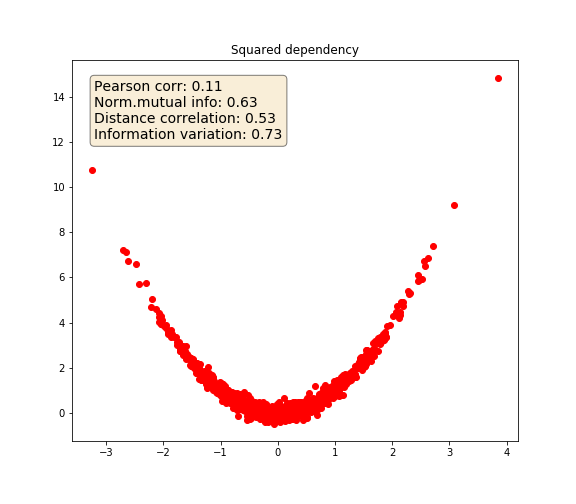
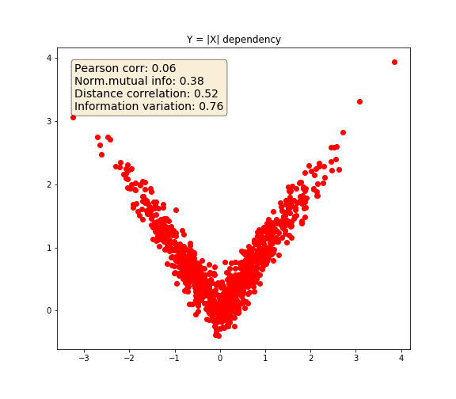
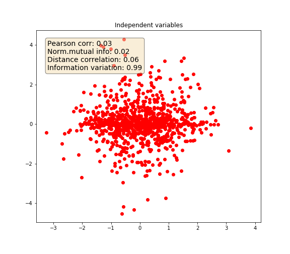

.. _implementations-codependence:

.. note::
   The following implementations and documentation, closely follows the lecture notes notes from Cornell University, by Marcos Lopez de Prado:
   `Codependence (Presentation Slides) <https://papers.ssrn.com/sol3/papers.cfm?abstract_id=3512994>`_.

============
Codependence
============

Pearson correlation coefficient is the most famous and widely used measure of codependence, however, there are some drawbacks.

.. warning::

    Pearson correlation suffers from 3 major drawbacks:

    1) It captures linear effects, but if two variables have strong non-linear dependency (squared or abs for example) Pearson correlation won't find any pattern between them.
    2) Correlation is not a distance metric: it does not satisfy non-negativity and subadditivity conditions.
    3) Financial market have non-linear patterns and correlations fails to capture them.

However, Pearson correlation is not the only way of measuring codependence. There are alternative and more modern measures of codependence, such
such as those introduced in information theory.

Correlation-Based Metrics
###########################

Distance Correlation
********************

**Distance Correlation** can capture not only linear association but also non-linear variable dependencies which Pearson correlation can not.
It was introduced in 2005 by Gábor J. Szekely. (`wikipedia <https://en.wikipedia.org/wiki/Distance_correlation>`_)

.. math::
    \rho_{dist}[X, Y] = \frac{dCov[X, Y]}{\sqrt{dCov[X, X]dCov[Y,Y}}

Where :math:`dCov[X, Y]` can be interpreted as the average Hadamard product of the doubly-centered Euclidean distance matrices of
:math:`X, Y`. (`Cornell lecture slides, p.7 <https://papers.ssrn.com/sol3/papers.cfm?abstract_id=3512994>`_)

Then

.. math::
    0 \leq \rho_{dist}[X, Y] \leq 1

| Unlike Pearson's correlation, when the value is zero, we can say the two variables are independent.

.. math::
    \rho_{dist}[X, Y] = 0 \Leftrightarrow X \perp Y

| As shown in the figure below, Distance Correlation captures the nonlinear relationship.

The numbers in the first line are Pearson correlation values and the values in the second line are Distance correlation values.
This figure is from `Introducing the discussion paper by Székely and Rizzo <https://www.researchgate.net/publication/238879872_Introducing_the_discussion_paper_by_Szekely_and_Rizzo>`_
by Michale A. Newton. It provides a great overview for readers.

Implementation
==============

.. py:currentmodule:: mlfinlab.codependence.correlation

.. autofunction:: distance_correlation

Angular Distance
*****************

**Angular Distance** is a slight modification of the correlation coefficient which satisfies all distance metric conditions.
This measure is known as the angular distance because when we use *covariance* as *inner product*, we can interpret correlation as :math:`cos\theta`.

It is a metric, because it is a linear multiple of the Euclidean distance between the vectors :math:`X, Y` (after standardization)
(`Cornell lecture slides, p.10 <https://papers.ssrn.com/sol3/papers.cfm?abstract_id=3512994>`_).

There are three types of angular distance: standard, absolute and squared.

Standard
========

   The angular distance satisfies all the conditions of a true metric, (Lopez de Prado, 2020.)

.. autofunction:: angular_distance

.. math::
    d_\rho[X, Y] = \sqrt{\frac{1}{2}(1-\rho[X,Y])}

.. math::
    d_\rho \in [0, 1]

Absolute and Squared
====================

   In some financial applications, it makes more sense to apply a modified definition of angular distance, such that the
   sign of the correlation is ignored, (Lopez de Prado, 2020)

**Absolute**

.. math::
    d_{|\rho|}[X, Y] = \sqrt{1-|\rho[X,Y]|}

.. autofunction:: absolute_angular_distance

|

**Squared**

.. math::
    d_{\rho^2}[X, Y] = \sqrt{1-{\rho[X,Y]}^2}

.. autofunction:: squared_angular_distance

----

Information Theory Metrics
##########################

We can gauge the codependence from the information theory perspective. In information theory, (Shannon’s) entropy is a
measure of information (uncertainty).

.. math::
    H[X] = -\sum\limits_{x \in S_{X}}p[x]log[p[x]]

In short, we can say that entropy is the expectation of the amount of information when we sample from a particular probability distribution or the number of bits to transmit to the target.
So, If there is correspondence between random variables, the correspondence will be reflected in entropy. For example, if two random variables are associated,
the amount of information in the joint probability distribution of the two random variables will be less than the sum of the information in each random variable.
This is because knowing a correspondence means knowing one random variable can reduce uncertainty about the other random variable.

.. math::
    H[X+Y] = H[X] + H[Y],  X \bot Y

Here, we have two ways of measuring correspondence:

1. Mutual Information
2. Variation of Information

The following figure highlights how we can view the relationships of various information measures associated with correlated variables
:math:`X` and :math:`Y` through below figure. (`Cornell lecture slides, p.24 <https://papers.ssrn.com/sol3/papers.cfm?abstract_id=3512994>`_)

   The correspondence between joint entropy, marginal entropies, conditional entropies, mutual information and variation of information (Lopez de Prado, 2020)

Mutual Information
******************

Mutual Information is defined as the decrease in uncertainty (or informational gain) in X that results from knowing the value of Y.
Mutual information is not a metric and needs to be normalized. (`Cornell lecture slides, p.18 <https://papers.ssrn.com/sol3/papers.cfm?abstract_id=3512994>`_)

.. math::
    \begin{align*}
    I[X, Y]=& H[X] - H[X|Y]\\
           =& H[X]+H[Y]-H[X,Y]\\
           =& \sum\limits_{x \in S_{X}} \sum\limits_{y \in S_{Y}}p[x,y]log[\frac{p[x,y]}{p[x]p[y]}]\\
    \end{align*}

.. py:currentmodule:: mlfinlab.codependence.information

.. autofunction:: get_mutual_info

Variation of Information
************************

Variation of Information can be interpreted as the uncertainty we expect in one variable if we are told the value of another.
Variation of information is a metric because it satisfies non-negativity, symmetry, and triangle inequality axioms.

.. math::
   \begin{align*}
     VI[X,Y]=& H[X|Y] + H[Y|X]\\
           =& H[X] + H[Y]-2I[X,Y]\\
           =& 2H[X,Y]-H[X]-H[Y]\\
   \end{align*}

.. autofunction::  variation_of_information_score

Discretization
**************

Throughout the above section, we have assumed that random variables were discrete.

For the continuous case, we can quantize the values and estimate :math:`H[X]`, and apply the same concepts on the binned observations.
(`Cornell lecture slides, p.26 <https://papers.ssrn.com/sol3/papers.cfm?abstract_id=3512994>`_)

.. math::
    \begin{align*}
    H[X] =& \int_{\infty}^{\infty}f_{X}[x_{i}]logf_{X}[x]dx\\
    \:    &\approx-\sum\limits_{i=1}^{B_{X}}f_{X}[x_{i}]logf_{X}[x_{i}]\\
    \end{align*}

.. math::
    \hat{H}[X]=-\sum\limits_{i=1}^{B_{X}}\frac{N_{i}}{N}log[\frac{N_{i}}{N}]log[\Delta_{x}]

As you can see from these equations, we need to choose the binning carefully because results may be biased.
There are optimal binning  depends on entropy case(marginal, joint).
You can optimal number of bins for discretization through below method.
This function is need for using methods for getting information based codependence.

.. autofunction:: get_optimal_number_of_bins

Examples
########

The following example highlights how the various metrics behave under various variable dependencies:

1. Linear
2. Squared
3.  Y = abs(X)
4. Independent variables

.. code-block::

    import numpy as np
    import matplotlib.pyplot as plt

    from mlfinlab.codependece import distance_correlation, get_mutual_info, variation_of_information_score
    from ace import model # ace package is used for max correlation estimation

    def max_correlation(x: np.array, y: np.array) -> float:
        """
        Get max correlation using ace package.
        """

        x_input = [x]
        y_input = y
        ace_model = model.Model()
        ace_model.build_model_from_xy(x_input, y_input)
        return np.corrcoef(ace_model.ace.x_transforms[0], ace_model.ace.y_transform)[0][1]

    state = np.random.RandomState(42)
    x = state.normal(size=1000)
    y_1 = 2 * x + state.normal(size=1000) / 5 # linear
    y_2 = x ** 2 + state.normal(size=1000) / 5 # squared
    y_3 = abs(x) + state.normal(size=1000) / 5 # Abs
    # independent
    y_4 = np.random.RandomState(0).normal(size=1000) * np.random.RandomState(5).normal(size=1000)

    for y, dependency in zip([y_1, y_2, y_3, y_4], ['linear', 'squared', 'y=|x|', 'independent']):
        text = "Pearson corr: {:0.2f} " + \
               "\nNorm.mutual info: {:0.2f} " + \
               "\nDistance correlation: {:0.2f} " + \
               "\nInformation variation: {:0.2f} " + \
               "\nMax correlation: {:0.2f}"

        text = text.format(np.corrcoef(x, y)[0, 1],
                           get_mutual_info(x, y, normalize=True),
                           distance_correlation(x, y),
                           variation_of_information_score(x, y, normalize=True),
                           max_correlation(x, y))

        # Plot relationships
        fig, ax = plt.subplots(figsize=(8,7))
        props = dict(boxstyle='round', facecolor='wheat', alpha=0.5)
        ax.text(0.05, 0.95, text, transform=ax.transAxes, fontsize=14, verticalalignment='top', bbox=props)
        plt.title(dependency)
        ax.plot(x, y, 'ro')
        plt.savefig('{}.png'.format(dependency))

   Linear

   Squared

   Absolute

    
   Indepedent
    

Codependence Matrix
###################

This module consists two functions that generate the following:

1. **Dependence Matrix** to compute dependence of a given matrix using various codependence method like Mutual Information,
   Variation of Information and Distance Correlation.
2. **Distance Matrix** can used to compute distance of a given matrix using various metrics like angular, squared
   angular and absolute angular.

.. note::

   MlFinLab makes use of these functions in the clustered feature importance.

Implementation
**************

.. py:currentmodule:: mlfinlab.codependence.codependence_matrix
.. autofunction:: get_dependence_matrix
.. autofunction:: get_distance_matrix

Example
*******

.. code-block::

   import pandas as pd
   from mlfinlab.codependence.codependence_matrix import (get_dependence_matrix,
                                                          get_distance_matrix)

   X = pd.read_csv('X_FILE_PATH.csv', index_col=0, parse_dates = [0])

   dep_matrix = get_dependence_matrix(X, dependence_method='distance_correlation')
   dist_matrix = get_distance_matrix(dep_matrix, distance_metric='angular')
