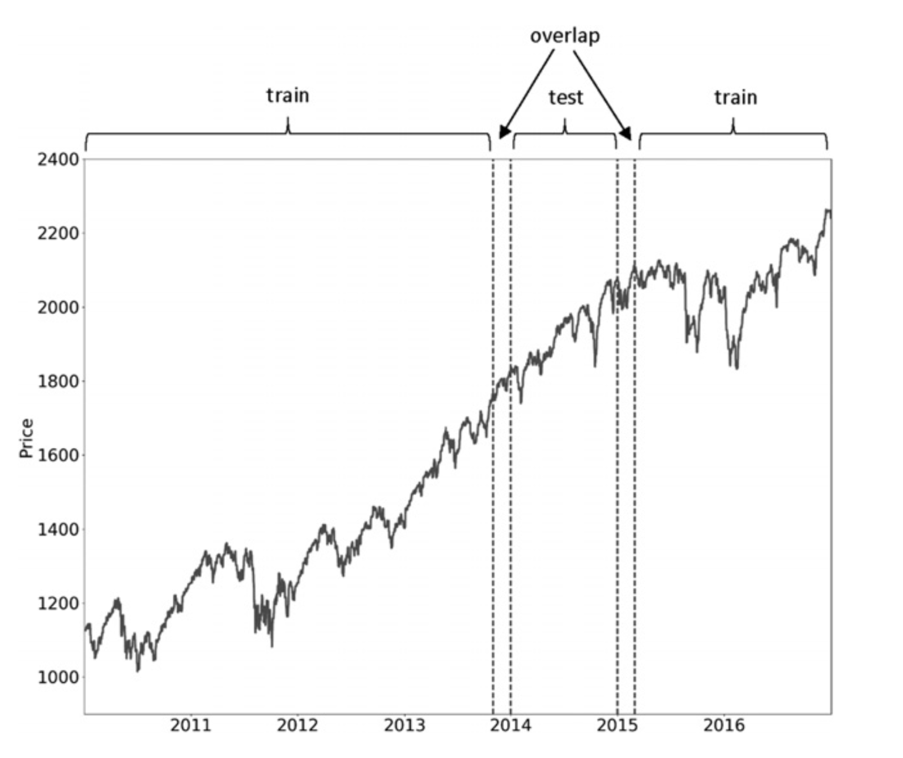
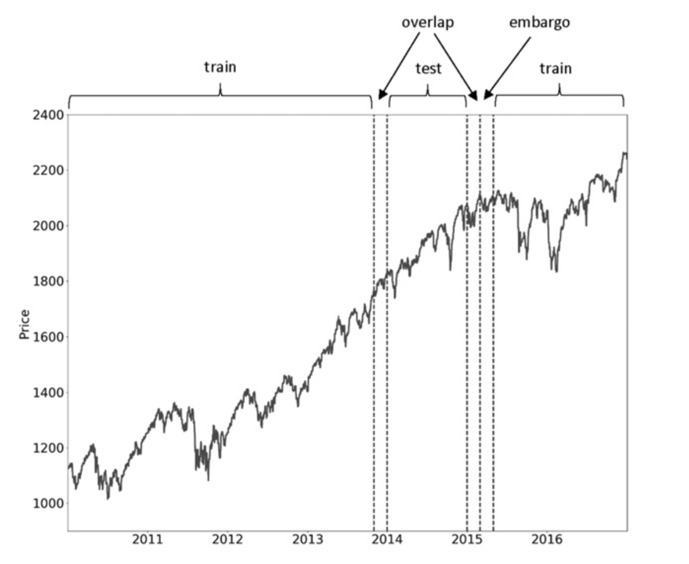
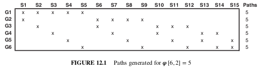

.. _implementations-cross_validation:

================
Cross Validation
================

Purged and Embargo Cross Validation
###################################

This implementation is based on Chapter 7 of the book Advances in Financial Machine Learning. The purpose of performing
cross validation is to reduce the probability of over-fitting and the book recommends it as the main tool of research.
There are two innovations compared to the classical K-Fold Cross Validation implemented in `sklearn <https://scikit-learn.org/>`_.

1. The first one is a process called **purging** which removes from the *training* set those samples that are build with
   information that overlaps samples in the *testing* set. More details on this in section 7.4.1, page 105.

   Image showing the process of **purging**. Figure taken from page 107 of the book.

2. The second innovation is a process called **embargo** which removes a number of observations from the *end* of the
test set. This further prevents leakage where the purging process is not enough. More details on this in section 7.4.2, page 107.

   Image showing the process of **embargo**. Figure taken from page 108 of the book.

Implementation
**************

.. py:currentmodule:: mlfinlab.cross_validation.cross_validation
.. automodule:: mlfinlab.cross_validation.cross_validation
   :members:

Combinatorial Purged CV (CPCV)
##############################

This implementation is based on Chapter 12 of the book Advances in Financial Machine Learning.

Given a number φ of backtest paths targeted by the researcher, CPCV generates the precise number of combinations of
training/testing sets needed to generate those paths, while purging training observations that contain leaked information.

CPCV can be used for both for cross-validation and backtesting. Instead of backtesting using single path, the researcher
may use CPCV to generate various train/test splits resulting in various paths.

CPCV algorithm:

    1. Partition T observations into N groups without shuffling, where groups n = 1, ... , N − 1 are of size [T∕N], and the Nth group is of size T − [T∕N] (N − 1).
    2. Compute all possible training/testing splits, where for each split N − k groups constitute the training set and k groups constitute the testing set.
    3. For any pair of labels (y_i , y_j), where y_i belongs to the training set and y j belongs to the testing set, apply the PurgedKFold class to purge y_i if y_i spans over a
       period used to determine label y j . This class will also apply an embargo, should some testing samples predate some training samples.
    4. Fit classifiers ( N ) on the N−k training sets, and produce forecasts on the respective N−k testing sets.
    5. Compute the φ [N, k] backtest paths. You can calculate one Sharpe ratio from each path, and from that derive the empirical distribution of the strategy’s
       Sharpe ratio (rather than a single Sharpe ratio, like WF or CV).

   Image showing splits for **CPCV(6,2)**

Implementation
**************

.. py:currentmodule:: mlfinlab.cross_validation.cross_validation
.. automodule:: mlfinlab.cross_validation.combinatorial
   :members:

Research Notebooks
##################

* `Answering Chapter 7: Cross-Validation Questions <https://github.com/hudson-and-thames/research/blob/master/Chapter7_CrossValidation/Chapter7_Exercises_CrossValidation.ipynb>`_
