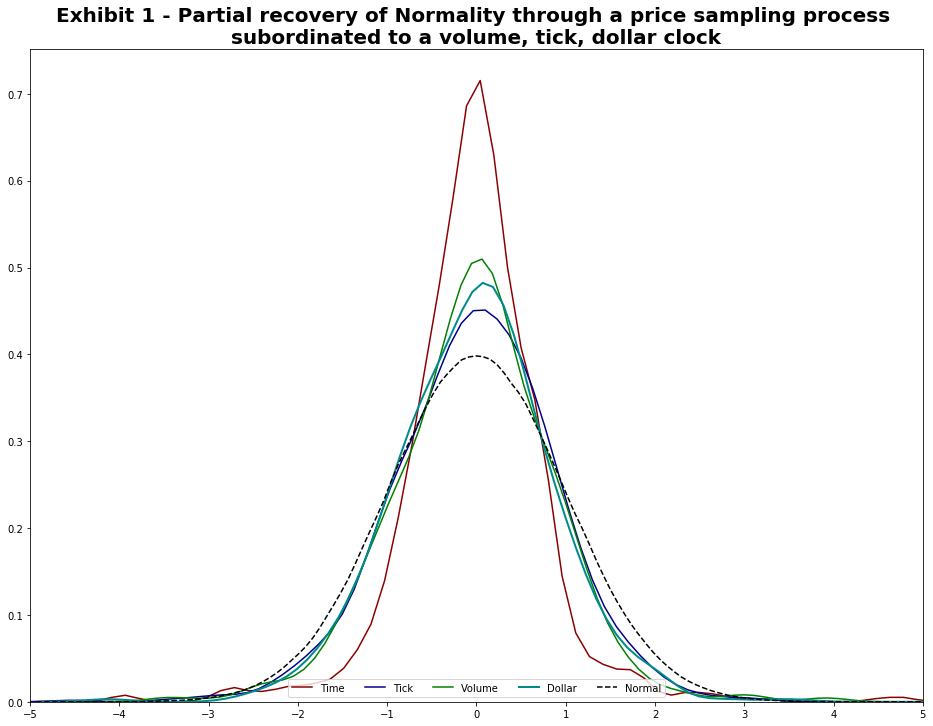
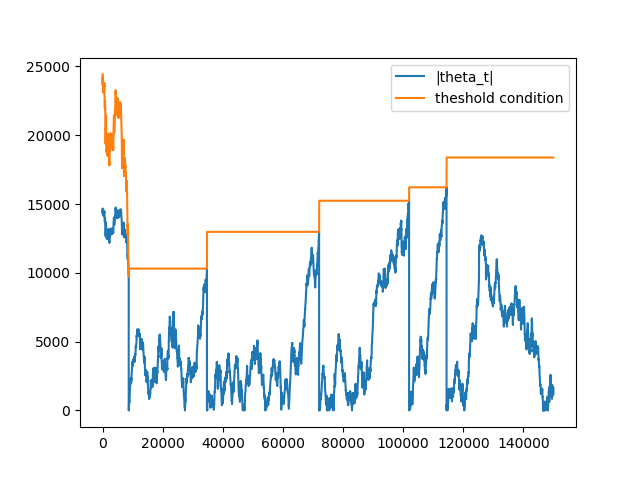
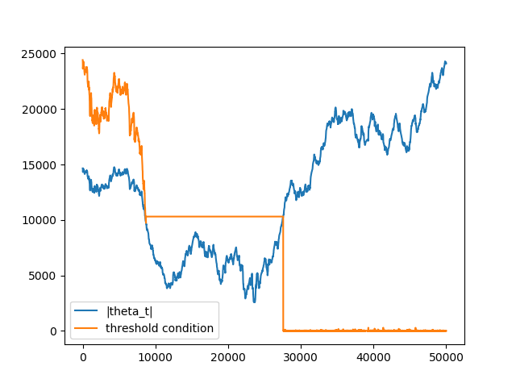

.. _implementations-data_structures:

===============
Data Structures
===============

When analyzing financial data, unstructured data sets, in this case tick data, are commonly transformed into a structured
format referred to as bars, where a bar represents a row in a table. mlfinlab implements tick, volume, and dollar bars
using traditional standard bar methods as well as the less common information driven bars.

Standard Bars
#############

The four standard bar methods implemented share a similar underlying idea in that they take a sample of data after a
certain threshold is reached and they all result in a time series of Open, High, Low, and Close data.

1. Time bars, are sampled after a fixed interval of time has passed.
2. Tick bars, are sampled after a fixed number of ticks have taken place.
3. Volume bars, are sampled after a fixed number of contracts (volume) has been traded.
4. Dollar bars, are sampled after a fixed monetary amount has been traded.

These bars are used throughout the text book (Advances in Financial Machine Learning, By Marcos Lopez de Prado, 2018,
pg 25) to build the more interesting features for predicting financial time series data.

.. tip::
   A fundamental paper that you need to read to have a better grasp on these concepts is:
   `Easley, David, Marcos M. López de Prado, and Maureen O’Hara. "The volume clock: Insights into the high-frequency
   paradigm." The Journal of Portfolio Management 39.1 (2012): 19-29. <https://jpm.pm-research.com/content/39/1/19.abstract>`_

Time Bars
*********

These are the traditional open, high, low, close bars that traders are used to seeing. The problem with using this sampling
technique is that information doesn't arrive to market in a chronological clock, i.e. news event don't occur on the hour - every hour.

It is for this reason that Time Bars have poor statistical properties in comparison to the other sampling techniques.

.. py:currentmodule:: mlfinlab.data_structures.time_data_structures
.. autofunction:: get_time_bars

Tick Bars
*********

.. py:currentmodule:: mlfinlab.data_structures.standard_data_structures
.. autofunction:: get_tick_bars

.. code-block::

	from mlfinlab.data_structures import standard_data_structures

	# Tick Bars
	tick = standard_data_structures.get_tick_bars('FILE_PATH', threshold=5500,
	                                               batch_size=1000000, verbose=False)

Volume Bars
***********

.. py:currentmodule:: mlfinlab.data_structures.standard_data_structures
.. autofunction:: get_volume_bars

.. code-block::

	from mlfinlab.data_structures import standard_data_structures

	# Volume Bars
	volume = standard_data_structures.get_volume_bars('FILE_PATH', threshold=28000,
                                                      batch_size=1000000, verbose=False)

Dollar Bars
***********

.. py:currentmodule:: mlfinlab.data_structures.standard_data_structures
.. autofunction::  get_dollar_bars

.. code-block::

	from mlfinlab.data_structures import standard_data_structures

	# Dollar Bars
	dollar = standard_data_structures.get_dollar_bars('FILE_PATH', threshold=70000000,
	                                                   batch_size=1000000, verbose=True)

Statistical Properties
**********************

The chart below that tick, volume, and dollar bars all exhibit a distribution significantly closer to normal - versus
standard time bars:

|

------------------------------------

|

Information-Driven Bars
#######################

Information-driven bars are based on the notion of sampling a bar when new information arrives to the market. The two
types of information-driven bars implemented are imbalance bars and run bars. For each type, tick, volume, and dollar bars
are included.

Imbalance Bars
**************

2 types of imbalance bars are implemented in mlfinlab:

    1. Expected number of ticks, defined as EMA (book implementation)
    2. Constant number of expected number of ticks.

Imbalance Bars Generation Algorithm
===================================

Let's discuss the generation of imbalance bars on an example of volume imbalance bars. As it is described in
Advances in Financial Machine Learning book:

First let's define what is the tick rule:

.. math::
    b_t = \begin{cases} b_{t-1},\;\;\;\;\;\;\;\;\;\; \Delta p_t \mbox{=0} \\ |\Delta p_t| / \Delta p_{t},\;\;\;	\Delta p_t \neq\mbox{0} \end{cases}

For any given :math:`t`, where :math:`p_t` is the price associated with :math:`t` and :math:`v_t` is volume, the tick rule :math:`b_t` is defined as:

Tick rule is used as a proxy of trade direction, however, some data providers already provide customers with tick direction, in this case we don't need to calculate tick rule, just use the provided tick direction instead.

Cumulative volume imbalance from :math:`1` to :math:`T` is defined as:

.. math::
    \theta_t = \sum_{t=1}^T b_t*v_t`

Where :math:`T` is the time when the bar is sampled.

Next we need to define :math:`E_0[T]` as the expected number of ticks, the book suggests to use a exponentially weighted moving average (EWMA)
of the expected number of ticks from previously generated bars. Let's introduce the first hyperparameter for imbalance bars generation:
**num_prev_bars** which corresponds to the window used for EWMA calculation.

Here we face the problem of the first bar's generation, because we don't know the expected number of ticks upfront.
To solve this we introduce the second hyperparameter: expected_num_ticks_init which corresponds to initial guess for
**expected number of ticks** before the first imbalance bar is generated.

Bar is sampled when:

.. math::
    |\theta_t| \geq E_0[T]*[2v^+ - E_0[v_t]]

To estimate (expected imbalance) we simply calculate the EWMA of volume imbalance from previous bars, that is why we need
to store volume imbalances in an imbalance array, the window for estimation is either **expected_num_ticks_init** before
the first bar is sampled, or expected number of ticks(:math:`E_0[T]`) * **num_prev_bars** when the first bar is generated.

Note that when we have at least one imbalance bar generated we update :math:`2v^+ - E_0[v_t]` only when the next bar is
sampled and not on every trade observed

Algorithm Logic
===============

Now that we have understood the logic of the imbalance bar generation, let's understand the process in further detail.

.. code-block::

	num_prev_bars = 3
	expected_num_ticks_init = 100000
	expected_num_ticks = expected_num_ticks_init
	cum_theta = 0
	num_ticks = 0
	imbalance_array = []
	imbalance_bars = []
	bar_length_array = []
	for row in data.rows:
	    #track high,low,close, volume info
	    num_ticks += 1
	    tick_rule = get_tick_rule(price, prev_price)
	    volume_imbalance = tick_rule * row['volume']
	    imbalance_array.append(volume_imbalance)
	    cum_theta += volume_imbalance
	    if len(imbalance_bars) == 0 and len(imbalance_array) >= expected_num_ticks_init:
	        expected_imbalance = ewma(imbalance_array, window=expected_num_ticks_init)

	    if abs(cum_theta) >= expected_num_ticks * abs(expected_imbalance):
	        bar = form_bar(open, high, low, close, volume)
	        imbalance_bars.append(bar)
	        bar_length_array.append(num_ticks)
	        cum_theta, num_ticks = 0, 0
	        expected_num_ticks = ewma(bar_lenght_array, window=num_prev_bars)
	        expected_imbalance = ewma(imbalance_array, window = num_prev_bars*expected_num_ticks)

Note that in algorithm pseudo-code we reset :math:`\theta_t` when bar is formed, in our case the formula for :math:`\theta_t` is:

.. math::
    \theta_t = \sum_{t=t^*}^T b_t*v_t

Let's look at dynamics of :math:`|\theta_t|` and :math:`E_0[T] * |2v^+ - E_0[v_t]|` to understand why we decided to
reset :math:`\theta_t` when a bar is formed. The following figure highlights the dynamics when theta value is reset:

Note that on the first set of ticks, the threshold condition is not stable. Remember, before the first bar is generated,
the expected imbalance is calculated on every tick with window = expected_num_ticks_init, that is why it changes with every tick.
After the first bar was generated both expected number of ticks (:math:`E_0[T]`) and expected volume imbalance
(:math:`2v^+ - E_0[v_t]`) are updated only when the next bar is generated

When theta is not reset:

The reason for that is due to the fact that theta is accumulated when several bars are generated theta value is not
reset :math:`\Rightarrow` condition is met on small number of ticks :math:`\Rightarrow` length of the next bar converges
to 1 :math:`\Rightarrow` bar is sampled on the next consecutive tick.

The logic described above is implemented in the **mlfinlab** package under ImbalanceBars

Implementation
==============

.. py:currentmodule:: mlfinlab.data_structures.imbalance_data_structures
.. autofunction::  get_ema_dollar_imbalance_bars
.. autofunction:: get_ema_volume_imbalance_bars
.. autofunction:: get_ema_tick_imbalance_bars
.. autofunction:: get_const_dollar_imbalance_bars
.. autofunction:: get_const_volume_imbalance_bars
.. autofunction:: get_const_tick_imbalance_bars

Example
=======

.. code-block::

   from mlfinlab.data_structures import get_ema_dollar_imbalance_bars, get_const_dollar_imbalance_bars

   # EMA, Const Dollar Imbalance Bars
   dollar_imbalance_ema = get_ema_dollar_imbalance_bars('FILE_PATH', num_prev_bars=3, exp_num_ticks_init=100000,
                                                        exp_num_ticks_constraints=[100, 1000], expected_imbalance_window=10000)

   dollar_imbalance_const = get_const_dollar_imbalance_bars('FILE_PATH', exp_num_ticks_init=100000, expected_imbalance_window=10000)

|

-----------------------------

|

Run Bars
********

Run bars share the same mathematical structure as imbalance bars, however, instead of looking at each individual trade,
we are looking at sequences of trades in the same direction. The idea is that we are trying to detect order flow imbalance
caused by actions such as large traders sweeping the order book or iceberg orders.

2 types of run bars are implemented in mlfinlab:

    1. Expected number of ticks, defined as EWMA (book implementation)
    2. Constant number of expected number of ticks.

Implementation
==============

.. py:currentmodule:: mlfinlab.data_structures.run_data_structures
.. autofunction:: get_ema_dollar_run_bars
.. autofunction:: get_ema_volume_run_bars
.. autofunction:: get_ema_tick_run_bars
.. autofunction:: get_const_dollar_run_bars
.. autofunction:: get_const_volume_run_bars
.. autofunction:: get_const_tick_run_bars

Example
=======

.. code-block::

   from mlfinlab.data_structures import get_ema_dollar_run_bars, get_const_dollar_run_bars

   # EMA, Const Dollar Imbalance Bars
   dollar_imbalance_ema = get_ema_dollar_run_bars('FILE_PATH', num_prev_bars=3, exp_num_ticks_init=100000,
                                                   exp_num_ticks_constraints=[100, 1000], expected_imbalance_window=10000)

   dollar_imbalance_const = get_const_dollar_run_bars('FILE_PATH', num_prev_bars=3, exp_num_ticks_init=100000,
                                                      expected_imbalance_window=10000)

|

-----------------------

|

Research Notebooks
##################

The following research notebooks can be used to better understand the previously discussed data structures

Standard Bars
*************

* `Getting Started`_
* `Sample Techniques`_

.. _Getting Started: https://github.com/hudson-and-thames/research/blob/master/Chapter2/Getting%20Started.ipynb
.. _Sample Techniques: https://github.com/hudson-and-thames/research/blob/master/Chapter2/2019-03-03_JJ_Sample-Techniques.ipynb

Imbalance Bars
**************

* `Imbalance Bars`_

.. _Imbalance Bars: https://github.com/hudson-and-thames/research/blob/master/Chapter2/2019-04-11_OP_Dollar-Imbalance-Bars.ipynb

|

---------------------

|

Data Preparation Tutorial
#########################

First import your tick data.

.. code-block::

   # Required Imports
   import numpy as np
   import pandas as pd

   data = pd.read_csv('data.csv')

In order to utilize the bar sampling methods presented below, our data must first be formatted properly.
Many data vendors will let you choose the format of your raw tick data files. We want to only focus on the following
3 columns: date_time, price, volume. The reason for this is to minimise the size of the csv files and the amount of time
when reading in the files.

Our data is sourced from TickData LLC which provides software called TickWrite, to aid in the formatting of saved files.
This allows us to save csv files in the format date_time, price, volume. (If you don't use TickWrite then make sure to pre-format your files)

For this tutorial we will assume that you need to first do some pre-processing and then save your data to a csv file.

.. code-block::

   # Don't convert to datetime here, it will take forever to convert
   # on account of the sheer size of tick data files.
   date_time = data['Date'] + ' ' + data['Time']
   new_data = pd.concat([date_time, data['Price'], data['Volume']], axis=1)
   new_data.columns = ['date', 'price', 'volume']

Initially, your instinct may be to pass an in-memory DataFrame object but the truth is when you're running the function
in production, your raw tick data csv files will be way too large to hold in memory. We used the subset 2011 to 2019 and
it was more than 25 gigs. It is for this reason that the mlfinlab package suggests using a file path to read the raw data
files from disk.

.. code-block::

	# Save to csv
	new_data.to_csv('FILE_PATH', index=False)
