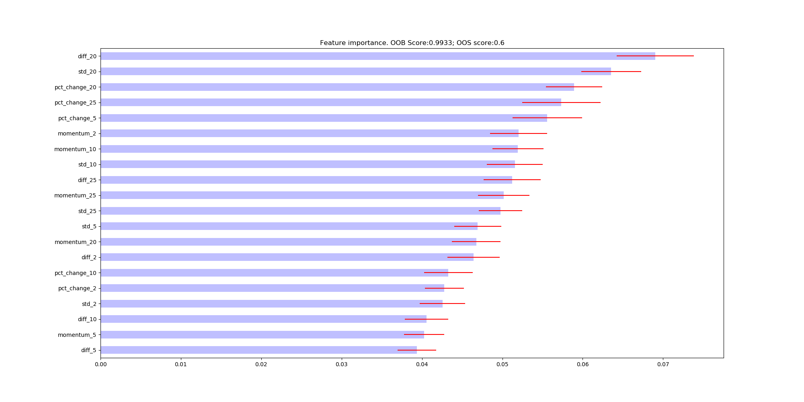
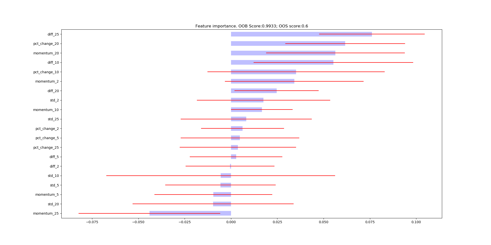
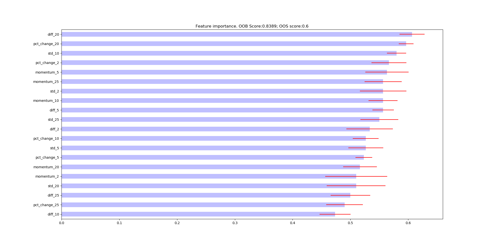
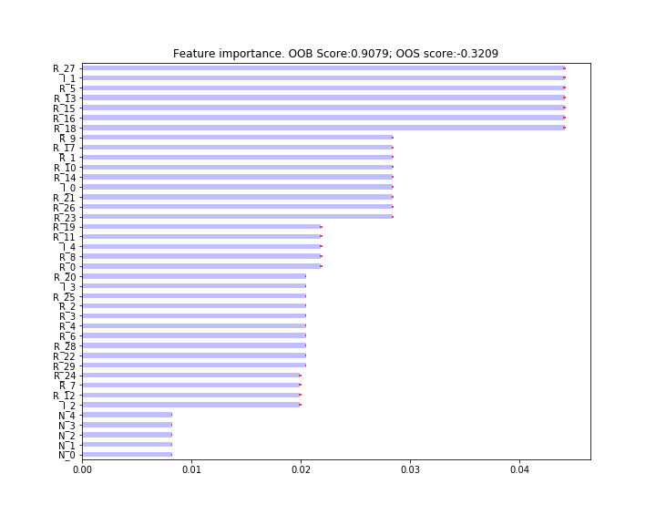
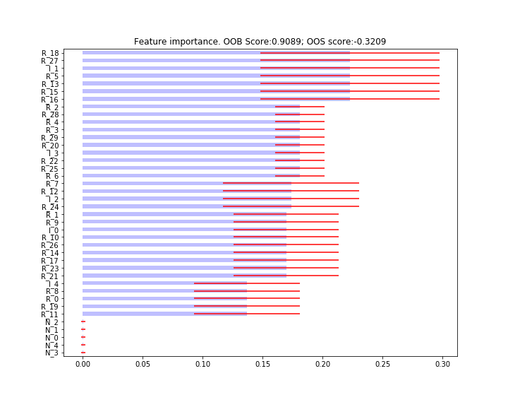
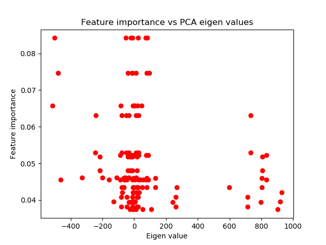

.. _implementations-feature_importance:

==================
Feature Importance
==================

.. centered::
   **Backtesting is not a research tool. Feature importance is. (Lopez de Prado)**

|

MDI, MDA, and SFI Feature Importance
####################################

The book describes three methods to get importance scores:

1) **Mean Decrease Impurity (MDI)**: This score can be obtained from tree-based classifiers and corresponds to sklearn's
   feature_importances attribute. MDI uses in-sample (IS) performance to estimate feature importance.
2) **Mean Decrease Accuracy (MDA)**: This method can be applied to any classifier, not only tree based. MDA uses
   out-of-sample (OOS) performance in order to estimate feature importance.
3) **Single Feature Importance (SFI)**: MDA and MDI feature suffer from substitution effects. If two features are highly
   correlated, one of them will be considered as important while the other one will be redundant. SFI is a OOS feature
   importance estimator which doesn't suffer from substitution effects because it estimates each feature importance separately.

Implementation
**************

.. py:currentmodule:: mlfinlab.feature_importance.importance
.. automodule:: mlfinlab.feature_importance.importance
   :members:

Example
*******

An example showing how to use various feature importance functions:

.. code-block::

  import pandas as pd
  from sklearn.ensemble import RandomForestClassifier
  from sklearn.metrics import accuracy_score, log_loss

  from mlfinlab.ensemble import SequentiallyBootstrappedBaggingClassifier
  from mlfinlab.feature_importance import (mean_decrease_impurity, mean_decrease_accuracy, single_feature_importance, plot_feature_importance)
  from mlfinlab.cross_validation import PurgedKFold, ml_cross_val_score

  X_train = pd.read_csv('X_FILE_PATH.csv', index_col=0, parse_dates = [0])
  y_train = pd.read_csv('y_FILE_PATH.csv', index_col=0, parse_dates = [0])
  triple_barrier_events = pd.read_csv('BARRIER_FILE_PATH', index_col=0, parse_dates = [0, 2])
  price_bars = pd.read_csv('PRICE_BARS_FILE_PATH', index_col=0, parse_dates = [0, 2])

  triple_barrier_events = triple_barrier_events.loc[X.index, :] # Take only train part
  price_events = price_events[(price_events.index >= X.index.min()) & (price_events.index <= X.index.max())]

  cv_gen = PurgedKFold(n_splits=4, samples_info_sets=triple_barrier_events.t1)

  base_est = RandomForestClassifier(n_estimators=1, criterion='entropy', bootstrap=False,
                                   class_weight='balanced_subsample')
  clf = SequentiallyBootstrappedBaggingClassifier(base_estimator=base_est, samples_info_sets=triple_barrier_events.t1,
                                                  price_bars=price_bars, oob_score=True)
  clf.fit(X_train, y_train)

  oos_score = ml_cross_val_score(clf, X_train, y_train, cv_gen=cv_gen, sample_weight_train=None, scoring=accuracy_score).mean()

  mdi_feature_imp = mean_decrease_impurity(clf, X_train.columns)
  mda_feature_imp = mean_decrease_accuracy(clf, X_train, y_train, cv_gen, scoring=log_loss)
  sfi_feature_imp = single_feature_importance(clf, X_train, y_train, cv_gen, scoring=accuracy_score)

  plot_feature_importance(mdi_feat_imp, oob_score=clf.oob_score_, oos_score=oos_score,
                                save_fig=True, output_path='mdi_feat_imp.png')
  plot_feature_importance(mda_feat_imp, oob_score=clf.oob_score_, oos_score=oos_score,
                                save_fig=True, output_path='mda_feat_imp.png')
  plot_feature_importance(sfi_feat_imp, oob_score=clf.oob_score_, oos_score=oos_score,
                                save_fig=True, output_path='sfi_feat_imp.png')

The following are the resulting images from the MDI, MDA, and SFI feature importances respectively:

Research Notebook
*****************
* `Answering Questions on MDI, MDA, and SFI Feature Importance`_

.. _Answering Questions on MDI, MDA, and SFI Feature Importance: https://github.com/hudson-and-thames/research/blob/master/Chapter8_FeatureImportance/Chapter8_Exercises_Feature_Importance.ipynb

---------------------

|

Clustered Feature Importance
############################

In the book Machine Learning for Asset Managers, as an approach to deal with substitution effect Clustered Feature
Importance was introduced. It clusters similar features and applies feature importance analysis (like MDA and MDI) at
the cluster level. The value add of clustering is that the clusters are mutually dissimilar and hence reduces the substitution
effects.

It can be implemented in two steps as described in the book:

1) **Features Clustering**: As a first step we need to generate the clusters or subsets of features we want to analyse
   with feature importance methods. This can be done using the feature cluster module. It implement the method of generating
   feature clusters as in the book.
2) **Clustered Importance**: Now that we have identified the number and composition of the clusters of features.
   We can use this information to apply MDI and MDA on groups of similar features, rather than on individual features.
   Clustered Feature Importance can be implemented by simply passing the feature clusters obtained in Step-1 to the
   clustered_subsets argument of the MDI or MDA feature importance algorithm.

Ways by Cluster Feature Importance can be applied:

1) Clustered MDI (code Snippet 6.4 page 86 ): We compute the clustered MDI as the sum of the MDI values of the features
   that constitute that cluster. If there is one feature per cluster, then MDI and clustered MDI are the same.
2) Clustered MDA (code Snippet 6.5 page 87 ): As an extension to normal MDA to tackle multi-collinearity and
   (linear or non-linear) substitution effect. Its implementation was also discussed by Dr. Marcos Lopez de Prado
   in the `Clustered Feature Importance (Presentaion Slides) <https://papers.ssrn.com/sol3/papers.cfm?abstract_id=3517595>`_.

.. note::

   The implementation of Clustered feature importance is included in the functions for MDI and MDA.

Example
*******
.. code-block::

   import pandas as pd
   from sklearn.tree import DecisionTreeClassifier
   from sklearn.ensemble import BaggingClassifier
   from sklearn.metrics import accuracy_score, log_loss
   from sklearn.model_selection._split import KFold

   from mlfinlab.util.generate_dataset import get_classification_data
   from mlfinlab.feature_importance import (mean_decrease_impurity, mean_decrease_accuracy,
                                           plot_feature_importance)
   from mlfinlab.cross_validation import  ml_cross_val_score
   from mlfinlab.clustering.feature_clusters import get_feature_clusters

   # Create Clusters
   X, y = get_classification_data(n_features=40, n_informative=5, n_redundant=30,
                                  n_samples=1000, sigmaStd=.1)
   feature_clusters = get_feature_clusters(X, dependence_metric='linear', n_clusters=None)

   # Fit model
   clf_base=DecisionTreeClassifier(criterion='entropy', max_features=1, class_weight='balanced',
                                   min_weight_fraction_leaf=0)
   clf=BaggingClassifier(base_estimator=clf_base, n_estimators=1000, max_features=1.0,
                         max_samples=1.0, oob_score=True)
   fit=clf.fit(X,y)

   # Score model
   cvGen = KFold(n_splits=10)
   oos_score = ml_cross_val_score(clf, X, y, cv_gen=cv_gen, sample_weight_train=None,
                                  scoring=accuracy_score).mean()

   # Feature Importance
   clustered_mdi = mean_decrease_impurity(clf, X_train.columns,
                                          clustered_subsets=feature_clusters)
   clustered_mda = mean_decrease_accuracy(clf, X_train, y_train, cv_gen,
                                          clustered_subsets=feature_clusters, scoring=log_loss)

   # Plot
   plot_feature_importance(clustered_mdi, oob_score=clf.oob_score_, oos_score=oos_score,
                           save_fig=True, output_path='clustered_mdi.png')
   plot_feature_importance(clustered_mda, oob_score=clf.oob_score_, oos_score=oos_score,
                           save_fig=True, output_path='clustered_mda.png')

The following are the resulting images from the Clustered MDI & Clustered MDA feature importances respectively:

   Clustered MDI

   Clustered MDA

Research Notebook
*****************
The following research notebooks can be used to better understand the Clustered Feature Importance and its implementations.

* `Clustered Feature Importance`_

.. _Clustered Feature Importance: https://github.com/hudson-and-thames/research/blob/master/Chapter8_FeatureImportance/Cluster_Feature_Importance.ipynb

------------------

|

Model Fingerprints Algorithm
############################

Another way to get a better understanding of a machine learning model is to understand how feature values influence model predictions. Feature effects can be decomposed into 3 components(fingerprints):

- **Linear component**
- **Non-linear component**
- **Pairwise interaction component**

Yimou Li, David Turkington, and Alireza Yazdani published a paper in the Journal of Financial Data Science `'Beyond the Black Box: An Intuitive Approach to Investment Prediction with Machine Learning'
<https://jfds.pm-research.com/content/early/2019/12/11/jfds.2019.1.023>`_ which describes in details the algorithm of extracting **linear**, **non-linear** and **pairwise** feature effects.
This module implements the algorithm described in the article.

.. tip::

   I would like to highlight that this algorithm is one of the tools that our team uses the most! There are 2 classes which
   inherit from an abstract base class, you only need to instantiate the child classes.

Implementation
**************

.. py:currentmodule:: mlfinlab.feature_importance.fingerpint
.. autoclass:: mlfinlab.feature_importance.fingerpint.AbstractModelFingerprint
   :members:

.. autoclass:: mlfinlab.feature_importance.fingerpint.ClassificationModelFingerprint
   :members:

.. autoclass:: mlfinlab.feature_importance.fingerpint.RegressionModelFingerprint
   :members:

Example
*******

.. code-block::

    from sklearn.datasets import load_boston
    from sklearn.ensemble import RandomForestRegressor
    from mlfinlab.feature_importance import RegressionModelFingerprint

    data = load_boston() # Get a dataset
    X = pd.DataFrame(columns=data['feature_names'], data=data['data'])
    y = pd.Series(data['target'])

    # Fit the model
    reg = RandomForestRegressor(n_estimators=10, random_state=42)
    reg.fit(X, y)

    reg_fingerpint = RegressionModelFingerprint()
    reg_fingerprint.fit(reg, X, num_values=20, pairwise_combinations=[('CRIM', 'ZN'),
                                                                      ('RM', 'AGE'),
                                                                      ('LSTAT', 'DIS')])
    reg_fingerpint.fit() # Fit the model

    # Get linear non-linear effects and pairwise effects
    linear_effect, non_linear_effect, pair_wise_effect = reg_fingerpint.get_effects()

    # Plot the results
    fig = reg_fingerpint.plot_effects()
    fig.show()

.. image:: feature_imp_images/effects.png
   :scale: 60 %
   :align: center

---------------------

|

PCA Features and Analysis
#########################

A partial solution to solve substitution effects is to orthogonalize features - apply PCA to them. However, PCA can be used
not only to reduce the dimension of your data set, but also to understand whether the patterns detected by feature importance are valid.

Suppose, that you derive orthogonal features using PCA. Your PCA analysis has determined that some features are more
'principal' than others, without any knowledge of the labels (unsupervised learning). That is, PCA has ranked features
without any possible overfitting in a classification sense.

When your MDI, MDA, SFI analysis selects as most important (using label information) the same features that PCA chose as
principal (ignoring label information), this constitutes confirmatory evidence that the pattern identified by the ML
algorithm is not entirely overfit. Here is the example plot of MDI feature importance vs PCA eigen values:

Implementation
**************

.. py:currentmodule:: mlfinlab.feature_importance.orthogonal
.. automodule:: mlfinlab.feature_importance.orthogonal
   :members: get_orthogonal_features, get_pca_rank_weighted_kendall_tau, feature_pca_analysis

Example
*******

Let's see how PCA feature extraction is analysis are done using mlfinlab functions:

.. code-block::

    import pandas as pd
    from mlfinlab.feature_importance.orthogonal import (get_orthogonal_features,
                                                        feature_pca_analysis)

    X_train = pd.read_csv('X_FILE_PATH.csv', index_col=0, parse_dates = [0])
    feat_imp = pd.read_csv('FEATURE_IMP_PATH.csv')

    pca_features = get_orthogonal_features(X_train)
    correlation_dict = feature_pca_analysis(X_train, feat_imp)
