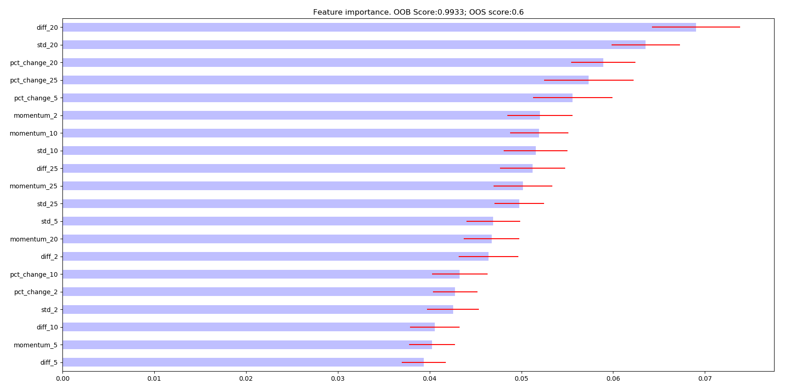
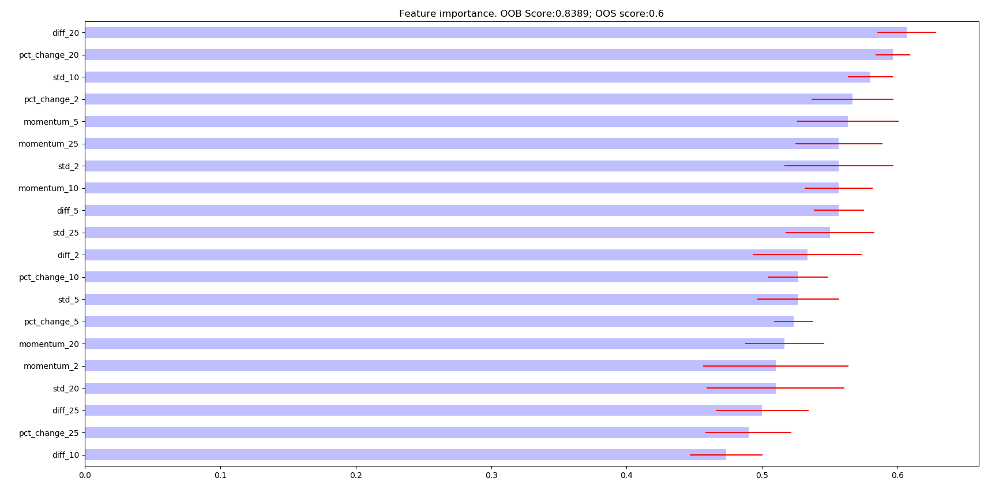

.. _implementations-feature_importance:

==================
Feature Importance
==================

One of the key research principles of Advances in Financial Machine learning is:

                              **Backtesting is not a research tool. Feature importance is.**

There are three ways to get feature importance scores:

1) Mean Decrease Impurity (MDI). This score can be obtained from tree-based classifiers and corresponds to sklearn's feature_importances attribute. MDI uses in-sample (IS) performance to estimate feature importance.
2) Mean Decrease Accuracy (MDA). This method can be applied to any tree-based classifier, not only tree based. MDA uses out-of-sample (OOS) performance in order to estimate feature importance.
3) Single Feature Importance (SFI). MDA and MDI feature suffer from substitution effects: if two features are highly correlated, one of them will be considered as important while the other one will be redundant. SFI is OOS feature importance estimator which doesn't suffer from substitution effect because it estimates each feature importance separately.

MDI, MDA, SFI feature importance
================================

.. py:currentmodule:: mlfinlab.feature_importance.importance
.. automodule:: mlfinlab.feature_importance.importance
   :members:

An example showing how to use various feature importance functions::

  import pandas as pd
  from sklearn.ensemble import RandomForestClassifier
  from mlfinlab.ensemble import SequentiallyBootstrappedBaggingClassifier
	from mlfinlab.feature_importance import feature_importance_mean_imp_reduction, feature_importance_mean_decrease_accuracy, feature_importance_sfi, plot_feature_importance
  from mlfinlab.cross_validation import PurgedKFold, ml_cross_val_score
  from mlfinlab.ensemble import SequentiallyBootstrappedBaggingClassifier

  X_train = pd.read_csv('X_FILE_PATH', index_col=0, parse_dates = [0])
  y_train = pd.read_csv('y_FILE_PATH', index_col=0, parse_dates = [0])
  triple_barrier_events = pd.read_csv('BARRIER_FILE_PATH', index_col=0, parse_dates = [0, 2])
  price_bars = pd.read_csv('PRICE_BARS_FILE_PATH', index_col=0, parse_dates = [0, 2])

  triple_barrier_events = triple_barrier_events.loc[X.index, :] # take only train part
  price_events = price_events[(price_events.index >= X.index.min()) & (price_events.index <= X.index.max())]

  cv_gen = PurgedKFold(n_splits=4, samples_info_sets=triple_barrier_events.t1)

  base_est = RandomForestClassifier(n_estimators=1, criterion='entropy', bootstrap=False,
                                   class_weight='balanced_subsample')
  clf = SequentiallyBootstrappedBaggingClassifier(base_estimator=base_est, samples_info_sets=triple_barrier_events.t1,
                                                  price_bars=price_bars, oob_score=True)
  clf.fit(X_train, y_train)

  oos_score = ml_cross_val_score(sclf, X_train, y_train, cv_gen=cv_gen, sample_weight=None,
                                       scoring='accuracy').mean()

  mdi_feature_imp = feature_importance_mean_imp_reduction(clf, X_train.columns)
  mda_feature_imp = feature_importance_mean_decrease_accuracy(clf, X_train, y_train, cv_gen, scoring='neg_log_loss')
  sfi_feature_imp = feature_importance_sfi(clf, X_train, y_train, cv_gen, scoring='accuracy')

  plot_feature_importance(mdi_feat_imp, oob_score=clf.oob_score_, oos_score=oos_score,
                                savefig=True, output_path='mdi_feat_imp.png')
  plot_feature_importance(mda_feat_imp, oob_score=clf.oob_score_, oos_score=oos_score,
                                savefig=True, output_path='mda_feat_imp.png')
  plot_feature_importance(sfi_feat_imp, oob_score=clf.oob_score_, oos_score=oos_score,
                                savefig=True, output_path='mdi_feat_imp.png')

Resulting images for MDI, MDA, SFI feature importances respectively:

.. image:: feature_imp_images/mda_feat_imp.png
  :scale: 40 %
  :align: center

PCA features and analysis
================================

Partial solution to solve substitution effects is to orthogonalize features - apply PCA to them. However, PCA can be used not only
to reduce the dimension of your data set, but also to understand whether the patterns detected by feature importance are valid.
Suppose, that you derive orthogonal features using PCA. Your PCA analysis has determined that some features are more 'principal' than others,
without any knowledge of the labels (unsupervised learning). That is, PCA has ranked features without any possible overfitting in a classification sense.
When your MDI, MDA, SFI analysis selects as most important (using label information) the same features that PCA chose as principal (ignoring label information),
this constitutes confirmatory evidence that the pattern identified by the ML algorithm is not entirely overfit. Here is the example plot of MDI feature importance vs PCA eigen values:

.. py:currentmodule:: mlfinlab.feature_importance.orthogonal
.. automodule:: mlfinlab.feature_importance.orthogonal
   :members: get_orthogonal_features, get_pca_rank_weighted_kendall_tau, feature_pca_analysis

Let's see how PCA feature extraction is analysis are done using mlfinlab functions::

    import pandas as pd
    from mlfinlab.feature_importance.orthogonal import get_orthogonal_features, feature_pca_analysis

    X_train = pd.read_csv('X_FILE_PATH', index_col=0, parse_dates = [0])
    feat_imp = pd.read_csv('FEATURE_IMP_PATH')

    pca_features = get_orthogonal_features(X_train)
    correlation_dict = feature_pca_analysis(X_train, feat_imp)
