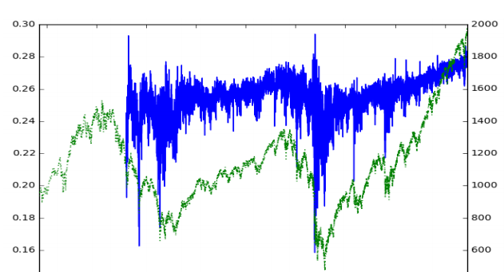

.. _implementations-frac_diff:

====================================
Fractionally Differentiated Features
====================================

One of the challenges of quantitative analysis in finance is that price time series have trends or a non-constant mean.
This makes the time series is non-stationary. A non-stationary time series are hard to work with when we want to do inferential
analysis such as average and variance of returns, or probability of loss.

Many supervised learning algorithms have the underlying assumption that the data is stationary. Specifically, in supervised
learning, one needs to map hitherto unseen observations to a set of labeled examples and determine the label of the new observation.
As Marcos Lopez de Prado (MLdP) says in Chapter 5, “if the features are not stationary we cannot map the new observation
to a large number of known examples”. However, to make a time series (or a feature) stationary often requires data
transformations like computing changes (change in price, yields, or volatility). These transformations also leave the time
series bereft of any memory and thereby reduce or eliminate its predictive capability.

Fractionally differentiated features tackle this problem by deriving features through fractionally differentiating a time
series to the point where the series is stationary, but not over differencing such that we lose all predictive power.

The following graph shows a fractionally differenced series plotted over the original closing price series:

   Fractionally Differentiated Series `(Lopez de Prado 2018) <https://papers.ssrn.com/sol3/papers.cfm?abstract_id=3447398>`_

|

Implementation
##############

The following function implemented in mlfinlab can be used to derive fractionally differentiated features.

.. py:currentmodule:: mlfinlab.features.fracdiff
.. autofunction::  frac_diff_ffd

Example
#######

Given that we know the amount we want to difference our price series, fractionally differentiated features can be derived
as follows:

.. code-block::

   import numpy as np
   import pandas as pd

   from mlfinlab.features.fracdiff import frac_diff_ffd

   data = pd.read_csv('FILE_PATH')
   frac_diff_series = frac_diff_ffd(data['close'], 0.5)

Research Notebook
#################

The following research notebook can be used to better understand fractionally differentiated features.

* `Fractionally Differentiated Features`_

.. _Fractionally Differentiated Features: https://github.com/hudson-and-thames/research/blob/master/Chapter5/Chapter5_Exercises.ipynb

