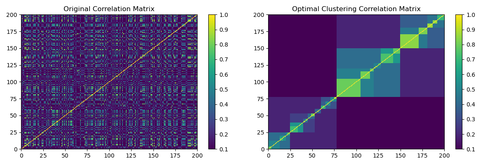

.. _implementations-optimal-hierarchical-clustering:

=======================
Hierarchical Clustering
=======================

This module implements various hierarchical clustering algorithms. The clustering technique groups similar data points into groups called clusters. Similarity
can be measured by multiple methods, such as Pearson's correlation, Spearman rank correlation, Euclidean distance, etc.

Hierarchical clustering is a technique that arranges a set of nested clusters as a tree. It can be agglomerative or divisive. Agglomerative hierarchical clustering
merges smaller and similar clusters to form bigger clusters in multiple iterations.  A dendrogram is a common technique to visualize the nested clusters. Divisive
hierarchical clustering is the opposite concept. At each iteration, bigger clusters are separated into smaller and dissimilar clusters. Hierarchical clustering
is useful to discern similar properties in datasets.

Implementation
##############

This module creates optimal leaf hierarchical clustering as shown in `Marti, G. (2020) TF 2.0 DCGAN for 100x100 financial correlation matrices <https://marti.ai/ml/2019/10/13/tf-dcgan-financial-correlation-matrices.html>`_
by arranging a matrix with hierarchical clustering by maximizing the sum of the similarities between adjacent leaves.

.. py:currentmodule:: mlfinlab.clustering.hierarchical_clustering

.. autofunction:: optimal_hierarchical_cluster

Example
#######

   (Left) HCBM matrix. (Right) Optimal Clustering of the HCBM matrix found by the function :code:`optimal_hierarchical_cluster`.

.. code-block::

    from mlfinlab.data_generation.data_verification import plot_optimal_hierarchical_cluster
    from mlfinlab.data_generation.hcbm import generate_hcmb_mat
    import matplotlib.pyplot as plt

    # Initialize parameters.
    samples = 1
    dim = 200
    rho_low = 0.1
    rho_high = 0.9

    # Generate HCBM matrix.
    hcbm_mat = generate_hcmb_mat(t_samples=samples,
                                 n_size=dim,
                                 rho_low=rho_low,
                                 rho_high=rho_high,
                                 permute=True)[0]

    # Plot it.
    plt.figure(figsize=(6, 4))
    plt.pcolormesh(hcbm_mat, cmap='viridis')
    plt.colorbar()
    plt.title("Original Correlation Matrix")

    # Obtain optimal clusters from HCBM matrix.
    ordered_corr = optimal_hierarchical_cluster(hcbm_mat, method="ward")

    # Plot it.
    plt.figure(figsize=(6, 4))
    plt.pcolormesh(ordered_corr, cmap='viridis')
    plt.colorbar()
    plt.title("Optimal Clustering Correlation Matrix")

    plt.show()

