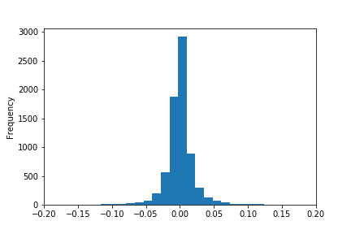

.. _implementations-labeling_excess_median:

============================
Labelling Excess Over Median
============================

Labelling according to excess over median is a binary labelling method used in the following paper `Zhu, M., Philpotts, F. and
Stevenson, M., 2012. The benefits of tree-based models for stock selection.
Journal of Asset Management, 13(6), pp.437-448. <https://link.springer.com/article/10.1057/jam.2012.17>`_

In this method, a cross-sectional dataset of close prices of many different tickers is used. The median return at each time index
is calculated and used as a proxy for market return. The median return is then subtracted from each observation's return to find the
numerical excess return over median. If desired, the numerical values can be converted to categorical values according to the sign of
the excess return. The labels can then be used in training regression and decision tree models.

At time :math:`t`:

.. math::

    P_t &= \{p_{t,0}, p_{t,1}, ... p_{t,n}\}

    m &= median(P_t)

    L(P_t) &= \{p_{t,0} - m, p_{t,1} - m, ... p_{t,n} - m\}

If categorical rather than numerical labels are desired:

.. math::
     \begin{equation}
     \begin{split}
       L(p_{t,n}) = \begin{cases}
       -1 &\ \text{if} \ \ p_{t,n} - m < 0\\
       0 &\ \text{if} \ \ p_{t,n} - m = 0\\
       1 &\ \text{if} \ \ p_{t,n} - m > 0\\
       \end{cases}
     \end{split}
     \end{equation}

The following shows the distribution of numerical excess over median for a set of 22 stock for the time period between Jan 2019
and May 2020.

Implementation
##############

.. py:currentmodule:: mlfinlab.labeling.excess_over_median

.. automodule:: mlfinlab.labeling.excess_over_median
   :members:

Example
########
Below is an example on how to create labels of excess over median from real data.

.. code-block::

    import pandas as pd
    import yfinance as yf
    from mlfinlab.labeling import excess_over_median

    # Import price data
    tickers = "AAPL MSFT AMZN GOOG"
    data = yf.download(tickers, start="2019-01-01", end="2020-05-01", group_by="ticker")
    data = data.loc[:, (slice(None), 'Adj Close')]
    data.columns = data.columns.droplevel(1)

    # Get returns over median numerically
    excess_over_median(data)

    # Get returns over median as a categorical label
    excess_over_median(data, binary=True)

Research Notebooks
##################

The following research notebooks can be used to better understand labelling excess over median.

* `Excess Over Median Example`_

.. _`Excess Over Median Example`: https://github.com/hudson-and-thames/research/blob/master/Labelling/Labels%20Excess%20Over%20Median/Excess%20over%20Median.ipynb
