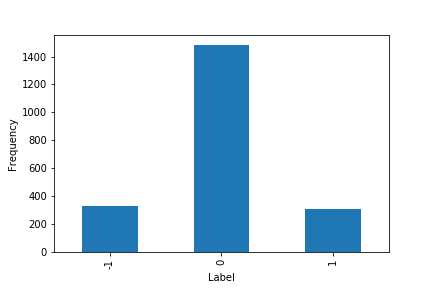

.. _implementations-labeling_fixed_time_horizon:

====================
Fixed Horizon Method
====================

Fixed horizon labels is a classification labeling technique used in the following paper: `Dixon, M., Klabjan, D. and
Bang, J., 2016. Classification-based Financial Markets Prediction using Deep Neural Networks. <https://arxiv.org/abs/1603.08604>`_

Fixed time horizon is a common method used in labeling financial data, usually applied on time bars. The forward rate of return relative
to :math:`t_0` over time horizon :math:`h` is calculated as follows (M.L. de Prado, Advances in Financial Machine Learning, 2018):

.. math::
    r_{t0,t1} = \frac{p_{t1}}{p_{t0}} - 1

Where :math:`t_1 = t_0 + h` is the time bar index after a fixed horizon of :math:`h` ticks have passed, and :math:`p_{t0}, p_{t1}`
are prices at times :math:`t_0, t_1`. This method assigns a label based on comparison of rate of return to a threshold :math:`\tau`

 .. math::
     \begin{equation}
     \begin{split}
       L_{t0, t1} = \begin{cases}
       -1 &\ \text{if} \ \ r_{t0, t1} < -\tau\\
       0 &\ \text{if} \ \ -\tau \leq r_{t0, t1} \leq \tau\\
       1 &\ \text{if} \ \ r_{t0, t1} > \tau
       \end{cases}
     \end{split}
     \end{equation}

The following shows the distribution of labels for standardized returns on closing prices of SPY in the time period from Jan 2008 to July 2016
using a 20 day rolling window for the standard deviation.

Though time bars are the most common format for financial data, there can be potential problems with over-reliance on time bars. Time
bars exhibit high seasonality, as trading behavior may be quite different at the open or close versus midday; thus it will not be
informative to apply the same threshold on a non-uniform distribution. Solutions include applying the fixed horizon method to tick or
volume bars instead of time bars, using data sampled at the same time every day (e.g. closing prices) or inputting a dynamic threshold
as a pd.Series corresponding to the times in the dataset.

.. tip::
   **Underlying Literature**

   The following sources describes this method in more detail:

   - **Advances in Financial Machine Learning, Chapter 3.2** *by* Marcos Lopez de Prado (p. 43-44).
   - **Machine Learning for Asset Managers, Chapter 5.2** *by* Marcos Lopez de Prado (p. 65-66).

Implementation
##############

.. py:currentmodule:: mlfinlab.labeling.fixed_time_horizon
.. automodule:: mlfinlab.labeling.fixed_time_horizon
   :members:

Example
########
Below is an example on how to use the Fixed Horizon labeling technique on real data.

.. code-block::

    import pandas as pd
    from mlfinlab.labeling import fixed_time_horizon

    # Import price data
    data = pd.read_csv('../Sample-Data/stock_prices.csv', index_col='Date', parse_dates=True)
    ticker = 'SPY'

    # Create labels
    labels = fixed_time_horizon(close=data[ticker], threshold=0.01, look_forward=1)

    # Create labels with standardization
    labels = fixed_time_horizon(close=data[ticker], threshold=1, look_forward=1, standardized=True, window=5)

Research Notebook
#################

The following research notebook can be used to better understand the Fixed Horizon labeling technique.

* `Fixed Horizon Example`_

.. _`Fixed Horizon Example`: https://github.com/hudson-and-thames/research/blob/master/Labelling/Labels%20Fixed%20Horizon/Fixed%20Time%20Horizon.ipynb
