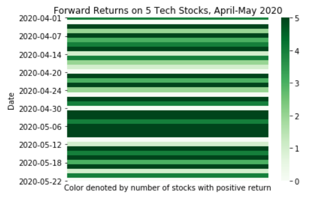

.. _implementations-labeling_forward_return:

===============
Forward Returns
===============

Labeling forward returns is a simple method of labeling financial data that is similar to labeling raw returns, except instead
of looking at the return from the previous timestamp, the price of each observation is compared to the price at :math:`h` timestamps
in the future. Usually :math:`h` will be 1. If the price at the next time index is greater than the current price, the observation
will be labeled with a 1. Otherwise, the label will be 0.

 .. math::
     \begin{equation}
     \begin{split}
       L_t = \begin{cases}
       0 &\ \text{if} \ \ p_{t+h} \leq p_t \\
       1 &\ \text{if} \ \ p_{t+h} > p_t
       \end{cases}
     \end{split}
     \end{equation}

This labeling method is used in in the paper `Kim, K., 2003. Financial time series forecasting using support vector machines.
<https://www.sciencedirect.com/science/article/abs/pii/S0925231203003722>`_. The author labels data in this way, and uses
the labels to train and test SVMs used to predict future price movements.

Below is a visualization of the labels. Five tech stocks are labelled based on their forward returns. Darker green indicates that
more of those stocks had a positive forward return on a given day,

Implementation
##############

.. py:currentmodule:: mlfinlab.labeling.forward_return
.. automodule:: mlfinlab.labeling.forward_return
   :members:

Example
########
Below is an example on how to use the forward return labeling technique on real data.

.. code-block::

    import pandas as pd
    from mlfinlab.labeling import forward_return

    # Import price data
    data = pd.read_csv('../Sample-Data/stock_prices.csv', index_col='Date', parse_dates=True)

    # Create labels on an entire DataFrame
    labels = forward_return(data, lookforward=1)

    # Create labels on a Series with a different lookforward period
    labels = forward_return(data['SPY'], lookforward=3)

Research Notebook
#################

The following research notebook can be used to better understand the Forward Return labeling technique,

* `Forward Return Example`_

.. _`Forward Return Example`: https://github.com/hudson-and-thames/research/blob/master/Labelling/Labels%20Fixed%20Horizon/Fixed%20Time%20Horizon.ipynb

