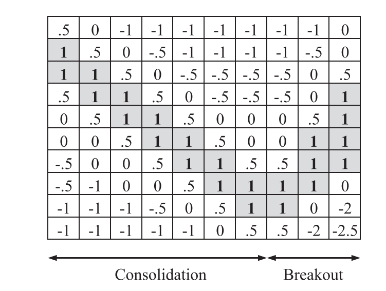

.. _implementations-labeling_matrix_flags:

=====================
Labeling Matrix Flags
=====================

The matrix flag labeling method is meant to capture trends in financial prices data, such as bull and bear flags.
A bull flag occurs when a stock's price rapidly increases, followed by a downwards trending consolidation period, followed by a breakout
increase in price confirming the original increase. As defined, "A bull flag pattern is a horizontal or downward
sloping flag of consolidation followed by a sharp rise in the positive direction, the breakout." [Leigh et al. 2002].
Being able to identify the early stages of the breakout process can lead to a profitable strategy of buying the breakout and
then selling some number of days later, when the price has theoretically stabilized again.

.. tip::
   **Literature Reference**

    Labeling price data according to a template to identify patterns in price changes is featured in the following paper:
    `Cervelló-Royo, R., Guijarro, F. and Michniuk, K., 2015. Stock market trading rule based on pattern recognition and technical
    analysis: Forecasting the DJIA index with intraday data. <https://www.sciencedirect.com/science/article/abs/pii/S0957417415002110>`_

    This method was originally introduced in `Leigh, W., Modani, N., Purvis, R. and Roberts, T., 2002. Stock market trading rule discovery
    using technical charting heuristics. <http://chart-patterns.technicalanalysis.org.uk/LMPR02.pdf>`_, which describes this method in more
    detail.

Cervelló-Royo et al. expand on Leigh et al.'s work by proposing a new bull flag pattern which ameliorates some weaknesses in Leigh's original template,
such as the possibility of false positives given the path the stock took. Additionally, he applies this bull flag labeling method to intraday
candlestick data, rather than just closing prices.

The bull flag labeling pattern requires the use of a template to apply to the transformed price data. Below is an example bull flag
template.

   Bull flag template, from Cervelló-Royo et al. (2015), originally proposed by Leigh et al. (2002). The first 7 columns represent
   consolidation, while final 3 columns represent the early stages of the breakout.

The matrix flag labeling method, in order to find a single day's fit, consists of the following steps:

 - The data window is taken, which consists of the current day's price and a number of days preceding.
 - The prices in the data window are ranked and decile cutoffs are found. Each price is mapped to the corresponding decile.
 - The data window is split into 10 chronological buckets each containing a tenth of the data window.
 - Each data window bucket is converted to a column of 10 elements, with the first bucket corresponding to the leftmost column, the second
   to the second from left, and so on until the last bucket corresponds to the rightmost column. Each row in a column corresponds to decile over
   the entire data window, with the top row corresponding to top 90-100th percentile, second row corresponding to the 80-90th percentile, and
   so on.
 - The mapping between price and decile over the data window is applied, and each row consists of the proportion of points in the bucket which
   falls into each decile. For example, suppose the second bucket contains 50% points in the 20-30th percentile, and 50% points in the 0-10th
   percentile. The corresponding column would be, from top to bottom, [0, 0, 0, 0, 0, 0, 0, 0.5, 0, 0.5]. This process is done for all ten
   buckets, until a 10 by 10 matrix is formed.
 - This 10 by 10 matrix is multiplied element-wise by the template. The sum of all elements of this resulting matrix is calculated to be the
   total fit for the day.
 - If a threshold is given, the fit is converted to a categorical label, with the positive class given if the fit equals or exceeds the
   threshold, and the negative class otherwise. The value of the threshold depends on how strict of a classifier the user
   desires, and the allowable values based on the template matrix.

The following shows the identified bull flag regions on price data in MSFT stock from 2019-2020 using the original template shown above, with
a time window of 40 days.

.. figure:: labeling_images/msft_bull_flag40.png
   :scale: 120 %
   :align: center
   :figclass: align-center
   :alt: bull flag msft

   Bull flag template from Leigh et al. (2002) applied to MSFT data. Green dots show when the template has identified the region as a
   bull flag breakout point.

The user should know what kind of timescale is desired when deciding the data window for this method. Using a small data window will catch
small, short-lived trends, while missing longer-term trends, and vice versa for a large data window. Additionally, the choice of template
determines which kind of pattern is tracked, and should be customized with respect to the data. A template which is optimal for 15 minute
bars, for example, may not work nearly as well for hourly or daily bars. The user may choose a preset template, or input their own. Currently,
the allowable pre-set templates are the bear and bull versions of the templates used in Leigh's and Cervelló-Royo's papers.

.. figure:: labeling_images/matrix_templates.png
   :scale: 60 %
   :align: center
   :figclass: align-center
   :alt: templates

   Left: Leigh's bull flag template. Right: Cervelló-Royo's bull flag template. The bear versions can be found by flipping
   the bull versions about the horizontal axis. The highest possible fit using the Leigh template is 10, and using Cervelló-Royo
   is 5.

.. tip::
   **Simple Example**

    It's perhaps easiest to illustrate this process with a simple example. Suppose we have the following data window of 20
    prices [100, 102, ..., 118, 120, 118, ..., 104, 102] i.e. rising monotonically to 120 and then falling back to 102.
    The decile cutoffs are then [102, 104, ..., 120]. Note that these cutoffs are right inclusive, so a value of 102 would
    fit into the (100, 102) percentile.

    We split the data into ten chronological subsets such that the first subset is [100, 102]. 100% of elements in the first subset
    fall into the lowest decile, so the corresponding column would be [0, 0, 0, 0, 0, 0, 0, 0, 0, 1]. The second subset is [104, 106],
    of which 1 out of 2 prices is in the 2nd decile, and the other is in the 3rd decile, so the column would be [0, 0, 0, 0, 0, 0, 0, 0.5, 0.5, 0].
    This is done until the entire 10 by 10 matrix is generated. The columns in this matrix represent the 10 chronological subsets, and each
    element in the column represents the proportion of points in each subset corresponding to its respective decile over the entire data window.

    This matrix is then multiplied element-wise by the template, and resulting values are summed to get the total template fit. The higher
    the fit, the better match to the template. Using the template shown above, the highest possible fit is 10.

Implementation
##############

.. automodule:: mlfinlab.labeling.matrix_flags

    .. autoclass:: MatrixFlagLabels
        :members:

        .. automethod:: __init__

Example
########
Below is an example on how to use the matrix flags labeling method.

.. code-block::

    import numpy as np
    import pandas as pd
    import yfinance as yf
    from mlfinlab.labeling.matrix_flags import MatrixFlagLabels

    # Import price data
    msft = yf.Ticker("MSFT")
    hist = msft.history(start='2020-1-1', end='2020-6-01')
    data = hist['Close']

    # Initialize with a window of 60 days.
    Flags = MatrixFlagLabels(prices=data, window=60, template_name='leigh_bull')

    # Get numerical weights based on the template (for days 60 and onwards).
    weights = Flags.apply_labeling_matrix()

    # Get categorical labels based on whether the day's weight is above 2.5.
    categorical = Flags.apply_labeling_matrix(threshold=2.5)

    # Change the template from pre-set to user defined.
    new_template = pd.DataFrame(np.random.randint(-3, 3, size=(10, 10)))
    Flags.set_template(template=new_template)

Research Notebook
#################

The following research notebook can be used to better understand the matrix flags labeling technique.

* `Matrix Flags Example`_

.. _`Matrix Flags Example`: https://github.com/hudson-and-thames/research/blob/master/Labelling/Labels%20Matrix%20Flags/Matrix%20Flag%20Labels.ipynb

