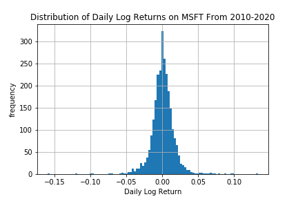

.. _implementations-labeling_raw_return:

===========
Raw Returns
===========

Labeling data by raw returns is the most simple and basic method of labeling financial data for machine learning. Raw returns can
be calculated either on a percentage or logarithmic basis. Using returns rather than raw prices is usually preferred for financial data
analysis due to returns being automatically scaled with respect to the underlying. Unlike raw prices, returns are better suited for
mathematical analysis due to the possibility of negative returns. The percentage raw return for an observation with
price :math:`p_t` at time :math:`t` relative to its price at time :math:`t-1` is as follows:

.. math::
    r_t = \frac{p_{t}}{p_{t-1}} - 1

And the logarithmic return is:

.. math::
    r_t = \log \frac{p_{t}}{p_{t-1}}

The label :math:`L_t` is simply equal to :math:`r_t`.

Returns can also be calculated relative to multiple observations prior to the observation, instead of just one. If desired, the labels
can be given as a sign of the return, rather than the magnitude. In this case:

 .. math::
     \begin{equation}
     \begin{split}
       L_{t} = \begin{cases}
       -1 &\ \text{if} \ \ r_t < 0\\
       0 &\ \text{if} \ \ r_t = 0\\
       1 &\ \text{if} \ \ r_t > 0
       \end{cases}
     \end{split}
     \end{equation}

The following shows the distribution of logarithmic daily returns on Microsoft stock during the time period between January
2010 and May 2020.

Implementation
##############

.. py:currentmodule:: mlfinlab.labeling.raw_return
.. automodule:: mlfinlab.labeling.raw_return
   :members:

Example
########
Below is an example on how to use the raw returns labeling method.

.. code-block::

    import pandas as pd
    from mlfinlab.labeling import raw_return

    # Import price data
    data = pd.read_csv('../Sample-Data/stock_prices.csv', index_col='Date', parse_dates=True)
    ticker = 'SPY'

    # Create labels numerically based on percentage returns
    returns = raw_returns(data[ticker])

    # Create labels categorically based on logarithmic returns
    returns = raw_returns(data[ticker], binary=True, logarithmic=True)

Research Notebook
#################

The following research notebook can be used to better understand the raw return labeling technique.

* `Raw Return Example`_

.. _`Raw Return Example`: https://github.com/hudson-and-thames/research/blob/master/Labelling/Labels%20Raw%20Return/Raw%20Return.ipynb
