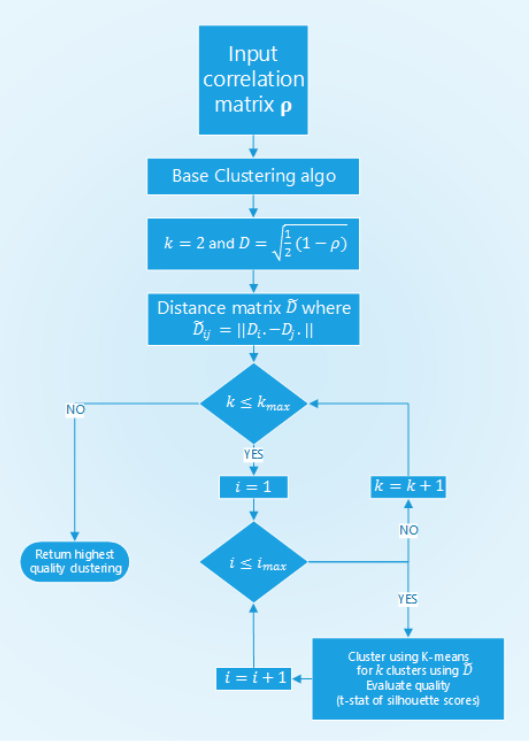
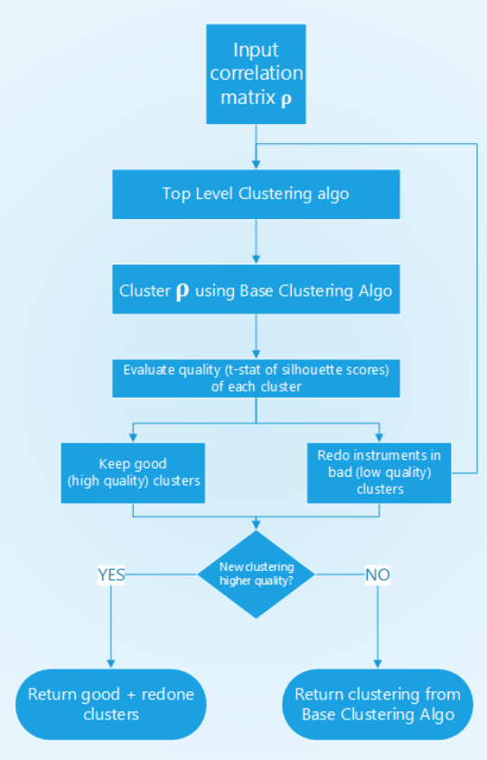

 .. _implementations-clustering:

================================
Optimal Number of Clusters (ONC)
================================

The ONC algorithm detects the optimal number of K-Means clusters using a correlation matrix as input.

Clustering is a process of grouping a set of elements where elements within a group (cluster) are more similar than
elements from different groups. A popular clustering algorithm is the K-means algorithm that guarantees the convergence
in a finite number of steps.

The K-means algorithm has two caveats. It requires the user to set the number of clusters in advance and the initialization
of clusters is random. Consequently, the effectiveness of the algorithm is random. The ONC algorithm proposed by
Marcos Lopez de Prado addresses these two issues.

.. tip::
   **Underlying Literature**

   The following sources elaborate extensively on the topic:

   - **Detection of false investment strategies using unsupervised learning methods** *by* Marcos Lopez de Prado *and* Lewis, M.J. `available here <https://papers.ssrn.com/sol3/abstract_id=3167017>`__. *Describes the ONC algorithm in detail. The code in this module is based on the code written by the researchers.*
   - **Machine Learning for Asset Managers** *by* Marcos Lopez de Prado `available here <https://www.cambridge.org/core/books/machine-learning-for-asset-managers/6D9211305EA2E425D33A9F38D0AE3545>`__. *Features additional descriptions of the algorithm and includes exercises to understand the topic in more detail.*
   - **Clustering (Presentation Slides)** *by* Marcos Lopez de Prado *and* Lewis, M.J. `available here <https://papers.ssrn.com/sol3/abstract_id=3512998>`__. *Briefly describes the logic behind the ONC algorithm.*
   - **Codependence (Presentation Slides)** *by* Marcos Lopez de Prado *and* Lewis, M.J. `available here <https://papers.ssrn.com/sol3/abstract_id=3512994>`__. *Explains why the angular distance metric is used to get distances between elements.*

Distances between the elements in the ONC algorithm are calculated using the same angular distance used in the HRP algorithm:

.. math::

      D_{i,j} = \sqrt{\frac{1}{2}(1 - \rho_{i,j})}

where :math:`\rho_{i,j}` is the correlation between elements :math:`i` and :math:`j` .

Distances between distances in the clustering algorithm are calculated as:

.. math::

      \hat{D_{i,j}} = \sqrt{\sum_{k}(D_{i,k} - D_{j,k})^{2}}

Silhouette scores are calculated as:

.. math::

      S_i = \frac{b_i - a_i}{max\{a_i,b_i\}}

where :math:`a_i` the average distance between element :math:`i` and all other components in the same cluster,
and :math:`b_i` is the smallest  average  distance  between :math:`i` and  all  the  nodes  in  any other  cluster.

The measure of clustering quality :math:`q` or :math:`t-score`:

.. math::

      q= \frac{E[\{S_i\}]}{\sqrt{V[\{S_i\}]}}

where :math:`E[\{S_i\}]` is the mean of the silhouette scores for each cluster, and :math:`V[\{S_i\}]` is the
variance of the silhouette scores for each cluster.

The ONC algorithm structure is described in the work `Detection of false investment strategies using unsupervised learning methods <https://papers.ssrn.com/sol3/papers.cfm?abstract_id=3167017>`_
using the following diagrams:

   Structure of ONC's base clustering stage.

In the base clustering stage first, the distances between the elements are calculated, then the algorithm iterates through
a set of possible number of clusters :math:`N` times to find the best clustering from :math:`N` runs of K-means for every
possible number of clusters. For each iteration, a clustering result is evaluated using the t-statistic of the silhouette scores.

The clustering result with the best t-statistic is picked, the correlation matrix is reordered so that clustered elements
are positioned close to each other.

   Structure of ONC’s higher-level stage.

On a higher level, the average t-score of the clusters from the base clustering stage is calculated. If more than two
clusters have a t-score below average, these clusters go through the base clustering stage again. This process is
recursively repeated.

Then, based on the t-statistic of the old and new clusterings it is checked whether the new clustering is better than
the original one. If not, the old clustering is kept, otherwise, the new one is taken.

The output of the algorithm is the reordered correlation matrix, clustering result, and silhouette scores.

Implementation
##############

.. py:currentmodule:: mlfinlab.clustering.onc
.. autofunction:: get_onc_clusters

Example
#######

An example showing how the ONC algorithm is used can be seen below:

.. code-block::

    import pandas as pd
    from mlfinlab.clustering import ONC

    # Import dataframe of returns for assets
    asset_returns = pd.read_csv(DATA_PATH, index_col='Date', parse_dates=True)

    # Calculate correlation matrix of returns
    assets_corr = asset_returns.corr()

    # Class that contains needed function
    onc = ONC()

    # Output of the ONC algorithm with 10 simulations for each number of clusters tested
    assets_corr_onc, clusters, silh_scores = onc.get_onc_clusters(assets_corr, repeat=10)
