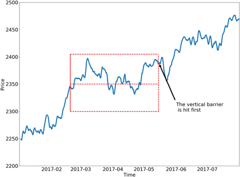
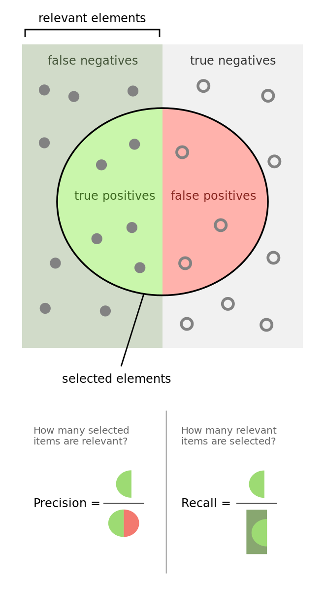

.. _implementations-labeling:

========
Portfolio Optimisation
========

The primary labeling method used in financial academia is the fixed-time horizon method. While ubiquitous, this method has many faults which are remedied by the triple-barrier method discussed below. The triple-barrier method can be extended to incorporate meta-labeling which will also be demonstrated and discussed below.

Hierarchical Risk Parity (HRP)
=====================

The idea behind the triple-barrier method is that we have three barriers: an upper barrier, a lower barrier, and a vertical barrier. The upper barrier represents the threshold an observation's return needs to reach in order to be considered a buying opportunty (a label of 1), the lower barrier represents the threshold an observation's return needs to reach in order to be considered a selling opportunity (a label of -1), and the vertical barrier represents the amount of time an observation has to reach its given return in either direction before it is given a label of 0. This concept can be better understood visually and is shown in the figure below taken from Advances in Financial Machine Learning (`reference`_):

One of the major faults with the fixed-time horizon method is that observations are given a label with respect to a certain threshold after a fixed interval regardless of their respective volatilities. In other words, the expected returns of every observation are treated equally regardless of the associated risk. The triple-barrier method tackles this issue by dynamically setting the upper and lower barriers for each observation based on their given volatilities.

.. _reference: https://www.wiley.com/en-us/Advances+in+Financial+Machine+Learning-p-9781119482086

The Critical Line Algorithm (CLA)
=============

Advances in Financial Machine Learning, Chapter 3, page 50. Reads:

"Suppose that you have a model for setting the side of the bet (long or short). You just need to learn the size of that bet, which includes the possibility of no bet at all (zero size). This is a situation that practitioners face regularly. We often know whether we want to buy or sell a product, and the only remaining question is how much money we should risk in such a bet. We do not want the ML algorithm to learn the side, just to tell us what is the appropriate size. At this point, it probably does not surprise you to hear that no book or paper has so far discussed this common problem. Thankfully, that misery ends here.""

I call this problem meta-labeling because we want to build a secondary ML model that learns how to use a primary exogenous model.

The ML algorithm will be trained to decide whether to take the bet or pass, a purely binary prediction. When the predicted label is 1, we can use the probability of this secondary prediction to derive the size of the bet, where the side (sign) of the position has been set by the primary model.

Mean-Variance Optimisation
~~~~~~~~~~~~~~~~~~~~~~~~

Binary classification problems present a trade-off between type-I errors (false positives) and type-II errors (false negatives). In general, increasing the true positive rate of a binary classifier will tend to increase its false positive rate. The receiver operating characteristic (ROC) curve of a binary classifier measures the cost of increasing the true positive rate, in terms of accepting higher false positive rates.

The image illustrates the so-called “confusion matrix.” On a set of observations, there are items that exhibit a condition (positives, left rectangle), and items that do not exhibit a condition (negative, right rectangle). A binary classifier predicts that some items exhibit the condition (ellipse), where the TP area contains the true positives and the TN area contains the true negatives. This leads to two kinds of errors: false positives (FP) and false negatives (FN). “Precision” is the ratio between the TP area and the area in the ellipse. “Recall” is the ratio between the TP area and the area in the left rectangle. This notion of recall (aka true positive rate) is in the context of classification problems, the analogous to “power” in the context of hypothesis testing. “Accuracy” is the sum of the TP and TN areas divided by the overall set of items (square). In general, decreasing the FP area comes at a cost of increasing the FN area, because higher precision typically means fewer calls, hence lower recall. Still, there is some combination of precision and recall that maximizes the overall efficiency of the classifier. The F1-score measures the efficiency of a classifier as the harmonic average between precision and recall.

**Meta-labeling is particularly helpful when you want to achieve higher F1-scores**. First, we build a model that achieves high recall, even if the precision is not particularly high. Second, we correct for the low precision by applying meta-labeling to the positives predicted by the primary model.

Meta-labeling will increase your F1-score by filtering out the false positives, where the majority of positives have already been identified by the primary model. Stated differently, the role of the secondary ML algorithm is to determine whether a positive from the primary (exogenous) model is true or false. It is not its purpose to come up with a betting opportunity. Its purpose is to determine whether we should act or pass on the opportunity that has been presented.

Meta-labeling is a very powerful tool to have in your arsenal, for four additional reasons. **First**, ML algorithms are often criticized as black boxes. Meta-labeling allows you to build an ML system on top of a white box (like a fundamental model founded on economic theory). This ability to transform a fundamental model into an ML model should make meta-labeling particularly useful to “quantamental” firms. **Second**, the effects of overfitting are limited when you apply metalabeling, because ML will not decide the side of your bet, only the size. **Third**, by decoupling the side prediction from the size prediction, meta-labeling enables sophisticated strategy structures. For instance, consider that the features driving a rally may differ from the features driving a sell-off. In that case, you may want to develop an ML strategy exclusively for long positions, based on the buy recommendations of a primary model, and an ML strategy exclusively for short positions, based on the sell recommendations of an entirely different primary model. **Fourth**, achieving high accuracy on small bets and low accuracy on large bets will ruin you. As important as identifying good opportunities is to size them properly, so it makes sense to develop an ML algorithm solely focused on getting that critical decision (sizing) right. We will retake this fourth point in Chapter 10. In my experience, meta-labeling ML models can deliver more robust and reliable outcomes than standard labeling models.

Example
=======

Suppose we use a mean reverting strategy as our primary model, giving each observation a label of 1 or -1.
We can then use meta-labeling to act as a filter for the bets of our primary model.

::

	import mlfinlab as ml
	import numpy as np
	import pandas as pd

::

	# Read in data
	data = pd.read_csv('FILE_PATH')

Assuming we have a pandas series with the timestamps of our observations and their respective labels given by the primary model, the process to generate meta-labels goes as follows.

::

	# Compute daily volatility
	daily_vol = ml.util.get_daily_vol(close=data['close'], lookback=50)

	# Apply Symmetric CUSUM Filter and get timestamps for events
	# Note: Only the CUSUM filter needs a point estimate for volatility
	cusum_events = ml.filters.cusum_filter(data['close'],
        threshold=daily_vol['2011-09-01':'2018-01-01'].mean()*0.5)

	# Compute vertical barrier
	vertical_barriers = ml.labeling.add_vertical_barrier(t_events=cusum_events,
        close=data['close'], num_days=1)

Once we have computed our daily volatility along with our vertical time barriers and have downsampled our series using the CUSUM filter, we can use the triple-barrier method to compute our meta-labels by passing in the side predicted by the primary model.

::

	pt_sl = [1, 2]
	min_ret = 0.005
	triple_barrier_events = ml.labeling.get_events(close=data['close'],
                                               t_events=cusum_events,
                                               pt_sl=pt_sl,
                                               target=daily_vol,
                                               min_ret=min_ret,
                                               num_threads=3,
                                               vertical_barrier_times=vertical_barriers,
                                               side_prediction=data['side'])

As can be seen above, we have scaled our lower barrier and set our minimum return to 0.005.

Meta-labels can then be computed using the time that each observation touched its respective barrier

::

	meta_labels = ml.labeling.get_bins(triple_barrier_events, data['close'])

This example ends with creating the meta-labels. To see a further explanation of using these labels in a secondary model to help filter out false positives, see the research notebooks below.

Research Notebooks
==================

The following research notebooks can be used to better understand the triple-barrier method and meta-labeling

Triple-Barrier Method
~~~~~~~~~~~~~~~~~~~~~

* `Trend Follow Question`_
* `Bollinger band Question`_

.. _Trend Follow Question: https://github.com/hudson-and-thames/research/blob/master/Chapter3/2019-03-06_JJ_Trend-Follow-Question.ipynb
.. _Bollinger Band Question: https://github.com/hudson-and-thames/research/blob/master/Chapter3/2019-03-09_AS_BBand-Question.ipynb

Meta-Labeling
~~~~~~~~~~~~~~

* `Meta Labeling MNIST`_

.. _Meta Labeling MNIST: https://github.com/hudson-and-thames/research/blob/master/Chapter3/2019-03-06_JJ_Meta-Labels-MNIST.ipynb

