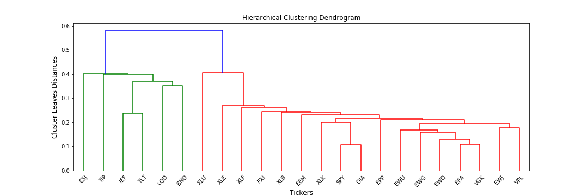
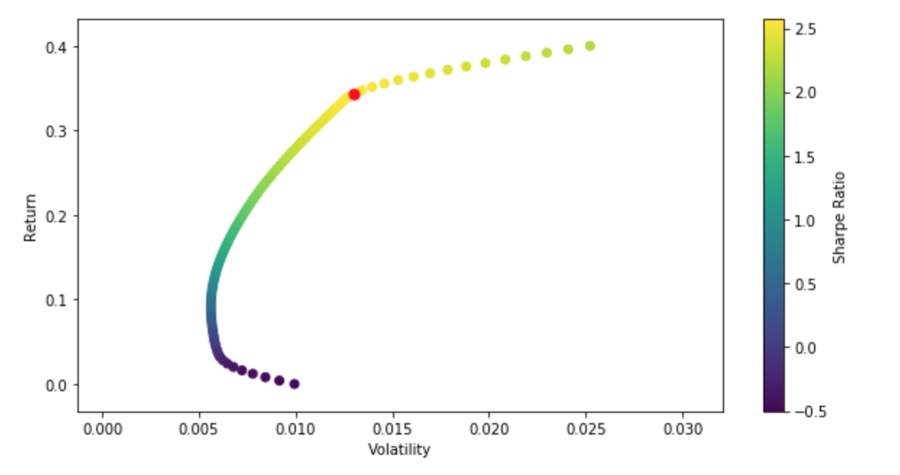

.. _implementations-portfolio_optimisation:

======================
Portfolio Optimisation
======================

The portfolio optimisation module contains different algorithms that are used for asset allocation and optimising strategies. Each
algorithm is encapsulated in its own class and has a public method called ``allocate()`` which calculates the weight allocations
on the specific user data. This way, each implementation can be called in the same way and makes it simple for users to use them.
Next up, lets discuss about some of these implementations and the different parameters they require.

Hierarchical Risk Parity (HRP)
==============================

Hierarchical Risk Parity is a novel portfolio optimisation method developed by
Marcos Lopez de Prado. The working of the algorithm can be broken down into 3 steps:

1. Based on the expected returns of the assets, they are segregated into clusters via hierarchical
   tree clustering.
2. Based on these clusters, the covariance matrix of the returns is diagonalised in a quasi manner such that assets
   within the same cluster are regrouped together.
3. Finally, the weights are assigned to each cluster in a recursive manner. At each node, the weights are broken
   down into the sub-cluster until all the individual assets are assigned a unique weight.

Although, it is a simple algorithm, HRP has been found to be very stable as compared to its older counterparts.
This is because, HRP does not involve taking inverse of the covariance matrix matrix which makes it robust to small changes
in the covariances of the asset returns.

.. note::
    * For a detailed explanation of how HRP works, we have written an excellent `blog post <https://hudsonthames.org/an-introduction-to-the-hierarchical-risk-parity-algorithm/>`_ about it.
    * HRP uses the single-linkage clustering algorithm. (See the tip under the HCAA algorithm for more details.)

Implementation
~~~~~~~~~~~~~~

.. automodule:: mlfinlab.portfolio_optimization.hrp

    .. autoclass:: HierarchicalRiskParity
        :members:

        .. automethod:: __init__

Hierarchical Clustering Asset Allocation (HCAA)
===============================================

The Hierarchical Risk Parity algorithm focuses on allocation of risk using a hierarchical clustering approach and using the
variance of the clusters to allocate weights. While variance is a very simple and popular representation of risk used in the
investing world, it is not the optimal one and can underestimate the true risk of a portfolio which is why there are many other
important risk metrics used by investment managers that can correctly reflect the true risk of a portfolio/asset. With respect to
this, the original HRP algorithm can be tweaked to allocate its weights based on different risk representations of the clusters
and generate better weights. This class implements an improved hierarchical clustering algorithm which gives the option of using
the following metrics:

1. ``minimum_variance`` : Variance of the clusters is used as a risk metric.
2. ``minimum_standard_deviation`` : Standard deviation of the clusters is used as a risk metric.
3. ``sharpe_ratio`` : Sharpe ratio of the clusters is used as a risk metric.
4. ``equal_weighting`` : All clusters are weighed equally in terms of risk.
5. ``expected_shortfall`` : Expected shortfall (CVaR) of the clusters is used as a risk metric.
6. ``conditional_drawdown_at_risk`` : Conditional drawdown at risk (CDaR) of the clusters is used as a risk metric.

Implementation
~~~~~~~~~~~~~~

.. automodule:: mlfinlab.portfolio_optimization.hcaa

    .. autoclass:: HierarchicalClusteringAssetAllocation
        :members:

        .. automethod:: __init__

.. tip::
    **What are the differences between the 3 Linkage Algorithms?**

    The following is taken directly from and we highly recommend you read:

    `Papenbrock, J., 2011. Asset Clusters and Asset Networks in Financial Risk Management and Portfolio Optimization (Doctoral
    dissertation, Karlsruher Institut für Technologie (KIT)). <https://d-nb.info/1108447864/34>`_

    **1. Single-Linkage**

    The idea behind single-linkage is to form groups of elements, which have the smallest distance to each other (nearest
    neighbouring clustering). This oftentimes leads to large groups/chaining.

    The single-link algorithm oftentimes forms clusters that are chained together and leaves large clusters. It can probably
    be best understood as a way to give a "more robust" estimation of the distance matrix and furthermore preserves the original
    structure as much as possible. Elements departing early from the tree can be interpreted as "different" from the overall dataset.
    In terms of application, the single-link clustering algorithm is very useful to gain insights in the correlation structure
    between assets and separates assets that were very different from the rest. If this separation is preferred and high weights
    should be put on "outliers" the single link certainly is a good choice.

    **2. Complete-Linkage**

    The complete-linkage algorithm tries to avoid those large groups by considering the largest distances between elements.
    It is thus called the farthest neighbour clustering.

    The complete-link algorithm has a different idea: elements should be grouped together in a way that they are not too
    different from each other when merged in a cluster. It thus has a much stronger definition of "similar pair of clusters".
    The complete-link algorithm therefore seems suitable for investors interested in grouping stocks that are similar in one cluster.

    **3. Average-Linkage**

    The average-linkage algorithm is a compromise between the single-linkage and complete-linkage algorithm.

The Critical Line Algorithm (CLA)
=================================

This is a robust alternative to the quadratic optimisation used to find mean-variance optimal portfolios. The major difference
between classic Mean-Variance and CLA is the type of optimisation problem solved. A typical mean-variance optimisation problem
looks something like this:

        :math:`\underset{w}{\text{minimise}} ~ \left\{w^T \Sigma w \right\}`

where, :math:`\sum_{i}w_{i} = 1` and :math:`0 <= w <= 1`. CLA also solves the same problem but with some added constraints - each weight of an asset in the portfolio can have different lower and upper bounds. The optimisation objective still remains the same but the second constraint changes to - :math:`l_{i} <= w_{i} <= u_{i}`. Each weight in the allocation has an upper and a lower bound, which increases the number of constraints to be solved.

The current CLA implementation in the package supports the following solution strings:

1. ``cla_turning_points`` : Calculates the set of CLA turning points. These are the original solution weights calculated the CLA algorithm.
2. ``max_sharpe`` : Calculates the weights relating to the maximum Sharpe Ratio portfolio.
3. ``min_volatility`` : Calculates the weights relating to Minimum Variance portfolio.
4. ``efficient_frontier`` : Calculates all weights in the efficient frontier(also includes the CLA turning points).

Implementation
~~~~~~~~~~~~~~

.. automodule:: mlfinlab.portfolio_optimization.cla

    .. autoclass:: CLA
        :members:

        .. automethod:: __init__

Mean-Variance Optimisation
==========================

This class contains some classic Mean-Variance optimisation techniques based on Harry Markowitz's methods. We use `cvxopt <https://cvxopt.org/>`_ as our quadratic optimiser instead of the more frequently used `scipy.optimize <https://docs.scipy.org/doc/scipy/reference/optimize.html>`_. This was a design choice for two reasons: (a) the documentation of cvxopt is better than that of scipy and (b) cvxopt's code is much more readable and easier to understand.

Currently, the following solution strings are supported by MVO class:

1. ``inverse_variance`` : Calculates the weights according to simple inverse-variance allocation.
2. ``max_sharpe`` : Calculates the weights relating to the maximum Sharpe Ratio portfolio. Users can specify the risk free return value through the :py:mod:`risk_free_rate` parameter.
3. ``min_volatility`` : Calculates the weights relating to Minimum Variance portfolio.
4. ``efficient_risk`` : Calculates an efficient risk portfolio for a specified target return. Users can specify their target return value through the :py:mod:`target_return` parameter.

.. tip::

    Note that users can also specify upper and lower bounds for asset weights:

    - Either a single upper and lower bound value can be applied for to all the asset weights in which case a single tuple needs to be passed: (:math:`low`, :math:`high`). By default a bound of (0, 1) is applied.

    - If individual bounds are required, then a dictionary needs to be passed with the key being the asset index and the value being the tuple of lower and higher bound values. Something like this: :math:`{ asset\_index : (low_i, high_i) }`

Implementation
~~~~~~~~~~~~~~

.. automodule:: mlfinlab.portfolio_optimization.mean_variance

    .. autoclass:: MeanVarianceOptimisation
        :members:

        .. automethod:: __init__

Risk Metrics
============

The RiskMetrics class contains functions for calculation of common risk metrics used by investment professionals. With time, we
will keep adding new metrics. For now, it supports the following risk calculations:

1. ``Variance``
2. ``Value at Risk (VaR)``
3. ``Expected Shortfall (CVaR)``
4. ``Conditional Drawdown at Risk (CDaR)``

Implementation
~~~~~~~~~~~~~~

.. automodule:: mlfinlab.portfolio_optimization.risk_metrics

    .. autoclass:: RiskMetrics
        :members:

        .. automethod:: __init__

Estimation of Returns
=====================

Accurate estimation of historical asset returns is one of the most important aspects of portfolio optimisation. At the same, it is
also one of the most difficult to calculate since most of the times, estimated returns do not correctly reflect the true underlying
returns of a portfolio/asset. Given this, there is still significant research work being published dealing with novel methods to
estimate returns and we wanted to share some of these methods with the users of mlfinlab.

This class provides functions to estimate mean asset returns. Currently, it is still in active development and we
will keep adding new methods to it.

Implementation
~~~~~~~~~~~~~~

.. automodule:: mlfinlab.portfolio_optimization.returns_estimators

    .. autoclass:: ReturnsEstimation
        :members:

        .. automethod:: __init__

Examples
========

In this section, we provide some code snippets for new users to get started with the portfolio optimisation module.

Importing the Classes
~~~~~~~~~~~~~~~~~~~~~

::

	from mlfinlab.portfolio_optimization.cla import CLA
	from mlfinlab.portfolio_optimization.hrp import HierarchicalRiskParity
	from mlfinlab.portfolio_optimization.mean_variance import MeanVarianceOptimisation
	import numpy as np
	import pandas as pd

Reading Data
~~~~~~~~~~~~~

It is fairly straightforward to read the data using pandas and pass it to the public methods. Here, we read a csv file of historical stock prices.
::

	# Read in data
	stock_prices = pd.read_csv('FILE_PATH', parse_dates=True, index_col='Date') # The date column may be named differently for your input.

.. note::

    We provide great flexibility to the users in terms of the input data - either they can pass raw historical stock prices as the parameter :py:mod:`asset_prices` in which case the expected returns and covariance matrix will be calculated using this data. Else, they can also pass pre-calculated :py:mod:`expected_returns` and :py:mod:`covariance_matrix`. For specific input types, please look at the doc-strings.

Allocating the Weights
~~~~~~~~~~~~~~~~~~~~~~

::

	# Compute HRP weights
	hrp = HierarchicalRiskParity()
	hrp.allocate(asset_names=stock_prices.columns, asset_prices=stock_prices, resample_by='B')
	hrp_weights = hrp.weights.sort_values(by=0, ascending=False, axis=1)

	# Compute IVP weights
	mvo = MeanVarianceOptimisation()
	mvo.allocate(asset_names=stock_prices.columns, asset_prices=stock_prices, solution='inverse_variance', resample_by='B
	ivp_weights = mvo.weights.sort_values(by=0, ascending=False, axis=1)

For HRP and IVP, you can access the computed weights as shown above. They are in the form of a dataframe and we can sort them in descending order of their weights.

::

    # Compute different solutions using CLA
    cla = CLA()

    # Turning Points
    cla.allocate(asset_names=stock_prices.columns, asset_prices=stock_prices solution='cla_turning_points')
    cla_weights = cla.weights.sort_values(by=0, ascending=False, axis=1) # Gives a dataframe with each row as a solution (turning_points)

    # Maximum Sharpe Solution
    cla.allocate(asset_names=stock_prices.columns, asset_prices=stock_prices, solution='max_sharpe')
    cla_weights = cla.weights.sort_values(by=0, ascending=False, axis=1) # Single set of weights for the max-sharpe portfolio
    max_sharpe_value = cla.max_sharpe # Accessing the max sharpe value

    # Minimum Variance Solution
    cla.allocate(asset_names=stock_prices.columns, asset_prices=stock_prices, solution='min_volatility')
    cla_weights = cla.weights.sort_values(by=0, ascending=False, axis=1) # Single set of weights for the min-variance portfolio
    min_variance_value = cla.min_var # Accessing the min-variance value

    # Efficient Frontier Solution
    cla.allocate(asset_names=stock_prices.columns, asset_prices=stock_prices, solution='efficient_frontier')
    cla_weights = cla.weights
    means, sigma = cla.efficient_frontier_means, cla.efficient_frontier_sigma

Lets look at the MVO class and its different solutions,

::

    # Compute different mean-variance solutions using MVO
    mvo = MeanVarianceOptimisation()

    # Maximum Sharpe Solution
    mvo.allocate(asset_names=stock_prices.columns, asset_prices=stock_prices, solution='max_sharpe')
    mvo_weights = mvo.weights.sort_values(by=0, ascending=False, axis=1) # Single set of weights for the max-sharpe portfolio

    # Minimum Variance Solution
    mvo.allocate(asset_names=stock_prices.columns, asset_prices=stock_prices, solution='min_volatility')
    mvo_weights = mvo.weights.sort_values(by=0, ascending=False, axis=1) # Single set of weights for the min-variance portfolio

    # Efficient Risk Solution
    mvo.allocate(asset_names=stock_prices.columns, asset_prices=stock_prices, solution='efficient_risk', target_return=0.4)
    mvo_weights = mvo.weights

    # Portfolio Characteristics
    portfolio_return, sharpe_ratio, risk = mvo.portfolio_return, mvo.portfolio_sharpe_ratio, mvo.portfolio_risk

Plotting
~~~~~~~~~~~~~~

There are two plotting functions:

1. ``plot_clusters()`` : Plots the hierarchical clusters formed during the clustering step in HRP. This is visualised in the form of dendrograms - a very common way of visualising the hierarchical tree clusters.

::

    hrp = HierarchicalRiskParity()
    hrp.allocate(asset_names=stock_prices.columns, asset_prices=stock_prices, resample_by='B')
    hrp.plot_clusters(assets=stock_prices.columns)

2. ``plot_efficient_frontier()`` : Plots the efficient frontier. The red dot corresponds to the Maximum Sharpe portfolio.

::

    mvo = MeanVarianceOptimisation()
    mvo.allocate(asset_names=stock_prices.columns, asset_prices=stock_prices, resample_by='B')

    # Assuming there is a stock_returns dataframe
    mvo.plot_efficient_frontier(covariance=stock_returns.cov(),
                                expected_asset_returns=stock_returns.mean()*252,
                                num_assets=len(stock_returns.columns))

Research Notebooks
==================

The following research notebooks can be used to better understand how the algorithms within this module can be used on real stock data.

* `Chapter 16 Exercise Notebook`_

.. _Chapter 16 Exercise Notebook: https://github.com/hudson-and-thames/research/blob/master/Chapter16/Chapter16.ipynb

