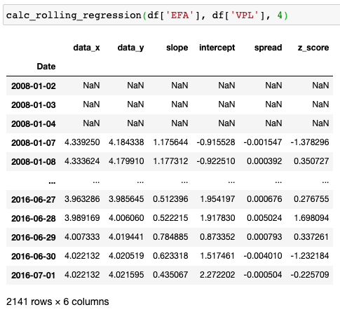

.. _statistical_arbitrage-introduction:
.. note::

    References

    1. `Gatev, E., Goetzmann, W.N. and Rouwenhorst, K.G., 2006. Pairs trading: Performance of a
    relative-value arbitrage rule. The Review of Financial Studies, 19(3), pp.797-827.
    <https://academic.oup.com/rfs/article/19/3/797/1646694>`_

=====================
Statistical Arbitrage
=====================

Statistical Arbitrage exploits the pricing inefficiency between two groups of assets. First
developed and used in the mid-1980s by Nunzio Tartaglia’s quantitative group at Morgan Stanley,
the classical strategy utilizes systematic trading signals and a market-neutral approach to
generate positive returns.

The strategy can be explained in a two-step process. First, two baskets of assets that have
historically moved similarly are identified. Then, the spread between the two is carefully
measured to look for signals of divergence. If the spread becomes wider than the value suggested
by historical data, the trader longs the losing basket and shorts the winning one. As the spread
reverts back to the mean, the positions will gain in value.

Most strategies involving statistical arbitrage can be expressed with the following equation:

.. math::
    \frac{dP_t}{P_t} = \alpha dt + \beta \frac{dQ_t}{Q_t} + dX_t

- :math:`P_t`: Price of the first group of assets.
- :math:`Q_t`: Price of the second group of assets.
- :math:`\alpha`: Drift term. For the most part, we will assume that this value is 0.
- :math:`\beta`: Regression coefficient between the change in returns.
- :math:`X_t`: Cointegration residual.

This can be interpreted as going long 1 unit of :math:`P_t` and short :math:`\beta` unit of
:math:`Q_t` if :math:`X_t` is a significant positive value and vice versa for a significant
negative value of :math:`X_t`. Here we assume that :math:`X_t` is a stationary process with
mean-reverting tendencies. :math:`X_t` will be described much more in detail in the section
that describes the **Ornstein-Uhlenbeck** process.

We can, therefore, interpret statistical arbitrage as a contrarian strategy to harness the
mean-reverting behavior of the pair ratio to exploit the mispricing of the assets.

Pairs Trading
=============

Pairs trading strategy is a specific statistical arbitrage strategy that focuses on two assets.
Instead of trading on a basket of assets, pairs trading focuses on two to harness the pricing
inefficiency caused by the widening spread. Pairs trading strategies can be implemented in three parts.

1. Filter the universe to select a number of pairs. These pairs are two related securities,
which are oftentimes in the same sector/industry and have similar fundamental values.

2. Calculate the spread between the two pairs and test for stationarity and cointegration.

3. If all the tests are satisfied, generate trading signals to long the asset that is underpriced
and short the other.

Filtering
=========

There are multiple ways to filter the initial data. For a pairs trading example, the number of pairs
grows quadratically with :math:`n`. The number of total pairs is:

.. math::
    \frac{n(n-1)}{2}

If we only have 10 assets that we want to test for, the total number of pairs is :math:`\frac{10 * 9}{2} = 45`.
However, once we start scanning for a universe of stocks with over 5000 options, the numbers quickly
add up. Therefore, it is important to have an effective method to test before we start the initial process.
The most commonly used filtering method is the cointegration test. Using the cointegration test, we
can see which pairs of assets pass the threshold to reject the null hypothesis. More information on
**Cointegration** is available two headings below.

Not implemented in the module yet, but options for filtering include:

1. Principal Component Analysis

    - Transforms data matrix to a set of principal components to reduce the dimensions.
    - `Avellaneda, M. and Lee, J.H., 2010. Statistical arbitrage in the US equities market. Quantitative Finance, 10(7), pp.761-782. <https://www.tandfonline.com/doi/pdf/10.1080/14697680903124632>`_

2. Clustering

    - Fundamental values
    - Sector/Industry
    - K-means

3. Heuristics

4. Distance/Correlation Matrix

Stationarity
============

A time series is defined to be stationary if its joint probability distribution is invariant
under translations in time or space. In other words, the mean and variance of the time series
do not change.

It is important to test for the spread for stationarity as statistical arbitrage typically
shows the strongest and most robust results that follow stationarity and cointegration for
the tested pairs.

Augmented Dickey-Fuller Test
****************************

Augmented Dickey-Fuller or the ADF tests the null hypothesis that a unit root is present
in a time series sample. If the time series does have a mean-reverting trend, then the next
price will be proportional to the current. The original Dickey-Fuller test only tested for
lag 1, whereas the augmented version can test for lag up to :math:`p`.

.. math::
	\Delta y_t = \alpha + \beta t + \gamma y_{t-1} + \delta_1 \Delta y_{t-1} + \cdots + \delta_{p-1} \Delta y_{t-p+1} + \epsilon_t

- :math:`\alpha`: constant variable
- :math:`\beta`: coefficient of temporal trend
- :math:`\delta`: change of :math:`y`

For the purpose of this module, we will empirically set :math:`p` to be :math:`1`.

Another important variable to consider is the presence of a trend within the spread. The most
ideal scenario for a statistical arbitrage strategy is one that does not have a trend within
the process. This, however, does not always hold true. An example of a trend stationary is shown
below:

.. image:: statistical_arbitrage_images/stationary.png
   :width: 49 %

.. image:: statistical_arbitrage_images/trend_stationary.png
   :width: 49 %

It is possible to detrend the trend_stationarity and the user can easily do so by setting the regression to
be ``ct`` instead of just ``c``, which is a constant residual.

.. py:currentmodule:: mlfinlab.statistical_arbitrage.stationarity

.. autofunction:: calc_adfuller

Kwiatkowski-Phillips-Schmidt-Shin
*********************************

.. py:currentmodule:: mlfinlab.statistical_arbitrage.stationarity

.. autofunction:: calc_kpss

Phillips-Perron Test
********************

To Be Implemented.

Phillips-Ouliaris Test
**********************

To Be Implemented.

Example Code
************

.. code-block::

    import pandas as pd
    import numpy as np
    from mlfinlab.statistical_arbitrage import calc_engle_granger, calc_johansen

    # Read in data.
    stock_prices = pd.read_csv('FILE_PATH', parse_dates=True, index_col='Date')

    # Change to log prices data.
    stock_prices = np.log(stock_prices)

    # Calculate ADF test on the first column with maxlag of 1.
    adf = calc_adfuller(stock_prices.iloc[:,0], maxlag=1)

    # Calculate KPSS test on the first column with nlags of 1.
    kpss = calc_kpss(stock_prices.iloc[:,0], nlags=1)

Cointegration
=============

Engle-Granger Test
******************

.. py:currentmodule:: mlfinlab.statistical_arbitrage.cointegration

.. autofunction:: calc_engle_granger

Johansen Test
**************

.. py:currentmodule:: mlfinlab.statistical_arbitrage.cointegration

.. autofunction:: calc_johansen

Example Code
************

.. code-block::

    import pandas as pd
    import numpy as np
    from mlfinlab.statistical_arbitrage import calc_engle_granger, calc_johansen

    # Read in data.
    stock_prices = pd.read_csv('FILE_PATH', parse_dates=True, index_col='Date')

    # Change to log prices data.
    stock_prices = np.log(stock_prices)

    # Calculate engle granger test with second and third column .
    engle_granger = calc_engle_granger(stock_prices.iloc[:, 2], stock_prices.iloc[:, 3])

    # Calculate johansen test with the first two columns, constant trend, and lag of 1.
    johansen = calc_johansen(stock_prices.iloc[:, 0:2], 0, 1)

Regression
==========

Pairs Trading
*************

There are currently two tools available for a pairs trading strategy. One calculates a rolling
z-score and regression over the given data, and the other calculates the z-score and regression
over the entire data. The first method removes data snooping bias and allows the user to backtest
and trade with the available information on that day; however, if the user wants to test for the
entire horizon, they can use the second method to calculate the scores for the entire time frame.

Rolling Regression
******************

.. py:currentmodule:: mlfinlab.statistical_arbitrage.regression

.. autofunction:: calc_rolling_regression

All Regression
**************

.. py:currentmodule:: mlfinlab.statistical_arbitrage.regression

.. autofunction:: calc_all_regression

.. image:: statistical_arbitrage_images/all_regression.png
   :width: 49 %

Example Code
************

.. code-block::

    import pandas as pd
    import numpy as np
    from mlfinlab.statistical_arbitrage import calc_rolling_regression, calc_all_regression

    # Read in data.
    stock_prices = pd.read_csv('FILE_PATH', parse_dates=True, index_col='Date')

    # Change to log prices data.
    stock_prices = np.log(stock_prices)

    # Calculate rolling regression with second and third column and window of 6.
    roll_reg = calc_rolling_regression(stock_prices.iloc[:, 2], stock_prices.iloc[:, 3], window=6)

    # Calculate all regression with fifth and sixth column.
    all_reg = calc_all_regression(stock_prices.iloc[:, 5], stock_prices.iloc[:, 6])

Trading Strategy
================

There are many methods to implement statistical arbitrage, and thorough investigation for each
procedure is needed before applying these tools to a real live trading environment.

Kalman Filtering
****************

To Be Implemented.

Ornstein-Uhlenbeck Process
**************************

.. note::
    `Bertram, W.K., 2010. Analytic solutions for optimal statistical arbitrage trading. Physica A: Statistical mechanics and its applications, 389(11), pp.2234-2243.
    <http://www.stagirit.org/sites/default/files/articles/a_0340_ssrn-id1505073.pdf>`_

The Ornstein-Uhlenbeck process is a stochastic mean-reverting process with the following equation:

.. math::
    dX_t = \kappa(\mu − X_t)dt + \sigma dW_t

- :math:`X_t`: Residual from the spread.
- :math:`\kappa`: Rate of mean reversion.
- :math:`\mu`: Mean of the process.
- :math:`\sigma` Variance or volatility of the process.
- :math:`W_t`: Wiener process or Brownian motion.

This can be changed into an AR(1) model with the following properties:

.. math::
    X_{n+1} = a + b X_n + \zeta_{n+1}

- :math:`b = e^{-\kappa \Delta_t}`
- :math:`a = \mu(1 - b)`
- :math:`var(\zeta) = \sigma^2 \frac{1 - b^2}{2 \kappa}`

We will primarily use the OU-process to generate trading signals for statistical arbitrage.
The trading signals will be defined as:

.. math::
    s = X_t - \frac{E(X_t)}{var(X_t)} = \frac{\mu\sqrt{2\kappa}}{\sigma}

Hurst Exponent
**************

To Be Implemented.

Optimal Trading Rules
*********************

To Be Implemented.

Optimal Portfolio Allocation
****************************

To Be Implemented.
