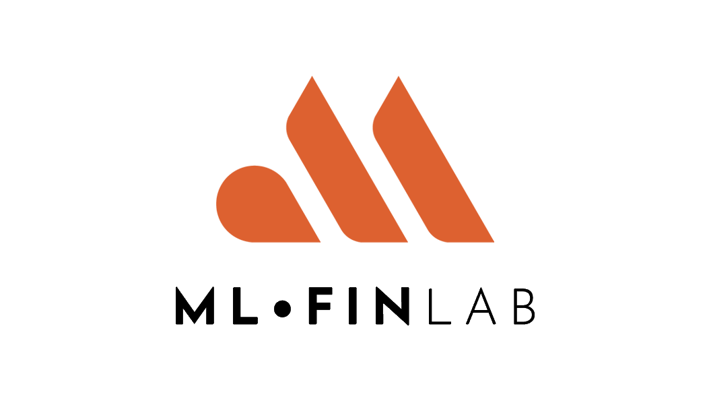

|

================================================
Machine Learning Financial Laboratory (mlfinlab)
================================================

MlFinlab is a python package which helps portfolio managers and traders who want to leverage the power of machine learning
by providing reproducible, interpretable, and easy to use tools.

Adding MlFinLab to your companies pipeline is like adding a department of PhD researchers to your team.

.. code-block::

   pip install mlfinlab

We source all of our implementations from the most elite and peer-reviewed journals. Including publications from:

1. `The Journal of Financial Data Science <https://jfds.pm-research.com/>`_
2. `The Journal of Portfolio Management <https://jpm.pm-research.com/>`_
3. `The Journal of Algorithmic Finance <http://www.algorithmicfinance.org/>`_
4. `Cambridge University Press <https://www.cambridge.org/>`_

Documentation & Tutorials
#########################

We lower barriers to entry for all users by providing extensive `documentation <https://hudson-and-thames-mlfinlab-premium.readthedocs-hosted.com/en/latest/>`_
and `tutorial notebooks <https://github.com/Hudson-and-Thames-Clients/research>`_, with code examples.

Who is Hudson & Thames?
#######################

Hudson and Thames Quantitative Research is a company with a focus on implementing the most cutting edge algorithms in
quantitative finance. We productionalize all our tools in the form of libraries and provide capability to our clients.

* `Website <https://hudsonthames.org/>`_
* `Github Group <https://github.com/hudson-and-thames>`_
* `MlFinLab Documentation <https://mlfinlab.readthedocs.io/en/latest/>`_

Contact us
##########

The best place to contact the team is via the Slack channel. Alternatively you can email us at: research@hudsonthames.org.

Looking forward to hearing from you!

License
#######

This project is licensed under an all rights reserved licence and is NOT open-source, and may not be used for commercial purposes without a commercial license which may be purchased from Hudson and Thames Quantitative Research.

`LICENSE.txt <https://github.com/hudson-and-thames/mlfinlab/blob/master/LICENSE.txt>`_ file for details.

.. toctree::
    :maxdepth: 2
    :caption: Legal
    :hidden:

    additional_information/license
    additional_information/analytics
    additional_information/privacy_gdpr
