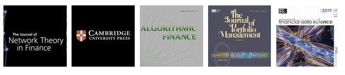
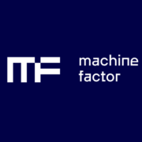

.. image:: logo/ht_logo.png
   :scale: 15 %
   :align: center
   :target: https://hudsonthames.org/

|

================================================
Machine Learning Financial Laboratory (mlfinlab)
================================================

    |PyPi| |Python| |Build Status| |codecov| |pylint Score|

    .. |Build Status| image:: https://travis-ci.com/hudson-and-thames/mlfinlab.svg?branch=master
        :target: https://travis-ci.com/hudson-and-thames/mlfinlab

    .. |codecov| image:: https://codecov.io/gh/hudson-and-thames/mlfinlab/branch/master/graph/badge.svg
        :target: https://codecov.io/gh/hudson-and-thames/mlfinlab

    .. |pylint Score| image:: https://mperlet.github.io/pybadge/badges/10.svg

    |Downloads|

    .. |PyPi| image:: https://img.shields.io/pypi/v/mlfinlab.svg
        :target: https://pypi.org/project/mlfinlab/

    .. |Downloads| image:: https://img.shields.io/pypi/dm/mlfinlab.svg
        :target: https://pypi.org/project/mlfinlab/

    .. |Python| image:: https://img.shields.io/pypi/pyversions/mlfinlab.svg
        :target: https://pypi.org/project/mlfinlab/

MlFinlab is a python package which helps portfolio managers and traders who want to leverage the power of machine learning
by providing reproducible, interpretable, and easy to use tools. Adding MlFinLab to your companies pipeline is like adding
a department of PhD researchers to your team.

.. code-block::

   pip install mlfinlab

We source all of our implementations from the most elite and peer-reviewed journals. Including publications from:

1. `The Journal of Financial Data Science <https://jfds.pm-research.com/>`_
2. `The Journal of Portfolio Management <https://jpm.pm-research.com/>`_
3. `The Journal of Algorithmic Finance <http://www.algorithmicfinance.org/>`_
4. `Cambridge University Press <https://www.cambridge.org/>`_

We are making a big drive to include techniques from various authors, however the most dominant author would be Dr. Marcos
Lopez de Prado (`QuantResearch.org <http://www.quantresearch.org/>`_). This package has its foundations in the two graduate
level textbooks:

1. `Advances in Financial Machine Learning <https://www.amazon.co.uk/Advances-Financial-Machine-Learning-Marcos/dp/1119482089>`_
2. `Machine Learning for Asset Managers <https://www.cambridge.org/core/books/machine-learning-for-asset-managers/6D9211305EA2E425D33A9F38D0AE3545>`_

Unlocking the Commons
#####################

We are currently running a sponsorship model of “Unlocking the Commmons”. Our code base, online documentation,
tutorial notebooks and presentations will remain open to everyone for so long as we can meet our minimum sponsorship
goals. We have set the **deadline: December 2020** - for a monthly total patronage of $4000 USD.

`Nadia Eghbal <https://github.com/nayafia/lemonade-stand>`_ explains it well: “If you'd like to open source a project
but want to ensure that others will invest in its long-term maintenance, you could tell your community that you'll
open-source the project once you've hit a certain amount of sponsorship. (Writer Tim Carmody refers to this as
"unlocking the commons.")”

`Become a Patron and keep MlFinLab Open! <https://www.patreon.com/HudsonThames>`_

Documentation & Tutorials
#########################

We lower barriers to entry for all users by providing extensive `documentation <https://mlfinlab.readthedocs.io/en/latest/>`_
and `tutorial notebooks <https://github.com/hudson-and-thames/research>`_, with code examples.

Who is Hudson & Thames?
#######################

We are a private research group focused on implementing research based financial machine learning. We all work in
virtual teams, spread across the world, primarily: New York, London, and Kyiv.

* `Website <https://hudsonthames.org/>`_
* `Github Group <https://github.com/hudson-and-thames>`_
* `Project Boards <https://github.com/orgs/hudson-and-thames/projects>`_
* `Documentation <https://mlfinlab.readthedocs.io/en/latest/>`_

Sponsors and Donating
#####################

A special thank you to our sponsors! If you would like to become a sponsor and help support our research, please sign
up on `Patreon <https://www.patreon.com/HudsonThames>`_

Benefits include:

1. Uninterrupted access: Should the code base pivot to closed source - your company will have access to all
   implementations and the source code.
2. A seat on the Hudson & Thames advisory council and votes towards the direction of research and implementations.
3. Ongoing access to slide show presentations and Jupyter Notebooks. (files can be edited to suit your personal
   needs such as classroom notes or client presentations.)
4. Company / Organisation profile on `www.hudsonthames.org <https://hudsonthames.org/sponsors/>`_
5. Use of Hudson & Thames sponsor badge on your website.
6. Access to our communities Slack Channel.
7. Subscription to project release updates and news.

Platinum Sponsor:
*****************

   `Machine Factor Technologies`_

Gold Sponsors:
**************

   `E.P. Chan & Associates`_ &  `Markov Capital`_

Contact us
##########

We host a booming community of like minded data scientists and quants, join the
`Slack Channel <https://www.patreon.com/HudsonThames>`_ now! Open to sponsors of our package.

The channel has the following benefits:

* Community of like minded individuals.
* Ask questions about the package implementations and get community feedback.
* Occasional presentations on topics within financial machine learning.
* A papers channel where we share the papers which are freely available.
* Access to members of our research group.

Looking forward to hearing from you!

Early Adopters:
###############

+-----------------------+------------------------+-----------------------+------------------------+
| `John B. Keown`_      | `Roberto Spadim`_      | `Zack Gow`_           | Alex Zivkovic          |
+-----------------------+------------------------+-----------------------+------------------------+
| `Jack Yu`_            |  Егор Тарасенок        | `Joseph Matthew`_     | `Aman Dhaliwal`_       |
+-----------------------+------------------------+-----------------------+------------------------+
| Justin Gerard         |  Jason Young           | `Shaun McDonogh`_     | Austin Hubbell         |
+-----------------------+------------------------+-----------------------+------------------------+
| `Christian Beckmann`_ |  Jeffrey Wang          | `Eugene Tartakovsky`_ | `Ben Zhang`_           |
+-----------------------+------------------------+-----------------------+------------------------+
| `Ming Wu`_            | `Richard Scheiwe`_     |  `Tianfang Wu`_       | `Brian Christopher`_   |
+-----------------------+------------------------+-----------------------+------------------------+
| `Eric Detterman`_     | Eric Huang             | Gunther Schulz        | Geoff Foster           |
+-----------------------+------------------------+-----------------------+------------------------+
| Golam Sakline         | `Ilya Pikulin`_        | Isabel Gonzalez       | Jason Harris           |
+-----------------------+------------------------+-----------------------+------------------------+
| Joshua Cortez         | `Kofi Glover`_         | Kristian Schmidt      | Lucas Astorian         |
+-----------------------+------------------------+-----------------------+------------------------+
| Luque Li              | `Mikhail Shishlenin`_  | Minsu Yeom            | `Mislav Sagovac`_      |
+-----------------------+------------------------+-----------------------+------------------------+
| Paul Morgen           | `Rino Hilman`_         | `Ruifan Pei`_         | `Shawn Unger`_         |
+-----------------------+------------------------+-----------------------+------------------------+
| Bramantyo Erlangga    | `Sritanu Chakraborty`_ | Stephen Caraher       | Swaminathan Sethuraman |
+-----------------------+------------------------+-----------------------+------------------------+
| Thiago Matos          | Thyme Sage             | Tom Celig             | `Tom Parnell`_         |
+-----------------------+------------------------+-----------------------+------------------------+
| William Thompkins     |                        |                       |                        |
+-----------------------+------------------------+-----------------------+------------------------+

.. _`Machine Factor Technologies`: https://machinefactor.tech/
.. _`E.P. Chan & Associates`: https://www.epchan.com/
.. _`Markov Capital`: http://www.markovcapital.se/
.. _`John B. Keown`: https://www.linkedin.com/in/john-keown-quantitative-finance-big-data-ml/
.. _`Roberto Spadim`: https://www.linkedin.com/in/roberto-spadim/
.. _`Zack Gow`: https://www.linkedin.com/in/zackgow/
.. _`Jack Yu`: https://www.linkedin.com/in/jihao-yu/
.. _`Christian Beckmann`: https://www.linkedin.com/in/christian-beckmann/
.. _`Eugene Tartakovsky`: https://www.linkedin.com/in/etartakovsky/
.. _`Ming Wu`: https://www.linkedin.com/in/ming-yue-wu/
.. _`Richard Scheiwe`: https://www.linkedin.com/in/richardscheiwe/
.. _`Shaun McDonogh`: https://www.linkedin.com/in/shaunmcdonogh/
.. _`Tianfang Wu`: https://www.linkedin.com/in/tianfangwu/
.. _`Ilya Pikulin`: https://www.linkedin.com/in/ilyapikulin/
.. _`Tom Parnell`: https://www.linkedin.com/in/thomas-parnell-7233a234/
.. _`Rino Hilman`: https://www.linkedin.com/in/rino-hilman-854a89181/
.. _`Joseph Matthew`: https://www.linkedin.com/in/jmatthew/
.. _`Aman Dhaliwal`: https://www.linkedin.com/in/amandhaliwal44/
.. _`Ben Zhang`: https://www.linkedin.com/in/haozhang777/
.. _`Brian Christopher`: https://www.linkedin.com/in/bcrblackarbs/
.. _`Eric Detterman`: https://www.linkedin.com/in/ericdetterman/
.. _`Mislav Sagovac`: https://www.linkedin.com/in/mislav-%C5%A1agovac-a72a6044
.. _`Mikhail Shishlenin`: https://www.linkedin.com/in/mikhail-shishlenin/
.. _`Shawn Unger`: https://www.linkedin.com/in/shawnunger1/
.. _`Ruifan Pei`: https://www.linkedin.com/in/ruifan-pei-b994b177/
.. _`Sritanu Chakraborty`: https://www.linkedin.com/in/sritanuchakraborty/
.. _`Kofi Glove`: https://www.linkedin.com/in/kofiglover/

License
#######

This project is licensed under an all rights reserved licence.

`LICENSE.txt <https://github.com/hudson-and-thames/mlfinlab/blob/master/LICENSE.txt>`_ file for details.

.. toctree::
    :maxdepth: 2
    :caption: Getting Started
    :hidden:

    getting_started/installation
    additional_information/contact
    getting_started/barriers_to_entry
    getting_started/researcher
    getting_started/datasets

.. toctree::
    :maxdepth: 2
    :caption: Feature Engineering
    :hidden:

    implementations/data_structures
    implementations/filters
    implementations/codependence
    implementations/frac_diff
    implementations/structural_breaks
    implementations/microstructural_features

.. toctree::
    :maxdepth: 2
    :caption: Labelling
    :hidden:

    implementations/tb_meta_labeling
    implementations/labeling_trend_scanning
    implementations/labeling_tail_sets

.. toctree::
    :maxdepth: 2
    :caption: Modelling
    :hidden:

    implementations/sampling
    implementations/sb_bagging
    implementations/feature_importance
    implementations/cross_validation
    implementations/EF3M
    implementations/bet_sizing

.. toctree::
    :maxdepth: 2
    :caption: Clustering
    :hidden:

    implementations/onc
    implementations/feature_clusters

.. toctree::
    :maxdepth: 2
    :caption: Backtest Overfitting
    :hidden:

    implementations/backtesting
    implementations/backtest_statistics

.. toctree::
    :maxdepth: 2
    :caption: Portfolio Optimization
    :hidden:

    portfolio_optimisation/risk_metrics
    portfolio_optimisation/returns_estimation
    portfolio_optimisation/risk_estimators
    portfolio_optimisation/mean_variance
    portfolio_optimisation/critical_line_algorithm
    portfolio_optimisation/hierarchical_risk_parity
    portfolio_optimisation/hierarchical_clustering_asset_allocation
    portfolio_optimisation/nested_clustered_optimisation
    portfolio_optimisation/theory_implied_correlation

.. toctree::
    :maxdepth: 2
    :caption: Additional Information
    :hidden:

    additional_information/contributing
    additional_information/license
