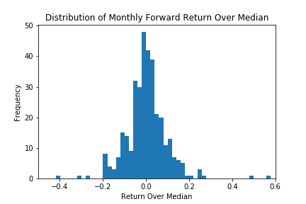

.. _implementations-labeling_excess_median:

==================
Excess Over Median
==================

Labeling according to excess over median is a labeling method used in the following paper `Zhu, M., Philpotts, F. and
Stevenson, M., 2012. The benefits of tree-based models for stock selection.
Journal of Asset Management, 13(6), pp.437-448. <https://link.springer.com/article/10.1057/jam.2012.17>`_

In this method, a cross-sectional dataset of close prices of many different stocks are used, which is converted to
returns. The median return at each time index is calculated and used as a proxy for market return. The median return is
then subtracted from each observation's return to find the numerical excess return over median. If desired, the
numerical values can be converted to categorical values according to the sign of the excess return. The labels can then
be used in training regression and classification models.

At time :math:`t`:

.. math::
    :nowrap:

    \begin{gather*}
    P_t = \{p_{t,0}, p_{t,1}, \dots, p_{t,n}\} \\

    R_t = \{r_{t,0}, r_{t,1}, \dots, r_{t,n}\} \\

    m_t = median(R_t) \\

    L(R_t) = \{r_{t,0} - m_t, r_{t,1} - m_t, \dots, r_{t,n} - m_t\}
    \end{gather*}

If categorical rather than numerical labels are desired:

.. math::
     \begin{equation}
     \begin{split}
       L(r_{t,n}) = \begin{cases}
       -1 &\ \text{if} \ \ r_{t,n} - m_t < 0\\
       0 &\ \text{if} \ \ r_{t,n} - m_t = 0\\
       1 &\ \text{if} \ \ r_{t,n} - m_t > 0\\
       \end{cases}
     \end{split}
     \end{equation}

If desired, the user can specify a resampling period to apply to the price data prior to calculating returns. The user can
also lag the returns to make them forward-looking. In the paper by Zhu et al., the authors use monthly forward-looking labels.

   Distribution of monthly forward stock returns. This is the labeling method used in the paper by Zhu et al.

Implementation
##############

.. py:currentmodule:: mlfinlab.labeling.excess_over_median

.. automodule:: mlfinlab.labeling.excess_over_median
   :members:

Example
########
Below is an example on how to create labels of excess over median from real data.

.. code-block::

    import pandas as pd
    import yfinance as yf
    from mlfinlab.labeling import excess_over_median

    # Import price data
    tickers = "AAPL MSFT AMZN GOOG"
    data = yf.download(tickers, start="2019-01-01", end="2020-05-01", group_by="ticker")
    data = data.loc[:, (slice(None), 'Adj Close')]
    data.columns = data.columns.droplevel(1)

    # Get returns over median numerically
    numerical = excess_over_median(prices=data, binary=False, resample_by=None, lag=False)

    # Get returns over median as a categorical label
    binary = excess_over_median((prices=data, binary=True, resample_by=None, lag=False)

    # Get monthly forward-looking returns
    monthly_forward = excess_over_median((prices=data, binary=True, resample_by='M', lag=True)

Research Notebooks
##################

The following research notebooks can be used to better understand labeling excess over median.

* `Excess Over Median Example`_

.. _`Excess Over Median Example`: https://github.com/hudson-and-thames/research/blob/master/Labelling/Labels%20Excess%20Over%20Median/Excess%20Over%20Median.ipynb
