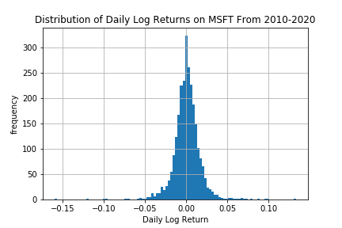

.. _implementations-labeling_raw_return:

.. note::
    This section includes an accompanying Jupyter Notebook Tutorial that is now available via the respective tier on
    `Patreon <https://www.patreon.com/HudsonThames>`_.

===========
Raw Returns
===========

Labeling data by raw returns is the most simple and basic method of labeling financial data for machine learning. Raw returns can
be calculated either on a simple or logarithmic basis. Using returns rather than prices is usually preferred for financial time series
data because returns are usually stationary, unlike prices. This means that returns across different assets, or the same asset
at different times, can be directly compared with each other. The same cannot be said of price differences, since the magnitude of the
price change is highly dependent on the starting price, which varies with time.

The simple return for an observation with
price :math:`p_t` at time :math:`t` relative to its price at time :math:`t-1` is as follows:

.. math::
    r_t = \frac{p_{t}}{p_{t-1}} - 1

And the logarithmic return is:

.. math::
    r_t = log(p_t) - log(p_{t-1})

The label :math:`L_t` is simply equal to :math:`r_t`, or to the sign of :math:`r_t`, if binary labeling is desired.

 .. math::
     \begin{equation}
     \begin{split}
       L_{t} = \begin{cases}
       -1 &\ \text{if} \ \ r_t < 0\\
       0 &\ \text{if} \ \ r_t = 0\\
       1 &\ \text{if} \ \ r_t > 0
       \end{cases}
     \end{split}
     \end{equation}

If desired, the user can specify a resampling period to apply to the price data prior to calculating returns. The user
can also lag the returns to make them forward-looking.

The following shows the distribution of logarithmic daily returns on Microsoft stock during the time period between January
2010 and May 2020.

   Distribution of logarithmic returns on MSFT.

Implementation
##############

.. py:currentmodule:: mlfinlab.labeling.raw_return
.. automodule:: mlfinlab.labeling.raw_return
   :members:

Example
########
Below is an example on how to use the raw returns labeling method.

.. code-block::

    import pandas as pd
    from mlfinlab.labeling import raw_return

    # Import price data
    data = pd.read_csv('../Sample-Data/stock_prices.csv', index_col='Date', parse_dates=True)

    # Create labels numerically based on simple returns
    returns = raw_returns(prices=data, lag=True)

    # Create labels categorically based on logarithmic returns
    returns = raw_returns(prices=data, binary=True, logarithmic=True, lag=True)

    # Create labels categorically on weekly data with forward looking log returns.
    returns = raw_returns(prices=data, binary=True, logarithmic=True, resample_by='W', lag=True)

Research Notebook
#################

.. note::
    This and other accompanying Jupyter Notebook Tutorials are now available via the respective tier on
    `Patreon <https://www.patreon.com/HudsonThames>`_.

The following research notebook can be used to better understand the raw return labeling technique.

* `Raw Return Example`_

.. _`Raw Return Example`: https://github.com/Hudson-and-Thames-Clients/research/blob/master/Labeling/Labels%20Raw%20Return/Raw%20Return.ipynb
