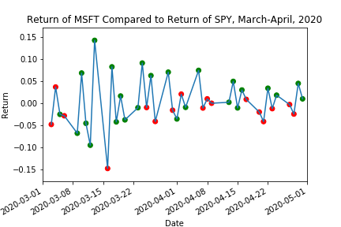

.. _implementations-labeling_vs_benchmark:

=========================
Return Versus Benchmark
=========================
Labeling versus benchmark is featured in the paper `Evaluating multiple classifiers for stock price direction prediction, by Ballings et al.,
2015. <https://www.sciencedirect.com/science/article/abs/pii/S0957417415003334>`_ In this paper, the authors label yearly forward
stock returns against a predetermined benchmark, and use that labeled data to compare the performance of several machine
learning algorithms in predicting long term price movements.

Labeling against benchmark is a simple method of labeling financial data in which time-indexed returns are labeled according to
whether they exceed a set value. The benchmark can be either a constant value, or a pd.Series of values with an index matching
that of the returns. The labels can be the numerical value of how much each observation's return exceeds the benchmark, or the sign
of the excess.

At time :math:`t`, given that price of a stock is :math:`p_{t, n}`, benchmark is :math:`B_t` and return is:

.. math::
    r_{t,n} = \frac{p_{t,n}}{p_{t-1,n}} - 1

Note that :math:`B_t` is a scalar value corresponding to the benchmark at time :math:`t`, while :math:`B` is the vector of all benchmarks
across all timestamps. The labels are:

.. math::
    L(r_{t,n}) = r_{t,n} - B_t

If categorical labels are desired:

 .. math::
     \begin{equation}
     \begin{split}
       L(r_{t, n}) = \begin{cases}
       -1 &\ \text{if} \ \ r_{t,n} < B_t\\
       0 &\ \text{if} \ \ r_{t,n} = B_t\\
       1 &\ \text{if} \ \ r_{t,n} > B_t\\
       \end{cases}
     \end{split}
     \end{equation}

The simplest method of labeling is just returning the sign of the return. However, sometimes it is desirable to quantify the return
compared to a benchmark to better contextualize the returns. This is commonly done by using the mean or median of multiple stocks in the market.
However, that data may not always be available, and sometimes the user might wish a specify a constant or more custom benchmark to compare
returns against. Note that these benchmarks are unidirectional only. If the user would like a benchmark that captures the absolute value of the
returns, then the fixed horizon method should be used instead.

If desired, the user can specify a `resampling period <https://pandas.pydata.org/pandas-docs/stable/user_guide/timeseries.html#dateoffset-objects>`_
to apply to the price data prior to calculating returns. The user can also lag the returns to make them forward-looking.
In the paper by Ballings et al., the authors use yearly forward returns, and compare them to benchmark values
of 15%, 25%, and 35%.

The following shows the returns for MSFT stock during March-April 2020, compared to the return of SPY as a benchmark during
the same time period. Green dots represent days when MSFT outperformed SPY, and red dots represent days when MSFT underperformed
SPY.

   Comparison of MSFT return to SPY return.

.. tip::
   **Underlying Literature**

   This labeling method is sourced from the following:
   - Chapter 5.5.1 of **Machine Learning for Factor Investing**, *by* Coqueret, G. and Guida, T. (2020).

Implementation
##############

.. py:currentmodule:: mlfinlab.labeling.return_vs_benchmark
.. automodule:: mlfinlab.labeling.return_vs_benchmark
   :members:

Example
########
Below is an example on how to use the return over benchmark labeling technique on real data.

.. code-block::

    import pandas as pd
    from mlfinlab.labeling import return_vs_benchmark

    # Import price data.
    data = pd.read_csv('../Sample-Data/stock_prices.csv', index_col='Date', parse_dates=True)

    # Get returns in SPY to be used as a benchmark.
    spy_returns = data['SPY'].pct_change()

    # Create labels using SPY as a benchmark.
    numerical_labels = return_vs_benchmark(prices=data, benchmark=spy_returns)

    # Create labels categorically.
    binary_labels = return_vs_benchmark(prices=data, benchmark=spy_returns, binary=True)

    # Label yearly forward returns, with the benchmark being an 25% increase in price.
    yearly_labels = return_vs_benchmark(prices=data, benchmark=0.25, binary=True, resample_by='Y',
                                        lag=True)

Research Notebook
#################

The following research notebook can be used to better understand the return against benchmark labeling technique.

* `Return Over Benchmark Example`_

.. _`Return Over Benchmark Example`: https://github.com/hudson-and-thames/research/blob/master/Labelling/Labeling%20vs%20Benchmark/Labeling%20vs%20Benchmark.ipynb
