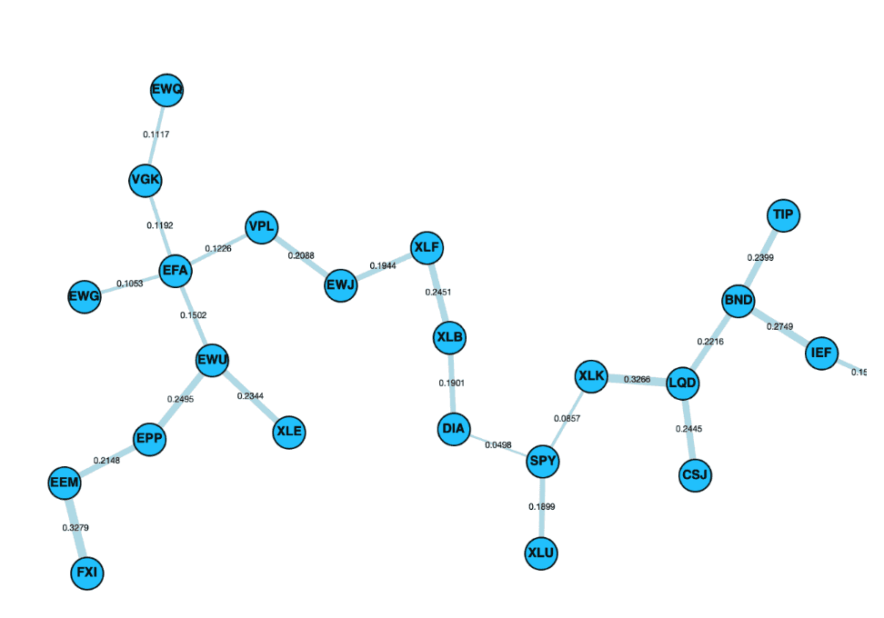
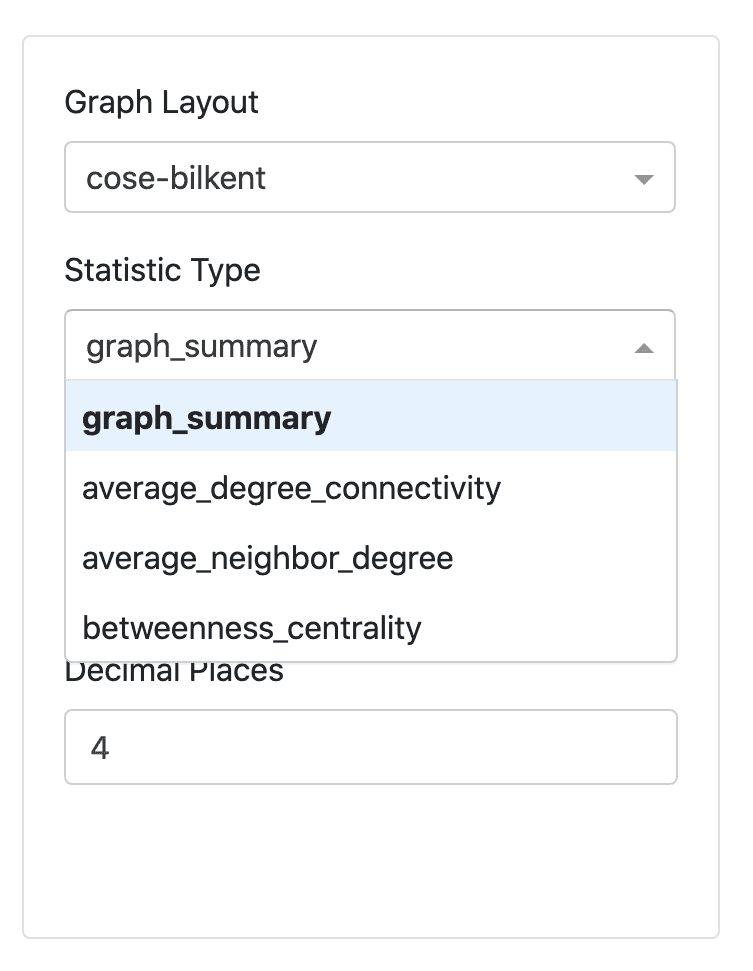
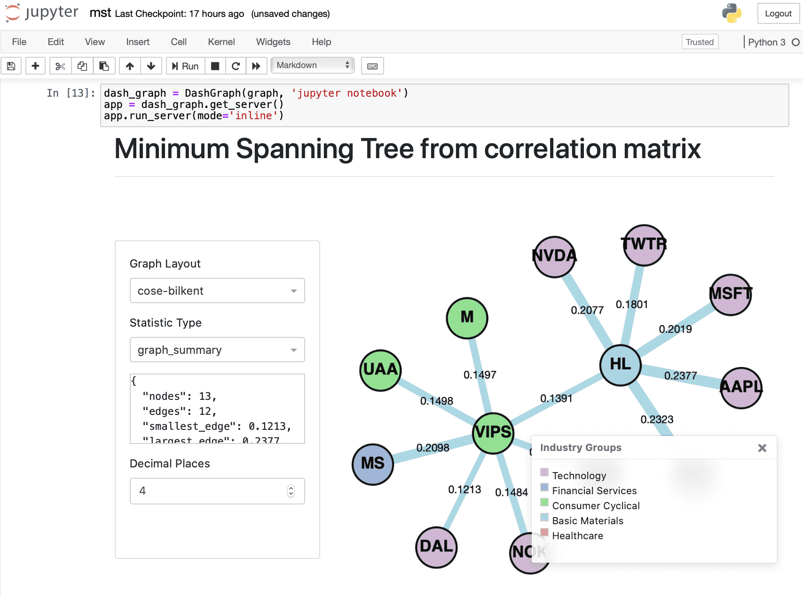

.. _networks-dash:

.. note::
    This section includes an accompanying Jupyter Notebook Tutorial that is now available via the respective tier on
    `Patreon <https://www.patreon.com/HudsonThames>`_.

===========================
Dash Network Visualisations
===========================

`DashGraph` is the frontend class which takes in the input `MST` class object
from this Networks module and creates a Flask server which runs locally.

`Plotly's Dash <https://dash.plotly.com>`_ and is used to display interactive
graphs of the MST and `Dash Bootstrap <https://dash-bootstrap-components.opensource.faculty.ai/>`_
is used for styling the UI into a user friendly interface.

.. Note::

    Running run_server() will produce the warning "Warning: This is a development server. Do not use app.run_server
    in production, use a production WSGI server like gunicorn instead.".
    However, this is okay and the Dash server will run without a problem.

Graph Layout
############

On the side panel, the top dropdown menu contains three different layouts designed to layout the MST.
These are namely `cose-bilkent`, `cola` and `spread`, selected as optimal layouts to view the MST.

.. image:: images/data/graphLayout.png
    :width: 23%

.. image:: images/data/cola.png
    :width: 23%

.. image:: images/data/spread.png
    :width: 23%

Control panel alongside the layouts `cose-bilkent`, `cola` and `spread`.

**Cose Bilkent Layout**

"The CoSE (Compound Spring Embedder) layout for Cytoscape.js developed by i-Vis Lab in Bilkent University is a
spring embedder layout with support for compound graphs (nested structures) and varying (non-uniform) node dimensions."

The full algorithm explanation can be found on Dogrusoz, et al. `"A Layout
Algorithm For Undirected Compound Graphs" (2009) <https://www.sciencedirect.com/science/article/pii/S0020025508004799>`_.

**Cola Layout**

The Cola layout is a physics simulation layout, using a `force-directed physics <https://en.wikipedia.org/wiki/Force-directed_graph_drawing>`_ simulation
written by `Tim Dwyer <http://www.csse.monash.edu.au/~tdwyer/>`_.
For more information about Cola, refer to the `documentation <https://ialab.it.monash.edu/webcola/>`_.

**Spread Layout**

The Spread layout is a physics simulation based layout, attempting to spread the elements out evenly in the space.
The layout is based on two phases, first a phase using `CoSE <http://js.cytoscape.org/#layouts/cose>`_ and, a second phase based on `Voroni <https://github.com/gorhill/Javascript-Voronoi>`_ to spread out the nodes in the remaining spread.
A full description of this algorithm can be found on the `Cytoscape Spread <https://github.com/cytoscape/cytoscape.js-spread>`_ repository.

Statistics Panel
################

The statistics panel on the left hand side of the UI is designed to provide useful information about the MST displayed
on the right. The following is a brief explanation of the statistic type, and the reason for selection.

.. image:: images/data/statspanel1.png
    :width: 30%

.. image:: images/data/statspanel3.png
    :width: 30%

The statistics can be used to analyse topological features of the MST.
Properties such as normalized tree length, centrality measures, node degree and connectivity are included.

.. Note::
    For larger datasets, the statistics may appear blank while the statistics are loading,
    as the calls to NetworkX's functions for the statistics can be very slow. However, they will load eventually.
    This works better in 'external' mode for Jupyter notebook.

**Graph Summary**

Returns overall summary in the format below:

.. code-block::

    {
      "nodes": 48,
      "edges": 47,
      "smallest_edge": 0.4154,
      "largest_edge": 1.3404,
      "average_node_connectivity": 1.0,
      "normalised_tree_length": 0.8944543478260868,
      "average_shortest_path": 4.399822695035461
    }

**Average Node Connectivity**

Average Node Connectivity is defined as "the maximum number of internally disjoint paths connecting" a
given pair of vertices for all pairs in the graph `(Beineke et al. 2002) <https://www.sciencedirect.com/science/article/pii/S0012365X01001807>`_.

Returns the average connectivity of graph as given in
`NetworkX <https://networkx.github.io/documentation/stable/reference/algorithms/generated/networkx.algorithms.
connectivity.connectivity.average_node_connectivity.html>`_.

Where :math:`\bar{\kappa}` of a graph G is the average of local node connectivity over all pairs of nodes of G.

**Normalised Tree Length**

Normalised Tree Length as defined in `Onnela, J-P., et al. (2003) <https://www.researchgate.net/publication/8952753_Dynamics_of_Market_Correlations_Taxonomy_and_Portfolio_Analysis>`_

.. math::
    L(t) = \frac{1}{N - 1} \sum_{d^t_{ij} ∈ T^t} d^t_{ij}

Where :math:`L(t)` is the Normalised Tree length,  :math:`t` is the time at which tree is constructed, :math:`N-1` is the number of edges in the MST and :math:`D` is the distance matrix.

According to `Marti, Gautier, et al. (2017) <https://arxiv.org/abs/1703.00485>`_, normalized tree length and the investment diversification potential are very strongly
correlated. `Huang et al. (2016) <https://www.sciencedirect.com/science/article/pii/S0960077916303344>`_ also notes that the normalized tree length is positively correlated
with average stock market return, and negatively correlated with return volatility and tail risk.

**Average Shortest Path**

Calculates the `average shortest path length <https://networkx.github.io/documentation/stable
/reference/algorithms/generated/networkx.algorithms.shortest_paths.generic.average_shortest_path_length.html>`_ of the graph calling NetworkX function.

**Average Degree Connectivity**

The average degree connectivity is the "average nearest neighbor degree of nodes with degree :math:`k`".
Computes the average degree connectivity of graph via call to NetworkX method.
The full details of the function can be found `here. <https://networkx.github.io/documentation/stable/reference
/algorithms/generated/networkx.algorithms.assortativity.average_degree_connectivity.html>`_

**Average Neighbour Degree**

Computes the average number of neighbours of each node, weighted by the edge weight value.

.. math::
    k^w_{nn,i} = \frac{1}{s_i} \sum_{j ∈ N(i)} w_{ij} k_j

Where :math:`s_i` is the weighted degree of node :math:`i`, :math:`k_j` is the degree of node :math:`j`, :math:`w_{ij}` is the weight of the edge that links :math:`i`
and :math:`j` and :math:`N(i)` are the neighbors of node :math:`i`. The full description of the function can be found
`here <https://networkx.github.io/documentation/stable/reference/algorithms/generated/networkx.algorithms.assortativity.average_neighbor_degree.html>`__.

**Betweenness Centrality**

Betweenness Centrality measures the "fraction of the shortest paths passing through a vertex" `(Jia et al. 2012) <https://www.sciencedirect.com/science/article/pii/B9780123859631000022>`_.

It is commonly used to compare properties of graphs, for example in the study by `Fiedor (2014) <https://journals.aps.org/pre/abstract/10.1103/PhysRevE.89.052801>`_,
used to compare MST to PMFG (Planar Maximally Filtered Graph).
Betweenness Centrality is also commonly used when analysing social networks,
where the higher the betweenness centrality of a node the more likely the individual is playing a "bridge spanning" role network `(Hansen et al. 2020) <https://www.sciencedirect.com/science/article/pii/B9780128177563000066>`_.

This specific function is for bipartite graphs, and full details of the function can be found `here <https://networkx.github.io/documentation/stable/reference/algorithms/generated/networkx.algorithms.bipartite.centrality.betweenness_centrality.html>`_.

----

DashGraph for Custom Matrix
###########################

To create a MST visualisation, it is best to use the :ref:`Visualisations methods <networks-visualisations>`.
However, if you would like to input a custom matrix instead of a distance matrix, please read the information below.

The DashGraph class takes in the input Graph, or more specifically, a child of the Graph class such as a MST class.
The DashGraph class then creates a visualisation based on the input Graph.

Implementation
**************

.. automodule:: mlfinlab.networks.dash_graph
    :noindex:

    .. autoclass:: DashGraph
        :members:
        :inherited-members:

        .. automethod:: __init__

Running Dash in Jupyter
***********************

You can easily run Dash server within Jupyter Notebook. The `Jupyter Dash library <https://github.com/plotly/jupyter-dash>`_ is used to provide this functionality.

When you initialize the `DashGraph` class, you must add another argument 'jupyter notebook'.
To run the visualisations in Jupyter, replace:

.. code-block::

    # Initialize DashGraph class
    dash_graph = DashGraph(graph)

    # Get server app
    app = dash_graph.get_server()

    # Run server
    app.run_server()

With:

.. code-block::

    # Extra argument 'jupyter notebook'
    dash_graph = DashGraph(graph, 'jupyter notebook')

    # Get server app
    app = dash_graph.get_server()

    # Extra argument 'inline', 'external' or 'jupyterlab' for jupyter notebook
    app.run_server(mode='inline')

Initialising the `DashGraph` class with an additional argument 'jupyter notebook', creates a JuptyerDash class instead of a Dash class.
Running `mode='inline'` will allow the interactive visualisations to display within a cell output of the Jupyter notebook.
For detailed explanations of the different modes, refer to `this article <https://medium.com/plotly/introducing-jupyterdash-811f1f57c02e>`_ on Jupyter Dash.

Dash Dual Interface for Comparisons
###################################

The `DualDashGraph` interface can be used to compare the MST and ALMST. The `DualDashGraph` takes in two `Graph` objects.
`DualDashGraph` also allows for an additional argument to use the interface inside Jupyter Notebook.

.. code-block::

    # Extra argument 'jupyter notebook'
    dash_graph = DualDashGraph(graph_one, graph_two, 'jupyter notebook')

    # Get server app
    app = dash_graph.get_server()

    # Extra argument 'inline', 'external' or 'jupyterlab' for jupyter notebook
    app.run_server(mode='inline')

Implementation
**************

.. automodule:: mlfinlab.networks.dual_dash_graph

    .. autoclass:: DualDashGraph
        :members:
        :inherited-members:

        .. automethod:: __init__

Research Notebook
#################

.. note::
    This and other accompanying Jupyter Notebook Tutorials are now available via the respective tier on
    `Patreon <https://www.patreon.com/HudsonThames>`_.

The following notebook provides a more detailed exploration of the MST creation.

* `MST visualisation`_

.. _`MST visualisation`: https://github.com/Hudson-and-Thames-Clients/research/tree/master/Networks/mst.ipynb
