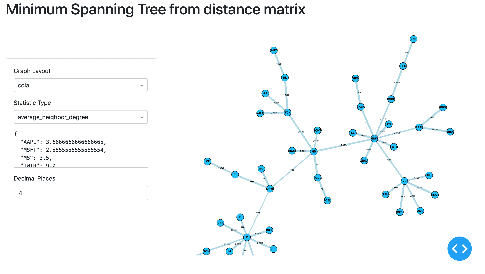

.. _networks-introduction:

.. Note::
    An overview of network methods can be found on `Marti et al. "A review of two decades of correlations,
    hierarchies, networks and clustering in financial markets." (2017). <https://arxiv.org/abs/1703.00485>`_

============
Introduction
============

Networks
########

Networks module creates beautiful and informative visualizations of financial data, using network theory to describe complex
systems
such as financial markets.

Networks takes in a codependence or distance matrix between a set of elements and converts it into graphs such as a Minimum Spanning Tree, creating a mini `Flask
<https://flask.palletsprojects.com>`_ server using `Plotly's Dash <https://dash.plotly.com>`_ to display the interactive
graphs.

    Interactive Minimum Spanning Tree graph of 48 stocks based on daily closing price data from 15th August 2017 - 10th of August 2020

Four aspects of network visualisation tools have been added:

1. Minimum Spanning Tree (MST).

2. Average Linkage Minimum Spanning Tree (ALMST).

3. Planar Maximally Filtered Graph (PMFG).

4. Triangulated Maximally Filtered Graph (in development).

The methods from the `visualisations.py` file can be used to create visualisations given a dataframe of log returns.

----

Input Matrices
##############

Methods take distance or correlation matrices as inputs. Tools to calculate various codependences and distances
can be found in the :ref:`Codependence module <codependence-introduction>`. To create a matrix from a set of observations,
the :ref:`Codependence Matrix function <codependence-codependence_matrix>` can be used.

Correlation Matrix
******************

Let :math:`n` be the number of assets, :math:`P_i(t)` be price :math:`t` of asset :math:`i` and :math:`r_i(t)` be the
log-return at time :math:`t` of asset :math:`i`:

.. math::
    r_i(t) = log P_i(t) − log P_i(t − 1)

For each pair of assets :math:`i`, :math:`j` of assets, compute their correlation:

.. math::
    \rho_{ij} = \frac{⟨r_i r_j⟩ − ⟨r_i⟩⟨r_j⟩}{\sqrt{(⟨r_i^2⟩−⟨r_i⟩^2)  (⟨r_j^2⟩−⟨r_j⟩^2})}

Distance Matrix
***************

Having followed the steps to create a correlation matrix,
convert the correlation coefficients :math:`\rho_{ij}` into distances:

.. math::
    d_{ij} = \sqrt{2(1- \rho_{ij})}

For a more detailed explanation, please refer to :ref:`Correlation-Based Metrics section <codependence-correlation_based_metrics>`,
as it describes the measures in more detail.

