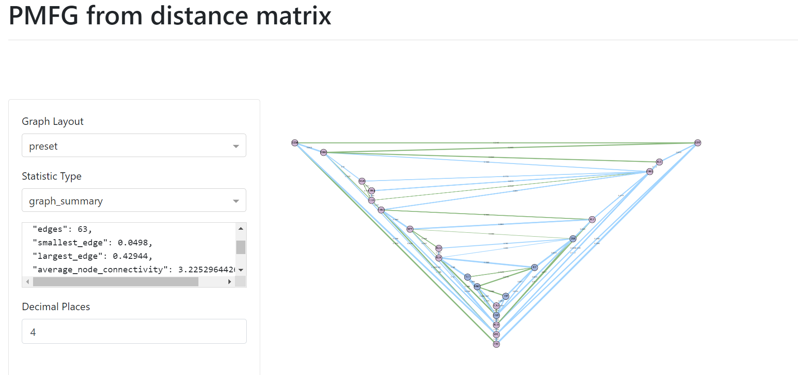
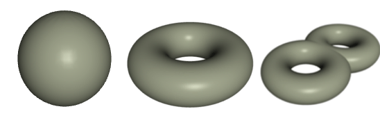
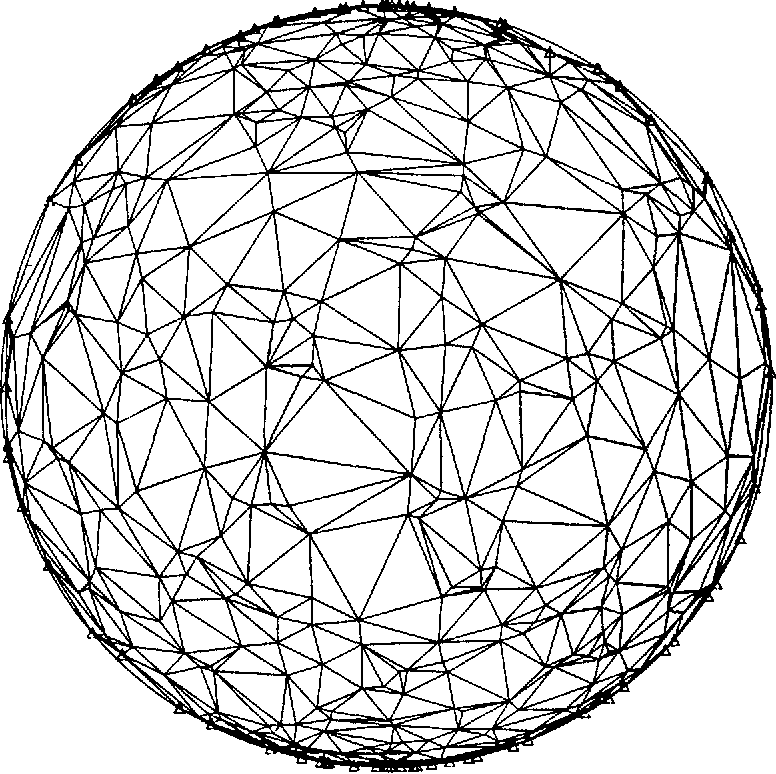
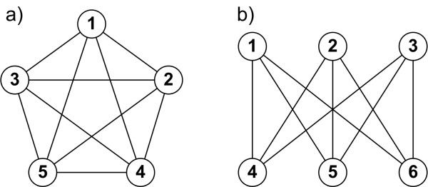
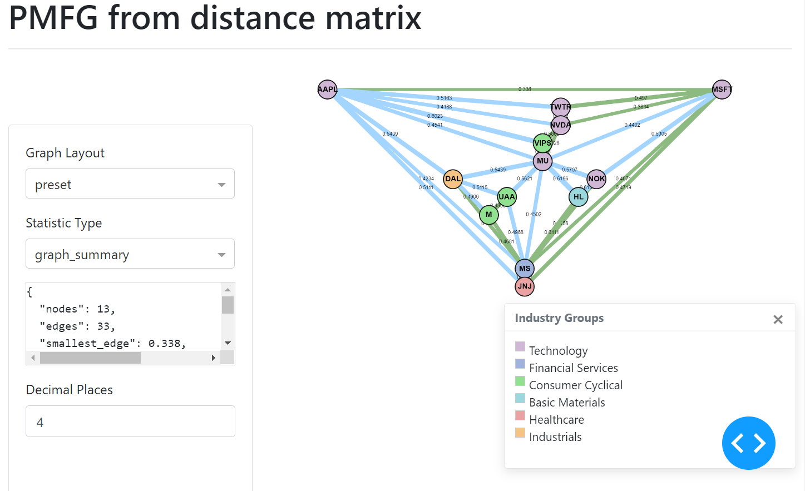
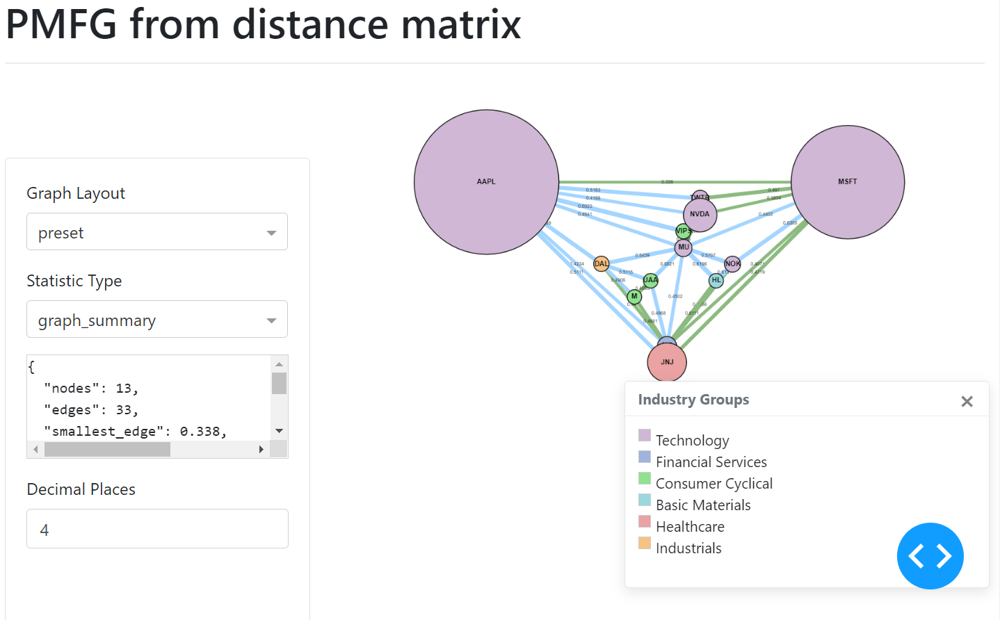

.. _networks-pmfg:

.. note::
    This section includes an accompanying Jupyter Notebook Tutorial that is now available via the respective tier on
    `Patreon <https://www.patreon.com/HudsonThames>`_.

.. note::

   The following sources elaborates extensively on the topic:

   1. `Tumminello, Michele, et al. "A tool for filtering information in complex systems." Proceedings of the National Academy of Sciences 102.30 (2005): 10421-10426. <https://arxiv.org/pdf/cond-mat/0501335.pdf>`_

   2. `Aste, Tomaso, et al. "Correlation filtering in financial time series." Noise and Fluctuations in Econophysics and Finance. Vol. 5848. International Society for Optics and Photonics, 2005. <https://arxiv.org/pdf/physics/0508118.pdf>`_

======================================
Planar Maximally Filtered Graph (PMFG)
======================================

A planar graph is a graph which can be drawn on a flat surface without the edges crossing.
The Planar Maximally Filtered Graph (PMFG) is a planar graph where the edges connecting the most similar elements are added first (Tumminello et al, 2005).

For example, for a correlation-based PMFG, the edges with the highest correlation would be added first. The steps to construct the PMFG are defined as follows:

1. Order the edges from the highest similarity to the lowest.
2. Add the edge with the highest similarity to the PMFG, if the resulting graph is planar
3. Keep adding edges from the ordered list, until :math:`3 (n - 2)` edges have been added.

The PMFG retains the Minimum Spanning Tree (MST) as a subgraph, thus retains more information about the network than a MST (Tumminello et al, 2005).

   PMFG example user interface.

PMFG contains :math:`3 (n - 2)` edges as opposed to the MST, which contains :math:`n - 1` edges for :math:`n` number of nodes in the network.

----

PMFG
####

Background on Topology and Graph Theory
***************************************

PMFG is the specific case where the graph is planar on genus :math:`k = 0`, which means the graph can be drawn on a flat surface without the edges crossing.
However, the greater the genus, the greater the information stored in the graph. However,  Tumminello et al (2005) state “major relative improvement” when the simplest graph is created of genus :math:`k = 0`, instead of for higher genus.

The figure shows three different shapes with different genera. A sphere in 2 dimensions is of genus :math:`k = 0` (much like the PMFG).
The torus is of genus :math:`k =1` and the double torus of genus :math:`k = 2` and so on.
A coffee cup with a handle, would have the same topology as a torus.

  Topological genera. From the left: Genus 0 (sphere), Genus 1 (torus), Genus 2 (double torus) (Warne, 2013).

The PMFG “is a topological triangulation of the sphere” (Tumminello et al, 2005).

  Example of a topological triangulation of a sphere (Renka, 1984).

**Planar Graph Theory**

According to Kuratowski's theorem on planar graphs, a planar graph cannot contain a 5 clique (see :math:`k_{5}` graph),
nor can it contain a :math:`k_{3,3}` bipartite graph where each node connects to every other node in the other group (see :math:`k_{3,3}` graph) (Grünbaum and Bose, 2013).

  Graph a) shows a 5 clique graph (:math:`k_{5}`) and b) shows :math:`k_{3,3}` bipartite graph (Staniec and Debita, 2012).

Only 3 cliques and 4 cliques are allowed in the PMFG. Cliques of higher orders are allowed if the genus is greater. For example, 5 cliques would be allowed in genus :math:`k = 1`. Analysing 3-cliques and 4-cliques can show the underlying hierarchical structure of the network and
“have important and significant relations with the market structure and properties” (Aste et al, 2005).

.. figure:: images/pmfg/3_cliques_4_cliques.png
  :width: 50%
  :align: center

  An example of a 3 clique graph and a 4 clique graph.

Where :math:`k` is the genus, and :math:`r` is the number of elements, the number of elements allowed in a clique is given by Ringel (2012) as:

.. math::

  r ≤ \frac{7+\sqrt{1+48k}}{2}

For example, for a graph of genus :math:`k = 1`, 5 cliques are allowed in the graph.

Analysing Cliques in PMFG
*************************

Analysis of 3-cliques and 4-cliques, describe the underlying hierarchical structure of the network and “have important and significant relations with the market structure and properties” (Aste et al, 2005).
In the case of interest rates, the 4 cliques group together the rates with similar maturity dates (Aste et al, 2005).
For stocks, 4-cliques tend to group with similar industry or sector groups (Tumminello et al, 2005).
Therefore, 3-cliques and 4-cliques can be useful to analyse and understand the network.

Tumminello et al (2005) proposes a measure of disparity :math:`y_{i}` defined as follows:

.. math::

   y_{i} = \sum_{j ≠i, j ∈clique} [\frac{p_{ij}}{s_{i}}]^2

The mean value of the disparity measure is the sum of :math:`y_{i}` divided by the number of nodes in the clique.
The strength of an element :math:`s_{i}` is calculated by:

.. math::

   s_{i} = \sum_{j ≠i, j ∈clique} p_{ij}

The disparity measure is only meaningful if all of the edges in the clique have a correlation value of 0 or greater, which is why some disparity measure values may be excessively large.

.. figure:: images/pmfg/cliques_pmfg.png
  :width: 50%
  :align: center

  PMFG 34 US interest rates, with 4 cliques highlighted (Aste et al, 2005).

Aste et al (2005) found that the groups of 4-cliques “reveal the hierarchical organization of the underlying system... grouping together the interest rates with similar maturity dates”.
The figure above is an example of how the cliques form according to the maturity dates.

The average disparity measure for all 3 cliques and 4 cliques are shown in the PMFG interface under the statistic name `disparity_measure`.

----

Creating the PMFG
#################

You can create the PMFG visualisation using `generate_pmfg_server`. This requires you to input a log returns dataframe.

.. code-block::

   # Import pandas
   import pandas as pd

   # Import generate_pmfg_server method
   from mlfinlab.networks.visualisations import generate_pmfg_server

   # Import log return csv
   log_return_dataframe = pd.read_csv('path_to_file.csv', index_col=False)

   # Creates the PMFG comparison server
   server = generate_pmfg_server(log_return_dataframe)

   # Run the server in the command line
   server.run_server()

.. note::

   Log returns dataframe should be calculated as :math:`log P_{i}(t) - log P_{i}(t-1)` for asset :math:`i` and price :math:`P`.

Implementation
**************

Here are the options you can use for the `generate_pmfg_server`:

.. py:currentmodule:: mlfinlab.networks.visualisations
.. autofunction:: generate_pmfg_server

Specifying “correlation” instead of the default “distance”, the PMFG algorithm orders the edges from largest to smallest edge instead of the other way round.
The optional format for the colours and sizes, can be specified in the following manner:

.. code-block::

   # Optional - add industry groups for node colour
   industry = {"tech": ['NVDA', 'TWTR', 'MSFT'], "utilities": ['JNJ'], "automobiles": ['TSLA', 'GE']}

   # Optional - adding market cap for node size, corresponding to node input index.
   market_caps = [2000, 2500, 3000, 1000, 5000, 3500, 500, 1700]

   # Creates the PMFG comparison server
   server = generate_pmfg_server(log_return_dataframe, colours=industry, sizes=market_caps)

.. figure:: images/pmfg/sizes_colours_no_toast.png
  :width: 90%
  :align: center

The MST edges, contained within the PMFG, are displayed in green.

----

Custom Input Matrix PMFG
########################

As is the case for `MST` and `ALMST`, to input a custom matrix, you must create a PMFG class directly.
This gives you the option to transform the input dataframe directly, instead of a log returns dataframe,
allowing you to make specific transformations instead of the default way to create “correlation” or
“distance” matrix. However, PMFG only allows input_type of “correlation” or “distance” to specify
whether the PMFG algorithm should add the edges from largest to smallest or smallest to largest
respectively.

.. code-block::

   # Import pandas
   import pandas as pd

   # Import PMFG class
   from mlfinlab.networks.pmfg import PMFG

   # Import PMFG Dash Graph class
   from mlfinlab.networks.dash_graph import PMFGDash

   # Import file containing stock log returns
   log_return_dataframe = pd.read_csv('path_to_file', index_col=False)

   # Create your custom matrix
   custom_matrix = log_return_dataframe.corr(method='pearson')

   # Creates PMFG graph class
   graph = PMFG(custom_matrix)

   # Input ‘correlation’ as matrix type, to order the PMFG algorithm from largest to smallest
   Graph = PMFG(cutom_matrix, 'correlation')

   # Create and get the server
   dash_graph = PMFGDashGraph(graph)
   server = dash_graph.get_server()

   # Run server
   server.run_server()

Once the PMFG class object has been created, you can set the colours and sizes properties of the graph.

Adding Colours to Nodes
***********************

The colours can be added by passing a dictionary of group name to list of node names corresponding to the nodes input.
You then pass the dictionary to the `set_node_groups` method.

.. code-block::

  # Optional - add industry groups for node colour
  industry = {"tech": ['NVDA', 'TWTR', 'MSFT'], "utilities": ['JNJ'], "automobiles": ['TSLA', 'GE']}
  graph.set_node_groups(industry)

Adding Sizes to Nodes
*********************

The sizes can be added in a similar manner, via a list of numbers which correspond to the node indexes.
The UI of the graph will then display the nodes indicating the different sizes.

.. code-block::

  # Optional - adding market cap for node size
  market_caps = [2000, 2500, 3000, 1000, 5000, 3500, 500, 1700]
  graph.set_node_size(market_caps)

The `PMFG` object, once constructed, serves as the input to the `PMFGDash` class. To run the `PMFGDash` within the Jupyter notebook, make sure to pass in the parameter.

.. code-block::

   server = PMFGDash(pmfg, app_display=’jupyter notebook')

Where calling `get_server` will return the Dash server with the frontend components. Then you can call:

.. code-block::

   server.run_server()

Which is the default option, or alternatively for Jupyter dash, specify the mode as ‘inline’, ‘external’ or ‘jupyterlab’.
The 'external' mode is very useful for larger graphs, as you can view the PMFG in a new window.

.. code-block::

   server.run_server(mode=’inline’)

.. figure:: images/pmfg/jupyter_inline_dash.png
  :width: 90%
  :align: center

----

PMFG Class
##########

.. automodule:: mlfinlab.networks.pmfg

  .. autoclass:: PMFG
      :members:
      :inherited-members:

      .. automethod:: __init__

----

PMFGDash Class
##############

.. automodule:: mlfinlab.networks.dash_graph

  .. autoclass:: PMFGDash
      :members:
      :inherited-members:

      .. automethod:: __init__

References
##########

1. Tumminello, M., Aste, T., Di Matteo, T. and Mantegna, R.N., 2005. A tool for filtering information in complex systems. Proceedings of the National Academy of Sciences, 102(30), pp.10421-10426.  https://arxiv.org/pdf/cond-mat/0501335.pdf

2. Grünbaum, B., & Bose, R. (2013, August 14). Applications of graph theory. Retrieved September 16, 2020, from https://www.britannica.com/science/combinatorics/Applications-of-graph-theory

3. Ringel, Gerhard. Map color theorem. Vol. 209. Springer Science & Business Media, 2012.

4. Aste, Tomaso, et al. "Correlation filtering in financial time series." Noise and Fluctuations in Econophysics and Finance. Vol. 5848. International Society for Optics and Photonics, 2005. https://arxiv.org/pdf/physics/0508118.pdf

5. Renka, R.J., 1984. Interpolation of data on the surface of a sphere. ACM Transactions on Mathematical Software (TOMS), 10(4), pp.417-436.

6. Warne, D., 2013. On the effect of topology on cellular automata rule spaces.

7. Staniec, K. and Debita, G., 2012. Evaluation of topological planarity and reliability for interference reduction in radio sensor networks. EURASIP Journal on Wireless Communications and Networking, 2012(1), p.56.

----

Research Notebook
#################

.. note::
    This and other accompanying Jupyter Notebook Tutorials are now available via the respective tier on
    `Patreon <https://www.patreon.com/HudsonThames>`_.

The following research notebook provides a more detailed exploration of the PMFG creation.

* `PMFG visualisation`_

.. _`PMFG visualisation`: https://github.com/Hudson-and-Thames-Clients/research/tree/master/Networks/pmfg.ipynb
