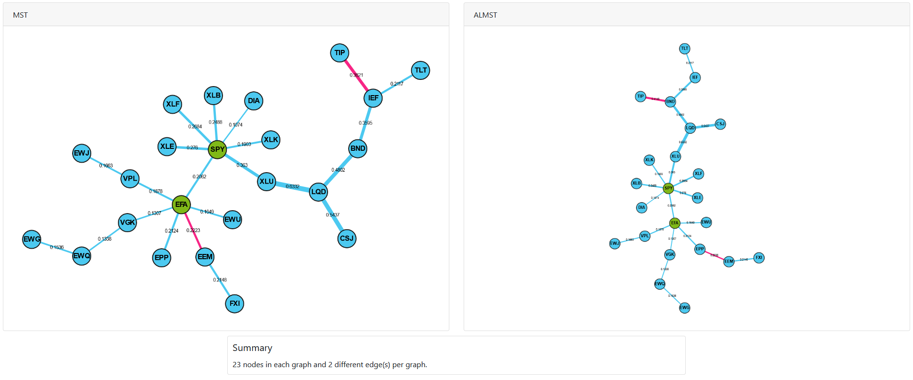

.. _networks-visualisations:

.. note::
    This section includes an accompanying Jupyter Notebook Tutorial that is now available via the respective tier on
    `Patreon <https://www.patreon.com/HudsonThames>`_.

===================
Visualising Graphs
===================

This section outlines how to create visualisations using the helper function from `visualisations.py`.
The helper functions streamline the process of constructing the `MST` and `DashGraph` objects.
This is the recommended way to create visualisations, unless you would like to pass in a custom matrix.

.. figure:: images/data/mst_coloured.png
    :align: center

    MST visualisation based on stock price data form 18th February 2020 until the 24th of March 2020.

To pass in a custom matrix, you must construct `MST` and `DashGraph` directly. Please refer to the
MST with Custom Matrix section in the :ref:`MST <networks-minimum_spanning_tree>` part of the documentation.

Creating Visualisations
#######################

The code snippet below shows how to create a MST visualisation and run the Dash server using the `generate_mst_server` method.
The code snippet creates a distance matrix, inputs it into the ``MST`` class, which is passed to the ``DashGraph`` class.
To input a custom matrix, you can use the ``MST`` class constructor instead.

Example Code
************

.. code-block::

    # Import pandas
    import pandas as pd

    # Import generate_mst_server method
    from mlfinlab.networks.visualisations import generate_mst_server

    # Import log return csv
    log_return_dataframe = pd.read_csv('path_to_file.csv', index_col=False)

    # Create MST server
    server = generate_mst_server(log_return_dataframe)

    # Run the server in the command line
    server.run_server()

Input File Format
*****************

When using the `generate_mst_server` method as in the example above,
the input file should be a time series of log returns.
An example of the csv when imported as a dataframe (as the `log_return_dataframe` in the above example),
is shown below.

.. figure::
    images/introduction/input.png

The formula to calculate the log returns from OHLCV data is given as:

Let :math:`n` be the number of assets, :math:`P_i(t)` be price :math:`t` of asset :math:`i` and :math:`r_i(t)` be the
log-return at time :math:`t` of asset :math:`i`:

.. math::
    r_i(t) = log P_i(t) − log P_i(t − 1)

For a more detailed explanation, please refer to :ref:`Correlation-Based Metrics section <codependence-correlation_based_metrics>`,
as it describes the measures in more detail.

Creating ALMST Visualisations
*****************************

Similar to creating MST visualisations, you can use the `generate_almst_server` to create the ALMST server instead of the MST server.
However, the input parameters and the output server are the same for the `ALMST` class. Both `ALMST` and `MST` are subclasses of the parent class `Graph`.

.. code-block::

    # Import pandas
    import pandas as pd

    # Import generate_almst_server method
    from mlfinlab.networks.visualisations import generate_almst_server

    # Import log return csv
    log_return_dataframe = pd.read_csv('path_to_file.csv', index_col=False)

    # Create ALMST server
    server = generate_almst_server(log_return_dataframe)

    # Run the server in the command line
    server.run_server()

The optional parameters such as colours, node sizes, and the Jupyter notebook mode are set in the same way as the `MST`.

Comparing ALMST and MST
***********************

In order to create a dual interface to compare both the ALMST and MST, we can use the `generate_mst_almst_comparison` method with the `ALMST` and `MST` as the input.

.. code-block::

    # Import pandas
    import pandas as pd

    # Import generate_mst_almst_comparison method
    from mlfinlab.networks.visualisations import generate_mst_almst_comparison

    # Import log return csv
    log_return_dataframe = pd.read_csv('path_to_file.csv', index_col=False)

    # Creates the ALMST vs. MST comparison server
    server = generate_mst_almst_comparison(log_return_dataframe)

    # Run the server in the command line
    server.run_server()

Implementation
**************

The `generate_mst_server` and `generate_almst_server` methods construct the server, ready to be run. It streamlines the process of creating a
``MST`` or ``ALMST`` respectively, and ``DashGraph`` object, and various optional parameters can be passed.

.. py:currentmodule:: mlfinlab.networks.visualisations
.. autofunction:: generate_mst_server

Jupyter Notebook
****************

An additional parameter `jupyter=True` must be passed to create a `JupyterDash` object instead of a `Dash` object.
To run the server inside the notebook, pass the mode `inline`, `external` or `jupyterlab` to the method `run_server`.
The `Jupyter Dash library <https://github.com/plotly/jupyter-dash>`_ is used to provide this functionality.
To utilise within Jupyter Notebook, replace:

.. code-block::

    # Create MST server
    server = generate_mst_server(log_return_dataframe)

    # Run the server in the command line
    server.run_server()

With:

.. code-block::

    # Create MST server for Jupyter Notebook
    server = generate_mst_server(log_return_dataframe, jupyter=True)

    # Run the server inside Jupyter Notebook
    server.run_server(mode='inline')

Adding Colours
**************

The colours can be added by passing a dictionary of group name to list of node names corresponding to the nodes input.
You then pass the dictionary as an argument.

.. code-block::

    # Optional - add industry groups for node colour
    industry = {"tech": ['NVDA', 'TWTR', 'MSFT'], "utilities": ['JNJ'], "automobiles": ['TSLA', 'GE']}

    # Pass in the colour groups into the generate method
    server = generate_mst_server(log_return_dataframe, colours=industry)

Adding Sizes
************

The sizes can be added in a similar manner, via a list of numbers which correspond to the node indexes.
The UI of the graph will then display the nodes indicating the different sizes.

.. code-block::

    # Optional - adding market cap for node size
    market_caps = [2000, 2500, 3000, 1000, 5000, 3500, 500, 1700]

    # Pass in the sizes of nodes into the generate method
    server = generate_mst_server(log_return_dataframe, sizes=market_caps)

MST Algorithm
*************

Kruskal's algorithms is used as a default. To use Prim's algorithm instead, pass the parameter `mst_algorithm='prim'`
into the `generate_mst_server` method.

.. code-block::

    server = generate_mst_server(log_return_dataframe, mst_algorithm='prim')

Distance Matrix
***************

The `generate_mst_server` method takes in a dataframe of log returns. A Pearson correlation matrix is then calculated
from the log returns dataframe. The correlation matrix is the input to the method `get_distance_matrix`
from the :ref:`Codependence module <codependence-introduction>`. The valid distance matrix types are 'angular',
'abs_angular', and 'squared_angular'. Explanations on the different types of distance matrices can be found on the
:ref:`Codependence module section <codependence-introduction>`.

----

Ranking Nodes by Centrality
###########################

For a PMFG graph, you can create a centrality ranking of the nodes. The ranking is based on the sum of 6 centrality
measures, detailed below, all of which call methods from NetworkX centrality methods.

.. py:currentmodule:: mlfinlab.networks.visualisations
.. autofunction:: generate_central_peripheral_ranking

An example for ranking of PMFG is shown below.

.. code-block::

   from mlfinlab.networks.visualisations import generate_central_peripheral_ranking

   pmfg = PMFG(matrix, matrix_type='distance')

   pmfg_graph = pmfg.get_graph()

   ranking = generate_central_peripheral_ranking(pmfg_graph)

The ranking returns an ordered list of tuples with the node name as the key and ranking as the value. The formula for the
ranking is defined as:

.. math::

   ranking = \sum{(C_{D}^w + C_{D}^u + C_{BC}^w+ C_{BC}^u + C_{E}^u + C_{C}^w + C_{C}^u - \frac{C_{SO}^w}{100} - C_{EC}^u)}

Where :math:`C_{D}^w` is the weighted degree, and :math:`C_{D}^u` is the degree for the unweighted graph. The factors included are:
Degree (D), Betweenness Centrality (BC), Eccentricity (E), Closeness Centrality (C), Second Order Centrality (SO) and Eigenvector Centrality (EC).

The Second Order Centrality (SO) is divided, as the output values would have a disproportionately large impact on the ranking.

----

Research Notebook
#################

.. note::
    This and other accompanying Jupyter Notebook Tutorials are now available via the respective tier on
    `Patreon <https://www.patreon.com/HudsonThames>`_.

The following notebook provides a more detailed exploration of the MST creation.

* `MST visualisation`_

.. _`MST visualisation`: https://github.com/Hudson-and-Thames-Clients/research/tree/master/Networks/mst.ipynb
