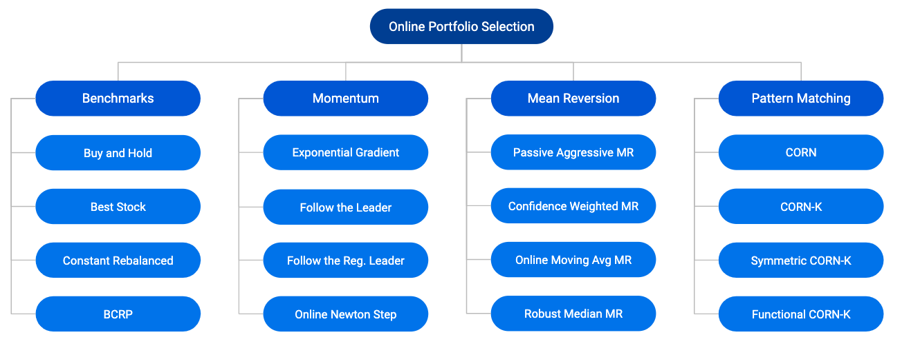
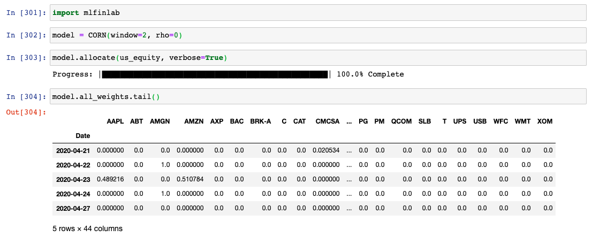
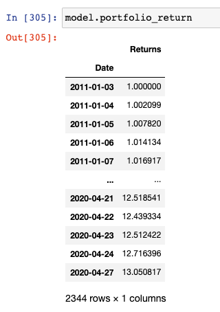
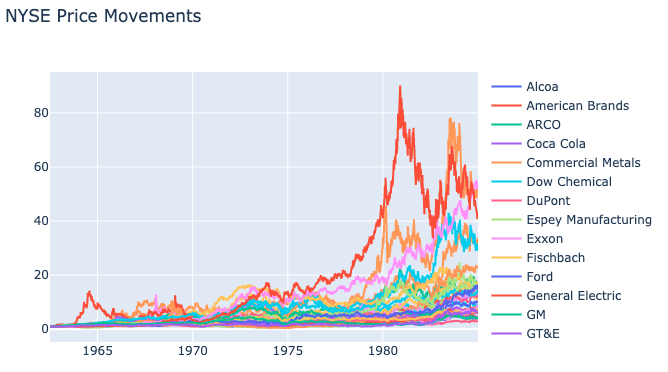
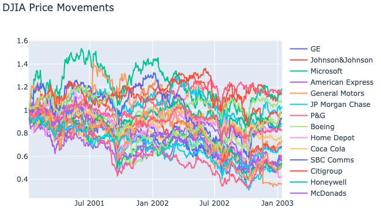
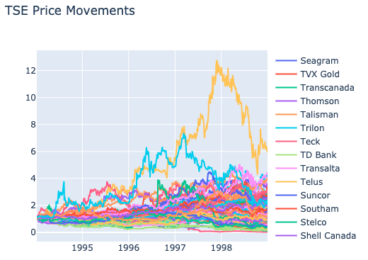
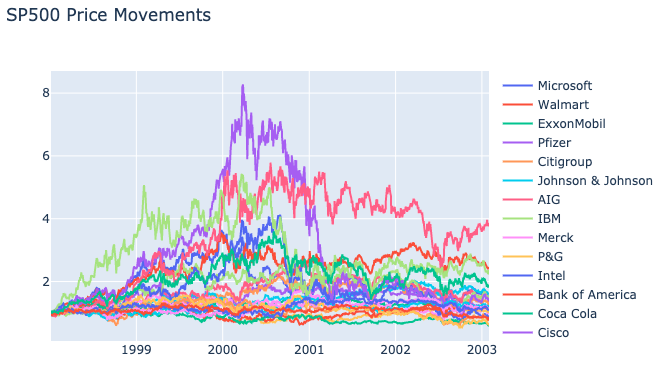
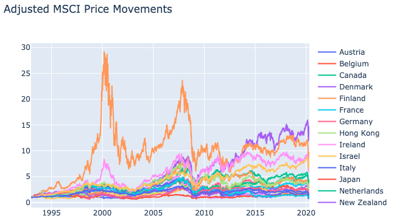
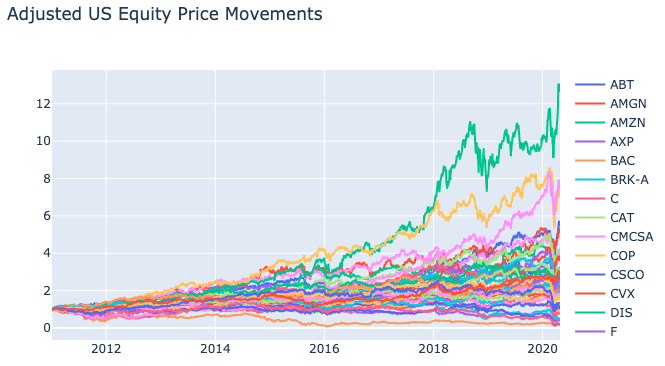

.. _online_portfolio_selection-introduction:

.. note::
    Special thanks to Li and Hoi's `OLPS <https://github.com/OLPS/OLPS>`_ toolbox and
    Marigold's `Universal Portfolio <https://github.com/Marigold/universal-portfolios>`_ for the implementation
    of the Online Portfolio Selection module.

.. note::
    The online portfolio selection module contains different algorithms that are used for asset allocation and optimizing strategies. Each
    algorithm is encapsulated in its own class and has a public method called ``allocate()`` which calculates the weight allocations
    on the specific user data. This way, each implementation can be called in the same way and makes it simple for users to use them.

----

============
Introduction
============

Online Portfolio Selection
##########################

Online Portfolio Selection can broadly be divided into two parts: Portfolio Selection and Online Learning.

Portfolio Selection is a sequential allocation among a set of assets to maximize the final return of investment.
Every day a portfolio manager is given a task to decide the allocation of capital, and we formulate the problem
so that the weights and the daily returns can be represented in a vector format. The product of the two will represent
the daily returns of the strategy.

Online Learning utilizes computationally efficient algorithms to handle large scale applications. You could have
the best strategy in the world that predicts the stock market movements 100% of the time. However, if your strategy
takes one day to run, you would not be able to capture the opportunity presented by the situation. It is imperative
that these update algorithms can be done in a set amount of time and preferably a quick one to that. This would
actually expand the application of this selection algorithm to not only a daily or weekly time frame to something
that can be applied to even intraday or mid-frequency settings as well.

It is also noteworthy to understand that traditional theories for portfolio selection, such as Markowitz’s
Portfolio Theory, optimize the balance between the portfolio's risks and returns. However, online portfolio
selection is founded on the capital growth theory, which solely focuses on maximizing the returns of the current
portfolio. Because the capital growth theory primarily relies on the Kelly criterion, traditional metrics such as
Sharpe ratios and maximum drawdowns are more so less useful. The primary metric in this situation becomes the log
of final wealth, which in turn indicates the maximum of final wealth.

Four different strategies are currently implemented in the Online Portfolio Selection module with the
above diagram available for a general overview of some of the strategies.

1. Benchmarks

2. Momentum

3. Mean Reversion

4. Pattern Matching

All of the online portfolio selection strategies will be built on top of the base constructor class ``OLPS``.

.. warning::
    Online Portfolio Selection module does not support:

    1. Transaction costs
    2. Short selling
    3. Data points with null or 0 value.

Import
######

Strategies can be imported by using variations of the following lines.

.. code-block::

    # Import all strategies.
    from mlfinlab.online_portfolio_selection import *

    # Import all benchmark strategies.
    from mlfinlab.online_portfolio_selection.benchmarks import *

    # Import all momentum strategies.
    from mlfinlab.online_portfolio_selection.momentum import *

    # Import all mean reversion strategies.
    from mlfinlab.online_portfolio_selection.mean_reversion import *

    # Import all pattern matching strategies.
    from mlfinlab.online_portfolio_selection.pattern_matching import *

    # Import a specific buy and hold strategy.
    from mlfinlab.online_portfolio_selection import BAH

    # Import buy and hold and universal portfolio.
    from mlfinlab.online_portfolio_selection import BAH, UP

Initialize
##########

Strategies are first initialized to create an object. Certain strategies require parameters to initialize.

.. code-block::

    # Initialize Buy and Hold.
    bah = BAH()

    # Initialize Passive Aggressive Mean Reversion.
    pamr = PAMR(optimization_method=1, epsilon=0.5, agg=10)

    # Initialize Correlation Driven Nonparametric Learning - K
    cornk = CORNK(window=2, rho=5, k=2)

Allocate
########

All strategies use ``allocate()`` to calculate the portfolio weights based on the given data. The user must supply the given data in a ``pd.DataFrame`` that is indexed by time.

Three additional options are available for the ``allocate`` method.

- ``weights`` is an option for the user to supply the initial weights.
- ``resample_by`` changes the reallocation period for the portfolio.
- ``verbose`` prints out a progress bar to allow users to follow the status.

.. code-block::

    # Initialize Buy and Hold.
    bah = BAH()

    # Allocate with no additional inputs.
    bah.allocate(price_data)

    # Allocate with monthly portfolio rebalancing.
    bah.allocate(price_data, resample_by='M')

    # Allocate with user given weights.
    bah.allocate(price_data, weights=some_weight)

    # Allocate with printed progress bar.
    bah.allocate(price_data, verbose=True)

.. automodule:: mlfinlab.online_portfolio_selection.base

    .. automethod:: OLPS.allocate

Result
######

Upon weights allocation the possible outputs are:

- ``self.weights`` (np.array) Final portfolio weights prediction.
- ``self.all_weights`` (pd.DataFrame) Portfolio weights for the time period.
- ``self.asset_name`` (list) Name of assets.
- ``self.number_of_assets`` (int) Number of assets.
- ``self.time`` (datetime) Time index of the given data.
- ``self.length_of_time`` (int) Number of time periods.
- ``self.relative_return`` (np.array) Relative returns of the assets.
- ``self.portfolio_return`` (pd.DataFrame) Cumulative portfolio returns over time.
- ``self.asset_prices`` (pd.DataFrame)`` Historical asset prices (daily close).

.. note::
    ``self.all_weights`` returns all the predicted weights for the entire given dataset.
    To interpret the results, if you see that for ``2015-5-16`` the final weights are
    ``{A: 0.2, B:0.3, C:0.5}``, the strategy has predicted those particular weights given
    the data until ``2015-05-15``. The daily returns (or any periodic returns) are then
    calculated by the dot product of the weights and returns.

.. note::
    If you want to put this in a production setting, it is important to see if the particular
    algorithm will require the entire dataset or just a particular window. As an example,
    ``OLMAR-1`` and ``RMR`` both have a given window value as a lookback period. Therefore,
    as long as we have the given weights that we calculated from the previous run and
    sufficient data to cover the window value, we can output the new weights by adjusting the
    ``weights`` for ``.allocate()`` and the given ``asset_prices``. However, this method will
    not work for strategies that look back for the entire period. ``OLMAR-2`` is an exponential
    moving average algorithm that incorporates data for all periods and ``CORN`` algorithms look
    at all historical values as well.

.. code-block::

    # Initialize Buy and Hold.
    bah = BAH()

    # Allocate with no additional inputs.
    bah.allocate(price_data)

    # All weights for the portfolio.
    bah.all_weights

    # Portfolio returns.
    bah.portfolio_return

Data
####

Data selection is one of the hardest problems in research. With numerous test sets and a vast amount of resources
available to the public, it is tempting to overfit and choose the data that best represent your hypothesis.
However, conclusions that are reached from these weak models are more prone to outliers and can have a narrow
scope for applications. Online portfolio selection also deals with the same issues as it is heavily dependent
on the data available.

Traditional papers for online portfolio selection have consistently used the same datasets and developed their
arguments to improve on the performance of the prior papers. Thomas Cover first used a NYSE dataset that
contained 36 stocks from 1962 to 1984. Allan Borodin collected three datasets: 88 stocks from the Toronto
Stock Exchange from 1994 to 1998, the largest 25 stocks by market capitalization on S&P500 from 1998 to 2003,
and 30 stocks from DJIA from 2001 to 2003. Bin Li and Steven Hoi introduced the MSCI World Index from 2006
to 2010 to add an additional perspective to the problem.

All of these datasets have different characteristics as Cover’s NYSE dataset all increased in value whereas
most assets in DJIA lost value. The S&P 500 data contains both a bull and bear market environment, and the
stocks from TSE originate from a less liquid market and a long bear run. However, these mediations do not
seem enough to justify the applications and practicality of the newest module.

To offset these older datasets in my research, I’ll expand the MSCI world index to look back from 1993
to 2020 and also include 44 largest US stocks by market capitalization from 2011 to 2020. Through a different
lens of selection, I hope to introduce the readers to a more practical and familiar set of stocks to
understand the module in a more intuitive way.

NYSE 1962-1984
**************

This is the original NYSE data that Thomas Cover used for his papers. Although it covers a lot of sectors
and should have been useful when the paper was published, it is difficult to gauge if this dataset adds
much value now because of the time difference.

Strategies that worked a year ago could quickly lose their value as the paradigm shifts. This data is
collected almost 60 years ago, and markets nowadays have many complex movements that cannot be comprehended
with data from a long time ago. Results from this data should be approached with a grain of salt.

Generally, most assets in this dataset increased by a significant amount. The notable outperforming companies
are American Brands and Commercial Metals, and the least performing stock, DuPont, still ended with 2.9 times
returns as no stocks in this list decreased in value.

DJIA 2001-2003
**************

This is a more recent dataset that involves companies that are still well known to us. 2001 to 2003 covers
a bear market run that should be useful to see how our strategies are affected in times of general downturn.
Most of these assets lost in value.

DJIA from 2001 to 2003 provides strikingly different patterns compared to the previous NYSE data.
Only 5 companies increased in price as most declined at a steady rate.

TSE 1994-1998
*************

The Toronto Stock Exchange data includes a collection that may be unfamiliar to most researchers. It is an
interesting universe with half of the stocks decreasing in value. With a combination of both overperforming
and underperforming stocks, selection strategies will need to identify the ups and downs to have profitable returns.

Half of the stocks decreasing in value. With a combination of both overperforming and underperforming stocks,
selection strategies need to identify the ups and downs to have profitable returns.

SP500 1998-2003
***************

This dataset also includes the bear and bull run during turbulent times. It is longer than the DJIA data by
3 more years and includes many companies that are familiar to us. This will be a good comparison to our new
US Equity dataset which looks at more recent history for most of these companies.

This dataset also includes the bear and bull run during turbulent times. It is longer than the DJIA data by 3 years
and includes many companies that are familiar to us. SP500 during this time goes through the bear market in 2000,
and in the long run, all but 5 companies increase in value.

MSCI 1993-2020
**************

I used the MSCI Developed Markets Index from 1993/01/01, which includes 23 countries:

- Americas: USA, Canada
- Europe & Middle East: Austria, Belgium, Denmark, Finland, France, Germany, Ireland, Israel, Italy, Netherlands, Norway, Portugal, Spain, Sweden, Switzerland, United Kingdom
- Pacific: Australia, Hong Kong, Japan, New Zealand, Singapore

Different from traditional assets, the world indexes capture much more than just the price changes of individual
companies. With an overarching representation of the countries' market states, these market indexes will present a
different idea for applications of OLPS strategies.

Finland is not the first country to come in mind with metrics like these, but the rise and fall of Finland
around the 2000s puts every other country aside. Most countries show movements that are strongly correlated with each other.

US Equity 2011-2020
*******************

For a more recent dataset, I collected the 44 largest US stocks based on market capitalization according to a
Financial Times `report <http://media.ft.com/cms/253867ca-1a60-11e0-b003-00144feab49a.pdf>`_.

Although included in the original report, I did not include United Technologies and Kraft Foods due to M&A
and also excluded Hewlett-Packard because of the company split in 2015.

This dataset will be particularly interesting because it also includes the recent market impact by the coronavirus
as well. With 10 years of continuous bull run after the financial crisis in 2008, we can examine which strategy
was the most robust to the rapidly changing market paradigm in the last month.

The companies included are:

Exxon Mobil, Apple, Microsoft, Berkshire Hathaway, General Electric, Walmart, Chevron, IBM, PG, ATT, Johnson and Johnson,
JP Morgan, Wells Fargo, Oracle, Coca-Cola, Google, Pfizer, Citi, Bank of America, Intel, Schlumberger, Cisco, Merck,
Philip Morris, PepsiCo, ConocoPhillips, Goldman Sachs, McDonald’s, Amazon, Qualcomm, Occidental Petroleum, Abbott Laboratories,
Walt Disney, 3M, Comcast, Caterpillar, General Motors, Home Depot, Ford, Freeport-McMoran Copper & Gold, United Parcel Service,
Amgen, US Bancorp, American Express

Amazon has been the clear winner for the past 10 years with Microsoft and Home Depot being a close second.
One key note for this data will be to see how our strategies fared during the downturn caused by the coronavirus.
