.. _online_portfolio_selection-mean_reversion:

.. note::

    Strategies were implemented with modifications from:

    1. `Li, B., Zhao, P., Hoi, S.C. and Gopalkrishnan, V., 2012. PAMR: Passive aggressive mean reversion strategy for portfolio selection. Machine learning, 87(2), pp.221-258. <https://link.springer.com/content/pdf/10.1007/s10994-012-5281-z.pdf>`_
    2. `Li, B., Hoi, S.C., Zhao, P. and Gopalkrishnan, V., 2013. Confidence weighted mean reversion strategy for online portfolio selection. ACM Transactions on Knowledge Discovery from Data (TKDD), 7(1), pp.1-38. <https://dl.acm.org/doi/pdf/10.1145/2435209.2435213>`_
    3. `Li, B. and Hoi, S.C., 2012. On-line portfolio selection with moving average reversion. arXiv preprint arXiv:1206.4626. <https://arxiv.org/pdf/1206.4626.pdf>`_
    4. `Huang, D., Zhou, J., Li, B., Hoi, S.C. and Zhou, S., 2016. Robust median reversion strategy for online portfolio selection. IEEE Transactions on Knowledge and Data Engineering, 28(9), pp.2480-2493. <https://core.ac.uk/download/pdf/35455615.pdf>`_

==============
Mean Reversion
==============

Mean Reversion is an effective quantitative strategy based on the theory that prices will revert back to its historical mean.
A basic example of mean reversion follows the benchmark of Constant Rebalanced Portfolio. By setting a predetermined allocation of
weight to each asset, the portfolio shifts its weights from increasing to decreasing ones.

Through this documentation, the importance of hyperparameters is highlighted as the choices greatly affect the outcome of returns.
A lot of the hyperparameters for traditional research has been chosen by looking at the data in hindsight, and fundamental analysis
of each dataset and market structure is required to profitably implement this strategy in a real-time market scenario.

There are four mean reversion strategies implemented in the Online Portfolio Selection module.

----

Passive Aggressive Mean Reversion
#################################

Passive Aggressive Mean Reversion alternates between a passive and aggressive approach to the current market conditions.
The strategy can effectively prevent a huge loss and maximize returns by setting a threshold for mean reversion.

PAMR takes in a variable :math:`\epsilon`, a threshold for the market condition. If the portfolio returns for the period are
below :math:`\epsilon`, then PAMR will passively keep the previous portfolio, whereas if the returns are above the threshold,
the portfolio will actively rebalance to the less performing assets.

In a way, :math:`\epsilon` can be interpreted as the maximum loss for the portfolio. It is most likely that the asset that
decreased in prices for the period will bounce back, but there are cases where some companies plummet in value. PAMR
is an effective algorithm that will prevent huge losses in blindly following these assets.

PAMR defines a loss function:

.. math::
    l_{\epsilon} (b; x_t)

If the returns for the period are below the threshold, :math:`\epsilon`:

.. math::
    l_{\epsilon} (b; x_t) = 0

For returns that are higher than :math:`\epsilon`:

.. math::
    l_{\epsilon} (b; x_t) = b \cdot x_t - \epsilon

Typically :math:`\epsilon` is set at a value between 0 and 1 and closer to 1 as daily returns fluctuate around 1.

We will introduce three versions of Passive Aggressive Mean Reversion: PAMR, PAMR-1, and PAMR-2.

- :math:`b_t` is the portfolio vector at time :math:`t`.
- :math:`x_t` is the price relative change at time :math:`t`. It is calculated by :math:`\frac{p_t}{p_{t-1}}`, where :math:`p_t` is the price at time :math:`t`.
- :math:`\epsilon` is the mean reversion threshold constant.

PAMR
****

The first method is described as the following optimization problem:

.. math::
    b_{t+1} = \underset{b \in \Delta_m}{\arg\min} \frac{1}{2} \|b-b_t \|^2 \: \text{s.t.} \: l_{\epsilon}(b;x_t)=0

With the original problem formulation and :math:`\epsilon` parameters, PAMR is the most basic implementation.

PAMR-1
******

PAMR-1 introduces a slack variable to PAMR.

:math:`C` is a positive parameter that can be interpreted as the aggressiveness of the strategy.

.. math::
    b_{t+1} = \underset{b \in \Delta_m}{\arg\min} \left\lbrace\frac{1}{2} \|b-b_t \|^2 + C\xi\right\rbrace \: \text{s.t.} \: l_{\epsilon}(b;x_t) \leq \xi \geq 0

A higher :math:`C` value indicates the affinity to a more aggressive approach.

PAMR-2
******

PAMR-2 contains a quadratic term to the original slack variable from PAMR-1.

.. math::
    b_{t+1} = \underset{b \in \Delta_m}{\arg\min} \left\lbrace\frac{1}{2} \|b-b_t \|^2 + C\xi^2 \right\rbrace \: \text{s.t.} \: l_{\epsilon}(b;x_t) \leq \xi

By increasing the slack variable at a quadratic rate, the method regularizes portfolio deviations.

- :math:`C` is the aggressiveness of the strategy.
- :math:`\xi` is the slack variable used to calculate the optimization equation.
- :math:`\Delta_m` is the simplex domain. The sum of all elements is 1, and each element is in the range of [0, 1].

.. tip::

    PAMR-1 and PAMR-2 tends to have higher returns compared to a normal PAMR.

Parameters
**********

Using `optuna <https://optuna.org/>`_, we experimented with different parameters to provide a general guideline
for the users. For NYSE, aggressiveness was not an important parameter as returns were primarily affected by
the :math:`\epsilon` value. :math:`\epsilon` of 0 resulted as the
highest returns.

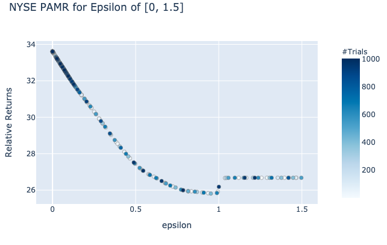

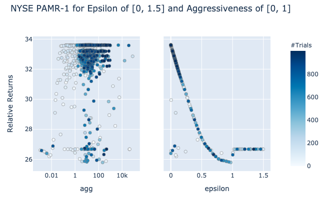

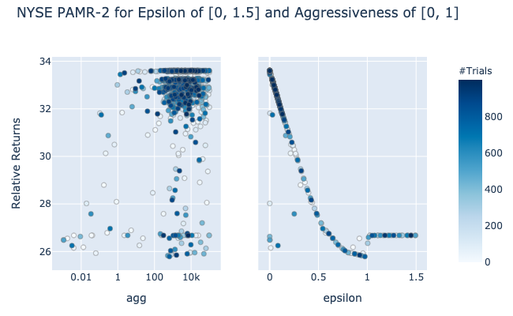

For the US Equity dataset, the optimal :math:`\epsilon` is actually 1; however, the difference in returns,
for :math:`\epsilon` of 0 and 1 is not too far apart. Aggressiveness continues to be a nominal factor as
a hyperparameter.

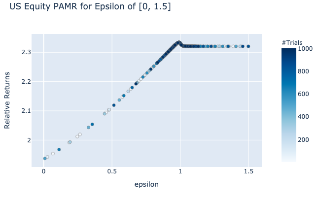

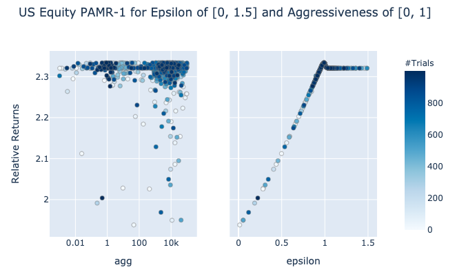

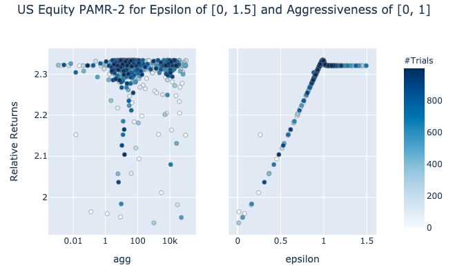

.. tip::

    - High :math:`\epsilon`: passive mean reversion.
    - Low :math:`\epsilon`: aggressive mean reversion.
    - Aggressiveness (Agg) has minimal impact on returns, but a value between 10 and 100 typically worked well.

Implementation
**************

.. automodule:: mlfinlab.online_portfolio_selection.pamr

    .. autoclass:: PAMR
        :members:
        :inherited-members:

        .. automethod:: __init__

Example Code
************

.. code-block::

    import pandas as pd
    from mlfinlab.online_portfolio_selection import *

    # Read in data.
    stock_prices = pd.read_csv('FILE_PATH', parse_dates=True, index_col='Date')

    # Compute Passive Aggressive Mean Reversion with no given weights and epsilon of 0.3.
    pamr = PAMR(optimization_method=0, epsilon=0.3)
    pamr.allocate(asset_prices=stock_prices, resample_by='W', verbose=True)

    # Compute Passive Aggressive Mean Reversion - 1 with given user weights and epsilon of 0.4.
    pamr1 = PAMR(optimization_method=1, epsilon=0.4, agg=20)
    pamr1.allocate(asset_prices=stock_prices, weights=some_weight)

    # Compute Passive Aggressive Mean Reversion - 2 with given user weights and epsilon of 0.8.
    pamr2 = PAMR(optimization_method=2, epsilon=0.8, agg=1000)
    pamr2.allocate(asset_prices=stock_prices, weights=some_weight)

    # Get the latest predicted weights.
    pamr.weights

    # Get all weights for the strategy.
    pamr1.all_weights

    # Get portfolio returns.
    pamr2.portfolio_return

----

Confidence Weighted Mean Reversion
##################################

Extending from PAMR, Confidence Weighted Mean Reversion looks at the autocovariance across all assets.
Instead of focusing on a single asset's deviation from the original price, CWMR takes in second-order
information about the portfolio vector as well to formulate a set of weights.

For CWMR, we introduce :math:`\sum`, a measure of anti-confidence in the portfolio weights, where a smaller
value represents higher confidence for the corresponding portfolio weights.

.. math::
    (\mu_{t+1}, \Sigma_{t+1}) = \underset{\mu \in \Delta_m, \Sigma}{\arg\min}D_{KL}(N(\mu,\Sigma) | N(\mu_t,\Sigma_t) )

If the returns for the period are below the threshold, :math:`\epsilon`:

.. math::
    \text{such that } Pr[b^{\top} \cdot x_t \leq \epsilon] \geq \theta \text{ and } \mu \in \Delta_m

Here the problem can be interpreted as maximizing the portfolio confidence by minimizing :math:`\Sigma` given
a confidence interval :math:`\theta` determined by the threshold, :math:`\epsilon`.

- :math:`b_t` is the portfolio vector at time :math:`t`.
- :math:`x_t` is the price relative change at time :math:`t`. It is calculated by :math:`\frac{p_t}{p_{t-1}}`, where :math:`p_t` is the price at time :math:`t`.
- :math:`\epsilon` is the mean reversion threshold constant.
- :math:`\theta` is the confidence interval for the given distribution.
- :math:`\mu_t` is the mean of the projected weights distribution at time :math:`t`.
- :math:`\Sigma_t` is the confidence matrix in the projected weights distribution at time :math:`t`.
- :math:`N(\mu_t, \Sigma_t)` is the normal distribution for the projected weights.
- :math:`D_{KL}` is the Kullback-Leibler Divergence. More information of KL Divergence is available `here <https://en.wikipedia.org/wiki/Kullback%E2%80%93Leibler_divergence>`_.

CWMR has two variations to solve this optimization problem with CWMR-SD and CWMR-Var.

CWMR-SD
*******

CWMR uses the Kullback-Leibler divergence to further formulate the optimization problem as following:

.. math::
    (\mu_{t+1}, \Sigma_{t+1}) = \arg \min \frac{1}{2} \left( \log(\frac{\det \Sigma_t}{\det \Sigma}) + Tr(\Sigma_t^{-1}\Sigma) + (\mu_t-\mu)^{\top}\Sigma_t^{-1}(\mu_t - \mu) \right)

.. math::
    \text{such that } \epsilon - \mu^{\top}\cdot x_t \geq \phi x_t^{\top} \Sigma x_t\text{, } \mu^{\top} \cdot \textbf{1} = 1 \text{, and } \mu \geq 0

CWMR-Var
********

The standard deviation method further assumes the PSD property of :math:`\Sigma` to refactor the equations as the following:

.. math::
    (\mu_{t+1},\Gamma_{t+1}) = \arg \min \frac{1}{2}\left(\log(\frac{\det \Gamma_t^2}{\det \Gamma^2}) +Tr(\Gamma_t^{-2}\Gamma^2) + (\mu_t - \mu)^{\top}\Gamma_t^{-2}(\mu_t -\mu) \right)

.. math::

    \text{such that }\epsilon - \mu^{\top}\cdot x_t \geq \phi || \Gamma x_t || \text{, }\Gamma \text{ is a PSD, }\mu^{\top} \cdot \textbf{1} = 1\text{, and }\mu \geq 0

- :math:`\phi` is the inverse of the cumulative distribution function for a given confidence interval.
- :math:`Tr` is the sum of the diagonal elements in a matrix.
- :math:`\Gamma` is the square root of the matrix :math:`\Sigma`.

.. warning::

    For both CWMR-Var and CWMR-SD, the calculations involve taking the inverse of a sum of another inverse matrix.
    The constant calculations of matrix inversion is extremely unstable and makes the model prone to any outliers and hyperparameters.

Parameters
**********

Using `optuna <https://optuna.org/>`_, we experimented with different parameters to provide a general guideline
for the users. CWMR in general does not have an optimal parameter. The results are extremely dependent on the
hyperparameters as seen with the case for the NYSE and TSE dataset.

For NYSE, a :math:`\epsilon` of 1 and confidence of 1 had the highest returns.

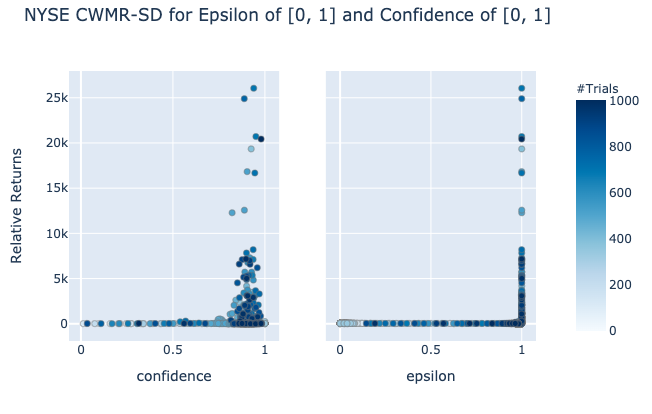

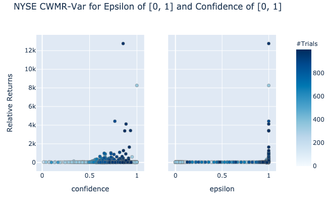

TSE has a much wider range, and it is difficult to pinpoint which parameters are actually the most useful.
At least for TSE, the SD method has higher returns with lower confidence value, whereas the VAR method
seems to indicate a congregation at 0.5.

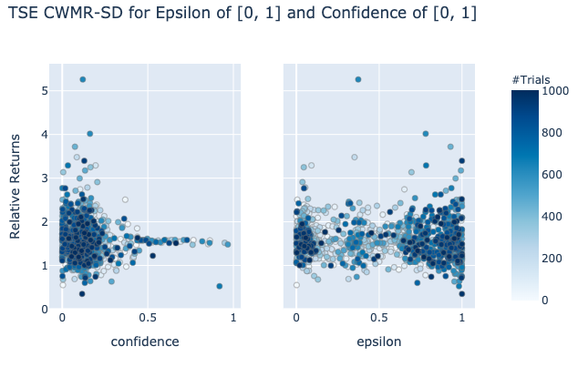

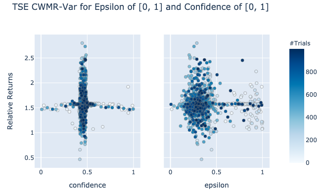

.. tip::

    It is difficult to gauge the optimal :math:`\epsilon` and confidence for any dataset. We recommend
    using other mean reversion strategies for implementations.

Implementation
**************

.. automodule:: mlfinlab.online_portfolio_selection.cwmr

    .. autoclass:: CWMR
        :members:
        :inherited-members:

        .. automethod:: __init__

Example Code
************

.. code-block::

    import pandas as pd
    from mlfinlab.online_portfolio_selection import *

    # Read in data.
    stock_prices = pd.read_csv('FILE_PATH', parse_dates=True, index_col='Date')

    # Compute Confidence Weighted Mean Reversion - SD with no given weights, epsilon of 0.5, and confidence of 0.5.
    cwmr_sd = CWMR(confidence=0.5, epsilon=0.5, method='sd')
    cwmr_sd.allocate(asset_prices=stock_prices, resample_by='W', verbose=True)

    # Compute Confidence Weighted Mean Reversion - Var with given user weights, epsilon of 1, and confidence of 1.
    cwmr_var = CWMR(confidence=1, epsilon=1, method='var')
    cwmr_var.allocate(asset_prices=stock_prices, weights=some_weight)

    # Get the latest predicted weights.
    cwmr_sd.weights

    # Get all weights for the strategy.
    cwmr_var.all_weights

    # Get portfolio returns.
    cwmr_sd.portfolio_return

----

Online Moving Average Reversion
###############################

Traditional mean reversion techniques have an underlying assumption that the next price relative is inversely
proportional to the latest price relative; however, mean reversion trends are not limited to a single period.
Unlike traditional reversion methods that rely on windows of just one, OLMAR looks to revert to the moving average of price data.

OLMAR proposes two different moving average methods: Simple Moving Average and Exponential Moving Average.

From these moving average methods, the strategy predicts the next period's price relative. Using this new prediction,
the portfolio iteratively updates its new weights.

.. math::
    b_{t+1} = b_t + \lambda_{t+1}(\tilde{x}_{t+1}-\bar x_{t+1}\textbf{1})

- :math:`\lambda` is the constant multiplier to the new weights, and it is determined by the deviation from
- :math:`\epsilon`, the reversion threshold. The portfolio will look to rebalance itself to the underperforming assets only if the portfolio returns are lower than the :math:`\epsilon` value.

.. math::
    \lambda_{t+1} = max \left\lbrace 0, \frac{\epsilon-b_t \cdot \tilde{x}_{t+1}}{\|\tilde{x}_{t+1}-\bar x_{t+1} \textbf{1}\|^2}\right\rbrace

OLMAR has two variations to solve this optimization problem with OLMAR-1 and OLMAR-2.

- :math:`b_t` is the portfolio vector at time :math:`t`.
- :math:`x_t` is the price relative change at time :math:`t`. It is calculated by :math:`\frac{p_t}{p_{t-1}}`, where :math:`p_t` is the price at time :math:`t`.
- :math:`\tilde{x}` is the projected price relative.
- :math:`\bar x` is the mean of the projected price relative.
- :math:`\epsilon` is the mean reversion threshold constant.
- :math:`\lambda` is the lagrangian multiplier to change the new weights.

OLMAR-1
*******

OLMAR-1 utilizes simple moving average to predict prices.

.. math::
    \tilde{x}_{t+1}(w) = \frac{SMA_t(w)}{p_t}

.. math::
    \: \: \: \: \: \: \: \: \: \: \: \: \: \: = \frac{1}{w} \left(\frac{p_t}{p_t} + \frac{p_{t-1}}{p_t}+ \cdot \cdot \cdot + \frac{p_{t-w+1}}{p_t}\right)

.. math::
    \: \: \: \: \: \: \: \: \: \: \: \: \: \: = \frac{1}{w} \left( 1+ \frac{1}{x_t}+ \cdot \cdot \cdot + \frac{1}{\odot^{w-2}_{i=0}x_{t-i}} \right)

OLMAR-2
*******

OLMAR-2 uses exponential moving average to predict prices.

.. math::
    \tilde{x}_{t+1}(\alpha) = \frac{EMA_t(\alpha)}{p_t}

.. math::

    \: \: \: \: \: \: \: \: \: \: \: \: \:= \frac{\alpha p_t+(1-\alpha)EMA_{t-1}(\alpha)}{p_t}

.. math::
    \: \: \: \: \: \: \: \: \: \: \: \: \:= \alpha \textbf{1} + (1 - \alpha) \frac{EMA_{t-1}(\alpha)}{p_{t-1}}\frac{p_{t-1}}{p_t}

.. math::
    \: \: \: \: \: \: \: \: \: \: \: \: \:= \alpha \textbf{1} + (1 - \alpha) \frac{\tilde{x_t}}{x_t}

- :math:`w` is the window value for simple moving average.
- :math:`\alpha` is the smoothing factor for exponential moving average.
- :math:`\bigodot` is the element-wise cumulative product. In this case, the cumulative product represents the overall change in prices.

.. tip::

    For both OLMAR-1 and OLMAR-2, the corresponding window and alpha values are the most important parameters.
    Every market has a different mean reversion pattern, and it is important to identify the exact parameter to apply this
    strategy in a real trading environment.

Parameters
**********

Using `optuna <https://optuna.org/>`_, we experimented with different parameters to provide a general guideline
for the users. :math:`\epsilon` has minimal impact on the returns as the primary driving paramter for these strategies
is corresponding window or alpha value.

For NYSE, optimal window for OLMAR-1 was 23, whereas optimal alpha was 0.4.

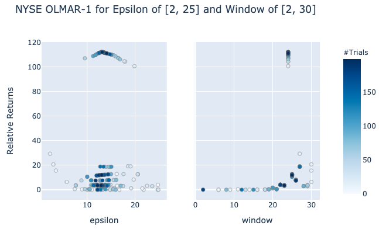

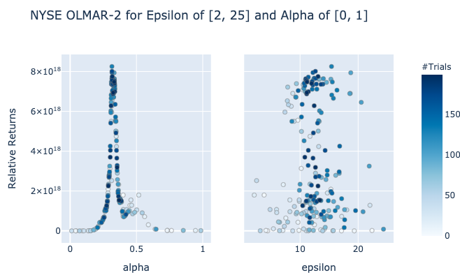

TSE's window was similar to that of NYSE, but the optimal alpha was much higher, with a value of 0.9.

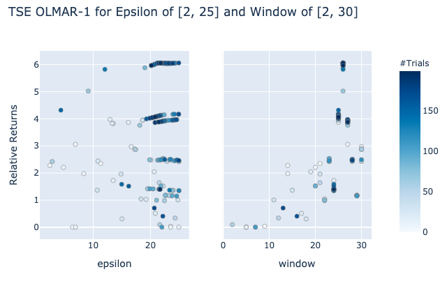

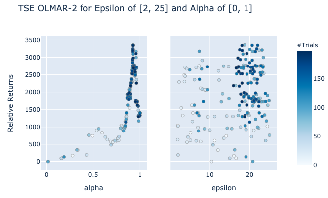

.. tip::

    - OLMAR-2 tends to have much higher returns compared to OLMAR-1, but this is also dependent on each dataset.
    - :math:`\epsilon` has minimal effect on returns.

Implementation
**************

.. automodule:: mlfinlab.online_portfolio_selection.olmar

    .. autoclass:: OLMAR
        :members:
        :inherited-members:

        .. automethod:: __init__

Example Code
************

.. code-block::

    import pandas as pd
    from mlfinlab.online_portfolio_selection import *

    # Read in data.
    stock_prices = pd.read_csv('FILE_PATH', parse_dates=True, index_col='Date')

    # Compute Online Moving Average Reversion - 1 with no given weights, epsilon of 10, and window of 7.
    olmar1 = OLMAR(reversion_method=1, epsilon=10, window=7)
    olmar1.allocate(asset_prices=stock_prices, resample_by='W', verbose=True)

    # Compute Online Moving Average Reversion - 2 with given user weights, epsilon of 100, and alpha of 0.6.
    olmar2 = OLMAR(reversion_method=2, epsilon=100, alpha=0.6)
    olmar2.allocate(asset_prices=stock_prices, weights=some_weight)

    # Get the latest predicted weights.
    olmar1.weights

    # Get all weights for the strategy.
    olmar2.all_weights

    # Get portfolio returns.
    olmar1.portfolio_return

----

Robust Median Reversion
#######################

Robust Median Reversion extends the previous Online Moving Average Reversion by introducing L1 median of the specified windows.
Instead of reverting to a moving average, RMR reverts to the L1 median estimator, which proves to be a more effective method of
predicting the next period's price because financial data is inherently noisy and contains many outliers.

L1-median is calculated with the following equation:

.. math::
    \mu = \underset{\mu}{\arg \min}\overset{k-1}{\underset{i=0}{\sum}}||p_{t-i} - \mu ||

where :math:`k` is the number of historical price windows, and :math:`\mu` represents the predicted price.

The calculation of L1-median is computationally inefficient, so the algorithm will be using the Modified Weiszfeld Algorithm.

.. math::
    \hat{x}_{t+1} = T(\mu) = (1 - \frac{\eta(\mu)}{\gamma(\mu)})^+ \: \tilde{T}(\mu) + \min(1,\frac{\eta(\mu)}{\gamma(\mu)})\mu

.. math::
    \eta(\mu) = 1 \text{ if } \mu =\text{ any price and }0 \text{ otherwise.}

.. math::
    \gamma(\mu)=\left|\left|\underset{p_{t-i} \neq \mu}{\sum}\frac{p_{t-i}-\mu}{||p_{t-i}-\mu||}\right|\right|

.. math::
    \tilde{T}(\mu)=\left\lbrace \underset{p_{t-i}\neq \mu}{\sum}\frac{1}{||p_{t-i}-\mu||}\right\rbrace^{-1}\underset{p_{t-i}\neq \mu}{\sum}\frac{p_{t-i}}{||p_{t-i}-\mu||}

Then next portfolio weights will use the predicted price to produce the optimal portfolio weights.

.. math::
    b_{t+1} = b_{t} - \min \left \lbrace 0, \frac{\hat{x}_{t+1} b_t-\epsilon}{||\hat{x}_{t+1}-\bar{x}_{t+1}\cdot\textbf{1}||^2}\right \rbrace \cdot (\hat{x}_{t+1}-\bar{x}_{t+1}\cdot\textbf{1})

- :math:`b_t` is the portfolio vector at time :math:`t`.
- :math:`x_t` is the price relative change at time :math:`t`. It is calculated by :math:`\frac{p_t}{p_{t-1}}`, where :math:`p_t` is the price at time :math:`t`.
- :math:`\mu_t` is the projected price.
- :math:`\hat{x}` is the projected price relative.
- :math:`\bar{x}` is the mean of the projected price relative.

Parameters
**********

Using `optuna <https://optuna.org/>`_, we experimented with different parameters to provide a general guideline
for the users. Similarly to OLMAR, the parameters primarily depend on the window value. N_iteration of 200 typically had
the highest results with a :math:`\epsilon` range of 15 to 25. Ultimately, the window range that decides
the period of mean reversion was the most influential parameter to affect the portfolio's results.

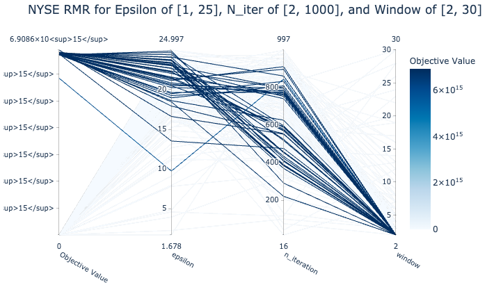

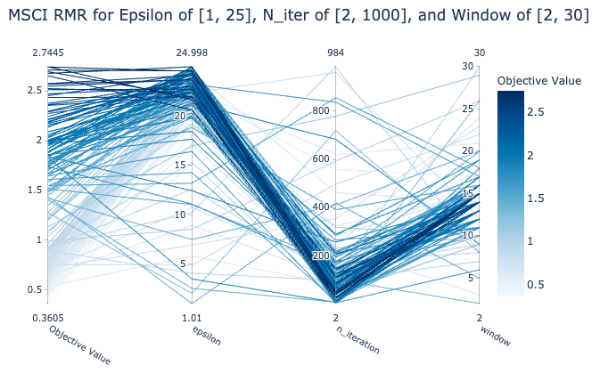

.. tip::

    - Window values tended to be more experimental and is the most important parameter for RMR.
    - N_iteration of 200 typically had higher results.
    - :math:`\epsilon` range of 15 to 25 worked for many datasets.
    - It is recommended to leave the :math:`\tau` at 0.001 for computational issues.

Implementation
**************

.. automodule:: mlfinlab.online_portfolio_selection.rmr

    .. autoclass:: RMR
        :members:
        :inherited-members:

        .. automethod:: __init__

Example Code
************

.. code-block::

    import pandas as pd
    from mlfinlab.online_portfolio_selection import *

    # Read in data.
    stock_prices = pd.read_csv('FILE_PATH', parse_dates=True, index_col='Date')

    # Compute Robust Median Reversion with no given weights, epsilon of 15, n_iteration of 100, and window of 7.
    rmr = RMR(epsilon=15, n_iteration=100, window=7)
    rmr.allocate(asset_prices=stock_prices, resample_by='W', verbose=True)

    # Compute Robust Median Reversion with given user weights, epsilon of 25, n_iteration of 500, and window of 21.
    rmr1 = RMR(epsilon=25, n_iteration=500, window=21)
    rmr1.allocate(asset_prices=stock_prices, weights=some_weight)

    # Get the latest predicted weights.
    rmr.weights

    # Get all weights for the strategy.
    rmr.all_weights

    # Get portfolio returns.
    rmr1.portfolio_return

----

Research Notebook
#################

    The following `mean reversion <https://github.com/hudson-and-thames/research/blob/master/Online%20Portfolio%20Selection/Online%20Portfolio%20Selection%20-%20Mean%20Reversion.ipynb>`_
    notebook provides a more detailed exploration of the strategies.
