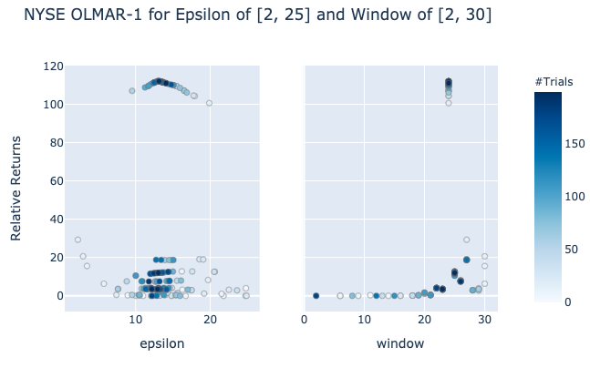

.. _online_portfolio_selection-mean_reversion-online_moving_average_reversion:

.. note::
    The online portfolio selection module contains different algorithms that are used for asset allocation and optimizing strategies. Each
    algorithm is encapsulated in its own class and has a public method called ``allocate()`` which calculates the weight allocations
    on the specific user data. This way, each implementation can be called in the same way and makes it simple for users to use them.
    Next up, let's discuss some of these implementations and the different parameters they require.

================================
Online Moving Average Reversion
================================

Traditional mean reversion techniques have an underlying assumption that the next price relative is inversely
proportional to the latest price relative; however, mean reversion trends are not limited to a single period.
Unlike traditional reversion methods that rely on windows of just one, OLMAR looks to revert to the moving average of price data.

OLMAR proposes two different moving average methods: Simple Moving Average and Exponential Moving Average.

From these moving average methods, the strategy predicts the next period's price relative. Using this new prediction,
the portfolio iteratively updates its new weights.

.. math::
    b_{t+1} = b_t + \lambda_{t+1}(\tilde{x}_{t+1}-\bar x_{t+1}\textbf{1})

:math:`\lambda` is the constant multiplier to the new weights, and it is determined by the deviation from
:math:`\epsilon`, the reversion threshold. The portfolio will look to rebalance itself to the underperforming
assets only if the portfolio returns are lower than the :math:`\epsilon` value.

.. math::
    \lambda_{t+1} = max \left\lbrace 0, \frac{\epsilon-b_t \cdot \tilde{x}_{t+1}}{\|\tilde{x}_{t+1}-\bar x_{t+1} \textbf{1}\|^2}\right\rbrace

OLMAR has two variations to solve this optimization problem with OLMAR-1 and OLMAR-2.

- :math:`b_t` is the portfolio vector at time :math:`t`.
- :math:`x_t` is the price relative change at time :math:`t`. It is calculated by :math:`\frac{p_t}{p_{t-1}}`, where :math:`p_t` is the price at time :math:`t`.
- :math:`\tilde{x}` is the projected price relative.
- :math:`\bar x` is the mean of the projected price relative.
- :math:`\epsilon` is the mean reversion threshold constant.
- :math:`\lambda` is the lagrangian multiplier to change the new weights.

1. OLMAR-1
##########

OLMAR-1 utilizes simple moving average to predict prices.

.. math::
    \tilde{x}_{t+1}(w) = \frac{SMA_t(w)}{p_t}

.. math::
    \: \: \: \: \: \: \: \: \: \: \: \: \: \: = \frac{1}{w} \left(\frac{p_t}{p_t} + \frac{p_{t-1}}{p_t}+ \cdot \cdot \cdot + \frac{p_{t-w+1}}{p_t}\right)

.. math::
    \: \: \: \: \: \: \: \: \: \: \: \: \: \: = \frac{1}{w} \left( 1+ \frac{1}{x_t}+ \cdot \cdot \cdot + \frac{1}{\odot^{w-2}_{i=0}x_{t-i}} \right)

2. OLMAR-2
##########

OLMAR-2 uses exponential moving average to predict prices.

.. math::
    \tilde{x}_{t+1}(\alpha) = \frac{EMA_t(\alpha)}{p_t}

.. math::

    \: \: \: \: \: \: \: \: \: \: \: \: \:= \frac{\alpha p_t+(1-\alpha)EMA_{t-1}(\alpha)}{p_t}

.. math::
    \: \: \: \: \: \: \: \: \: \: \: \: \:= \alpha \textbf{1} + (1 - \alpha) \frac{EMA_{t-1}(\alpha)}{p_{t-1}}\frac{p_{t-1}}{p_t}

.. math::
    \: \: \: \: \: \: \: \: \: \: \: \: \:= \alpha \textbf{1} + (1 - \alpha) \frac{\tilde{x_t}}{x_t}

- :math:`w` is the window value for simple moving average.
- :math:`\alpha` is the smoothing factor for exponential moving average.
- :math:`\bigodot` is the element-wise cumulative product. In this case, the cumulative product represents the overall change in prices.

.. tip::

    For both OLMAR-1 and OLMAR-2, the corresponding window and alpha values are the most important parameters.
    Every market has a different mean reversion pattern, and it is important to identify the exact parameter to apply this
    strategy in a real trading environment.

.. tip::

    The following research `notebook <https://github.com/hudson-and-thames/research/blob/master/Online%20Portfolio%20Selection/Online%20Portfolio%20Selection%20-%20Mean%20Reversion.ipynb>`_
    provides a more detailed exploration of the strategies.

Parameters
----------

:math:`\epsilon` has minimal impact on the returns as the primary driving paramter for these strategies
is corresponding window or alpha value.

For NYSE, optimal window for OLMAR-1 was 23, whereas optimal alpha was 0.4.

.. image:: mean_reversion_images/nyse_olmar2.png
   :width: 49 %

TSE's window was similar to that of NYSE, but the optimal alpha was much higher, with a value of 0.9.

.. image:: mean_reversion_images/tse_olmar1.png
   :width: 49 %

.. image:: mean_reversion_images/tse_olmar2.png
   :width: 49 %

Implementation
--------------

.. automodule:: mlfinlab.online_portfolio_selection.mean_reversion.online_moving_average_reversion

    .. autoclass:: OLMAR
        :members:
        :show-inheritance:
        :inherited-members:

        .. automethod:: __init__

Example Code
############

.. code-block::

    import pandas as pd
    from mlfinlab.online_portfolio_selection import *

    # Read in data.
    stock_prices = pd.read_csv('FILE_PATH', parse_dates=True, index_col='Date')

    # Compute Online Moving Average Reversion - 1 with no given weights, epsilon of 10, and window of 7.
    olmar1 = OLMAR(reversion_method=1, epsilon=10, window=7)
    olmar1.allocate(asset_prices=stock_prices, resample_by='W', verbose=True)

    # Compute Online Moving Average Reversion - 2 with given user weights, epsilon of 100, and alpha of 0.6.
    olmar2 = OLMAR(reversion_method=2, epsilon=100, alpha=0.6)
    olmar2.allocate(asset_prices=stock_prices, weights=some_weight)

    # Get the latest predicted weights.
    olmar1.weights

    # Get all weights for the strategy.
    olmar2.all_weights

    # Get portfolio returns.
    olmar1.portfolio_return

.. tip::

    Strategies were implemented with modifications from `Li, Bin & Hoi, Steven. (2012). On-Line Portfolio
    Selection with Moving Average Reversion. Proceedings of the 29th International Conference on
    Machine Learning, ICML 2012. 1. <https://arxiv.org/pdf/1206.4626.pdf>`_
