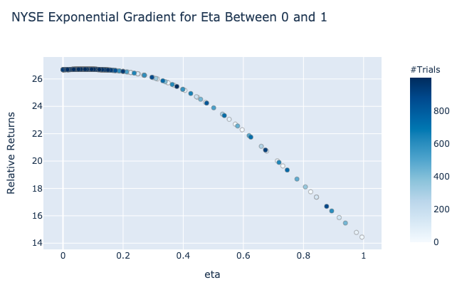
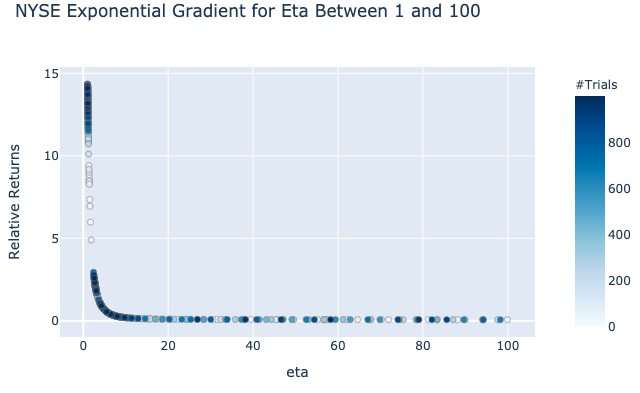
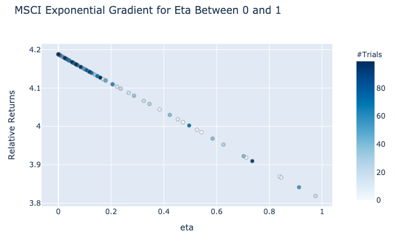
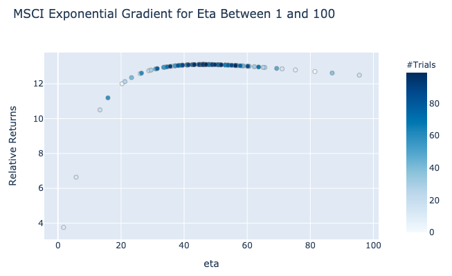
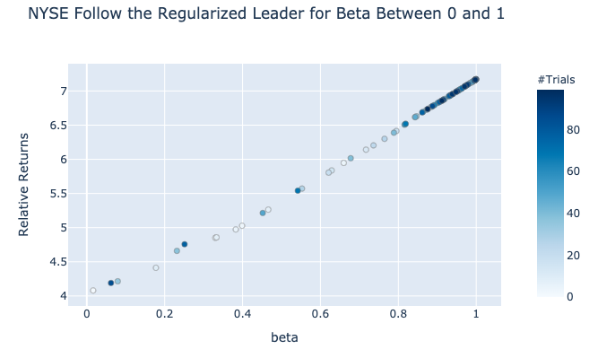
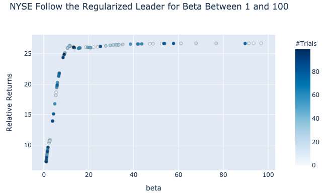
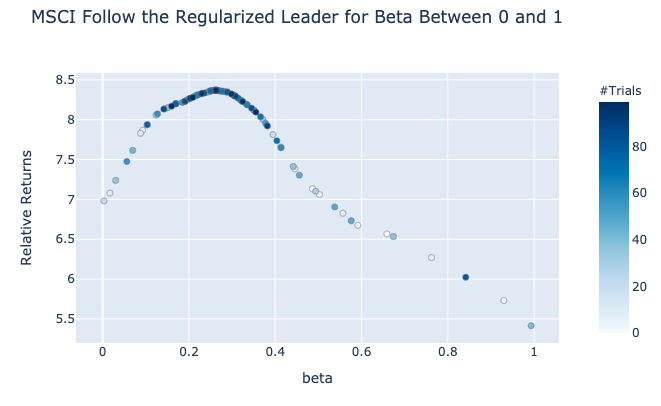
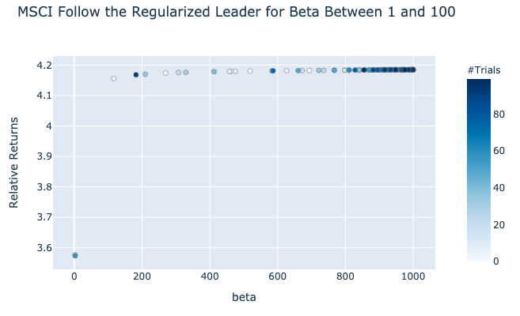

.. _online_portfolio_selection-momentum:

.. note::

    Strategies were implemented with modifications from:

    1. `Li, B., Hoi, S. C.H., 2012. OnLine Portfolio Selection: A Survey. ACM Comput. Surv. V, N, Article A (December 2012), 33 pages. <https://arxiv.org/abs/1212.2129>`_

========
Momentum
========

Momentum strategies have been a popular quantitative strategy in recent decades as the simple but powerful trend-following
allows investors to exponentially increase their returns. This module will implement two types of momentum strategy with one
following the best-performing assets in the last period and the other following the Best Constant Rebalanced Portfolio until the last period.

There are three momentum strategies implemented in the Online Portfolio Selection module.

----

Exponential Gradient
####################

Exponential Gradient is a momentum strategy that focuses on the best performing asset of the last time period.
The portfolio shifts its weights to the best performing asset of the last period with an adjustment of :math:`\eta`, the learning rate.
A higher value of :math:`\eta` indicates the aggressiveness of the strategy to match the best performing assets. A lower value of :math:`\eta`
indicates the passiveness of the strategy to match the best performing assets.

.. math::
    b_{t+1} = \underset{b \in \Delta_m}{\arg\max} \: \eta \log b \cdot x_t - R(b,b_t)

- :math:`b_t` is the portfolio vector at time :math:`t`.
- :math:`x_t` is the price relative change at time :math:`t`. It is calculated by :math:`\frac{p_t}{p_{t-1}}`, where :math:`p_t` is the price at time :math:`t`.
- :math:`R(b, b_t)` is the regularization term for exponential gradient. Different update rules will use different regularization terms.
- :math:`\Delta_m` is the simplex domain. The sum of all elements is 1, and each element is in the range of [0, 1].

Exponential Gradients have an extremely efficient computational time that scales with the number of assets,
and broadly speaking, there are three update methods to iteratively update the selection of portfolio weights.

Multiplicative Update
*********************

David Helmbold first proposed a regularization term that adopts relative entropy in his `paper <https://www.cis.upenn.edu/~mkearns/finread/portfolio.pdf>`_.

.. math::
    R(b,b_t) = \overset{m}{\underset{i=1}{\sum}}b_i \log \frac{b_i}{b_{t,i}}

Using log's first order taylor expansion of :math:`b_i`

.. math::
    \log b \cdot x_{t, i} \approx \log(b_t \cdot x_{t, i}) + \frac{x_{t, i}}{b_t \cdot x_{t, i}}(b-b_t)

Multiplicative update algorithm can be stated as the following.

.. math::
    b_{t+1} = b_t \cdot \exp \left( \eta \frac{x_t}{b_t \cdot x_t} \right) / Z

where :math:`Z` is a normalization term to sum the weights to 1.

Gradient Projection
*******************

Instead of relative entropy, gradient projection adopts an :math:`L_2`-regularization term for the optimization equation.

.. math::
    R(b,b_t) = \frac{1}{2}\overset{m}{\underset{i=1}{\sum}}(b_i - b_{t,i})^2

Gradient projection can then be iteratively updated with the following equation.

.. math::
    b_{t+1} = b_t + \eta \cdot \left( \frac{x_t}{b_t \cdot x_t} - \frac{1}{m} \sum_{j=1}^{m} \frac{x_t}{b_t \cdot x_t} \right)

Expectation Maximization
************************

Lastly, Expectation Maximization uses a :math:`\chi^2` regularization term.

.. math::
    R(b, b_t)=\frac{1}{2}\overset{m}{\underset{i=1}{\sum}}\frac{(b_i - b_{t,i})^2}{b_{t,i}}

Then the corresponding update rule becomes

.. math::
    b_{t+1} = b_t \cdot \left( \eta \cdot \left( \frac{x_t}{b_t \cdot x_t} - 1 \right) + 1 \right)

.. tip::
    The three update methods have similar returns for the same set of parameters.

Parameters
**********

Using `optuna <https://optuna.org/>`_, we experimented with different parameters to provide a general guideline
for the users. For NYSE, a low value of :math:`\eta` was optimal, which indicates a lack of a clear momentum strategy.

However, for the MSCI dataset, we see a high value of optimal :math:`\eta`, indicating a possible presence
of a momentum strategy.

.. tip::
    - High :math:`\eta` : Aggressively follow the best performing asset.
    - Low :math:`\eta` : Passively follow the best performing asset.

Implementation
**************

.. automodule:: mlfinlab.online_portfolio_selection.eg

    .. autoclass:: EG
        :members:
        :inherited-members:

        .. automethod:: __init__

Example Code
************

.. code-block::

    import pandas as pd
    from mlfinlab.online_portfolio_selection import *

    # Read in data.
    stock_prices = pd.read_csv('FILE_PATH', parse_dates=True, index_col='Date')

    # Compute Multiplicative Update with eta of 0.2 with no given weights.
    mu = EG(update_rule='MU', eta=0.2)
    mu.allocate(asset_prices=stock_prices, resample_by='W', verbose=True)

    # Compute Gradient Projection with eta of 0.5 with given weights.
    gp = EG(update_rule='GP', eta=0.5)
    gp.allocate(asset_prices=stock_prices, weights=some_weight)

    # Compute Expectation Maximization with eta of 0.8 with given weights.
    em = EG(update_rule='EM', eta=0.8)
    em.allocate(asset_prices=stock_prices, weights=some_weight)

    # Get the latest predicted weights.
    em.weights

    # Get all weights for the strategy.
    mu.all_weights

    # Get portfolio returns.
    gp.portfolio_return

----

Follow the Leader
#################

The biggest drawback of using Exponential Gradient is the failure to look at the changes before the latest period.
Follow the Leader mediates this shortfall by directly tracking the Best Constant Rebalanced Portfolio; therefore, FTL
looks at the whole history of the data and calculates the portfolio weights that would have had the maximum returns.

.. math::
    b_{t+1} = b^{\bf{\star}}_t = \underset{b \in \Delta_m}{\arg\max} \overset{t}{\underset{n=1}{\sum}} \: \log(b \cdot x_n)

- :math:`b_t` is the portfolio vector at time :math:`t`.
- :math:`x_t` is the price relative change at time :math:`t`. It is calculated by :math:`\frac{p_t}{p_{t-1}}`, where :math:`p_t` is the price at time :math:`t`.
- :math:`\Delta_m` is the simplex domain. The sum of all elements is 1, and each element is in the range of [0, 1].

.. warning::

    It is recommended to change ``verbose=True`` to follow the progress. Because the update algorithm optimizes for
    every data point, the time complexity quadratically scales with the number of points.

Implementation
**************

.. automodule:: mlfinlab.online_portfolio_selection.ftl

    .. autoclass:: FTL
        :members:
        :inherited-members:

Example Code
************

.. code-block::

    import pandas as pd
    from mlfinlab.online_portfolio_selection import *

    # Read in data.
    stock_prices = pd.read_csv('FILE_PATH', parse_dates=True, index_col='Date')

    # Compute Follow the Leader with no given weights.
    ftl = FTL()
    ftl.allocate(asset_prices=stock_prices, resample_by='W', verbose=True)

    # Compute Follow the Leader with given weights.
    ftl = FTL()
    ftl.allocate(asset_prices=stock_prices, weights=some_weight)

    # Get the latest predicted weights.
    ftl.weights

    # Get all weights for the strategy.
    ftl.all_weights

    # Get portfolio returns.
    ftl.portfolio_return

----

Follow the Regularized Leader
#############################

Follow the Regularized Leader adds an additional regularization term to the objective function for Follow the Leader to prevent a drastic deviation in each period.

.. math::
    b_{t+1} = \underset{b \in \Delta_m}{\arg\max} \overset{t}{\underset{n=1}{\sum}} \: \log(b \cdot x_n) - \frac{\beta}{2}R(b)

- :math:`b_t` is the portfolio vector at time :math:`t`.
- :math:`x_t` is the price relative change at time :math:`t`. It is calculated by :math:`\frac{p_t}{p_{t-1}}`, where :math:`p_t` is the price at time :math:`t`.
- :math:`\beta` is a penalty variable for the regularization.
- :math:`R(b)` is the regularization term for follow the regularized leader.
- :math:`\Delta_m` is the simplex domain. The sum of all elements is 1, and each element is in the range of [0, 1].

.. warning::

    It is recommended to change ``verbose=True`` to follow the progress. Because the update algorithm optimizes for
    every data point, the time complexity quadratically scales with the number of points.

Parameters
**********

Using `optuna <https://optuna.org/>`_, we experimented with different parameters to provide a general guideline
for the users. For NYSE, a high regularization was an effective method to generate high returns
as :math:`\beta` of 20 was optimal.

However, for the MSCI dataset, we see that regularization is an ineffective means to follow the momentum strategy.
The highest returns are results with :math:`\beta` of 0.2. Lower values of beta tend to follow the Uniform Constant Rebalanced Portfolio results.

.. tip::
    - High :math:`\beta` : Aggressively follow the best performing asset.
    - Low :math:`\beta` : Passively follow the best performing asset. Strategy becomes a CRP with the given user weights and CRP-Uniform if no weights are given.

Implementation
**************

.. automodule:: mlfinlab.online_portfolio_selection.ftrl

    .. autoclass:: FTRL
        :members:
        :inherited-members:

        .. automethod:: __init__

Example Code
************

.. code-block::

    import pandas as pd
    from mlfinlab.online_portfolio_selection import *

    # Read in data.
    stock_prices = pd.read_csv('FILE_PATH', parse_dates=True, index_col='Date')

    # Compute Follow the Regularized Leader with no given weights and beta of 10.
    ftrl = FTRL(beta=10)
    ftrl.allocate(asset_prices=stock_prices, resample_by='W', verbose=True)

    # Compute Follow the Leader with given user weights and beta of 0.4.
    ftrl = FTRL(beta=0.4)
    ftrl.allocate(asset_prices=stock_prices, weights=some_weight)

    # Get the latest predicted weights.
    ftrl.weights

    # Get all weights for the strategy.
    ftrl.all_weights

    # Get portfolio returns.
    ftrl.portfolio_return

----

Research Notebook
#################

The following `momentum <https://github.com/hudson-and-thames/research/blob/master/Online%20Portfolio%20Selection/Online%20Portfolio%20Selection%20-%20Momentum.ipynb>`_
notebook provides a more detailed exploration of the strategies.