.. _online_portfolio_selection-pattern_matching:

.. note::

    Strategies were implemented with modifications from:

    1. `Li, B., Hoi, S.C. and Gopalkrishnan, V., 2011. Corn: Correlation-driven nonparametric learning approach for portfolio selection. ACM Transactions on Intelligent Systems and Technology (TIST), 2(3), pp.1-29. <https://dl.acm.org/doi/pdf/10.1145/1961189.1961193>`_
    2. `Wang, Y. and Wang, D., 2019. Market Symmetry and Its Application to Pattern-Matching-Based Portfolio Selection. The Journal of Financial Data Science, 1(2), pp.78-93. <https://jfds.pm-research.com/content/1/2/78.short>`_

================
Pattern Matching
================

Pattern matching locates similarly acting historical market windows and make future predictions based on the similarity.
Traditional quantitative strategies such as momentum and mean reversion focus on the directionality of the market trends.
The underlying assumption that the immediate past trends will continue is simple but does not always perform the best in real markets.
Pattern matching strategies combine the strengths of both by exploiting the statistical correlations of the current market window to the past.

There are three pattern matching strategies implemented in the Online Portfolio Selection module.

----

Correlation Driven Nonparametric Learning
#########################################

Correlation Driven Nonparametric Learning strategies look at historical market sequences to identify similarly correlated periods.
Existing pattern matching strategies attempt to exploit and identify the correlation between different market windows by using
the Euclidean distance to measure the similarity between two market windows. However, the traditional Euclidean distance between
windows does not effectively capture the linear relation. CORN utilizes the Pearson correlation coefficient instead of Euclidean
distances to capture the whole market direction.

Three different variations of the CORN strategies are implemented in the Online Portfolio Selection module.

----

Correlation Driven Nonparametric Learning (CORN)
************************************************

CORN formally defines a similar set to be one that satisfies the following equation:

.. math::
    C_t(w,\rho) = \left\lbrace w < i < t+1 \bigg\vert \frac{cov(x^{i-1}_{i-w}, x^t_{t-w+1})}{std(x^{i-1}_{i-w})std(x^t_{t-w+1})} \geq \rho\right\rbrace

:math:`W` represents the number of windows to lookback, and :math:`\rho` is the correlation coefficient threshold.

For the specific correlation calculation, each market window of w periods is concatenated to obtain a univariate correlation coefficient between the two windows.

Once all the similar historical periods are identified, the strategy returns weights that will maximize returns for the period.

.. math::
    b_{t+1}(w,\rho) = \underset{b \in \Delta_m}{\arg \max} \underset{i \in C_t(w,\rho)}{\prod}(b \cdot x_i)

- :math:`b_t` is the portfolio vector at time :math:`t`.
- :math:`x_t` is the price relative change at time :math:`t`. It is calculated by :math:`\frac{p_t}{p_{t-1}}`, where :math:`p_t` is the price at time :math:`t`.
- :math:`w` is the number of windows to lookback.
- :math:`cov` is the covariance term.
- :math:`std` is the standard deviation term.
- :math:`\rho` is the correlation threshold.
- :math:`C_t` is the set of similar periods.

CORN Parameters
---------------

Using `optuna <https://optuna.org/>`_, we experimented with different parameters to provide a general guideline
for the users. For NYSE, :math:`\rho` of 0.3 and window of 1 had the highest returns.
SP500 images indicate an optimal rho of 0 and window of 6. Most of the times the window values should be less than 7 with a strong
inclination to 0 with rho values being on the lower end from 0 to 0.4.

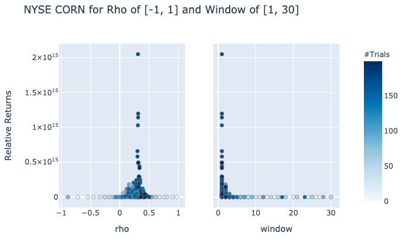

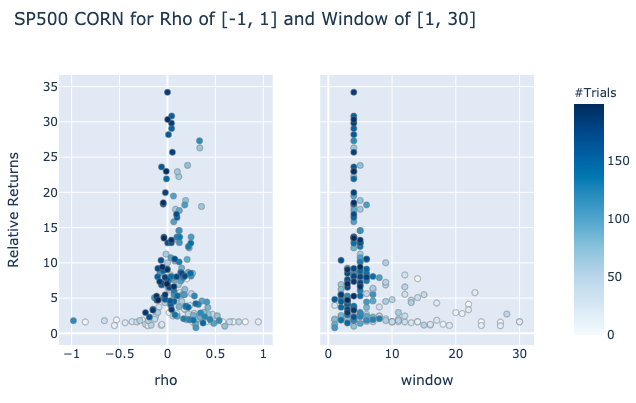

.. tip::

    - :math:`\rho` between 0 and 0.2 is optimal
    - Optimal window ranges are different, but are typically in between 1 and 7 and most likely 1.

CORN Implementation
-------------------

.. automodule:: mlfinlab.online_portfolio_selection.corn

    .. autoclass:: CORN
        :members:
        :inherited-members:

        .. automethod:: __init__

----

Correlation Driven Nonparametric Learning - Uniform (CORN-U)
************************************************************

Because the CORN strategies are dependent on the parameters, we propose a more generic one that takes an
ensemble approach to reduce variability. One possible CORN ensemble is the CORN-U method.

CORN-U generates a set of experts with different window sizes and the same :math:`\rho` value. After all the expert's
weights are calculated, weights are evenly distributed among all experts to represent the strategy as a universal portfolio.

After gathering results for all the experts, the total portfolio weight will be determined by:

.. math::
    b_{t+1}=\frac{\sum_{w, \rho}q(w,\rho)S_t(w,\rho)b_{t+1}(w,\rho)}{\sum_{w, \rho}q(w,\rho)S_t(w,\rho)}

- :math:`S(t)` is the total portfolio returns at time :math:`t`.
- :math:`q(w, \rho)` is the weight allocation constant. For CORN-U, this is a uniform distribution.

CORN-U Parameters
-----------------

Using `optuna <https://optuna.org/>`_, we experimented with different parameters to provide a general guideline
for the users. The best parameters for CORN-U were similar to the parameters for parent class CORN. The most important
parameter that affects returns tend to be the :math:`\rho` value and a range between 0 and 0.4 works for most datasets.
Window ranges are trickier as they tend to be either just 1 or a much larger value.

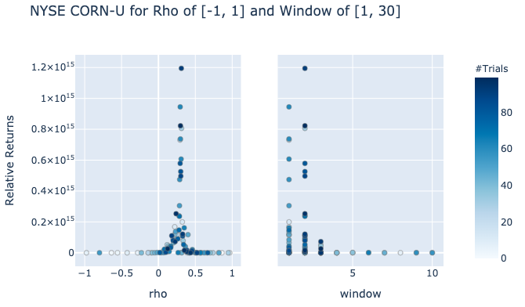

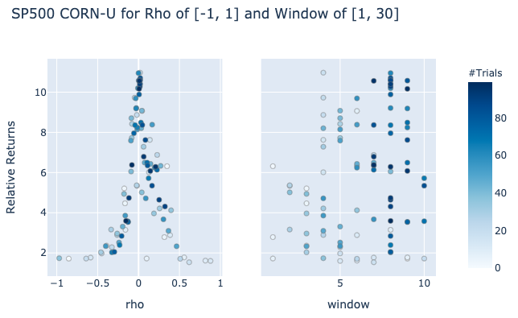

.. tip::

    - :math:`\rho` between 0 and 0.2 is optimal
    - Optimal window ranges are different, but are typically in between 1 and 7 and most likely 1.

CORN-U Implementation
---------------------

.. automodule:: mlfinlab.online_portfolio_selection.cornu

    .. autoclass:: CORNU
        :members:
        :inherited-members:

        .. automethod:: __init__

----

Correlation Driven Nonparametric Learning - K (CORN-K)
******************************************************

CORN-K further improves the CORN-U by generating more parameters of experts. There is more variability as
different ranges of window and :math:`\rho` value are considered to create more options.

The most important part of the CORN-K, however, is the capital allocation method. Unlike CORN-U, which uniformly
distributes capital among all the experts, CORN-K selects the top-k best performing experts until the last period
and equally allocate capital among them. This prunes the experts that have less optimal returns and puts more weight on the performing ones.

CORN-K takes in 3 parameters: window, :math:`rho`, and :math:`k`.

CORN-K Parameters
-----------------

Using `optuna <https://optuna.org/>`_, we experimented with different parameters to provide a general guideline
for the users. The most important parameter for CORN-K is k, and most of the times this should always be set at 1 or 2 for the highest returns. A low
value of k effectively prunes the less performing experts. Rho of 1 is good for datasets that have optimal CORN rho value of 0,
but if the optimal CORN rho is slightly above that rho should be changed to a value higher then 3 to capture the range. Typically,
range of [3, 5] worked for preliminary datasets. Window values also depend on each dataset, but the best
guess would be on the lower range of 1 or higher value of 7.

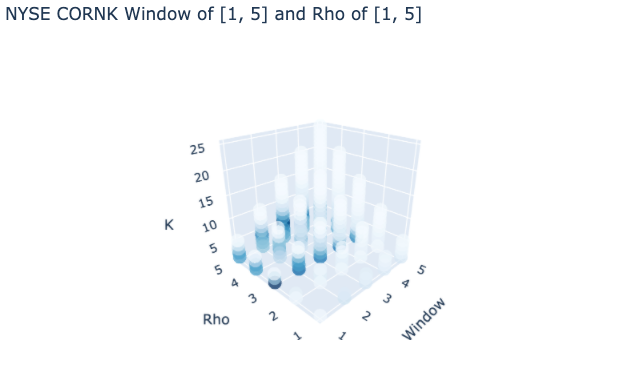

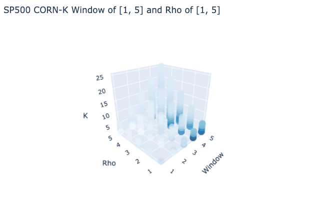

.. tip::

    - :math:`k` should be either 1 or 2 in most cases.
    - :math:`\rho` between 1 and 7 is optimal
    - Optimal window ranges are different, but are typically in between 1 and 7.

CORN-K Implementation
---------------------

.. automodule:: mlfinlab.online_portfolio_selection.cornk

    .. autoclass:: CORNK
        :members:
        :inherited-members:

        .. automethod:: __init__

Example Code
************

.. code-block::

    import pandas as pd
    from mlfinlab.online_portfolio_selection import *

    # Read in data.
    stock_prices = pd.read_csv('FILE_PATH', parse_dates=True, index_col='Date')

    # CORN
    # Compute Correlation Driven Nonparametric Learning with no given weights, window of 1, and rho of 0.3.
    corn = CORN(window=1, rho=0.3)
    corn.allocate(asset_prices=stock_prices, resample_by='W', verbose=True)

    # Compute Correlation Driven Nonparametric Learning with user given weights, window of 3, and rho of 0.5.
    corn1 = CORN(window=3, rho=0.5)
    corn1.allocate(asset_prices=stock_prices, weights=some_weight)

    # CORN-U
    # Compute Correlation Driven Nonparametric Learning - Uniform with no given weights, window range of 10, and rho of 0.3.
    cornu = CORNU(window=10, rho=0.3)
    cornu.allocate(asset_prices=stock_prices, resample_by='W', verbose=True)

    # Compute Correlation Driven Nonparametric Learning - Uniform with user given weights, window range of 5, and rho of 0.1.
    cornu1 = CORNU(window=5, rho=0.1)
    cornu1.allocate(asset_prices=stock_prices, weights=some_weight)

    # CORN-K
    # Compute Correlation Driven Nonparametric Learning - K with no given weights, window range of 10, rho of 7, and k of 2.
    cornk = CORNK(window=10, rho=7, k=2)
    cornk.allocate(asset_prices=stock_prices, resample_by='W', verbose=True)

    # Compute Correlation Driven Nonparametric Learning - K with user given weights, window range of 5, rho of 3, and k of 1.
    cornk1 = CORNK(window=5, rho=3, k=1)
    cornk1.allocate(asset_prices=stock_prices, weights=some_weight)

    # Recalculate k for cornk1 to save computational time of generating all experts.
    cornk1.recalculate_k(k=3)

    # Get the latest predicted weights.
    corn.weights

    # Get all weights for the strategy.
    cornk.all_weights

    # Get portfolio returns.
    cornu.portfolio_return

    # Get each object of the generated experts.
    cornk1.experts

    # Get each experts parameters.
    cornu.expert_params

    # Get all expert's portfolio returns over time.
    cornu1.expert_portfolio_returns

    # Get capital allocation weights.
    cornk1.weights_on_experts

----

Symmetric Correlation Driven Nonparametric Learning
###################################################

Symmetric CORN utilizes the concept of Market symmetry which states that markets have mirrored price movements. Increasing price trends
represents a mirror of a decreasing trend. This gives us an intuitional understanding that if the price movements are strongly negatively
correlated, the optimal portfolio weights should minimize the returns or the losses from those periods as it is most likely that the optimal
portfolio weights would be the inverse.

Introduced recently in a Journal of Financial Data Science paper by Yang Wang and Dong Wang in 2019, SCORN identifies positively
correlated windows and negatively correlated windows.

The positiviely correlated windows are identified similar to the process for CORN.

.. math::
    C(x_t;w,\rho) = \lbrace x_j \vert R(X^{j-1}_{j-w},X^{t-1}_{t-w})  > \rho)

And the negatively correlated windows are identified as any period with a correlation value below the negative of the threshold.

.. math::
    C'(x_t;w,\rho) = \lbrace x_j \vert R(X^{j-1}_{j-w},X^{t-1}_{t-w})  < -\rho)

The strategy, therefore, maximizes the returns for periods that are considered similar and minimize the losses over periods that are considered the opposite.

.. math::
    b^{\bf{\star}}_t(w,\rho) = \underset{b \in \Delta_m}{\arg\max} \underset{x \in C(x_t;w,\rho)}{\sum}\log b^{\top}x - \underset{x \in C'(x_t;w,\rho)}{\sum}\log b^{\top}x

Two different variations of the SCORN strategies are implemented in the Online Portfolio Selection module.

- :math:`b_t` is the portfolio vector at time :math:`t`.
- :math:`x_t` is the price relative change at time :math:`t`. It is calculated by :math:`\frac{p_t}{p_{t-1}}`, where :math:`p_t` is the price at time :math:`t`.
- :math:`\rho` is the correlation threshold.
- :math:`R` is the correlation coefficient.
- :math:`C_t` is the set of similar periods.
- :math:`C'_t` is the set of similar periods.
- :math:`\Delta_m` is the simplex domain. The sum of all elements is 1, and each element is in the range of [0, 1].

----

Symmetric Correlation Driven Nonparametric Learning (SCORN)
***********************************************************

SCORN Parameters
----------------

Using `optuna <https://optuna.org/>`_, we experimented with different parameters to provide a general guideline
for the users. The optimal :math:`\rho` for SCORN is between 0 and 0.2. Most cases :math:`\rho` would be 0 to indicate a
binary classification regarding the similarity sets; however, there are some instances where a value of 0.2
is more optimal. The optimal window value more or less varies with a tendency for a shorter value of 1 or 2.
Although, there are cases where a window of 21 had the highest returns.

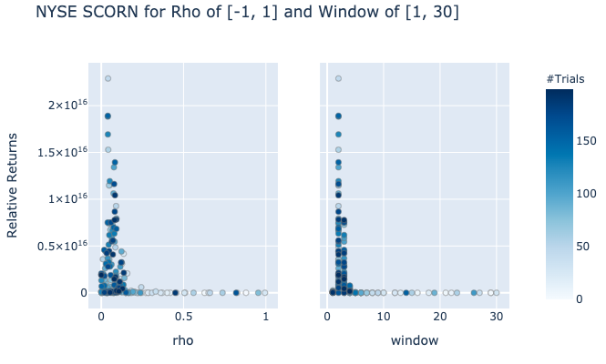

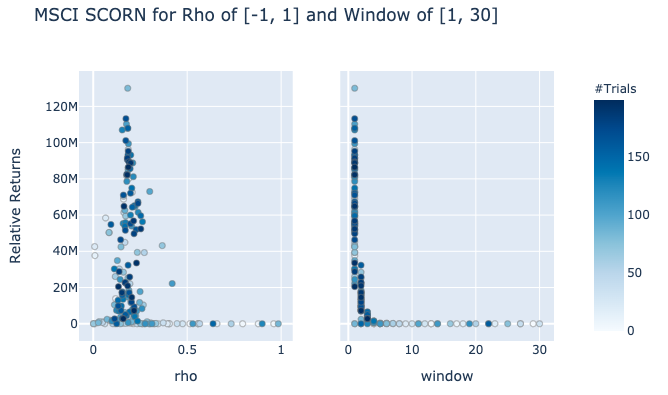

.. tip::

    - :math:`\rho` between 0 and 0.2 is optimal. In most cases, 0 had the highest returns.
    - Optimal window ranges are different and will vary dependant on the data.

SCORN Implementation
--------------------

.. automodule:: mlfinlab.online_portfolio_selection.scorn

    .. autoclass:: SCORN
        :members:
        :inherited-members:

        .. automethod:: __init__

----

Symmetric Correlation Driven Nonparametric Learning - K (SCORN-K)
*****************************************************************

.. tip::

    More detailed explanation about the top-k strategy is available with the documentation for CORN-K.

SCORN-K Parameters
------------------

Using `optuna <https://optuna.org/>`_, we experimented with different parameters to provide a general guideline
for the users. In general, :math:`\rho` of 1 is sufficient as most of the time the ideal :math:`\rho` is 0. For cases with
datasets that have optimal SCORN of 0.2, :math:`\rho` should be increased to 3. Window values are also dependent
on each data, but in most cases, value of 2 was sufficient.

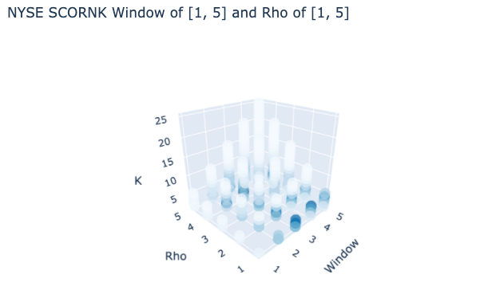

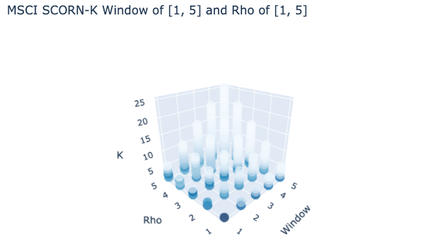

.. tip::

    - :math:`k` should be either 1 or 2 in most cases.
    - :math:`\rho` between 1 and 7 is optimal
    - Optimal window ranges are different, but are typically in between 1 and 7.

SCORN-K Implementation
----------------------

.. automodule:: mlfinlab.online_portfolio_selection.scornk

    .. autoclass:: SCORNK
        :members:
        :inherited-members:

        .. automethod:: __init__

Example Code
************

.. code-block::

    import pandas as pd
    from mlfinlab.online_portfolio_selection import *

    # Read in data.
    stock_prices = pd.read_csv('FILE_PATH', parse_dates=True, index_col='Date')

    # SCORN
    # Compute Symmetric Correlation Driven Nonparametric Learning with no given weights, window of 1, and rho of 0.3.
    scorn = SCORN(window=1, rho=0.3)
    scorn.allocate(asset_prices=stock_prices, resample_by='W', verbose=True)

    # Compute Symmetric Correlation Driven Nonparametric Learning with user given weights, window of 3, and rho of 0.5.
    scorn1 = SCORN(window=3, rho=0.5)
    scorn1.allocate(asset_prices=stock_prices, weights=some_weight)

    # SCORN-K
    # Compute Symmetric Correlation Driven Nonparametric Learning - K with no given weights, window range of 10, rho of 7, and k of 2.
    scornk = SCORNK(window=10, rho=7, k=2)
    scornk.allocate(asset_prices=stock_prices, resample_by='W', verbose=True)

    # Compute Symmetric Correlation Driven Nonparametric Learning - K with user given weights, window range of 5, rho of 3, and k of 1.
    scornk1 = SCORNK(window=5, rho=3, k=1)
    scornk1.allocate(asset_prices=stock_prices, weights=some_weight)

    # Recalculate k for scornk1 to save computational time of generating all experts.
    scornk1.recalculate_k(k=3)

    # Get the latest predicted weights.
    scorn.weights

    # Get all weights for the strategy.
    scornk.all_weights

    # Get portfolio returns.
    scorn.portfolio_return

    # Get each object of the generated experts.
    scornk1.experts

    # Get each experts parameters.
    scornk.expert_params

    # Get all expert's portfolio returns over time.
    scornk.expert_portfolio_returns

    # Get capital allocation weights.
    scornk1.weights_on_experts

----

Functional Correlation Driven Nonparametric Learning
####################################################

FCORN further extends the SCORN by introducing a concept of an activation function. Applying the concept
to the previous CORN algorithms, the activation function for the SCORN can be considered as a piecewise function.
For any value between the positive and negative value of the threshold, we discount the importance of the period by placing a constant of 0.

Instead of completely neglecting windows with correlation with absolute value less than the threshold,
FCORN introduces a sigmoid function that places a set of different weights depending on the correlation
to the current market window. By replacing with such a variable, it is possible for us to place different
importance on the correlated periods. One that has higher correlation will have higher weights of importance
whereas ones that are less correlated will have less importance on it.

The activation function can be labeled as the following:

.. math::
    b^{\bf{\star}}_t(w,\rho) = \underset{b \in \Delta_m}{\arg\max} \underset{j \in \lbrace1,...,t-1\rbrace}{\sum}v(j)\log b^{\top}x_i

If the correlation is nonnegative, we place a positive weight.

.. math::
    \text{if} \: c \geq 0 \rightarrow v(j) =  \frac{1}{1 + \exp(-\lambda(c-\rho))}

If the correlation is negative, we place a negative weight that approaches 0 for correlation values closer to 0.

.. math::
    \text{if} \: c < 0 \rightarrow v(j) =  \frac{1}{1 + \exp(-\lambda(c+\rho))} - 1

- :math:`b_t` is the portfolio vector at time :math:`t`.
- :math:`x_t` is the price relative change at time :math:`t`. It is calculated by :math:`\frac{p_t}{p_{t-1}}`, where :math:`p_t` is the price at time :math:`t`.
- :math:`c` is the correlation coefficient.
- :math:`\rho` is the correlation threshold.
- :math:`v(j)` is the activation function for the given period weights.
- :math:`\Delta_m` is the simplex domain. The sum of all elements is 1, and each element is in the range of [0, 1].

Two different variations of the FCORN strategies are implemented in the Online Portfolio Selection module.

----

Functional Correlation Driven Nonparametric Learning (FCORN)
************************************************************

FCORN Parameters
----------------

Using `optuna <https://optuna.org/>`_, we experimented with different parameters to provide a general guideline
for the users. The optimal :math:`\rho` for FCORN is between 0.4 and 0.8 with best lambd value at 1.
In most cases, window should be in the smaller range with 1 or 2 as seen with the case for the NYSE dataset; however,
SP500 has the highest returns with window of 5.

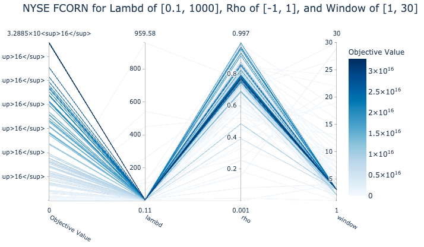

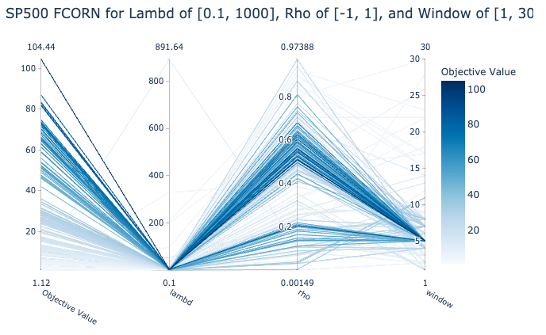

.. tip::

    - :math:`\rho` between 0.4 and 0.8 is optimal
    - Optimal window ranges are different, but are typically in between 1 and 7.
    - Lambd of 1 to 5 typically had high returns.

FCORN Implementation
--------------------

.. automodule:: mlfinlab.online_portfolio_selection.fcorn

    .. autoclass:: FCORN
        :members:
        :show-inheritance:
        :inherited-members:

        .. automethod:: __init__

----

Functional Correlation Driven Nonparametric Learning - K (FCORN-K)
******************************************************************

.. tip::

    More detailed explanation about the top-k strategy is available with the documentation for CORN-K.

FCORN-K Parameters
------------------

Using `optuna <https://optuna.org/>`_, we experimented with different parameters to provide a general guideline
for the users. :math:`\rho` should be at least 5 to capture the range between 0.4 and 0.8, with lambd of 1 sufficient
to get the highest returns. Window values vary with each dataset, but a value of 1 or 2 typically
had the highest returns.

FCORN-K Implementation
----------------------

.. automodule:: mlfinlab.online_portfolio_selection.fcornk

    .. autoclass:: FCORNK
        :members:
        :show-inheritance:
        :inherited-members:

        .. automethod:: __init__

Example Code
************

.. code-block::

    import pandas as pd
    from mlfinlab.online_portfolio_selection import *

    # Read in data.
    stock_prices = pd.read_csv('FILE_PATH', parse_dates=True, index_col='Date')

    # FCORN
    # Compute Functional Correlation Driven Nonparametric Learning with no given weights, window of 1, rho of 0.3, and lambd of 10.
    fcorn = FCORN(window=1, rho=0.3, lambd=10)
    fcorn.allocate(asset_prices=stock_prices, resample_by='W', verbose=True)

    # Compute Functional Correlation Driven Nonparametric Learning with user given weights, window of 3, rho of 0.5, and lambd of 5.
    fcorn1 = FCORN(window=3, rho=0.5, lambd=5)
    fcorn1.allocate(asset_prices=stock_prices, weights=some_weight)

    # FCORN-K
    # Compute Functional Correlation Driven Nonparametric Learning - K with no given weights, window of 10, rho of 7, lambd of 1, and k of 2.
    fcornk = FCORNK(window=10, rho=7, lambd=1, k=2)
    fcornk.allocate(asset_prices=stock_prices, resample_by='W', verbose=True)

    # Compute Functional Correlation Driven Nonparametric Learning - K with user given weights, window of 5, rho of 3, lambd of 2, and k of 1.
    fcornk1 = FCORNK(window=5, rho=3, lambd=2, k=1)
    fcornk1.allocate(asset_prices=stock_prices, weights=some_weight)

    # Recalculate k for fcornk1 to save computational time of generating all experts.
    fcornk1.recalculate_k(k=3)

    # Get the latest predicted weights.
    fcorn.weights

    # Get all weights for the strategy.
    fcornk.all_weights

    # Get portfolio returns.
    fcorn.portfolio_return

    # Get each object of the generated experts.
    fcornk1.experts

    # Get each experts parameters.
    fcornk.expert_params

    # Get all expert's portfolio returns over time.
    fcornk.expert_portfolio_returns

    # Get capital allocation weights.
    fcornk1.weights_on_experts

----

Research Notebook
#################

The following `pattern matching <https://github.com/hudson-and-thames/research/blob/master/Online%20Portfolio%20Selection/Online%20Portfolio%20Selection%20-%20Pattern%20Matching.ipynb>`_
notebook provides a more detailed exploration of the strategies.
