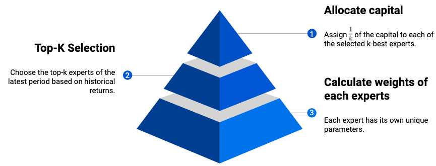

.. _online_portfolio_selection-universal_portfolio:

.. note::
    Strategies were implemented with modifications from:

    1. `Cover, T.M., 1996. Universal Portfolios. <http://web.mit.edu/6.962/www/www_fall_2001/shaas/universal_portfolios.pdf>`_
    2. `Li, B., Hoi, S. C.H., 2012. OnLine Portfolio Selection: A Survey. ACM Comput. Surv. V, N, Article A (December 2012), 33 pages. <https://arxiv.org/abs/1212.2129>`_

===================
Universal Portfolio
===================

The default universal portfolio acts as a fund of funds. With the given number of inputs as experts,
the ensemble portfolio will generate a random set of weighted CRP’s to aggregated based on the given
algorithm. This class also acts as a parent class for the other strategies’ ensemble methods.

Three different capital allocation methods have been implemented.

Historical Performance
######################

The default capital allocation method according to Cover’s paper was a historical-performance based one.
In this case, the concept can be easily represented as initially allocating a set of capital to all
experts and collecting the total sum at the end of the period.

Uniform
#######

Uniform allocation refers to a similar principle as a CRP. Instead of leaving each individual capital
to each expert, after every period capital is rebalanced equally among all experts. The capital from
the better performing expert will move to the less performing ones.

Top-K
#####

Top-K was introduced in the Pattern Matching strategies, where it chooses portfolio weights based
on each experts’ performance. In this case, each expert is defined as an independent portfolio
with predetermined parameters. The next period’s total weights are based on the previous period’s k
best-performing experts. Through this method, we can reduce our overfitting and make our models more robust.

.. automodule:: mlfinlab.online_portfolio_selection.up

    .. autoclass:: UP
        :members:
        :inherited-members:

        .. automethod:: __init__

.. note::
    For the universal portfolio to represent the studies by Thomas Cover, it would have to generate an infinite
    number of portfolios to cover all possible parameters. This is more or less possible with a low number of assets
    as for a two-asset market we can generate 100 weights from (0.01, 0.99) to (0.99 to 0.01). However, as the number
    of assets increase, the number of points require to represent the same dimensionality exponentially increases as
    well. Due to the `curse of dimensionality <https://en.wikipedia.org/wiki/Curse_of_dimensionality>`_, it is
    difficult for us to exactly approximate a portfolio.

Results
#######

In addition to the outputs represented with the original ``OLPS`` class, the ensemble methods have more options.

- ``self.experts`` (list) Array to store all experts
- ``self.number_of_experts`` (int) Set the number of experts.
- ``self.expert_params`` (np.array) Each expert's parameters.
- ``self.expert_portfolio_returns`` (np.array) All experts' portfolio returns over time.
- ``self.expert_all_weights`` (np.array) Each experts' weights over time.
- ``self.expert_weights`` (np.array) Each experts' final portfolio weights
- ``self.weights_on_experts`` (np.array) Capital allocation on each experts.
- ``self.weighted`` (np.array) Weights allocated to each experts.
- ``self.k`` (int) Number of top-k experts.

Example Code
############

.. code-block::

    import pandas as pd
    from mlfinlab.online_portfolio_selection import *

    # Read in data.
    stock_prices = pd.read_csv('FILE_PATH', parse_dates=True, index_col='Date')

    # Compute Universal Portfolio with 100 experts with historical performance weights.
    up = UP(number_of_experts=100, weighted='hist_performance',)
    up.allocate(asset_prices=stock_prices, resample_by='W', verbose=True)

    # Compute Universal Portfolio with 1000 experts with uniform weights.
    up = UP(number_of_experts=1000, weighted='uniform')
    up.allocate(asset_prices=stock_prices, resample_by='W', verbose=True)

    # Compute Universal Portfolio with 10000 experts with top-k weights and k of 5.
    up = UP(number_of_experts=10000, weighted='top-k', k=5)
    up.allocate(asset_prices=stock_prices, resample_by='W', verbose=True)

    # Recalculate k to 3 for top-k to experiment with different parameters.
    up.recalculate_k(3)

    # Get the latest predicted weights.
    up.weights

    # Get all weights for the strategy.
    up.all_weights

    # Get portfolio returns.
    up.portfolio_return
