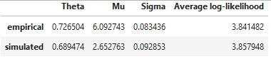
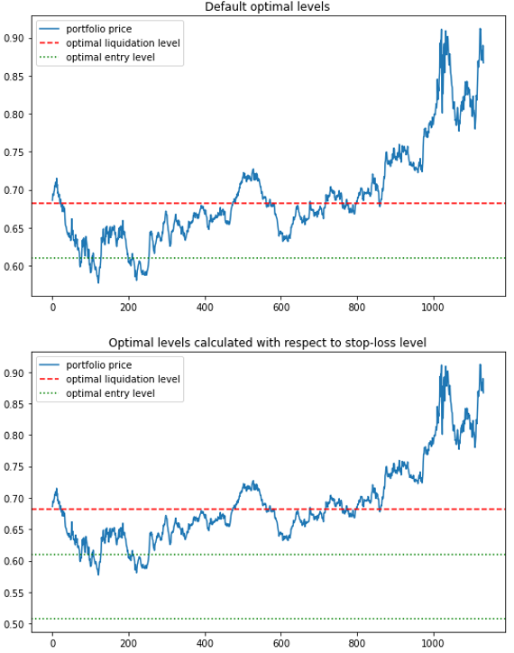

.. _optimal_mean_reverting_strategies-ou_model:

.. note::
   The following implementations and documentation closely follow the work of Tim Leung:
   `Tim Leung and Xin Li Optimal Mean reversion Trading: Mathematical Analysis and Practical Applications
   <https://www.amazon.com/Optimal-Mean-Reversion-Trading-Mathematical/dp/9814725919>`_.

==========================================
Trading Under the Ornstein-Uhlenbeck Model
==========================================
.. warning::

    Alongside with Leung's research we are using :math:`\theta` for mean and :math:`\mu` for mean-reversion
    speed, while other sources e.g. Wikipedia, use :math:`\theta` for mean reversion speed and :math:`\mu` for
    mean.

Model fitting
=============

.. note::
   We are solving the optimal stopping problem for a mean-reverting portfolio that is constructed by holding
   :math:`\alpha = \frac{A}{S_0^{(1)}}` of a risky asset :math:`S^{(1)}` and shorting
   :math:`\beta = \frac{B}{S_0^{(2)}}` of another risky asset :math:`S^{(2)}`, yielding a portfolio value:

   .. math::
      X_t^{\alpha,\beta} = \alpha S^{(1)} - \beta S^{(2)}, t \geq 0

   Since in terms of mean-reversion we care only about the ratio between :math:`\alpha` and :math:`\beta`, without the
   loss of generality we can set :math:`\alpha = const` and A = $1, while varying :math:`\beta` to find the optimal strategy
   :math:`(\alpha,\beta^*)`

We establish **Ornstein-Uhlenbeck process** driven by the SDE:

.. math::
    :nowrap:

    \begin{gather*}
    dX_t = \mu(\theta - X_t)dt + \sigma dB_t,\\

    \mu, \sigma > 0,\\

    \theta \in \mathbb{R},\\

    B\ -\text{a standard Brownian motion}
    \end{gather*}

* :math:`\theta` − long term mean level, all future trajectories of 𝑋 will evolve around a mean level 𝜃 in the long run.

* :math:`\mu` - speed of reversion, characterizes the velocity at which such trajectories will regroup around :math:`\theta` in time.

* :math:`\sigma` - instantaneous volatility, measures instant by instant the amplitude of randomness entering the system. Higher values imply more randomness.

Under the OU model the probability density function of :math:`X_t` with increment  :math:`\delta t = t_i
- t_{i-1}` is:

.. math::
    :nowrap:

    \begin{gather*}
    f^{OU} (x_i|x_{i-1};\theta,\mu,\sigma) = \frac{1}{\sqrt{2\pi\tilde{\sigma}^2}}
    exp(-\frac{(x_i - x_{i-1} e^{-\mu\Delta t} - \theta (1 - e^{-\mu \Delta t})^2)} {2 \tilde{\sigma}^2}),\\

    \text{with the constant } \tilde{\sigma}^2 = \sigma^2 \frac{1 - e^{-2\mu\Delta t}}{2\mu}
    \end{gather*}

We observe the resulting portfolio values :math:`(x_i^\beta)_{i = 0,1,\cdots,n}` for every strategy :math:`\beta`
realized over an *n*-day period. To fit the model to our data and find optimal parameters we define the average
log-likelihood function:

.. math::
    :nowrap:

    \begin{gather*}
    \ell (\theta,\mu,\sigma|x_0^{\alpha\beta},x_1^{\alpha\beta},\cdots,x_n^{\alpha\beta}) := \frac{1}{n}\sum_{i=1}^{n} ln
    f^{OU}(x_i|x_{i-1};\theta,\mu,\sigma)\\

    = -\frac{1}{2} ln(2 \pi) - ln(\tilde{\sigma}) - \frac{1}{2\pi\tilde{\sigma}^2}\sum_{i=1}^{n} [x_i^{\alpha\beta}
    - x_{i-1}^{\alpha\beta} e^{-\mu \Delta t} - \theta (1 - e^{-\mu \Delta t})]^2
    \end{gather*}

Then, maximizing the log-likelihood function by applying maximum likelihood estimation(MLE) we are able to determine
the parameters of the model and fit the observed portfolio prices to an OU process. Let's denote the maximized average
log-likelihood by :math:`\hat{\ell}(\theta^*,\mu^*,\sigma^*)`. Then for every :math:`\alpha` we choose
:math:`\beta^*`, where:

.. math::
    \beta^* = \underset{\beta}{\arg\max}\ \hat{\ell}(\theta^*,\mu^*,\sigma^*|x_0^{\alpha\beta},x_1^{\alpha\beta},\cdots,
    x_n^{\alpha\beta})

Optimal Timing of Trades
===========================

Suppose the investor already has a position with a value process :math:`(X_t)_{t>0}` that follows the OU process. When
the investor closes his position at the time :math:`\tau` he receives the value :math:`(X_{\tau})` and pays a
constant transaction cost :math:`c_s \in \mathbb{R}` To maximize the expected discounted value we need to solve
the optimal stopping problem:

.. math::
    V(x) = \underset{\tau \in T}{\sup} \mathbb{E}_x{e^{-r \tau} (X_{\tau} - c_s)| X_0 = x}

where :math:`T` denotes the set of all possible stopping times and :math:`r > 0` is our subjective constant
discount rate. :math:`V(x)` represents the expected liquidation value accounted with X.

Current price plus transaction cost  constitute the cost of entering the trade and in combination with :math:`V(x)`
we can formalize the optimal entry problem:

.. math::
    J(x) = \underset{\nu \in T}{\sup} \mathbb{E}_x{e^{-\hat{r} \tau} (V(X_{\nu}) - X_{\nu} - c_b)| X_0 = x}

with

.. math::
    \hat{r}>0,\ c_b \in \mathbb{R}

To sum up this problem, we, as an investor, want to maximize the expected difference between the current price
of the position - :math:`x_{\nu}` and its' expected liquidation value :math:`V(X_{\nu})` minus transaction cost
:math:`c_b`

.. note::

    Following part of the chapter presents the analytical solution for the optimal stopping problem, both the default
    version and the version with the inclusion of the stop-loss level.

To solve this problem we denote the OU process infinitesimal generator:

.. math::

    L = \frac{\sigma^2}{2} \frac{d^2}{dx^2} + \mu(\theta - x) \frac{d}{dx}

and recall the classical solution of the differential equation

.. math::

    L u(x) = ru(x)

.. math::

    F(x) = \int_{0}^{\infty} u^{ \frac{r}{\mu} - 1} e^{\sqrt{\frac{2\mu}{\sigma^2}}(x - \theta)u - \frac{u^2}{2}}du

    G(x) = \int_{0}^{\infty} u^{\frac{r}{\mu} - 1} e^{\sqrt{\frac{2\mu}{\sigma^2}} (\theta - x)u - \frac{u^2}{2}}du

Then we are able to formulate the following theorems

(proven in `Optimal Mean reversion Trading:
Mathematical Analysis and Practical Applications by Tim Leung and Xin Li
<https://www.amazon.com/Optimal-Mean-Reversion-Trading-Mathematical/dp/9814725919>`_) to provide the solutions to
following problems:

Default optimal stopping problem
--------------------------------

Theorem 2.6 (p.23):

**The optimal liquidation problem admits the solution:**

.. math::
    :nowrap:

    \begin{gather*}
    V(x) = \begin{cases} (b^* - c_s) \frac{F(x)}{F(b^*)} , & \mbox{if } x \in (-\infty,b^*)\\
    \\ x - c_s, &  \mbox{ otherwise}  \end{cases}\\
    \end{gather*}

The optimal liquidation level :math:`b^*` is found from the equation:

.. math::

    F(b) - (b - c_s)F'(b) = 0\\

Corresponding optimal liquidation time is given by

.. math::
    \tau^* = inf [t\geq0:X_t \geq b^*]

Theorem 2.10 (p.27):

**The optimal entry timing problem admits the solution:**

.. math::
    :nowrap:

    \begin{gather*}
    J(x) = \begin{cases} V(x) - x - c_b, & \mbox{if } x \in (-\infty,d^*)\\
    \\ \frac{V(d^*) - d^* - c_b}{\hat{G}(d^*)}, & \mbox{if } x \in (d^*, \infty)  \end{cases}
    \end{gather*}

The optimal entry level :math:`d^*` is found from the equation:

.. math::

    \hat{G}(d)(V'(d) - 1) - \hat{G}'(d)(V(d) - d - c_b) = 0

Where ":math:`\hat{\ }`" represents the use of transaction cost and discount rate of entering.

Optimal stopping problem with stop-loss
---------------------------------------

When we include the stop-loss in our optimal stopping problems the theorems we use to find the solution
are:

Theorem 2.13 (p.31):

**The optimal liquidation problem admits the solution:**

.. math::
    :nowrap:

    \begin{gather*}
    V(x) = \begin{cases} C F(x)+D G(x) , & \mbox{if } x \in (-\infty,b^*)\\
    \\ x - c_s, & \mbox{ otherwise}  \end{cases}
    \end{gather*}

The optimal liquidation level :math:`b_L^*` is found from the equation:

.. math::
    :nowrap:

    \begin{gather*}
    F'(b) [(L - c_s) G(b) - (b - c_s) G(L)]\\

    + G'(b) [(b - c_s) F(L) - (L - c_s) F(b)]\\

    - G(b) F(L) - G(L)F(b) = 0\\
    \end{gather*}

Corresponding optimal liquidation time is given by

.. math::

   	\tau^* = inf [t\geq0:X_t \geq b^*]

Helper functions C and D defined as following:

.. math::

    C = \frac{(b_L^* - c_s) G(L) - ( L - c_s) G(b^*)}{F(b_L^*)G(L) - F(L)G(b_L^*)}

    D = \frac{(L - c_s) F(L) - ( b_L^* - c_s) F(b^*)}{F(b_L^*)G(L) - F(L)G(b_L^*)}

Theorem 2.42 (p.35):

**The optimal entry timing problem admits the solution:**

.. math::
    :nowrap:

    \begin{gather*}
    J_L(x) = \begin{cases} P\hat{F}(x),  & \mbox{if } x \in (-\infty,a_L^*)\\
    \\ V_L(x) - x - c_b, & \mbox{if } x \in (a_L^*, d_L^*)\\
    \\ Q\hat{G}(x), & \mbox{if } x \in (d_L^*, \infty)\end{cases}\\
    \end{gather*}

The optimal entry interval :math:`(a_L^*,d_L^*)` is found using the respective equations:

.. math::
    :nowrap:

    \begin{gather*}
    \hat{G}(d)(V_L'(d) - 1) - \hat{G}'(d)(V_L(d) - d - c_b) = 0\\

    \hat{F}(a)(V_L'(a) - 1) - \hat{F}'(a)(V_L(a) - a - c_b) = 0
    \end{gather*}

How to use this submodule
=========================

This module gives you the ability to calculate optimal values of entering and liquidating the position for your
portfolio. The whole process takes only 2 steps.

Step 1: Model fitting
----------------------

In this step we need to use :code:`fit` function to fit OU model to our training data and set the constant
parameters like transaction costs, discount rates, stop-loss level and data frequency. You have a choice not
to set the stop-loss level at the beginning, but it will deny access to the functions that use the stop-loss level.
To access them you just need to set the parameter :code:`self.L`. Also there is a possibility to not use the whole
provided training sample, limiting it to a time interval of your choice with :code:`start` and :code:`end` parameters.

That option can be used if you provide a pandas DataFrame as an input data with Datetime-type indices.
You can also use an np.array of two time series of asset prices, and the optimal portfolio will be constructed by the
function itself, or use your own portfolio values as an input data.

Implementation
++++++++++++++
.. py:currentmodule:: mlfinlab.optimal_mean_reversion.ou_model.OrnsteinUhlenbeck

.. autofunction:: fit

.. tip::

    To retrain the model just use one of the functions :code:`fit_to_portfolio` or :code:`fit_to_assets`.
    You have a choice either to use the new dataset or to change the training time interval of your currently
    used dataset.

    .. autofunction:: fit_to_portfolio

    .. autofunction:: fit_to_assets

It is important to understand how good of a fit your data is compared to a simulated process with the
same parameters. To check we can use :code:`check_fit` function that shows the optimal parameter values obtained
by fitting the OU model to our data and from the OU model simulated using our fitted parameters.

.. autofunction:: check_fit

.. tip::

    If you are interested in data generation you can create OU process simulations
    using the :code:`ou_model_simulation` function. The parameters used for the
    model can be either the fitted parameters to your data or you can set all of them
    for yourself.

    .. autofunction:: ou_model_simulation

Step 2: Determining the optimal entry and exit values
-----------------------------------------------------
To get the optimal liquidation or entry level for your data we need to call one of the functions mentioned below.
They present the solutions to the equations established during the theoretical part.
To choose whether to account for stop-loss level or not choose the respective set of functions.

Implementation
++++++++++++++
:math:`b^*`: - optimal level of liquidation:

.. autofunction:: optimal_liquidation_level

:math:`d^*` - optimal level of entry:

.. autofunction:: optimal_entry_level

:math:`b_L^*` - optimal level of liquidation, accounting for preferred stop-loss level:

.. autofunction:: optimal_liquidation_level_stop_loss

:math:`[a_L^*,d_L^*]` - optimal level of entry, accounting for preferred stop-loss level:

.. autofunction:: optimal_entry_interval_stop_loss

.. tip::

    General rule for the use of the optimal levels:

      *  If not bought, buy the portfolio as soon as portfolio price reaches the optimal entry level
         (enters the interval).

      *  If bought, liquidate the position as soon as portfolio price reaches the optimal liquidation level.

Step 3: (Optional) Plot the optimal levels on your data
-------------------------------------------------------

Additionally you have the ability to plot your optimal levels onto your out-of-sample data. Similarly to the
fit step you have a choice whether to use portfolio prices or an array of asset prices. In the case of
the latter optimal coefficient found during the fit stage will be used to create a portfolio.

Implementation
++++++++++++++
.. autofunction:: plot_levels

.. tip::
    To view al the model stats, including the optimal levels call the ``description`` function

    .. autofunction:: description

    .. figure:: images/description_function.png
       :scale: 70 %
       :align: center
       :figclass: align-center

Example
=======

The following examples show how the described above module can be used on real data:

.. code-block::
    import numpy as np
    import pandas as pd

    import yfinance as yf
    from mlfinlab.optimal_mean_reversion import OrnsteinUhlenbeck

    # Import data from Yahoo finance
    data1 =  yf.download("GLD GDX", start="2015-08-25", end="2016-12-09")
    data2 =  yf.download("GLD GDX", start="2016-12-10", end="2017-03-09")

    # Create training dataset as an array of two asset prices
    data_train = np.array([data1["Adj Close"]])

    # Create an out-of-sample dataset
    data_oos = np.array([data2["Adj Close"]])

    # Create the class object
    example = OrnsteinUhlenbeck()

    # Fit the model to the training data and allocate data frequency,
    # transaction costs, discount rates and stop-loss level
    example.fit(data_train, data_frequency="D", discount_rate=[0.05, 0.05],
                transaction_cost=[0.02, 0.02], stop_loss=0.5)

    # The parameters can be also allocated in an alternative way
    example.fit(data_train, data_frequency="D", discount_rate=0.5,
                transaction_cost=0.2, stop_loss=0.5)

    # You can also use the pd.DataFrame as an input data
    example.fit(data_train, data_frequency="D", discount_rate=[0.05, 0.05],
                transaction_cost=[0.02, 0.02], stop_loss=0.5)

    # In this case you can also specify the training interval you would like to use
    example.fit(data_train, data_frequency="D", discount_rate=[0.05, 0.05],
                start="2015-10-25", end="2016-11-09",
                transaction_cost=[0.02, 0.02], stop_loss=0.5)

    # Stop-loss level, transaction costs and discount rates
    # can be changed along the way
    example.L = 0.5

    # Check the model fit
    example.check_fit()

    # Calculate the optimal liquidation level
    b = example.optimal_entry_level()

    # Calculate the optimal entry level
    d = example.optimal_entry_level()

    # Calculate the optimal liquidation level accounting for stop-loss
    b_L = example.optimal_liquidation_level_stop_loss()

    # Calculate the optimal entry interval accounting for stop-loss
    d_L = example.optimal_entry_interval_stop_loss()

    # Showcase the data for both variations of the problem on the out of sample data
    example.plot_levels(data_oos, stop_loss=True)

    # Call the description function to see all the model's parameters and optimal levels
    example.description()

    # Retrain the model
    # By changing the training interval
    example.fit_to_assets(start="2015-08-25", end="2016-12-09")
    # By changing the input data
    example.fit_to_assets(data=data_oos)
    # By using the simulated OU process
    example.fit_to_portfolio(ou_model_simulation(400))
