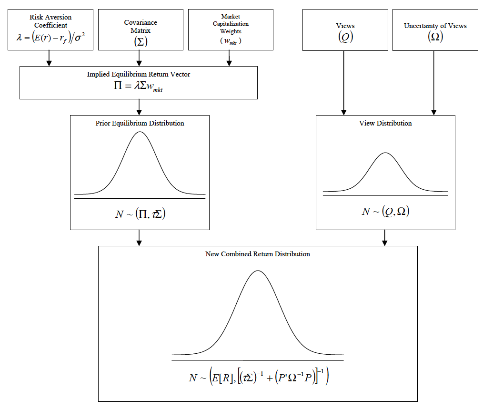

.. _portfolio_optimisation-black_litterman:

.. |br| raw:: html

     

.. |h3| raw:: html

    <h3>

.. |h3_| raw:: html

    </h3>

.. |h4| raw:: html

    <h4>

.. |h4_| raw:: html

    </h4>

.. note::
    The portfolio optimisation module contains different algorithms that are used for asset allocation and optimising strategies.
    Each algorithm is encapsulated in its own class and has a public method called ``allocate()`` which calculates the weight
    allocations on the specific user data. This way, each implementation can be called in the same way and this makes it simple
    for users to use them.

=====================
Black-Litterman Model
=====================

The Black-Litterman (BL) Model is one of the most widely used portfolio allocation models in the industry. The mean-variance framework developed by Harry Markowitz requires investors
to specify the mean and covariance of the portfolio assets. Before BL, people used historical sample estimates of expected returns and covariance matrix for this purpose but it is
commonly known these samples estimates of returns and risk are not robust to market changes, highly sensitive and hence prove to be bad estimators of true market parameters. Instead of
relying on these inefficient sample estimates, BL uses Bayesian theory to combine historical market data (prior) with additional investor views (likelihood) to generate a posterior
estimate of expected returns and covariance in sync with an investor's intuitions.

Overview of the Algorithm
#########################

In this section, we will go over a quick overview of the different steps of BL algorithm.

Calculating the Prior: Implied Excess Equilibrium Returns
*********************************************************

The first step is to start by formulating the prior distribution of returns for our Bayesian BL model. Because there is a complex mapping between the returns, and no natural
starting point for assumptions on expected returns, users of the standard portfolio optimizers often find their specification of expected returns produces output portfolio weights which
do not seem to make sense. It all starts with the Capital Asset Pricing Model (CAPM) market portfolio. The typical quadratic utility for portfolio optimisation is:

.. math::
    U = \pi^{T}w_{m} - \frac{\delta}{2}w_{m}^{T}\Sigma w_{m}

where :math:`\pi` is the vector of implied excess equilibrium weights, :math:`\Sigma` is the covariance matrix of asset returns, :math:`w_{m}` is the set of weights of the market
portfolio and :math:`\delta` is the risk aversion coefficient. Under the CAPM assumptions and no investment constraints, an investor will start by holding the market portfolio.
Differentiating the above utility equation w.r.t. :math:`w_{m}` and equating to 0, we get the following,

.. math::
    \begin{align*}
        & \triangledown U = \pi - \delta\Sigma w_{m} = 0 \\
        & w_{m} = (\delta\Sigma)^{-1}\pi
    \end{align*}

In our case, we already know the market weights and instead want to find :math:`\pi` which is done via reverse optimisation trick that gives us the following:

.. math::
    \pi = \delta\Sigma w_{m}

:math:`w_{m}` is typically calculated by taking the market-caps of assets in our portfolio and normalising them to sum to 1. The empirical covariance of returns is normally used as an
estimate of :math:`\Sigma`. Finding the value of :math:`\delta` is a tricky part and can either be assumed based on prior knowledge or calculated using any index portfolio like S&P500.
This gives us the final prior distribution of market returns:

.. math::
    r \: \sim{~} \: N(\pi, \tau\Sigma)

It is a multivariate normal distribution parameterised by the mean - :math:`\pi` - and the covariance - :math:`\tau\Sigma` - where :math:`\tau` is the constant of proportionality with
values around 0.005-0.01.

Calculating the Likelihood: Market Views
****************************************

The second step is to take into account an investor's views on the market. It is a very important step which highlights the ingenuity of the BL model. In many scenarios, an asset manager
or investor has his/her own views about assets in a portfolio. For example, one might have an opinion that some assets in the portfolio will yield a higher expected return while some may
underperform. There are three important inputs of interest here - :math:`P`, :math:`Q` and :math:`\Omega`.

:math:`Q` is a vector of means that contains specific values denoting the portfolio views and :math:`P` is a matrix denoting which assets in our portfolio are involved in the views. It is often called a :math:`\textit{picking matrix}`. :math:`\Omega` matrix is a very important parameter because it quantifies the variance/errors in the investor's views. Note that the investor's beliefs are based on the prior distribution mentioned before and combining this information gives us the investor's distribution of the returns:

.. math::
    r \: \sim{~} \: N(Q, \Omega)

Generating the Posterior Market Distribution
********************************************

The BL model generates the final posterior distribution from the above described prior and likelihood distributions,

.. math::
    r \: \sim{~} \: N(\mu_{p}, \Sigma_{p})

where,

.. math::
    \begin{align*}
        & \mu_{p} = [(\tau\Sigma)^{-1} + P^{T}\Omega^{-1}P]^{-1}[(\tau\Sigma)^{-1}\pi + P^{T}\Omega^{-1}Q] \\
        & \Sigma_{p} = [(\tau\Sigma)^{-1} + P^{T}\Omega^{-1}P]^{-1}
    \end{align*}

where :math:`\mu_p` and :math:`\Sigma_p` are the mean and covariance of the new posterior returns distribution. For a detailed derivation of the above results, please refer to the links
in the Underlying Literature section. The following image by Thomas Idzorek summarises the entire Black-Litterman model in a good way,

.. tip::
   |h4| Underlying Literature |h4_|

   The following sources elaborate extensively on the topic:

   - `Global Portfolio Optimization <https://faculty.fuqua.duke.edu/~charvey/Teaching/BA453_2006/blacklitterman.pdf>`_ *by* Fisher Black and Robert Litterman.
   - `A Step-by-Step Guide To The Black-Litterman Model <https://papers.ssrn.com/sol3/papers.cfm?abstract_id=3479867>`_ *by* Thomas Idzorek.

   For a detailed derivation of the results, refer to the following paper:

   - `Seminal Paper on Black-Litterman Model <https://fam.tuwien.ac.at/~sgerhold/pub_files/sem16/s_polovenko.pdf>`_ *by* Tetyana Polovenko.

Implementation
##############

.. automodule:: mlfinlab.portfolio_optimization.bayesian.black_litterman

    .. autoclass:: VanillaBlackLitterman
        :members:

        .. automethod:: __init__

.. note::
    |h4| Structure of the Pick List |h4_|
    In Black-Litterman, :math:`P` is a matrix of size :math:`k \: x \: n` where :math:`k` is the number of views and :math:`n` is the number of assets in our portfolio. This is
    all fine when we are dealing with small number of portfolios and views but it becomes a cumbersome task from a user perspective when you have lots of views and large number of
    assets in the portfolio. MlFinLab's implementation allows users to only specify the assets participating in the views and will handle the creation of the pick matrix internally.
    Lets say you have 3 assets in your portfolio - :math:`A, B \: \text{and} \: C` with the following views:

        - :math:`\textit{A will have an expected return of 2%}`
        - :math:`\textit{B will outperform C by 4%}`.

    Instead of specifying the entire matrix, users can just pass a list of dictionaries as follows:

        .. code-block::

            pick_list = [
                            {'A': 1},
                            {'B': 1, 'C': -1}
                        ]

    Here, the list contains a dictionary for each view. In each dictionary the keys represent the participating assets and values correspond to the pick values.

    |h4| Calculating the Omega Matrix |h4_|
    As mentioned before, the omega matrix is a very important part of the BL model. It represents the variance in the investor's views and there is a ton of literature on how to
    effectively calculate this matrix. Out of these, the :math:`\textit{VanillaBlackLitterman}` class contains two popular methods of estimating :math:`\Omega`

    - **Prior Variance:** In this method, the empirical covariance of the returns is used to calculate :math:`\Omega`. Here, the variance of the views is assumed to be proportional to the variance of the prior.

    .. math::
        \Omega = diag(P\tau\Sigma P^{T})

    - **View Confidences:** This method was developed by Thomas Idzorek whose paper and image we used previously. In this method, an investor specifies individual confidences in their views. Hence, for :math:`k` views, you will have a list of :math:`k` confidence values :math:`C` (between 0-1). The omega matrix is calculated using the following formula:

    .. math::
        \Omega = \alpha P\Sigma P^{T}, \text{where} \: \alpha = \frac{1 - C_{i}}{C_{i}}, i=1,...,k

Example Code
############

In this section we go through a code example by replicating results from He-Litterman - `The Intuition Behind Black-Litterman Model Portfolios <http://npo-jasmine.org/wp-content/uploads/2016/09/SSRN-id3343041.pdf>`_. In the paper, the authors run a BL model on a portfolio of international currencies of 7 countries.

.. code-block::

    import pandas as pd
    from mlfinlab.portfolio_optimization.bayesian import VanillaBlackLitterman

    countries = ['AU', 'CA', 'FR', 'DE', 'JP', 'UK', 'US']

    # Table 1 of the He-Litterman paper: Correlation matrix
    correlation = pd.DataFrame([
        [1.000, 0.488, 0.478, 0.515, 0.439, 0.512, 0.491],
        [0.488, 1.000, 0.664, 0.655, 0.310, 0.608, 0.779],
        [0.478, 0.664, 1.000, 0.861, 0.355, 0.783, 0.668],
        [0.515, 0.655, 0.861, 1.000, 0.354, 0.777, 0.653],
        [0.439, 0.310, 0.355, 0.354, 1.000, 0.405, 0.306],
        [0.512, 0.608, 0.783, 0.777, 0.405, 1.000, 0.652],
        [0.491, 0.779, 0.668, 0.653, 0.306, 0.652, 1.000]
    ], index=countries, columns=countries)

    # Table 2 of the He-Litterman paper: Volatilities
    volatilities = pd.DataFrame([0.160, 0.203, 0.248, 0.271, 0.210, 0.200, 0.187],
                                index=countries, columns=["vol"])
    covariance = volatilities.dot(volatilities.T) * correlation

    # Table 2 of the He-Litterman paper: Market-capitalised weights
    market_weights = pd.DataFrame([0.016, 0.022, 0.052, 0.055, 0.116, 0.124, 0.615],
                                  index=countries, columns=["CapWeight"])

Now that our input data has been set up, we can proceed to creating specific input parameters for Black-Litterman model. The first view explored by the authors states that German
equities will outperform the rest of European equities by 5%. We have one German equity in our portfolio - DE - and two European equities - FR and UK. We create the views vector and the
pick list:

.. code-block::

    # Q
    views = [0.05]

    # P
    pick_list = [
            {
                "DE": 1.0,
                "FR": -market_weights.loc["FR"]/(market_weights.loc["FR"] + \
                                                market_weights.loc["UK"]),
                "UK": -market_weights.loc["UK"] / (market_weights.loc["FR"] + \
                                                    market_weights.loc["UK"])
            }
        ]

Final step is to allocate weights using :math:`\textit{VanillaBlackLitterman}`,

.. code-block::

    bl = VanillaBlackLitterman()
    bl.allocate(covariance=covariance,
                market_capitalised_weights=market_weights,
                investor_views=views,
                pick_list=pick_list,
                asset_names=covariance.columns,
                tau=0.05,
                risk_aversion=2.5)

Yes, using the Black-Litterman model is as simple as that. First of all, we will look at the equilibrium returns calculated by our BL model.

.. code-block::

    print(bl.implied_equilibrium_returns)

.. code-block::

    [3.9, 6.9, 8.4, 9.0, 4.3, 6.8, 7.6]

This exactly matches the values in column-3 of Table-2 in the above paper. Next up we check the posterior expected returns calculated by the model,

.. code-block::

    print(bl.posterior_expected_returns)

.. code-block::

    [4.3, 7.6, 9.3, 11.0, 4.5, 7.0, 8.1]

Again, this is an exact match of the values in column-2 of Table-4.
