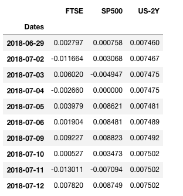

.. _portfolio_optimisation-entropy_pooling:

.. |br| raw:: html

     

.. |h3| raw:: html

    <h3>

.. |h3_| raw:: html

    </h3>

.. |h4| raw:: html

    <h4>

.. |h4_| raw:: html

    </h4>

.. note::
    The portfolio optimisation module contains different algorithms that are used for asset allocation and optimising strategies.
    Each algorithm is encapsulated in its own class and has a public method called ``allocate()`` which calculates the weight
    allocations on the specific user data. This way, each implementation can be called in the same way and this makes it simple
    for users to use them.

==============================
Entropy Pooling
==============================

The Entropy Pooling (EP) algorithm developed by Atillio Meucci is a methodology that allows investors to specify non-linear views on the market and generate a posterior distribution
that aligns with these views. Unlike the Black-Litterman model which only allows for views on returns, EP can be used for specifying views not only on returns but on different other
market factors like correlations, covariances, rankings etc...

Overview of the Algorithm
#########################

In this section, we will go over a quick overview of the EP algorithm.

The Reference Model
*******************

The reference model :math:`X` is a :math:`T x N` risk model representing a joint distribution of risk factors coming from a probability density function,

.. math::
    X \: \sim{~} \: f_{X}

Here, :math:`N` corresponds to the number of assets in the portfolio and :math:`T` denotes the time frame of observations. One can use different types of risk factors - variances,
standard deviations, VaR, expected shortfall etc. - basically anything that can help to access the risk of the assets in a portfolio - in fact even returns can be used as a market
factor. This joint distribution reference model will act as a Bayesian prior for our EP model.

Prior Probabilities
*******************

The EP algorithm uses Bayesian theory to calculate the posterior parameters. In this sense, everything is associated with some probability density distribution. As mentioned
previously, the reference model :math:`X` is the prior for our Bayesian framework and each row of this matrix represents an individual sample of the prior market distribution. Each row
in :math:`X`, has a prior probability :math:`p_{i}, i=1,2,....,T` associated with it which gives the probability of observing that particular row when sampling from the prior distribution
. EP starts with these initial prior probabilities and combines it with investor views to arrive at posterior probabilities for the market distribution.

Investor Views
**************

Investor views are a very important component of EP and there is lot of flexibility in how investors can specify these views. In the most general case, the user expresses views on
generic functions of the market :math:`g_{1}(X), g_{2}(X), g_{3}(X)..., g_{K}(X)`. These views constitute a :math:`K`-dimensional joint distribution implied by the reference model.

.. math::
    V \: \sim{~} \: g(\textbf{X}) \: \sim{~} \: f_{\textbf{V}}

Unlike the Black-Litterman (BL) model, where one is constrained by only linear views on expected returns, here, investors can also specify non-linear views which are statements
on market variables different from what is implied by the prior/reference model :math:`X`. In EP, these views are statements on distributions rather than parametric variables. Some of
these views include (but are not limited to):

    - Views on Expectation (Classic BL Views)
    - Relative Ranked Views
    - Views on Volatility
    - Views on Correlations
    - Views on Tail Codependence

The above list further strengthens the fact that EP is definitely more flexible and powerful in handling investor views as compared to traditional Black-Litterman models.

Generating Posterior Probabilities
**********************************

With the prior and likelihood (views) distributions and probabilities calculated, we proceed to calculate the posterior probabilities. The posterior distribution should satisfy the
views without adding additional structure and at the same time should be as close as possible to the reference model. EP employs the use of relative entropy (RE) to converge the prior
and posterior distributions towards each other. For a generic distribution :math:`\tilde{f_{X}}` and a reference distribution :math:`f_{X}` the RE formula is as follows,

.. math::
    \epsilon (\tilde{f_{X}}, f_{X}) = \int \tilde{f_{X}}(x)[ln\tilde{f_{X}}(x) - ln f_{X}(x)]

It is a natural measure of structure of :math:`\tilde{f_{X}}` and shows how far away the generic distribution is from the reference distribution :math:`f_{X}`. Hence, for our problem,
EP uses relative entropy to minimise the difference between the posterior market probabilities :math:`\tilde{p}` and the prior probabilities :math:`p`,

.. math::
    \begin{align*}
        \tilde{p}^{*} = \underset{\mathbf{\tilde{p} \: \in \: V}}{\text{argmin}} \: \epsilon (\tilde{p}, p)
    \end{align*}

Confidence in Views - Opinion Pooling
*************************************

The posterior distribution is calculated by assuming full confidence in the views expressed by the investor. However, for low confidence in the views, the posterior distribution of the
market must shrink towards the reference model. To account for this, the final probabilities of the market distribution is an opinion-pooled combination of the prior and posterior
probabilities.

.. math::
    \tilde{p}^{*} = (1 - c)p + c\tilde{p}^{*}

where :math:`c \in [0, 1]` is a pooling parameter controlling the tilt between reference and posterior distribution.

.. tip::
    |h4| Underlying Literature |h4_|
    The original paper by Atilio Meucci `Fully Flexible Views: Theory and Practice <https://papers.ssrn.com/sol3/papers.cfm?abstract_id=1213325>`_.

Implementation
##############

.. automodule:: mlfinlab.portfolio_optimization.bayesian.entropy_pooling

    .. autoclass:: EntropyPooling
        :members:

        .. automethod:: __init__

.. note::
    |h4| More about the Reference Model |h4_|
    The reference model, :math:`X` is a :math:`T x N` matrix of historical observations and acts as a joint distribution of different market factors. Each column corresponds to an asset
    and the rows are historical observations of some market factor for that asset. For e.g. in the following image, the first two columns for FTSE and SP500 are the historical asset
    returns over the given time period while the column for US-2Y displays historical volatility values. In this way, one can combine different market factors like correlations, standard
    deviations, returns, volatilities to create the prior reference model.

        .. image:: portfolio_optimisation_images/reference_model.png
                :align: center

    Note that users do not need to pass :math:`X` into the *allocate* method. EP takes probabilities for each row in :math:`X` and tweaks them so that the
    probabilities satisfying the views are increased while the other values go down - all the while keeping the reference model same.

    |h4| Types of Views in EP Framework |h4_|
    There are two types of views involved in the EP framework:

        1. Equality Views: These are views that correspond to the scenario where an investor has assumptions of specific values of the market factors. For e.g. the expected return of
        FTSE will be 0.05, the average return of SP500 will be 0.02 etc...

        2. Inequality Views: If an investor is not sure about the exact values but a rough inequality. For e.g. one might have a view that the expected return of FTSE will be greater
        than the expected return of SP500 or average volatility of the US-2Y bond will be greater than 0.08 etc...

Example Code
############

Let us go through a practical example to understand how to use the *EntropyPooling* class. We have 3 assets in our portfolio - [FTSE, SP500, US-2Y] and the reference model for these
assets is as follows:

The first two columns are the historical asset returns for FTSE and SP500 while the third column shows the historical volatilities of the US-2Y bond. Note that we have 10 historical
observations in our reference model (T = 10).

**Step-1: Prior Probabilities**

The first step is to specify the initial prior probabilities. Typically for most cases, one can assume that all observations have an equal and independent probability of coming from the
prior distribution.

.. code::

    from mlfinlab.portfolio_optimization.bayesian import EntropyPooling

    p_initial = [0.1] * 10

**Step-2: Equality and Inequality View Matrices**

Now we formulate one of the most important parameters in the EP model - :py:mod:`equality_matrix`, :py:mod:`equality_vector`, :py:mod:`inequality_matrix` and :py:mod:`inequality_vector`.
For the above problem, let's say we have 2 views:

    - Expected return of FTSE will be 0.05 and standard deviation of US-2Y will be 0.02.
    - Expected return of FTSE will be greater than the expected return of SP500.

The first view is an equality view as the investor gives specific values about the expected returns  and standard deviation of the assets. On the other hand, the second view is just a ranked inequality view
where the investor thinks FTSE will yield a larger average return than SP500 but does not make any assumption on how much larger. The :py:mod:`equality_natrix` has a shape of :math:`T x
N_{1}` where :math:`T` is the number of time-series observations (20 in our case) and :math:`N_{1}` is the number of equality views. Each row of the view matrix will have the corresponding market factor
observation value related to the view. For e.g. since the above equality views are related to the expected return of FTSE and standard deviation of US-2Y, we will have 2 columns and the
rows will contain the historical return observations of FTSE and historical volatility values of the US-2Y bond.

.. code::

    equality_matrix = [[ 0.00279688,  0.00075838],
                      [-0.01166437,  0.00306802],
                      [ 0.00602026, -0.00494735],
                      [-0.00266024,  0.        ],
                      [ 0.00397856,  0.00862075],
                      [ 0.00190446,  0.0084813 ],
                      [ 0.00922719,  0.00882304],
                      [ 0.0005268,   0.00347321],
                      [-0.01301085, -0.00709418],
                      [ 0.00782011,  0.00874904]]

And the equality vector will contain the corresponding view values. Its length should be equal to :math:`N_1`.

.. code::

    equality_vector = [0.05, 0.02]

Similarly, for the second view, we need to create an inequality matrix but what will the row values be? According to the authors, for ranked views on expectations, the row values will
be the difference in the returns of the participating assets. So, for the second view, the inequality matrix looks something like this,

.. code::

    inequality_matrix = [0.0020385,
                        -0.01473239,
                        0.01096761,
                        -0.00266024,
                        -0.00464219,
                        -0.00657684
                        0.00040416,
                        -0.00294641,
                        -0.00591667,
                        -0.00092892]

Each value is the difference between the historical returns of FTSE and SP500. Remember this: whatever asset's market factor is expected to be greater will come first in
the difference. The last step is to specify the inequality vector which is similar to the equality vector mentioned previously,

.. code::

    inequality_vector = [0]

**Step-3: View Confidence**

Now, we pass the view confidence and run the EP algorithm. If one does not specify any view confidence value, then a default value of 1.0 is used. For the current problem, let's
simulate an investor with 80% confidence in the views.

.. code::

    view_confidence = 0.8
    ep = EntropyPooling()
    ep.calculate_posterior_probabilities(prior_probabilities=p_initial,
                                         equality_matrix=equality_matrix,
                                         equality_vector=equality_vector,
                                         inequality_matrix=inequality_matrix,
                                         inequality_vector=inequality_vector)

**Step-4: Get Posterior Probabilities**

Getting the posterior probabilities is as simple as just accessing the class variable of the *EntropyPooling* class,

.. code::

    p_posterior = ep.posterior_probabilities

**Step-5: Using these Probabilities in Portfolio Optimisation**

Let us say we want to create a portfolio of FTSE and SP500. We already have our probabilities from EP but how exactly do we calculate the optimal portfolio weights. The columns for FTSE
and SP500 contain the historical returns and each row has a new posterior probability value calculated by EP. We can get the expected returns of these assets by taking probability-weighted summation
of these returns. The reference model is read as a Pandas dataframe as shown in the previous image.

.. code::

    ftse_mean_return = reference_model['FTSE'].T.dot(p_posterior)
    sp500_mean_return = reference_model['SP500'].T.dot(p_posterior)

    expected_returns = np.array([ftse_mean_return, sp500_mean_return])
    covariance = reference_model[['FTSE', 'SP500']].cov()

Now with the list of expected returns and covariance matrix, we can simply plug these values into a standard mean-variance optimiser to get the required weight allocations.

.. code::

    from mlfinlab.portfolio_optimization.modern_portfolio_theory import MeanVarianceOptimisation

    mvo = MeanVarianceOptimisation()
    mvo.allocate(covariance_matrix=covariance, expected_asset_returns=expected_returns,
                 solution='max_return_min_volatility')
    portfolio_weights = mvo.weights

The expected returns calculated above embed the structure of the views and at the same time being close to the reference model too.

.. tip::
    |h4| More on the View Matrices |h4_|
    You might have noticed that the inequality vector contains the value 0 for the ranked views. How and why did we use this value? Previously we mentioned that EP minimises the
    relative entropy between the prior and posterior probabilities. Specifically the following optimisation problem is solved,

        .. math::
            \begin{align*}
                & \underset{\mathbf{\tilde{p}}}{\text{min}} & & \epsilon (\tilde{p}, p) \\
                & \text{s.t.} & & F\tilde{p} \geq f \\
                &&& H\tilde{p} = h \\
            \end{align*}

    where :math:`F` and :math:`f` stand for the inequality matrix and inequality vector respectively. Similarly, :math:`H` and :math:`h` are equality matrix and equality vector
    respectively. These view matrices act as linear constraints on the probabilities and depending on the different types of investor views, one needs to change their formulation. The
    authors provide a very comprehensive guide regarding this in the appendix.

    For a generic view matrix :math:`V` (it can be either equality or inequality matrix), the formulations are as follows:

        - **Views on Expectations (Black-Litterman Views)**

            The generalized BL bullish/bearish view reads:

            .. math::
                E[R_{k}] \gtreqqless m_{k}

            where :math:`k` stands for the :math:`k^{th}` asset, :math:`R_{k}` is the historical returns of :math:`k^{th}` asset and :math:`m_k` is the investor's view on the expected
            return of :math:`k^{th}` asset.

            .. math::
                \sum_{t = 1}^{T}\tilde{p_{t}}V_{t, k} \gtreqqless m_{k}

            where the view column :math:`V_{k}` contains the returns of :math:`k^{th}` asset, :math:`T` is the number of historical observations and :math:`\tilde{p}` is the posterior
            probability we want to calculate.

        - **Relative Ranked Views**

            The relative ranked view reads:

            .. math::
                E[R_{1}] \geq E[R_{2}] \geq E[R_{3}] \geq E[R_{4}] ..... \geq E[R_{K}]

            The respective view matrix formulation is:

            .. math::
                \begin{align*}
                    \sum_{t = 1}^{T}\tilde{p_{t}}(V_{t, 1} - V_{t, 2}) \geq 0 \\
                    \sum_{t = 1}^{T}\tilde{p_{t}}(V_{t, 2} - V_{t, 3}) \geq 0 \\
                    . \\
                    . \\
                    . \\
                    . \\
                    . \\
                    . \\
                    \sum_{t = 1}^{T}\tilde{p_{t}}(V_{t, K-1} - V_{t, K}) \geq 0
                \end{align*}

            where the view column :math:`V_{k}` contains the returns of :math:`k^{th}` asset, :math:`T` is the number of historical observations and :math:`\tilde{p}` is the posterior
            probability we want to calculate.

        - **Views on Volatility**

            EP also allows us to specify views on volatility of the assets. The volatility view reads as follows:

            .. math::
                \tilde{\sigma}[\nu_{k}] \gtreqqless \sigma_{k}

            where :math:`k` stands for the :math:`k^{th}` asset, :math:`\nu_{k}` is the historical standard deviations of :math:`k^{th}` asset and :math:`\sigma_k` is the investor's
            view on the standard deviation of :math:`k^{th}` asset.

            The respective view formulation is:

            .. math::
                \sum_{t = 1}^{T}\tilde{p_{t}}V^{2}_{t, k} \gtreqqless \hat{m}^{2}_{k} + \sigma^{2}_{k}

            where the view column :math:`V_{k}` contains the standard deviations of :math:`k^{th}` asset, :math:`\hat{m}^{2}_{k}` is the sample mean of :math:`V_k`, :math:`T` is the
            number of historical observations and :math:`\tilde{p}` is the posterior probability we want to calculate.