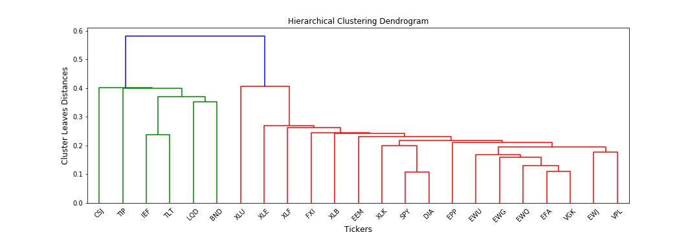

.. _portfolio_optimisation-hierarchical_equal_risk_contribution:

.. |br| raw:: html

     

.. |h3| raw:: html

    <h3>

.. |h3_| raw:: html

    </h3>

.. |h4| raw:: html

    <h4>

.. |h4_| raw:: html

    </h4>

.. note::
    The portfolio optimisation module contains different algorithms that are used for asset allocation and optimising strategies.
    Each algorithm is encapsulated in its own class and has a public method called ``allocate()`` which calculates the weight
    allocations on the specific user data. This way, each implementation can be called in the same way and this makes it simple
    for users to use them.

===============================================
Hierarchical Equal Risk Contribution (HERC)
===============================================

The Hierarchical Equal Risk Contribution (HERC) method takes inspiration from the Hierarchical Risk Parity (HRP)
algorithm and the Hierarchical Clustering based Asset Allocation (HCAA) and uses machine learning to allocate weights efficiently. While both the HERC and HRP algorithms use hierarchical tree clustering to allocate their weights, there are some subtle differences between the two. Lets look at a quick overview of how the HERC algorithm works:

Overview of the Algorithm
#########################

Hierarchical Tree Clustering
****************************

This step breaks down the assets in our portfolio into different hierarchical clusters using the famous Hierarchical Tree
Clustering algorithm (Agglomerative Clustering). The assets in the portfolio are segregated into clusters which mimic the
real-life interactions between the assets in a portfolio - some stocks are related to each other more than others and hence
can be grouped within the same cluster. At the end of the step, we are left with the follow tree structure (also called a
dendrogram).

|br|

Calculate Optimal Number of Clusters
************************************

This step is where HERC deviates from the traditional HRP algorithm. The hierarchical risk parity method uses single linkage
and grows the tree to maximum depth. However, the number of clusters identified by growing the tree maximally may not be the
optimal one and can lead to sub-optimal results. **This is why before allocating the weights, HERC calculates the optimal number of clusters and cuts the hierarchical tree formed in Step-1 to the required height and clusters**. Currently, the Gap Index is used for
calculating the required number of clusters.

.. image:: portfolio_optimisation_images/gap.png

|br|

Top-Down Recursive Bisection
****************************

This is the step where weights for the clusters are calculated. If you are familiar with how the hierarchical risk parity
algorithm works, then you know this is similar to how HRP also allocates its weights. However, there is a fundamental
difference between the recursive bisections of the two algorithms.

As seen in the above image, at each step, the weights in HRP trickle down the tree by breaking it down the middle based on the
number of assets. Although, this uses the hierarchical tree identified in Step-1, it does not make use of the exact structure
of the dendrogram while calculating the cluster contributions. This is a fundamental disadvantage of HRP which is improved
upon by HERC by dividing the tree, at each step, based on the structure induced by the dendrogram.

At each level of the tree, an Equal Risk Contribution allocation is used i.e. the weights are:

.. math::
    \alpha_1 = \frac{RC_1}{RC_1 + RC_2}; \alpha_2 = 1 - \alpha_1

where :math:`\alpha_1`, :math:`\alpha_2` are the weights of left and right clusters respectively and :math:`RC_1`, :math:`RC_2`
are the risk contributions of left and right clusters.

.. note::

    |h4| Risk Contribution of Clusters |h4_|
    While variance is a very simple and popular representation of risk used in the investing world, it is not the optimal one
    and can underestimate the true risk of a portfolio which is why there are many other important risk metrics used by
    investment managers that can correctly reflect the true risk of a portfolio/asset. With respect to this, the original HRP
    algorithm can be tweaked to allocate its weights based on different risk representations of the clusters and generate
    better weights. The HERC method in mlfinlab provides the following risk metrics:

    1. ``variance`` : Variance of the clusters is used as a risk metric.
    2. ``standard_deviation`` : Standard deviation of the clusters is used as a risk metric.
    3. ``equal_weighting`` : All clusters are weighed equally in terms of risk.
    4. ``expected_shortfall`` : Expected shortfall (CVaR) of the clusters is used as a risk metric.
    5. ``conditional_drawdown_at_risk`` : Conditional drawdown at risk (CDaR) of the clusters is used as a risk metric.

Naive Risk Parity
*****************

Having calculated the cluster weights in the previous step, this step calculates the final asset weights. Within the same
cluster, an initial set of weights - :math:`w_{NRP}` - is calculated using the naive risk parity allocation. In this approach, assets are allocated weights in proportion to the inverse of their respective risk; higher risk assets will receive lower portfolio weights, and lower risk assets will receive higher weights. Here the risk can be quantified in different ways - variance, CVaR, CDaR, max daily loss etc...

The final weights are given by the following equation:

.. math::
    w^{i}_{final} = w^{i}_{NRP} * C^{i}, \: i \in Clusters

where, :math:`w^{i}_{NRP}` refers to naive risk parity weights of assets in the :math:`i^{th}` cluster and :math:`C^{i}` is the
weight of the  :math:`i^{th}` cluster calculated in Step-3.

.. tip::
    |h4| Underlying Literature |h4_|
    This implementation is based on the following two papers written by Thomas Raffinot:

        * `Hierarchical Clustering based Asset Allocation <https://papers.ssrn.com/sol3/papers.cfm?abstract_id=3237540>`_
        * `Hierarchical Equal Risk Contribution <https://ssrn.com/abstract=2840729>`_

    You can read more about the Gap Index method in this paper:

        * `Gap Index Paper <https://statweb.stanford.edu/~gwalther/gap>`_

Implementation
##############

.. automodule:: mlfinlab.portfolio_optimization.herc

    .. autoclass:: HierarchicalEqualRiskContribution
        :members:

        .. automethod:: __init__

.. warning::
    The calculation of optimal number of clusters using the Gap Index makes the algorithm run a little slower and you will notice
    a significant speed difference for larger datasets. If you know the number of clusters for your data beforehand, it would be
    better for you to pass that value directly to the method using the :py:mod:`optimal_num_clusters` parameter. This will bypass
    the Gap Index method and speed up the algorithm.

.. note::
    |h4| Using Custom Input |h4_|
    We provide great flexibility to the users in terms of the input data - they can either pass their own pre-calculated input
    matrices/dataframes or leave it to us to calculate them. A quick reference on common input parameters which you will encounter
    throughout the portfolio optimisation module:

        * :py:mod:`asset_prices`: Dataframe/matrix of historical raw asset prices **indexed by date**.
        * :py:mod:`asset_returns`: Dataframe/matrix of historical asset returns. This will be a :math:`TxN` matrix where :math:`T` is the time-series and :math:`N` refers to the number of assets in the portfolio.
        * :py:mod:`expected_asset_returns`: List of expected returns per asset i.e. the mean of historical asset returns. This refers to the parameter :math:`\mu` used in portfolio optimisation literature. For a portfolio of 5 assets, ``expected_asset_returns = [0.45, 0.56, 0.89, 1.34, 2.4]``.
        * :py:mod:`covariance_matrix`: The covariance matrix of asset returns.

.. tip::
    |h4| Different Linkage Methods |h4_|
    The following linkage methods are supported by the HERC class in mlfinlab. (The following is taken directly from and we highly
    recommend you read):

    `Papenbrock, J., 2011. Asset Clusters and Asset Networks in Financial Risk Management and Portfolio Optimization (Doctoral
    dissertation, Karlsruher Institut für Technologie (KIT)). <https://d-nb.info/1108447864/34>`_

        **1. Single-Linkage**

        The idea behind single-linkage is to form groups of elements, which have the smallest distance to each other (nearest
        neighbouring clustering). This oftentimes leads to large groups/chaining.

        The single-link algorithm oftentimes forms clusters that are chained together and leaves large clusters. It can probably
        be best understood as a way to give a "more robust" estimation of the distance matrix and furthermore preserves the original
        structure as much as possible. Elements departing early from the tree can be interpreted as "different" from the overall dataset.
        In terms of application, the single-link clustering algorithm is very useful to gain insights in the correlation structure
        between assets and separates assets that were very different from the rest. If this separation is preferred and high weights
        should be put on "outliers" the single link certainly is a good choice.

        **2. Complete-Linkage**

        The complete-linkage algorithm tries to avoid those large groups by considering the largest distances between elements.
        It is thus called the farthest neighbour clustering.

        The complete-link algorithm has a different idea: elements should be grouped together in a way that they are not too
        different from each other when merged in a cluster. It thus has a much stronger definition of "similar pair of clusters".
        The complete-link algorithm therefore seems suitable for investors interested in grouping stocks that are similar in one cluster.

        **3. Average-Linkage**

        The average-linkage algorithm is a compromise between the single-linkage and complete-linkage algorithm.

        **4. Ward-Linkage**

        Whereas single-linkage, complete-linkage and average-linkage can be classified as graph-based clustering algorithms,
        Ward's method has a prototype-based view in which the clusters are represented by a centroid. For this reason, the
        proximity between clusters is usually defined as the distance between cluster centroids. The Ward method uses the increase
        in the sum of the squares error (SSE) to determine the clusters.

Plotting
########

``plot_clusters()`` : Plots the hierarchical clusters formed during the clustering step. This is visualised in the form of dendrograms - a very common way of visualising the hierarchical tree clusters.

.. code-block::

    # Instantiate HERC Class
    herc = HierarchicalEqualRiskContribution()
    herc.allocate(asset_prices=stock_prices, risk_measure='equal_weighting')

    # Plot Dendrogram
    herc.plot_clusters(assets=stock_prices.columns)

.. image:: portfolio_optimisation_images/dendrogram_herc.png

In the above image, the colors of assets corresponds to the cluster to which that asset belongs. Assets in the same cluster have the same color. Note that this coloring scheme may change based on the optimal number of clusters identified by the algorithm (or specified by the user).

Research Notebooks
##################

The following research notebooks provide a more detailed exploration of the algorithm.

* `How to use mlfinlab's HierarchicalEqualRiskContribution class`_

.. _How to use mlfinlab's HierarchicalEqualRiskContribution class: https://github.com/hudson-and-thames/research/blob/master/Portfolio%20Optimisation%20Tutorials/Hierarchical%20Equal%20Risk%20Contribution%20(HERC)/HERC%20Tutorial%20Notebook.ipynb